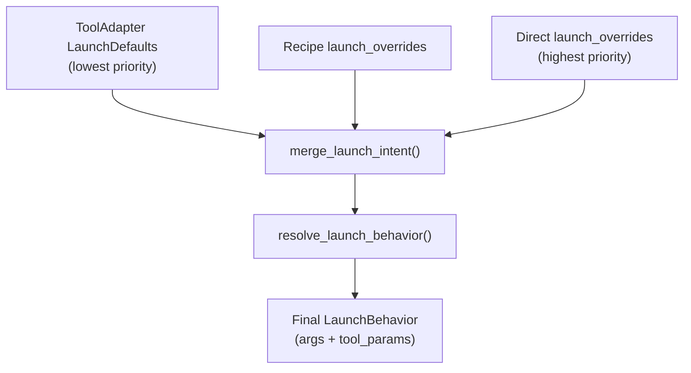

# Launch Overrides

Module: `src/houmao/agents/launch_overrides/` — "Shared launch-override models and resolution helpers."

Launch overrides control how tool launch arguments and parameters are customized beyond the adapter's built-in defaults. They flow through a layered resolution pipeline: adapter defaults → preset overrides → direct overrides.

### Override Precedence



## LaunchDefaults

`LaunchDefaults` is a frozen dataclass owned by the tool adapter. It defines the baseline launch arguments and tool parameters that apply when no overrides are specified.

| Field | Type | Description |
|---|---|---|
| `args` | `tuple[str, ...]` | Default launch arguments passed to the tool executable |
| `tool_params` | `dict[str, JsonValue]` | Default tool parameter values |

## LaunchOverrides

`LaunchOverrides` is a frozen dataclass used by presets and direct build requests to customize launch behavior on top of the adapter defaults.

| Field | Type | Description |
|---|---|---|
| `args` | `LaunchArgsSection \| None` | Optional args override section specifying mode and values |
| `tool_params` | `dict[str, JsonValue]` | Tool parameter values to override |

## LaunchArgsSection

`LaunchArgsSection` is a frozen dataclass that controls how override arguments combine with the adapter's default arguments.

| Field | Type | Description |
|---|---|---|
| `mode` | `"append" \| "replace"` | Whether to append to or replace the adapter default arguments |
| `values` | `tuple[str, ...]` | Argument values to append or use as replacement |

When `mode` is `"append"`, the override `values` are added after the adapter's default `args`. When `mode` is `"replace"`, the override `values` completely replace the adapter's default `args`.

## Resolution Pipeline

Two key functions handle the merge:

### `merge_launch_intent`

Merges launch overrides from multiple layers (preset overrides and direct overrides) into a single resolved intent. Later layers take precedence: direct overrides win over preset overrides.

### `resolve_launch_behavior`

Takes the merged intent and the adapter's `LaunchDefaults` and produces the final set of launch arguments and tool parameters. Tool parameters are validated against `ToolLaunchMetadata` definitions from the adapter and translated to backend-specific arguments.

### Merge Order

```
Adapter LaunchDefaults
  └─▶ Recipe LaunchOverrides (if present)
        └─▶ Direct LaunchOverrides (if present)
              └─▶ Final resolved launch arguments + tool params
```

Each layer can override `tool_params` by key (later values win) and modify `args` according to the `LaunchArgsSection.mode`.

## Protocol-Required Arguments

Protocol-required arguments are owned by the backend and **cannot** be overridden through the launch overrides mechanism. These include arguments that are structurally necessary for the backend to function correctly, such as:

- `claude -p` (headless prompt mode)
- `codex exec --json` (structured output)
- `--resume` / `--continue` (session continuation)

Launch overrides apply only to non-protocol launch arguments and tool parameters. Attempting to override protocol-required arguments will result in a validation error during the build phase.
