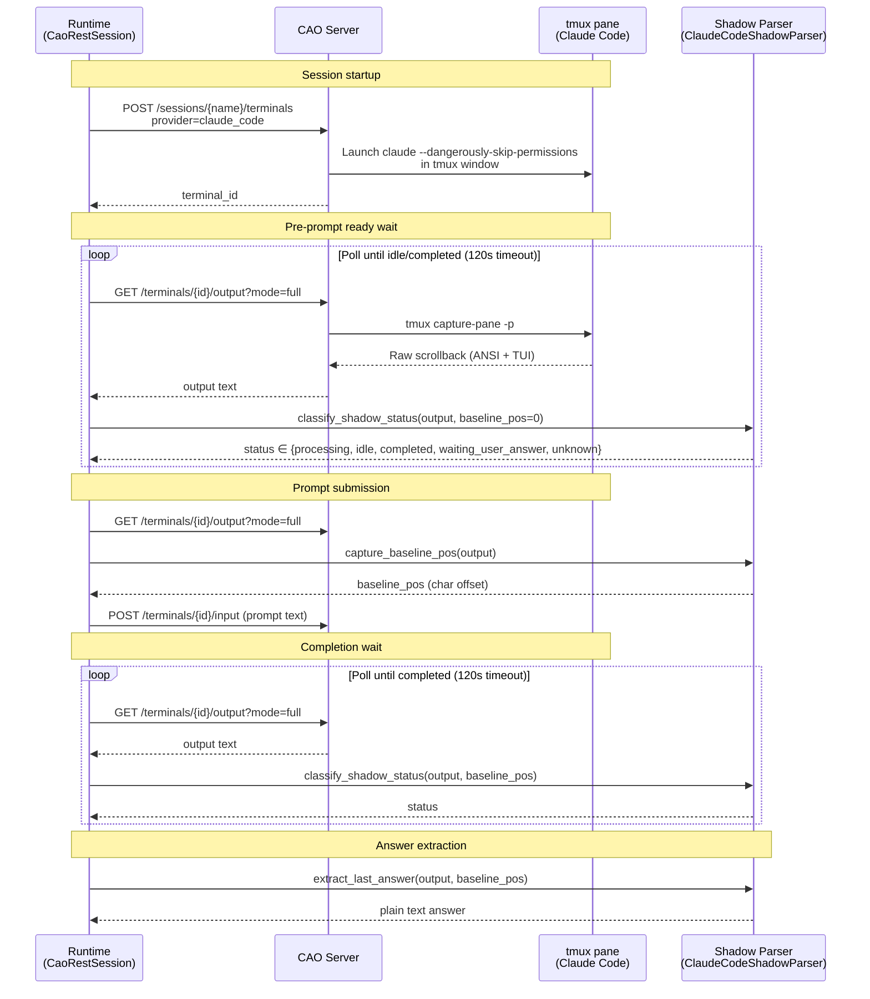
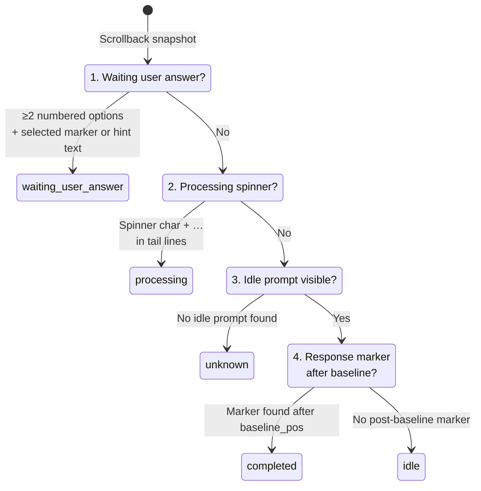
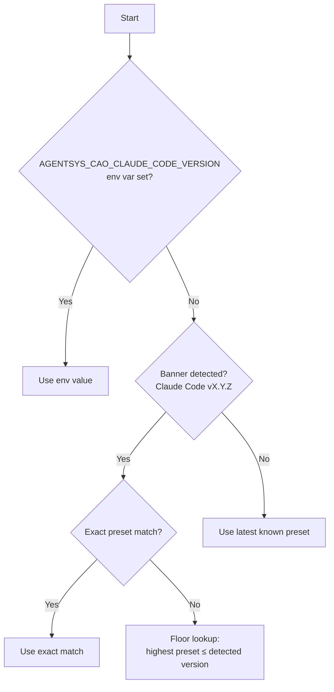
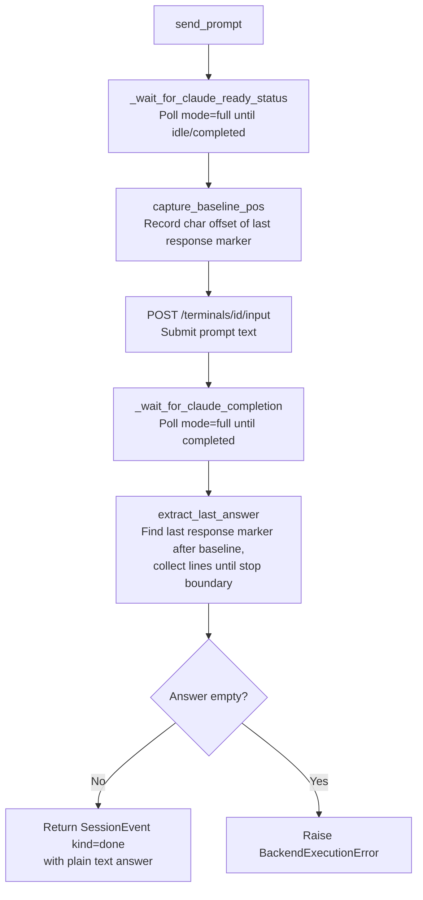
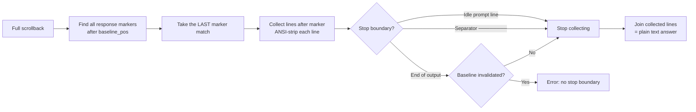

# CAO Claude Code Shadow Parsing

This page documents the custom handling the runtime uses to drive Claude Code through the CLI Agent Orchestrator (CAO). The approach is intentionally non-standard: CAO's built-in Claude Code provider has known marker and status drift, so the runtime bypasses CAO's extraction layer and performs its own "shadow parsing" of raw tmux scrollback.

For resumed CAO operations, session addressing is manifest-driven: runtime uses
the persisted `session_manifest.cao.api_base_url` and terminal identity from
the session manifest rather than a resume-time CAO base URL override.

**Source files:**

| File | Role |
|------|------|
| `backends/cao_rest.py` | CAO session lifecycle, poll loops, prompt submission |
| `backends/claude_code_shadow.py` | Shadow parser: status classification, answer extraction, preset resolution |
| `backends/claude_bootstrap.py` | Non-interactive Claude home bootstrap |

All paths are relative to `src/gig_agents/agents/brain_launch_runtime/`.

## Why Shadow Parsing Exists

CAO provides two output modes for terminals:

| Mode | What CAO returns |
|------|------------------|
| `mode=full` | Raw `tmux capture-pane` scrollback (ANSI + TUI chrome) |
| `mode=last` | Extracted last assistant message (plain text) |

For the `claude_code` provider, `mode=last` relies on CAO's internal `RESPONSE_PATTERN` regex to find the response marker. As of Claude Code v2.1.62, two mismatches break this:

1. **Response marker**: CAO expects `⏺` (U+23FA); Claude Code now emits `●` (U+25CF).
2. **Spinner format**: CAO requires a parenthesized suffix `( … )`; Claude Code now omits the parentheses (e.g. `✽ Razzmatazzing…`).

This causes `mode=last` to return HTTP 404 and CAO's own `status` field to misclassify processing turns as idle. Rather than patching the vendored CAO source, the runtime owns the parsing end-to-end.

## Why We Accept the Fragility

The shadow parser intentionally operates on raw tmux scrollback (TUI output). This is fragile by nature, but it is also a requirement for the CAO/tmux-backed Claude workflow:

- We want users to be able to attach to the tmux session and watch Claude Code run live.
- We want users to be able to interact with the session (inspect, interrupt, and recover) as a real terminal, not as a hidden background job.

If you want true background processing without a UI, prefer the headless backend (`claude_headless`) instead of CAO/tmux. Headless execution has a more stable, structured output surface and does not require parsing terminal UI.

## Architecture Overview

Key design decisions:

- The runtime **never** calls `mode=last` or reads CAO `status` for Claude terminals. All gating and extraction use `mode=full` + shadow parser.
- CAO is used purely as a tmux session manager and scrollback pipe.

Startup window hygiene:

- Runtime creates the tmux session before CAO terminal creation (a bootstrap window may exist briefly).
- After terminal creation, runtime best-effort selects the CAO terminal window and prunes the bootstrap window when it is safe to do so.
- Failures are surfaced as stderr `warning:` lines while keeping JSON stdout unchanged.

See: [Brain Launch Runtime window-hygiene checklist](./brain_launch_runtime.md#manual-verification-checklist-cao-startup-window-hygiene).

## Shadow Status State Machine

The shadow parser classifies each scrollback snapshot into one of five states. Checks are evaluated in priority order — the first match wins:

| Status | Meaning | Runtime behavior |
|--------|---------|------------------|
| `processing` | Preset-recognized spinner line present in tail lines | Keep polling |
| `idle` | Idle prompt visible, no new response marker after baseline | Ready for prompt submission |
| `completed` | Idle prompt visible + response marker after baseline | Turn is done, extract answer |
| `waiting_user_answer` | Interactive selection menu detected | Raise error with options excerpt |
| `unknown` | Output matches a supported format family but lacks safe status evidence | Keep polling; runtime can promote continuous `unknown` to `stalled` |

`stalled` is runtime-owned and means `unknown` remained continuous for at least `unknown_to_stalled_timeout_seconds`. See `docs/reference/cao_shadow_parser_troubleshooting.md` for tuning knobs and failure/recovery behavior.

## Version Presets

Claude Code's terminal UI changes across versions. The parser maintains a preset table keyed by version:

| Preset | Response marker | Idle prompt(s) | Spinner needs `(…)` |
|--------|----------------|----------------|---------------------|
| `0.0.0` | `⏺` | `>` | Yes |
| `2.1.0` | `⏺` | `>`, `❯` | Yes |
| `2.1.62` | `●` | `❯` | No |

### Resolution order

The env override (`AGENTSYS_CAO_CLAUDE_CODE_VERSION`) is the escape hatch when Claude Code updates break detection.

## Prompt Turn Lifecycle

A single `send_prompt()` call for Claude follows this sequence:

### Baseline and turn isolation

The `baseline_pos` mechanism prevents the parser from confusing prior-turn response markers with the current turn's output:

1. Before prompt submission, the runtime captures `baseline_pos` = the character offset of the end of the last response marker match in the current scrollback.
2. During completion wait, `classify_shadow_status` only considers response markers at positions `≥ baseline_pos`.
3. During extraction, `extract_last_answer` searches for markers after `baseline_pos` and collects lines until a stop boundary (idle prompt or separator `────────`).

If the scrollback is truncated/reset (its length drops below `baseline_pos`), the parser sets `baseline_invalidated = True` and falls back to requiring both a response marker **and** a stop boundary for safety.

## Answer Extraction

Once the shadow status reaches `completed`, extraction works on the `mode=full` scrollback:

### Idle prompt detection

A line is recognized as an idle prompt if it starts with one of the preset's `idle_prompts` characters (`❯` or `>`) followed by either nothing or a space. Trailing content (ghost/placeholder text like `Try "fix typecheck errors"`, cursor block characters, typed input) is accepted — only the leading prompt character + space matters.

This is a deliberate trade-off: Claude Code renders autocomplete suggestions as dim text on the prompt line, which `tmux capture-pane` captures as plain visible characters.

## Non-Interactive Bootstrap

Before the CAO terminal is created, the runtime bootstraps the Claude home directory to prevent interactive prompts:

| File | Purpose |
|------|---------|
| `settings.json` | Must set `skipDangerousModePermissionPrompt: true` |
| `claude_state.template.json` | Template from credential profile |
| `.claude.json` | Materialized once (create-only) with onboarding flags and API key approval |

The bootstrap ensures Claude Code starts directly into the idle prompt without showing onboarding, workspace trust, or API key approval dialogs.

## Environment and Tmux Setup

The runtime creates a dedicated tmux session per CAO session and propagates environment variables with this precedence:

1. Calling process env (`os.environ`)
2. Credential profile env file (`vars.env`)
3. Launch-specific overlays (e.g. `CLAUDE_CONFIG_DIR`)

CAO then creates a window inside this session and launches Claude Code.

## Timeout Configuration

| Parameter | Default | Applies to |
|-----------|---------|------------|
| `timeout_seconds` | 120s | Both pre-prompt ready wait and completion wait |
| `poll_interval_seconds` | 0.4s | Sleep between `mode=full` polls |

These are configurable on `CaoRestSession.__init__()`.

## Known Fragility

This approach is inherently fragile because it parses terminal UI output that has no stability contract:

- **Version drift**: New Claude Code versions may change markers, prompts, or spinner format. The preset table must be updated to match. Use `AGENTSYS_CAO_CLAUDE_CODE_VERSION` as a temporary pin.
- **Auto-update interference**: Claude Code may attempt auto-updates during startup, rewriting parts of the screen and delaying the idle prompt.
- **Ghost text**: Claude Code renders autocomplete suggestions on the prompt line. The parser accepts this, but future changes to placeholder rendering could break detection.
- **ANSI stripping**: The regex strips CSI sequences but not OSC or other less-common escape types. Unusual terminal output could leak through.
- **Scrollback truncation**: Long responses may cause tmux to truncate the scrollback buffer, invalidating `baseline_pos`. The parser handles this gracefully but with stricter extraction requirements.

For each new Claude Code version, run the demo (`bash scripts/demo/cao-claude-session/run_demo.sh`) and verify the terminal pipe log at `~/.aws/cli-agent-orchestrator/logs/terminal/<id>.log` to confirm preset compatibility.
