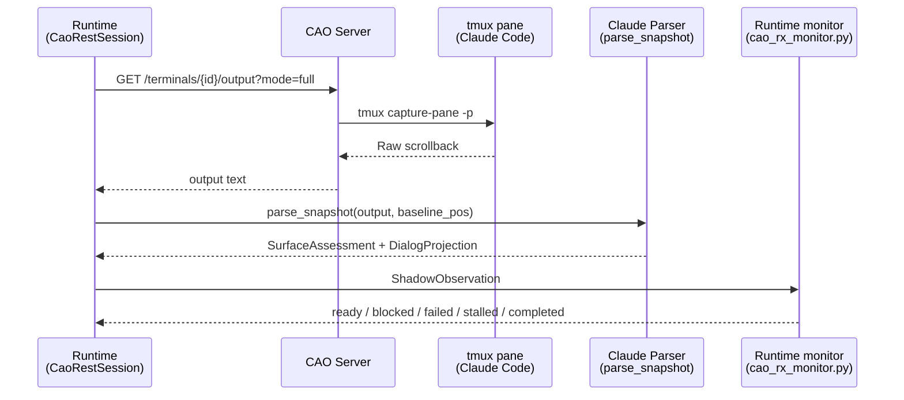

# CAO Claude Code Shadow Parsing

This page documents the current `parsing_mode=shadow_only` contract for Claude Code in the CAO-backed runtime.

For the full developer-oriented design guide, see:

- [TUI Parsing Developer Guide](../developer/tui-parsing/index.md)
- [TUI Parsing Architecture](../developer/tui-parsing/architecture.md)
- [Shared TUI Parsing Contracts](../developer/tui-parsing/shared-contracts.md)
- [Runtime Lifecycle And State Transitions](../developer/tui-parsing/runtime-lifecycle.md)
- [Claude Parsing Contract](../developer/tui-parsing/claude.md)
- [Codex Parsing Contract](../developer/tui-parsing/codex.md)

The important boundary is:

- the Claude shadow parser owns snapshot parsing,
- the runtime owns turn lifecycle, and
- caller-side answer association is optional and explicit.
- `normalized_text` stays closer to the captured TUI snapshot, while `dialog_text` is only a best-effort heuristic cleanup surface.

For resumed CAO operations, session addressing is manifest-driven: runtime uses the persisted `session_manifest.cao.api_base_url` and terminal identity from the session manifest rather than a resume-time CAO base URL override.

## Source Files

| File | Role |
|------|------|
| `backends/cao_rx_monitor.py` | Runtime readiness/completion monitor pipelines, post-submit evidence, stability timers, and stalled recovery |
| `backends/cao_rest.py` | Current-thread CAO poll loops, parser invocation, payload shaping, and error translation |
| `backends/claude_code_shadow.py` | Claude snapshot parsing into `SurfaceAssessment` + `DialogProjection` |
| `backends/shadow_parser_core.py` | Shared frozen parser models and projection provenance |
| `backends/shadow_answer_association.py` | Optional caller-side association helpers such as `TailRegexExtractAssociator` |
| `backends/claude_bootstrap.py` | Non-interactive Claude home bootstrap |

All paths are relative to `src/houmao/agents/realm_controller/`.

## Why Shadow Parsing Exists

CAO provides two output modes for terminals:

| Mode | What CAO returns |
|------|------------------|
| `mode=full` | Raw `tmux capture-pane` scrollback (ANSI + TUI chrome) |
| `mode=last` | Extracted last assistant message (plain text) |

For Claude Code, `mode=last` has historically drifted with Claude’s visible markers and spinner formats. The runtime therefore treats CAO as a tmux transport and owns the parsing contract itself.

## Contract Summary

The parser no longer owns “the final answer for the current prompt.”

Instead, one Claude snapshot produces two frozen artifacts:

- `ClaudeSurfaceAssessment`
- `ClaudeDialogProjection`

The runtime uses those artifacts over time to decide whether the submitted turn is:

- still waiting,
- blocked on user interaction,
- stalled,
- failed, or
- complete.

## Quick Contract Summary

- `SurfaceAssessment` answers whether the surface is supported and what it appears to be doing right now.
- Slash-command readiness follows the currently active input surface, not historical `/...` lines still visible in scrollback or projected dialog.
- `DialogProjection` returns best-effort cleaned visible dialog, not an authoritative answer for the current prompt and not an exact recovered transcript.
- The runtime monitor decides success terminality from ordered snapshots, not from parser-owned answer extraction.
- Current completion evidence keys off normalized shadow text after pipeline normalization; `dialog_text` remains a best-effort transcript surface for operators and caller-owned extraction.
- `TailRegexExtractAssociator` is an example of caller-owned best-effort extraction layered on top of projected dialog. Reliable downstream machine use should prefer schema-shaped prompting plus explicit sentinels or patterns.

Use the developer guide for the detailed state vocabulary, runtime lifecycle graph, and provider contract breakdown.
