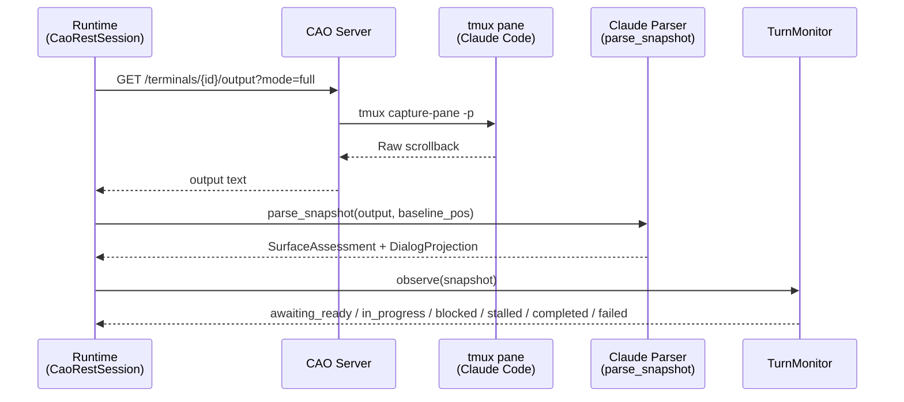
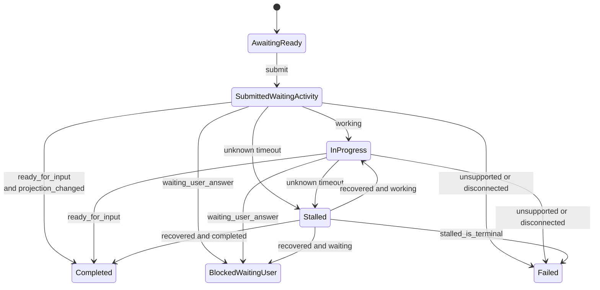

# CAO Claude Code Shadow Parsing

This page documents the current `parsing_mode=shadow_only` contract for Claude Code in the CAO-backed runtime.

The important boundary is:

- the Claude shadow parser owns snapshot parsing,
- the runtime owns turn lifecycle, and
- caller-side answer association is optional and explicit.

For resumed CAO operations, session addressing is manifest-driven: runtime uses the persisted `session_manifest.cao.api_base_url` and terminal identity from the session manifest rather than a resume-time CAO base URL override.

## Source Files

| File | Role |
|------|------|
| `backends/cao_rest.py` | CAO session lifecycle, poll loops, runtime `TurnMonitor`, result payloads |
| `backends/claude_code_shadow.py` | Claude snapshot parsing into `SurfaceAssessment` + `DialogProjection` |
| `backends/shadow_parser_core.py` | Shared frozen parser models and projection provenance |
| `backends/shadow_answer_association.py` | Optional caller-side association helpers such as `TailRegexExtractAssociator` |
| `backends/claude_bootstrap.py` | Non-interactive Claude home bootstrap |

All paths are relative to `src/gig_agents/agents/brain_launch_runtime/`.

## Why Shadow Parsing Exists

CAO provides two output modes for terminals:

| Mode | What CAO returns |
|------|------------------|
| `mode=full` | Raw `tmux capture-pane` scrollback (ANSI + TUI chrome) |
| `mode=last` | Extracted last assistant message (plain text) |

For Claude Code, `mode=last` has historically drifted with Claude’s visible markers and spinner formats. The runtime therefore treats CAO as a tmux transport and owns the parsing contract itself.

## Contract Summary

The parser no longer owns “the final answer for the current prompt.”

Instead, one Claude snapshot produces two frozen artifacts:

- `ClaudeSurfaceAssessment`
- `ClaudeDialogProjection`

The runtime uses those artifacts over time to decide whether the submitted turn is:

- still waiting,
- blocked on user interaction,
- stalled,
- failed, or
- complete.

## Claude Surface Assessment

`ClaudeSurfaceAssessment` carries:

- `availability`
- `activity`
- `accepts_input`
- `ui_context`
- `parser_metadata`
- `anomalies`
- `waiting_user_answer_excerpt`
- `evidence`

### State Facets

| Field | Values |
|------|--------|
| `availability` | `supported`, `unsupported`, `disconnected`, `unknown` |
| `activity` | `ready_for_input`, `working`, `waiting_user_answer`, `unknown` |
| `ui_context` | `normal_prompt`, `selection_menu`, `slash_command`, `trust_prompt`, `error_banner`, `unknown` |

### What Claude Parser Detects

- idle prompt visibility
- processing spinner visibility
- waiting/selection UI
- slash-command context
- trust prompt context
- supported vs unsupported output family
- disconnected/error-like signals

## Claude Dialog Projection

`ClaudeDialogProjection` carries:

- `raw_text`
- `normalized_text`
- `dialog_text`
- `head`
- `tail`
- `projection_metadata`
- `anomalies`
- `evidence`

Projection removes Claude-specific chrome such as:

- ANSI styling,
- banner/version lines,
- prompt-only idle lines,
- spinner lines,
- separator lines.

Projection preserves visible dialog content such as:

- prompt text that remains visible,
- assistant response lines,
- selection menu text when Claude is waiting for user action.

> `dialog_text` is a cleaned visible transcript, not an authoritative prompt answer.

## Runtime Turn Lifecycle

The runtime owns completion semantics through `TurnMonitor`.

For `shadow_only`, success terminality is intentionally stronger than “the parser says ready”:

- the surface must return to `ready_for_input`, and
- runtime must have observed either:
  - projected dialog change after submit, or
  - post-submit `working`

That contract prevents the generic “idle immediately after submit” false positive, while staying honest that the runtime still does not prove prompt-to-answer causality from tmux scrollback alone.

## Result Payloads

When a Claude `shadow_only` turn completes successfully, the `done` event is intentionally neutral:

- `message = "prompt completed"`

The payload exposes structured parser/runtime data:

- `surface_assessment`
- `dialog_projection`
- `projection_slices`
- `parser_metadata`
- `mode_diagnostics`

The payload does **not** expose a shadow-mode `output_text` compatibility alias.

If raw transport tail text is retained, it lives in diagnostics-only fields such as `mode_diagnostics.debug_transport_tail_excerpt`.

## Baseline Invalidation

The runtime still captures a pre-submit baseline offset, but baseline handling is now diagnostic rather than answer-extraction-centric.

If the normalized scrollback length falls below the recorded baseline offset:

- parser metadata sets `baseline_invalidated = true`
- the anomaly list includes `baseline_invalidated`

That signal tells callers the visible transcript was redrawn/truncated relative to the pre-submit baseline.

## Caller-Side Association

If a caller wants “the answer for my prompt,” that is now an explicit higher layer.

One built-in example is `TailRegexExtractAssociator`, which searches a regex over the last `n` characters of projected dialog text.

This is intentionally not part of the core Claude shadow parser guarantee.

## Preset Overrides

Use overrides only as a short-term mitigation while adding a new preset/fixture.

- Claude override: `AGENTSYS_CAO_CLAUDE_CODE_VERSION=<X.Y.Z>`

The env override is the escape hatch when Claude Code updates break preset selection before a new preset lands in the repo.
