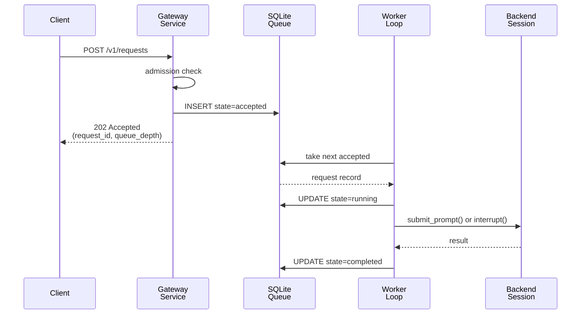

# Gateway Protocol And State Contracts

This page explains the current v1 gateway contracts: how attachability is published, what the live HTTP surface looks like, and which files under `gateway/` are durable versus ephemeral.

For the broader runtime-root and session-root filesystem map around this subtree, use [Agents And Runtime](../../system-files/agents-and-runtime.md).

## Mental Model

The gateway contract has two layers.

- Stable attachability tells the runtime how a session could gain a gateway.
- Live gateway bindings describe one currently running gateway instance.

Those layers are kept separate so a session can stay gateway-capable even when no sidecar is running.

## Stable Attachability

Stable attachability is published through the manifest-first contract:

- tmux discovery env:
  - `HOUMAO_MANIFEST_PATH`
  - `HOUMAO_AGENT_ID`
- runtime-owned manifest authority:
  - `<session-root>/manifest.json`
- derived outward-facing gateway bookkeeping:
  - `<session-root>/gateway/gateway_manifest.json`
- internal bootstrap artifacts may also exist:
  - `<session-root>/gateway/attach.json`

The supported external contract for attach, resume, and relaunch is `manifest.json` together with tmux-local discovery and shared-registry fallback. `gateway_manifest.json` remains derived publication only.

`attach.json` may still exist as internal bootstrap state for gateway startup, offline status materialization, and metadata transfer. It is not the supported public attach authority.

Representative internal bootstrap payload for a `cao_rest` session:

```json
{
  "schema_version": 1,
  "attach_identity": "cao-rest-1",
  "backend": "cao_rest",
  "tmux_session_name": "HOUMAO-gpu",
  "working_directory": "/abs/path/repo",
  "backend_metadata": {
    "api_base_url": "http://localhost:9889",
    "terminal_id": "term-123",
    "profile_name": "runtime-profile",
    "profile_path": "/abs/path/runtime-profile.md",
    "parsing_mode": "shadow_only"
  },
  "manifest_path": "/abs/path/.houmao/runtime/sessions/cao_rest/cao-rest-1/manifest.json",
  "agent_def_dir": "/abs/path/tests/fixtures/plain-agent-def",
  "runtime_session_id": "cao-rest-1",
  "desired_host": "127.0.0.1",
  "desired_port": 43123
}
```

Representative `houmao_server_rest` internal bootstrap payload:

```json
{
  "schema_version": 1,
  "attach_identity": "cao-gpu",
  "backend": "houmao_server_rest",
  "tmux_session_name": "cao-gpu",
  "working_directory": "/abs/path/repo",
  "backend_metadata": {
    "api_base_url": "http://127.0.0.1:9889",
    "session_name": "cao-gpu",
    "terminal_id": "term-123",
    "parsing_mode": "shadow_only"
  },
  "manifest_path": "/abs/path/.houmao/runtime/sessions/houmao_server_rest/cao-gpu/manifest.json",
  "agent_def_dir": "/abs/path/repo/.houmao/agents",
  "runtime_session_id": "cao-gpu",
  "desired_host": "127.0.0.1",
  "desired_port": 43123
}
```

Current v1 scope:

- Runtime-owned tmux-backed sessions publish gateway capability.
- Live attach and request execution currently support runtime-owned `local_interactive` sessions, runtime-owned REST-backed sessions (`cao_rest`, `houmao_server_rest`), and runtime-owned native headless sessions (`claude_headless`, `codex_headless`, `gemini_headless`).
- Gateway-owned live TUI tracking routes currently support attached runtime-owned REST-backed sessions and attached runtime-owned `local_interactive` sessions. For `local_interactive`, the gateway derives tracked identity from durable internal bootstrap metadata plus manifest-backed authority and uses the runtime session id as the public `terminal_id` compatibility value because no backend-provided terminal alias exists on that path.
- Native headless internal bootstrap metadata may also carry `managed_api_base_url` and `managed_agent_ref` together when the live gateway should route requests back through `houmao-server` for a server-managed headless agent instead of resuming that headless session locally.
- `attach.json` may keep `manifest_path` for gateway internals, but the runtime-owned session manifest remains the supported persisted mailbox-capability contract for gateway mailbox routes and mail notifier support.
- `gateway_manifest.json` is derived publication only. It may expose desired listener data and `gateway_pid`, but attach and control behavior must trust `manifest.json` plus tmux or registry discovery instead of treating `gateway_manifest.json` as primary authority.

Pair-managed current-session attach rules:

- tmux-published `HOUMAO_MANIFEST_PATH` is the preferred current-session manifest locator
- when `HOUMAO_MANIFEST_PATH` is missing or stale, `HOUMAO_AGENT_ID` plus the shared registry must resolve exactly one fresh `runtime.manifest_path`
- the resolved manifest must belong to the current tmux session
- the resolved manifest must use `backend = "houmao_server_rest"`
- manifest-declared pair attach authority is authoritative for current-session pair attach
- delegated pair launch may publish these stable artifacts before the matching managed-agent registration exists, so current-session attach readiness is later than capability publication

## Live Gateway Bindings

Live bindings exist only while a gateway process is running.

Published tmux env vars:

- `HOUMAO_AGENT_GATEWAY_HOST`
- `HOUMAO_AGENT_GATEWAY_PORT`
- `HOUMAO_GATEWAY_STATE_PATH`
- `HOUMAO_GATEWAY_PROTOCOL_VERSION`

Important rules:

- The runtime validates these bindings structurally before trusting them.
- `GET /health` is the authoritative liveness check for the live gateway.
- A dead gateway can leave stale env behind temporarily; validation plus health probing is what cleans that up.
- These env vars are a runtime publication surface, not the preferred attached-mail discovery contract for agent turns. For shared-mailbox work, the supported runtime-owned resolver is `pixi run houmao-mgr agents mail resolve-live`.

## Gateway Client Proxy Policy

Gateway client calls are local control-plane HTTP requests to the live per-agent gateway listener. By default, `GatewayClient` connects directly to the resolved gateway listener and bypasses ambient proxy variables such as `HTTP_PROXY`, `HTTPS_PROXY`, `ALL_PROXY`, and their lowercase variants. This applies to health checks, status, request submission, prompt and TUI control, reminders, mail, mail-notifier, and memory calls made through the shared gateway client.

Set `HOUMAO_GATEWAY_RESPECT_PROXY_ENV=1` in the process that constructs `GatewayClient` only when you intentionally want those live gateway calls to use normal Python environment proxy handling. In that mode, caller-provided proxy variables and `NO_PROXY` or `no_proxy` values are respected by the underlying HTTP client.

This gateway-specific switch is separate from the CAO loopback behavior that injects or preserves `NO_PROXY` entries. Gateway proxy bypass does not mutate process-wide `NO_PROXY` or `no_proxy`; it selects the gateway HTTP opener policy at client construction time.

## HTTP Surface

Current v1 routes:

- `GET /health`
- `GET /v1/status`
- `POST /v1/control/prompt`
- `GET /v1/control/tui/state`
- `GET /v1/control/tui/history`
- `POST /v1/control/tui/note-prompt`
- `POST /v1/control/send-keys`
- `GET /v1/control/headless/state`
- `POST /v1/requests`
- `POST /v1/reminders`
- `GET /v1/reminders`
- `GET /v1/reminders/{reminder_id}`
- `PUT /v1/reminders/{reminder_id}`
- `DELETE /v1/reminders/{reminder_id}`
- `GET /v1/mail/status`
- `POST /v1/mail/check`
- `POST /v1/mail/send`
- `POST /v1/mail/reply`
- `POST /v1/mail/state`
- `GET /v1/mail-notifier`
- `PUT /v1/mail-notifier`
- `DELETE /v1/mail-notifier`

### `GET /health`

Gateway-local liveness only:

```json
{
  "protocol_version": "v1",
  "status": "ok"
}
```

This does not mean the managed agent is available. It only means the gateway control plane is alive enough to serve its contract.

### `GET /v1/status`

Status is shared by the live HTTP route and `state.json`.

Representative live status:

```json
{
  "schema_version": 1,
  "protocol_version": "v1",
  "attach_identity": "cao-rest-1",
  "backend": "cao_rest",
  "tmux_session_name": "HOUMAO-gpu",
  "gateway_health": "healthy",
  "managed_agent_connectivity": "connected",
  "managed_agent_recovery": "idle",
  "request_admission": "open",
  "terminal_surface_eligibility": "ready",
  "active_execution": "idle",
  "execution_mode": "tmux_auxiliary_window",
  "queue_depth": 0,
  "gateway_host": "127.0.0.1",
  "gateway_port": 43123,
  "gateway_tmux_window_id": "@9",
  "gateway_tmux_window_index": "2",
  "gateway_tmux_pane_id": "%9",
  "managed_agent_instance_epoch": 1,
  "managed_agent_instance_id": "term-123"
}
```

Representative seeded offline status:

```json
{
  "schema_version": 1,
  "protocol_version": "v1",
  "attach_identity": "cao-rest-1",
  "backend": "cao_rest",
  "tmux_session_name": "HOUMAO-gpu",
  "gateway_health": "not_attached",
  "managed_agent_connectivity": "unavailable",
  "managed_agent_recovery": "idle",
  "request_admission": "blocked_unavailable",
  "terminal_surface_eligibility": "unknown",
  "active_execution": "idle",
  "execution_mode": "detached_process",
  "queue_depth": 0,
  "managed_agent_instance_epoch": 0
}
```

Current status axes:

- `gateway_health`: `healthy` or `not_attached`
- `managed_agent_connectivity`: `connected` or `unavailable`
- `managed_agent_recovery`: `idle`, `awaiting_rebind`, or `reconciliation_required`
- `request_admission`: `open`, `blocked_unavailable`, or `blocked_reconciliation`
- `terminal_surface_eligibility`: `ready`, `unknown`, or `not_ready`
- `active_execution`: `idle` or `running`
- `execution_mode`: `detached_process` or `tmux_auxiliary_window`
- `gateway_tmux_window_id` and `gateway_tmux_window_index`: present for live `tmux_auxiliary_window` status; `gateway_tmux_window_index` must never be `"0"`
- seeded offline status carries the resolved desired execution mode even when no live gateway is attached

### `POST /v1/requests`

#### Request Lifecycle



Current public request kinds:

- `submit_prompt`
- `interrupt`

The reminder timer path does not add a new public request kind. Reminders are registered and inspected only through `/v1/reminders`, and due reminders execute as gateway-owned in-memory behavior instead of becoming another public `POST /v1/requests` kind.

The notifier reminder path also does not add a new public request kind. The gateway may enqueue an internal `mail_notifier_prompt` record in `queue.sqlite`, but callers still control notifier behavior only through the dedicated `/v1/mail-notifier` routes.

`POST /v1/requests` stays the semantic queued prompt surface. For headless targets, both this route and `POST /v1/control/prompt` also accept an optional request-scoped `execution.model` object with normalized `name` plus optional `reasoning.level` as a tool/model-specific preset index. Higher unused numbers saturate to the highest maintained Houmao preset for the resolved ladder, and `0` means explicit off only when that ladder supports it. For immediate "send now or refuse now" prompt control, use `POST /v1/control/prompt`. For raw terminal mutation that must preserve exact `<[key-name]>` send-keys behavior without creating managed prompt history, use `POST /v1/control/send-keys` instead.

Representative prompt submission:

```json
{
  "schema_version": 1,
  "kind": "submit_prompt",
  "payload": {
    "prompt": "hello",
    "execution": {
      "model": {
        "name": "claude-3-7-sonnet",
        "reasoning": {
          "level": 7
        }
      }
    }
  }
}
```

Representative accepted response:

```json
{
  "request_id": "gwreq-20260313-000000Z-deadbeef",
  "request_kind": "submit_prompt",
  "state": "accepted",
  "accepted_at_utc": "2026-03-13T00:00:00+00:00",
  "queue_depth": 1,
  "managed_agent_instance_epoch": 1
}
```

Observable current error semantics:

- malformed request payloads return HTTP `422` from FastAPI validation,
- TUI-backed prompt targets reject `execution.model` with HTTP `422` instead of silently ignoring it,
- reconciliation-blocked admission returns HTTP `409`,
- unavailable managed-agent admission returns HTTP `503`.

The broader design leaves room for more policy-driven rejection states, but the current implementation should be documented as it exists today.

### `/v1/reminders`

This route family manages direct gateway-owned reminders without going through the durable request queue.

Supported routes:

- `POST /v1/reminders`
- `GET /v1/reminders`
- `GET /v1/reminders/{reminder_id}`
- `PUT /v1/reminders/{reminder_id}`
- `DELETE /v1/reminders/{reminder_id}`

Reminders are process-local in-memory state:

- pending reminders are lost when the gateway stops or restarts
- due-but-not-yet-delivered reminders are also lost on restart
- reminders do not create rows in `queue.sqlite` until or unless some other gateway feature persists its own internal work
- `GET /v1/reminders` reports only the current live gateway process state
- this is the direct live gateway HTTP surface only; there is no supported `houmao-mgr agents gateway reminders ...` CLI family or `/houmao/agents/{agent_ref}/gateway/reminders` projection

Representative create request:

```json
{
  "schema_version": 1,
  "reminders": [
    {
      "mode": "repeat",
      "title": "Review inbox",
      "prompt": "Review the inbox again.",
      "ranking": -10,
      "paused": false,
      "start_after_seconds": 300,
      "interval_seconds": 300
    }
  ]
}
```

Representative send-keys reminder request:

```json
{
  "schema_version": 1,
  "reminders": [
    {
      "mode": "one_off",
      "title": "Dismiss dialog",
      "send_keys": {
        "sequence": "<[Escape]>",
        "ensure_enter": false
      },
      "ranking": -100,
      "paused": false,
      "start_after_seconds": 5
    }
  ]
}
```

Representative create response:

```json
{
  "schema_version": 1,
  "effective_reminder_id": "greminder-deadbeefcafe",
  "reminders": [
    {
      "schema_version": 1,
      "reminder_id": "greminder-deadbeefcafe",
      "mode": "repeat",
      "delivery_kind": "prompt",
      "title": "Review inbox",
      "prompt": "Review the inbox again.",
      "send_keys": null,
      "ranking": -10,
      "paused": false,
      "selection_state": "effective",
      "delivery_state": "scheduled",
      "created_at_utc": "2026-03-31T00:00:00+00:00",
      "next_due_at_utc": "2026-03-31T00:05:00+00:00",
      "interval_seconds": 300.0,
      "last_started_at_utc": null,
      "blocked_by_reminder_id": null
    }
  ]
}
```

Current behavior:

- reminders support `one_off` and `repeat` modes
- callers set `title`, `ranking`, optional `paused`, exactly one of `prompt` or `send_keys`, and exactly one of `start_after_seconds` or `deliver_at_utc`
- `send_keys` uses `{ "sequence": "...", "ensure_enter": true }`; `ensure_enter=true` ensures one trailing `<[Enter]>`, while `ensure_enter=false` preserves the exact sequence
- reminder send-keys intentionally do not expose `escape_special_keys`
- smaller `ranking` values win; rankings are signed integers and may be negative
- equal rankings break deterministically by reminder creation order and then `reminder_id`
- only the effective reminder can dispatch; blocked reminders stay pending even if they are already due
- a paused effective reminder still blocks lower-priority reminders and sends no reminder delivery until it is updated or deleted
- repeating reminders require `interval_seconds`
- due effective reminders run only when `request_admission=open`, `active_execution=idle`, and durable queue depth is zero
- due prompt reminders submit semantic prompt text; due send-keys reminders submit raw control input through the same exact `<[key-name]>` grammar as `POST /v1/control/send-keys`
- send-keys reminders do not submit `title` or any `prompt` text when they fire
- rest-backed and server-managed headless gateway targets reject send-keys reminders with HTTP `422` at create or update time
- when the gateway is busy, due effective reminders stay pending and show `delivery_state = "overdue"`
- `PUT /v1/reminders/{reminder_id}` recomputes the effective reminder immediately after the update
- repeating reminders keep anchored cadence and do not backfill missed intervals as an immediate burst
- deleting a scheduled or overdue reminder removes it immediately
- deleting an executing reminder only stops future occurrences; the already-started reminder delivery continues until completion
- unknown reminder ids return HTTP `404`

### `POST /v1/control/prompt`

This route is the direct prompt-control surface for gateway-managed sessions. It returns success only after the prompt has been admitted for immediate live dispatch on the current target, and it refuses by default when the target is not prompt-ready.

Representative request:

```json
{
  "schema_version": 1,
  "prompt": "hello",
  "force": false,
  "execution": {
    "model": {
      "name": "claude-3-7-sonnet"
    }
  }
}
```

Headless prompt control also accepts an optional structured chat-session selector:

```json
{
  "schema_version": 1,
  "prompt": "hello",
  "force": false,
  "chat_session": {
    "mode": "tool_last_or_new"
  }
}
```

Representative success response:

```json
{
  "status": "ok",
  "action": "submit_prompt",
  "sent": true,
  "forced": false,
  "detail": "Prompt dispatched."
}
```

Representative refusal payload (returned under an HTTP error status):

```json
{
  "detail": {
    "status": "error",
    "action": "submit_prompt",
    "sent": false,
    "forced": false,
    "error_code": "not_ready",
    "detail": "Gateway prompt rejected because the TUI is not submit-ready."
  }
}
```

Current behavior:

- TUI-backed sessions (`cao_rest`, `houmao_server_rest`, and `local_interactive`) require gateway-owned tracked TUI state to report a stable ready posture before prompt dispatch unless `force=true`
- Recoverable degraded chat context and current-error diagnostics do not by themselves block ordinary prompt dispatch when the TUI-backed session otherwise satisfies the prompt-ready contract
- TUI-backed sessions accept `chat_session.mode = "new"` as a reset-then-send workflow that submits the tool-appropriate context-reset signal, waits for the tracked TUI surface to stabilize back to prompt-ready, and only then sends the caller prompt
- Codex TUI reset-then-send uses `/new`; other TUI tools use their configured reset signal, commonly `/clear`
- TUI-backed sessions reject explicit `chat_session.mode = "auto" | "current" | "tool_last_or_new" | "exact"` with HTTP `422`
- TUI-backed sessions also reject any `execution.model` override with HTTP `422`
- native local headless sessions require no active gateway-managed execution and no queued gateway work before prompt dispatch unless `force=true`
- native headless sessions accept `chat_session.mode = "auto" | "new" | "current" | "tool_last_or_new" | "exact"`; `chat_session.id` is required only for `mode = "exact"`
- native headless sessions accept optional `execution.model.name` plus optional `execution.model.reasoning.level`; the effective value merges with launch-resolved defaults for the current turn only and does not persist after the prompt completes
- omitted headless `chat_session` means `mode = "auto"`, which resolves in order as pending `next_prompt_override`, pinned `current`, persisted `startup_default`, then fresh `new`
- recoverable degraded chat context does not force headless `chat_session.mode = "new"`; ordinary headless selector resolution still applies unless the caller explicitly requests fresh context
- `chat_session.mode = "current"` fails explicitly when the managed session has no pinned current provider session
- server-managed native headless sessions reuse the managed-agent `can_accept_prompt_now` posture and reject overlapping work unless `force=true`
- `force=true` bypasses only readiness/busy posture; it does not bypass blank prompt validation, detached state, reconciliation blocking, or unsupported backends
- `codex_app_server` direct gateway prompt control is not implemented
- successful direct prompt control records gateway-owned prompt-note evidence for TUI-backed sessions

### `GET /v1/control/tui/state`

This route returns the gateway-owned live `HoumaoTerminalStateResponse` for one attached TUI-backed session.

Current availability rules:

- attached runtime-owned REST-backed sessions (`cao_rest`, `houmao_server_rest`),
- attached runtime-owned `local_interactive` sessions, and
- HTTP `422` for attached backends that do not have a gateway-owned TUI tracker.

For attached `local_interactive`, the gateway synthesizes tracked identity from internal bootstrap `runtime_session_id` metadata (falling back to `attach_identity`), keeps `terminal_aliases` empty, and therefore exposes the runtime session id as the public `terminal_id` on this route.

For attached runtime-owned `local_interactive` sessions outside `houmao-server`, repo-owned local/serverless workflow guidance now centers on this route together with `POST /v1/control/tui/note-prompt`. That pairing is the supported local inspection and explicit-input-provenance surface.

### `GET /v1/control/tui/history`

This route returns the gateway-owned live `HoumaoTerminalSnapshotHistoryResponse` for the same tracked TUI session.

It is a bounded in-memory recent snapshot surface rather than the coarse transition-summary history attached to `HoumaoTerminalStateResponse.recent_transitions`. The `limit` query parameter defaults to `100`. Attached `local_interactive` sessions use the same tracked-session identity and `terminal_id` fallback behavior as `GET /v1/control/tui/state`.

The tracker retains at most 1000 recent snapshots per tracked session in memory. That retention cap is internal implementation configuration and is not currently a user-facing knob.

For attached runtime-owned `local_interactive` sessions outside `houmao-server`, this route is now part of the supported local inspection workflow together with `GET /v1/control/tui/state` and `POST /v1/control/tui/note-prompt`.

### `POST /v1/control/tui/note-prompt`

This route records explicit-input evidence on the gateway-owned tracker for the attached session and returns the updated `HoumaoTerminalStateResponse`.

It accepts the same payload shape as prompt submission (`GatewayRequestPayloadSubmitPromptV1`), but only the `prompt` value is consumed by the tracker. Successful `submit_prompt` execution through `POST /v1/requests` already records this prompt note automatically, so callers only need this route when they must preserve explicit-input provenance without routing the prompt through the gateway request queue.

### `POST /v1/control/send-keys`

This route is the dedicated raw control-input surface for gateway-managed sessions. It bypasses the durable prompt queue and therefore does not claim that a managed prompt turn was submitted.

Representative request:

```json
{
  "sequence": "/model<[Enter]><[Down]>",
  "escape_special_keys": false
}
```

Representative success response:

```json
{
  "status": "ok",
  "action": "control_input",
  "detail": "Delivered control input to the local interactive session."
}
```

Current behavior:

- the route accepts the same exact `<[key-name]>` grammar as runtime `send-keys`, including optional whole-string literal escaping with `escape_special_keys=true`
- the route does not enqueue a `submit_prompt` request in `queue.sqlite`
- the route does not create gateway-owned prompt-tracking notes by itself
- semantic prompt submission remains separate on `POST /v1/control/prompt` for immediate control or `POST /v1/requests` for queued execution, while `POST /v1/control/send-keys` remains the operator/debug raw-control path
- REST-backed and server-managed headless gateway targets currently reject this route with HTTP `422` because they do not preserve exact tmux key semantics on that path

### `GET /v1/control/headless/state`

This route returns the read-optimized `GatewayHeadlessControlStateV1` for attached native headless backends.

`local_interactive` sessions do not use this route. When attached, they expose gateway-owned live TUI state through `/v1/control/tui/*` instead.

The headless control-state payload includes `chat_session` with:

- `current`: the concrete provider session id currently pinned by the managed session, or `null`
- `startup_default`: the first-chat fallback policy using `mode = "new" | "tool_last_or_new" | "exact"`
- `next_prompt_override`: the one-shot live override consumed only by the next accepted direct prompt whose effective mode is `auto`

`POST /v1/control/headless/next-prompt-session` stores that one-shot override. In v1 it accepts only:

```json
{
  "schema_version": 1,
  "mode": "new"
}
```

That override is live gateway state only. It is not persisted across restart, it is ignored by queued `/v1/requests` prompt execution, and it remains pending when later direct prompts explicitly request `new`, `current`, `tool_last_or_new`, or `exact`.

### `GET /v1/mail/status`

This route reports whether the attached session exposes the shared gateway mailbox facade and which transport-backed binding it is using.

Representative response:

```json
{
  "schema_version": 1,
  "transport": "filesystem",
  "principal_id": "HOUMAO-gpu",
  "address": "HOUMAO-gpu@agents.localhost",
  "bindings_version": "2026-03-19T08:00:00.000001Z"
}
```

### `POST /v1/mail/check`

This is the shared mailbox read path for both filesystem-backed and `stalwart`-backed sessions.

Representative request:

```json
{
  "schema_version": 1,
  "unread_only": true,
  "limit": 10
}
```

Representative response:

```json
{
  "schema_version": 1,
  "transport": "filesystem",
  "principal_id": "HOUMAO-gpu",
  "address": "HOUMAO-gpu@agents.localhost",
  "unread_only": true,
  "message_count": 1,
  "unread_count": 1,
  "messages": [
    {
      "message_ref": "filesystem:msg-20260319T080000Z-a1b2c3d4e5f64798aabbccddeeff0011",
      "thread_ref": "filesystem:msg-20260319T080000Z-a1b2c3d4e5f64798aabbccddeeff0011",
      "created_at_utc": "2026-03-19T08:00:00Z",
      "subject": "Gateway unread reminder",
      "unread": true,
      "body_preview": "Hello from the shared mailbox surface",
      "sender": {
        "address": "HOUMAO-sender@agents.localhost"
      },
      "to": [
        {
          "address": "HOUMAO-gpu@agents.localhost"
        }
      ],
      "cc": [],
      "reply_to": [],
      "attachments": []
    }
  ]
}
```

Shared mailbox reference rules:

- `message_ref` is the stable reply target for the shared gateway mailbox surface.
- `thread_ref` is optional and opaque for callers.
- Callers must not derive behavior from transport-specific prefixes embedded in those refs.

### `POST /v1/mail/send`

This route sends a new shared mailbox message without consuming the terminal-mutation slot used by `POST /v1/requests`.

Representative request:

```json
{
  "schema_version": 1,
  "to": ["HOUMAO-orchestrator@agents.localhost"],
  "cc": [],
  "subject": "Investigate parser drift",
  "body_content": "Hello from the gateway facade",
  "attachments": []
}
```

### `POST /v1/mail/reply`

This route replies to an existing shared mailbox message using the opaque `message_ref` returned by `check`.

Representative request:

```json
{
  "schema_version": 1,
  "message_ref": "filesystem:msg-20260319T080000Z-a1b2c3d4e5f64798aabbccddeeff0011",
  "body_content": "Reply with next steps",
  "attachments": []
}
```

### `POST /v1/mail/state`

This route applies the shared single-message read-state mutation used by bounded mailbox turns after successful processing.

Representative request:

```json
{
  "schema_version": 1,
  "message_ref": "filesystem:msg-20260319T080000Z-a1b2c3d4e5f64798aabbccddeeff0011",
  "read": true
}
```

Representative response:

```json
{
  "schema_version": 1,
  "transport": "filesystem",
  "principal_id": "HOUMAO-gpu",
  "address": "HOUMAO-gpu@agents.localhost",
  "message_ref": "filesystem:msg-20260319T080000Z-a1b2c3d4e5f64798aabbccddeeff0011",
  "read": true
}
```

Shared state-update rules:

- `message_ref` is the full targeting contract; callers must not derive transport-local ids from it.
- v1 supports explicit single-message read mutation only. Broader mailbox-state fields such as `starred`, `archived`, or `deleted` are rejected.
- The response is a minimal acknowledgment of the resulting read state for that shared target, not a full message envelope.
- Like the other shared mailbox routes, this route does not consume the terminal-mutation slot behind `POST /v1/requests`.

Shared mailbox route availability rules:

- `/v1/mail/*` is available only when the live gateway listener is bound to `127.0.0.1`.
- A gateway listener bound to `0.0.0.0` rejects shared mailbox routes with HTTP `503`.
- Sessions without a usable manifest-backed mailbox binding reject shared mailbox routes with HTTP `422`.
- Transport adapter failures return HTTP `502`.

### `GET|PUT|DELETE /v1/mail-notifier`

These routes manage the gateway-owned mail-notifier loop for mailbox-enabled sessions.

Representative enable request:

```json
{
  "schema_version": 1,
  "enabled": true,
  "interval_seconds": 60,
  "mode": "any_inbox",
  "appendix_text": "Prioritize release-blocking mail."
}
```

Representative status response:

```json
{
  "schema_version": 1,
  "enabled": true,
  "interval_seconds": 60,
  "mode": "any_inbox",
  "appendix_text": "Prioritize release-blocking mail.",
  "supported": true,
  "support_error": null,
  "last_poll_at_utc": "2026-03-16T09:45:00+00:00",
  "last_notification_at_utc": "2026-03-16T09:45:00+00:00",
  "last_error": null
}
```

Support contract rules:

- The gateway resolves the runtime-owned session manifest through internal bootstrap metadata, typically `attach.json.manifest_path`.
- It inspects `payload.launch_plan.mailbox` in that manifest as the durable mailbox capability record.
- It validates current mailbox actionability from that manifest-backed binding and transport-local prerequisites before treating notifier behavior as supported.
- The notifier wake-up prompt itself stays on the runtime-owned discovery contract for the agent turn: it points the agent at `resolve-live`, which derives current mailbox fields from the durable binding and returns optional `gateway.base_url` data when a valid live gateway is attached.
- Enabling the notifier fails explicitly when the internal bootstrap state cannot resolve a readable manifest, when the manifest launch plan has no mailbox binding, or when the current manifest-backed binding is not actionable for notifier work.
- Eligible inbox truth comes from the shared gateway mailbox facade rather than mailbox-local SQLite, while notifier cadence, readiness-gated reminder delivery, last-error bookkeeping, and durable per-poll notifier audit history remain gateway-owned state in `queue.sqlite`.
- The notifier mode selects the inbox filter: `any_inbox` wakes for any unarchived inbox mail, including read or answered mail, while `unread_only` wakes only for unread unarchived inbox mail.
- `appendix_text` is optional runtime guidance appended to rendered notifier prompts. `PUT /v1/mail-notifier` preserves the stored appendix when the field is omitted, replaces it when a non-empty string is supplied, and clears it when `appendix_text` is `""`.
- `DELETE /v1/mail-notifier` disables polling without clearing stored `appendix_text`.
- Notifier audit rows now persist shared `message_ref` and `thread_ref` values instead of transport-local mailbox ids.
- Wake-up prompts summarize the current eligible inbox snapshot and let the agent choose which message or messages to inspect and handle.
- Each reminder includes the eligible `message_ref`, optional `thread_ref`, sender context, subject, and creation timestamp for every selected message in that snapshot.
- If eligible inbox mail remains unchanged after an earlier reminder, later prompt-ready polls may enqueue another reminder because reminder eligibility depends on current mailbox truth plus live prompt readiness rather than on reminder history.
- Recoverable degraded chat context does not by itself cause a busy skip and does not force a clean-context notifier prompt. If the target is otherwise prompt-ready and queue admission passes, the notifier uses normal current-context prompt work.

Detailed inspection note:

- `GET /v1/mail-notifier` stays a compact snapshot surface and includes effective `appendix_text`.
- Detailed per-poll decision history lives in the `gateway_notifier_audit` table inside `queue.sqlite`.
- Detailed per-poll decision history can be inspected via the `gateway_notifier_audit` table inside `queue.sqlite`.

## Current-Instance Execution Handle

`run/current-instance.json` is the authoritative live execution record for one attached gateway instance.

Representative detached-process payload:

```json
{
  "schema_version": 1,
  "protocol_version": "v1",
  "pid": 424242,
  "host": "127.0.0.1",
  "port": 43123,
  "execution_mode": "detached_process",
  "managed_agent_instance_epoch": 1,
  "managed_agent_instance_id": "term-123"
}
```

Representative same-session `houmao_server_rest` payload:

```json
{
  "schema_version": 1,
  "protocol_version": "v1",
  "pid": 424242,
  "host": "127.0.0.1",
  "port": 43123,
  "execution_mode": "tmux_auxiliary_window",
  "tmux_window_id": "@2",
  "tmux_window_index": "1",
  "tmux_pane_id": "%7",
  "managed_agent_instance_epoch": 1,
  "managed_agent_instance_id": "term-123"
}
```

Current rules:

- `execution_mode = "detached_process"` must omit tmux execution-handle fields
- `execution_mode = "tmux_auxiliary_window"` must include `tmux_window_id`, `tmux_window_index`, and `tmux_pane_id`
- same-session mode must never record `tmux_window_index = "0"`
- for pair-managed `houmao_server_rest`, the recorded tmux handle is the authoritative live gateway surface for attach, detach, cleanup, and auxiliary-window recreation
- non-zero tmux windows remain non-contractual by convention; callers should rely on the recorded current-instance handle rather than window naming heuristics
- once the session root is known, `run/current-instance.json` is also the authoritative local live-gateway record used by runtime-owned cross-session endpoint discovery

## Durable And Ephemeral Gateway Artifacts

For the full runtime-managed session tree that surrounds `gateway/`, use [Agents And Runtime](../../system-files/agents-and-runtime.md). This page keeps the gateway-local artifact semantics.

Representative gateway tree:

```text
<session-root>/gateway/
  attach.json
  gateway_manifest.json
  protocol-version.txt
  desired-config.json
  state.json
  queue.sqlite
  events.jsonl
  logs/
    gateway.log
  run/
    current-instance.json
    gateway.pid
```

Artifact roles:

- `attach.json`: internal bootstrap state
- `gateway_manifest.json`: derived outward-facing gateway bookkeeping
- `protocol-version.txt`: simple version marker for local artifacts
- `desired-config.json`: desired host and port to reuse on later starts
- `state.json`: read-optimized current status contract
- `queue.sqlite`: durable queue records, the singleton gateway-owned mail notifier record, and the `gateway_notifier_audit` table that records one structured notifier decision row per enabled poll cycle
- `events.jsonl`: append-only event log
- `logs/gateway.log`: append-only line-oriented running log for lifecycle, notifier polling, busy deferrals, and execution outcomes
- `run/current-instance.json`: current process id, host, port, upstream epoch and instance id, plus same-session execution-handle fields when the gateway is hosted in a tmux auxiliary window
- `run/gateway.pid`: pidfile mirror; still written for same-session mode, but the tmux execution handle in `current-instance.json` is the authoritative stop or cleanup target for pair-managed `houmao_server_rest`

Operator note:

```bash
tail -f <session-root>/gateway/logs/gateway.log
```

That log is the stable tail-watch surface for the running gateway. Request lifecycle history still lives in `events.jsonl`, while detailed mail-notifier decision history now lives in `queue.sqlite.gateway_notifier_audit`. `gateway.log` remains the human-oriented running log for day-to-day observation.

## Current Implementation Notes

- `state.json` exists even before the first live attach.
- Offline status must omit live `gateway_host` and `gateway_port`.
- The gateway client connects to `127.0.0.1` even when the published host is `0.0.0.0`, because `0.0.0.0` is a bind address, not a connect address.
- The session manifest remains stable authority and must not persist live gateway host or port.
- Shared-registry gateway metadata is locator metadata only; runtime-owned discovery recovers `runtime.manifest_path`, derives the session root, and then validates the live endpoint against `run/current-instance.json` plus `/health`.

## Source References

- [`src/houmao/agents/realm_controller/gateway_models.py`](../../../../src/houmao/agents/realm_controller/gateway_models.py)
- [`src/houmao/agents/realm_controller/gateway_storage.py`](../../../../src/houmao/agents/realm_controller/gateway_storage.py)
- [`src/houmao/agents/realm_controller/gateway_client.py`](../../../../src/houmao/agents/realm_controller/gateway_client.py)
- [`src/houmao/agents/realm_controller/runtime.py`](../../../../src/houmao/agents/realm_controller/runtime.py)
