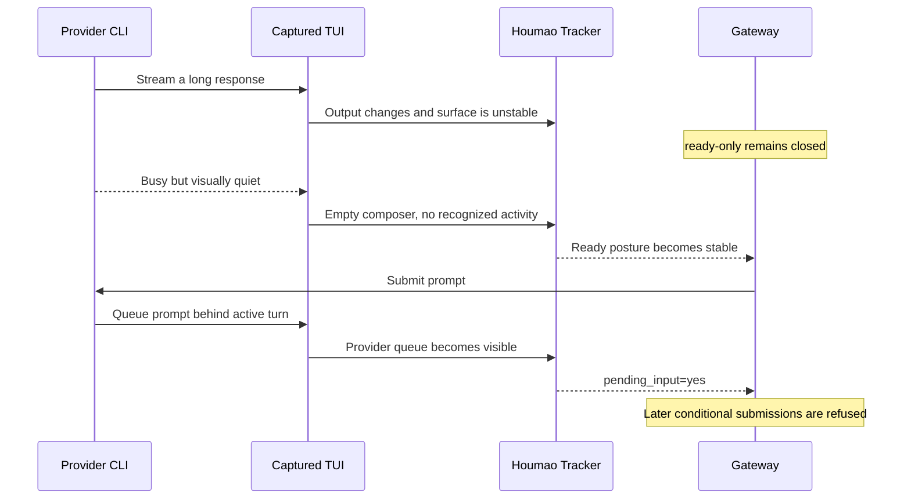

# Why Prompt Admission Uses Readiness and Pending Input

This page explains why direct TUI prompt admission uses both stable prompt readiness and provider-native pending-input detection. It is intended for developers changing TUI tracking, gateway admission, or downstream automation that submits prompts through `POST /v1/control/prompt`.

## The Core Problem

Houmao observes a terminal surface, but the CLI tool owns the authoritative turn state and its internal prompt queue. Those views usually agree, but they are not identical.

Codex and Kimi Code can continue processing while leaving an input composer visible. During a long response, an activity row or spinner can disappear, move outside the detector's bounded live-edge region, or remain unchanged while the CLI waits for more model output. If the detector sees a visible empty composer without recognizable activity, it can temporarily classify the surface as ready even though the CLI would queue a newly submitted prompt.

A long response does not create this risk by itself. While visible output keeps changing, the gateway's stability check normally keeps `ready-only` admission closed. The risky interval begins when a still-busy CLI produces no observable change for at least the configured stability threshold, or when capture timing misses the changing evidence.



## Three Independent Facts

Prompt admission must keep three facts separate:

| Fact | Question It Answers | What It Does Not Prove |
|---|---|---|
| Turn activity | Does the captured surface contain evidence of work in progress? | Absence of activity evidence does not prove that the provider is idle. |
| Surface stability | Has the tracked visible state remained unchanged for the configured interval? | A stable surface can still belong to a busy provider. |
| `surface.pending_input` | Does the provider TUI visibly hold submitted input behind its active turn? | `pending_input=no` does not prove that the active turn is complete. |

The conceptual `ready-only` rule is therefore:

```text
submit_ready =
    prompt-ready turn and surface posture
    AND tracked state is stable
    AND surface.pending_input = no
```

An unstable surface should be described as settling or not submit-ready. It should not automatically be labeled busy. Idle terminal chrome can repaint, and a busy CLI can remain visually static; folding stability into the busy state would make both concepts less precise.

## Why Stability Is Necessary but Insufficient

The stability guard reduces transient false-ready decisions. Each meaningful change to the tracked visible-state signature resets the stability window, so continuously rendered output does not immediately become eligible for `ready-only` submission.

No finite stability interval can prove idleness, however. A provider can remain internally busy during:

- a pause between streamed model-output chunks,
- hidden or redacted reasoning with no visible activity row,
- a tool or network wait whose indicator is missing or outside the captured region,
- output buffering or terminal backpressure,
- a provider-specific rendering change that the current detector does not recognize.

Increasing the stability threshold can reduce the probability of false-ready admission, but it also delays legitimate prompts and cannot eliminate these cases.

## Why Pending Input Remains an Admission Guard

Once an erroneously submitted prompt reaches a busy CLI, the provider normally renders a queued-input preview. Houmao reports that evidence as `surface.pending_input=yes`. This gives later submissions a fact that is stronger and more specific than another readiness guess: at least one submitted instruction is already waiting inside the provider.

The pending-input guard serves two roles:

1. It is defense in depth for `ready-only`. Even if readiness or active-turn recovery produces an inconsistent ready posture, `pending_input=yes` or `unknown` keeps conditional admission closed.
2. It is the defining signal for `if-no-pending`. That policy intentionally permits submission while the provider is busy, but only while no provider-native queued instruction is visible. A binary busy state cannot distinguish busy-with-an-empty-queue from busy-with-a-nonempty-queue.

Final stable-active recovery makes the first role especially important. That recovery is a parser-independent backstop for a detector that remains falsely active on an unchanged surface. It can eventually restore ready posture without using the same activity reasons that may be faulty. Keeping pending input as a separate admission check prevents that recovery from making a visible provider queue eligible for another `ready-only` submission.

## Admission Policies

The direct TUI prompt-control policies use the latest observed surface as follows:

| Policy | Readiness and Stability | Pending Input | Intended Use |
|---|---|---|---|
| `ready_only` | Must satisfy the stable prompt-ready contract. | Must be `no`. | Submit only for immediate processing. |
| `if_no_pending` | Ignored. The provider may be busy. | Must be `no`. | Permit one queued follow-up when the visible provider queue is empty. |
| `always` | Ignored. | Ignored. | Submit regardless of tracked TUI posture. |

Both conditional policies fail closed when pending input is `unknown`.

These decisions are observational rather than transactional. A successful submission note immediately arms Houmao's turn tracking, which reduces repeated admission through the same tracker. It does not reserve a provider queue slot, and the provider queue may not repaint before another closely spaced caller observes the previous snapshot. Two calls can therefore both dispatch before `pending_input=yes` becomes visible. The pending signal limits later submissions after observation; it does not claim to eliminate the pre-repaint window.

## Provider-Specific Reasons

Codex tracks whether an agent turn is running internally and can retain submitted input until a later boundary or the end of the turn. Its TUI can hide the ordinary status row while streaming assistant output. Houmao must therefore combine bounded activity cues, temporal evidence, stability, and visible queued-input sections rather than treating the empty composer as proof of idleness.

Kimi Code internally distinguishes idle, waiting, thinking, composing, tool, and shell phases. Submitted input is queued while the streaming phase is not idle. Some phases do not render the same spinner, and intervening panels can separate an activity indicator from the editor. Houmao's Kimi profiles likewise cannot infer the provider's internal phase from composer visibility alone.

Provider-specific detector improvements can reduce false-ready intervals, but terminal observation cannot make the internal state fully observable. The admission model must remain conservative when evidence is incomplete.

## Scope of This Guarantee

The `ready_only | if_no_pending | always` contract belongs to direct prompt control through `POST /v1/control/prompt` and its managed-agent proxy. It does not redefine every prompt-producing gateway subsystem.

The durable `/v1/requests` queue, prompt reminders, and the mail notifier have their own scheduling and admission behavior. Gateway-durable queue depth is also distinct from provider-native pending input. Developers adding a new automatic prompt path must choose and document its tracked-readiness and pending-input policy explicitly rather than assuming that direct-control admission runs automatically.

## Operational Interpretation

When diagnosing unexpected queued prompts:

1. Inspect `turn.phase`, `surface.ready_posture`, and `stability.stable` immediately before submission.
2. Check whether the provider was visibly producing output or was in a quiet interval during a longer turn.
3. Inspect `surface.pending_input` after the provider repaints.
4. Distinguish the direct prompt-control route from durable requests, reminders, and notifier-generated prompts.
5. Treat a ready observation followed by `pending_input=yes` as evidence that readiness admission was too optimistic, not as evidence that pending-input detection was redundant.

## See Also

- [Gateway Lifecycle and Operator Flows](../operations/lifecycle.md)
- [Gateway Queue and Recovery](queue-and-recovery.md)
- [TUI Tracking State Model](../../tui-tracking/state-model.md)
- [Shared TUI Detector Profiles](../../tui-tracking/detectors.md)
- [Scoped Agents Gateway CLI](../../cli/agents-gateway.md)

## Source References

- [`src/houmao/agents/realm_controller/gateway_service.py`](../../../../src/houmao/agents/realm_controller/gateway_service.py)
- [`src/houmao/agents/realm_controller/gateway_models.py`](../../../../src/houmao/agents/realm_controller/gateway_models.py)
- [`src/houmao/server/tui/tracking.py`](../../../../src/houmao/server/tui/tracking.py)
- [`src/houmao/shared_tui_tracking/session.py`](../../../../src/houmao/shared_tui_tracking/session.py)
- [`src/houmao/shared_tui_tracking/apps/codex_tui/`](../../../../src/houmao/shared_tui_tracking/apps/codex_tui/)
- [`src/houmao/shared_tui_tracking/apps/kimi_code/`](../../../../src/houmao/shared_tui_tracking/apps/kimi_code/)
