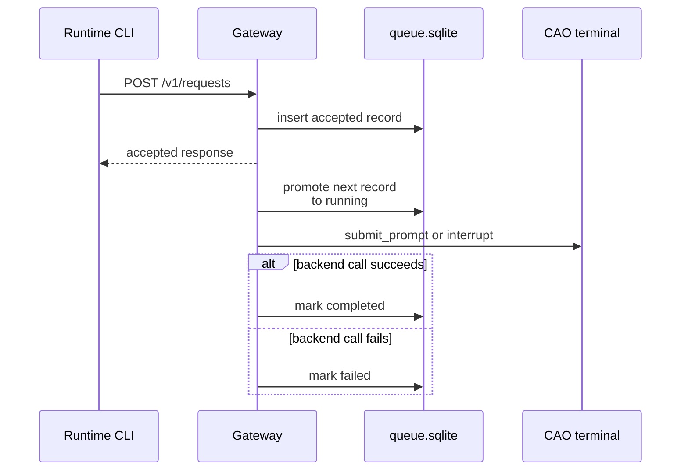
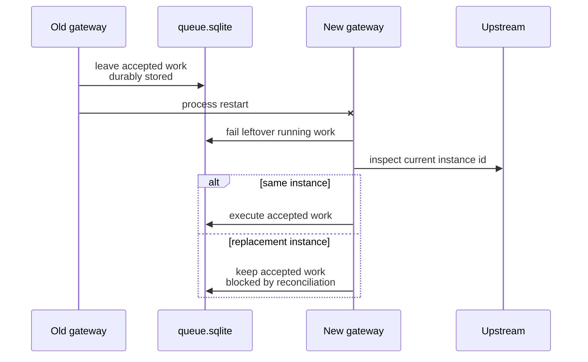

# Gateway Queue And Recovery

This page explains how the live gateway process persists queue state, tracks the currently attached upstream instance, and avoids replaying work across unsafe continuity changes.

## Mental Model

The gateway is small on purpose.

- It keeps a durable queue plus a read-optimized status snapshot.
- It owns one active execution slot for terminal-mutating work.
- It treats the managed agent behind it as a replaceable upstream instance, not as the durable identity of the session.
- That is why it tracks an epoch and blocks replay when continuity becomes uncertain.

## Queue Storage Model

The durable queue lives in `queue.sqlite`.

Current stored request states:

- `accepted`
- `running`
- `completed`
- `failed`

Current queue-depth reporting counts only `accepted` and `running` items. Completed and failed records remain useful for history and diagnostics, but they are not part of active queue depth.

## Current-Instance State

The gateway writes `run/current-instance.json` with:

- process id,
- bound host,
- bound port,
- `managed_agent_instance_epoch`,
- optional `managed_agent_instance_id`.

This file tells the runtime which live gateway process published the current listener, and it lets the gateway notice when the upstream managed-agent instance behind the same session changed.

## Request Admission And Serial Execution

The gateway worker loop is intentionally serialized.

- only one queue item can hold the active terminal-mutation slot at a time,
- new requests are first persisted as `accepted`,
- the worker promotes the oldest eligible request to `running`,
- completion updates the record to `completed` or `failed` and appends an event.



## Health Versus Upstream Availability

This split is easy to miss the first time you debug the system.

- `GET /health` only asks whether the gateway control plane is alive.
- `GET /v1/status` adds the managed-agent view: connectivity, recovery state, request admission, and surface eligibility.

That means a healthy gateway can still report:

- `managed_agent_connectivity=unavailable`,
- `managed_agent_recovery=awaiting_rebind`,
- `request_admission=blocked_unavailable`.

The gateway is alive; the upstream session it fronts is not currently ready.

## Epochs, Reconciliation, And Replay Blocking

The gateway increments `managed_agent_instance_epoch` when it sees a different current upstream instance id than the last one it recorded.

Consequences:

- if the upstream instance did not change, the epoch stays stable,
- if the upstream instance changed, the gateway enters reconciliation-oriented status,
- requests accepted for the old epoch are not replayed blindly against the replacement instance.

Representative status after an instance change:

```json
{
  "gateway_health": "healthy",
  "managed_agent_connectivity": "connected",
  "managed_agent_recovery": "reconciliation_required",
  "request_admission": "blocked_reconciliation",
  "managed_agent_instance_epoch": 2
}
```

This is a safety boundary, not just bookkeeping. It prevents the sidecar from silently delivering old queued intent to a new upstream instance whose continuity has not been positively established.

## Restart Recovery

Gateway restarts do not discard already accepted queued work by default.

Current behavior:

- requests left in `accepted` state remain eligible after restart,
- requests left in `running` state are marked failed on startup because the old process died mid-execution,
- accepted work can be recovered and executed after restart if the upstream instance continuity is still valid,
- accepted work is preserved but not replayed when the new startup detects an epoch change that requires reconciliation.



## Current Execution-Adapter Boundary

The live gateway process now selects an execution adapter from strict `attach.json` metadata instead of assuming one CAO-only callback path.

- REST-backed adapters cover runtime-owned `cao_rest` and `houmao_server_rest` sessions and use the existing REST callback path for inspection, prompt submission, and interrupt delivery.
- A local headless adapter covers runtime-owned native headless sessions and resumes that session through runtime-owned control.
- A server-managed headless adapter covers native headless sessions whose attach metadata publishes `managed_api_base_url` plus `managed_agent_ref`, and routes prompt or interrupt work back through the managed-agent API rather than bypassing server-owned turn authority.
- Queue durability, reconciliation checks, and gateway-local epoch handling stay the same across those adapters.

## Source References

- [`src/houmao/agents/realm_controller/gateway_service.py`](../../../../src/houmao/agents/realm_controller/gateway_service.py)
- [`src/houmao/agents/realm_controller/gateway_storage.py`](../../../../src/houmao/agents/realm_controller/gateway_storage.py)
- [`src/houmao/agents/realm_controller/gateway_models.py`](../../../../src/houmao/agents/realm_controller/gateway_models.py)
- [`tests/unit/agents/realm_controller/test_gateway_support.py`](../../../../tests/unit/agents/realm_controller/test_gateway_support.py)
