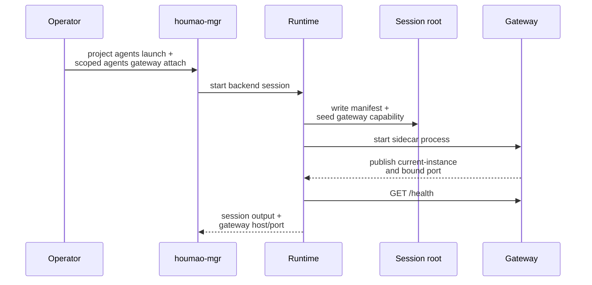
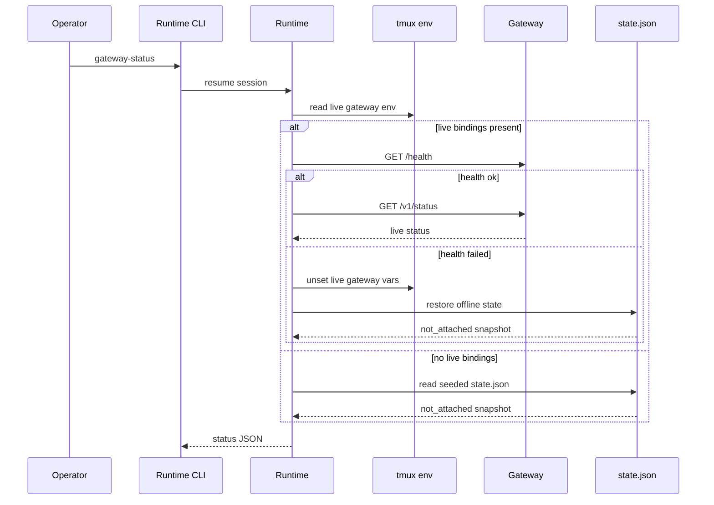

# Gateway Lifecycle And Operator Flows

This page explains how a runtime-managed session becomes gateway-capable, how a live gateway is attached or detached, and how the runtime tells the difference between a dead gateway and a session that is simply not attached right now.

## Mental Model

Think in three states:

1. the session is not gateway-capable,
2. the session is gateway-capable but has no live gateway attached,
3. the session has a live gateway sidecar.

Most operator confusion comes from mixing state 2 and state 3. The session can already have attach metadata and seeded status files even when there is no live HTTP listener.

## Capability Publication Versus Live Attach

Runtime-owned tmux-backed sessions publish gateway capability by default.

That means session start or resume can create:

- `gateway/gateway_manifest.json`,
- `gateway/attach.json`,
- `gateway/state.json`,
- manifest-first tmux discovery env,
- a `not_attached` status snapshot.

It does not mean a live gateway is already running.

`attach.json` is internal bootstrap state and `gateway_manifest.json` is derived outward-facing bookkeeping. Supported attach and relaunch behavior still resolve authority from `manifest.json` plus tmux or shared-registry discovery.

Maintained tmux-backed managed sessions use the same runtime-owned gateway publication seam. That shared publication writes `gateway_manifest.json`, `attach.json`, seeded offline status, queue/bootstrap assets, and manifest-first tmux discovery env before later gateway attach occurs.

## Post-Launch Attach Is The Official Managed-Agent Path

For the official managed-agent flow, launch and gateway lifecycle stay separate.

That means:

- the managed agent launches first,
- gateway capability is published through `manifest.json`, derived gateway artifacts, seeded state, and tmux discovery env,
- live gateway attach happens later through an explicit attach action,
- async mailbox demos and passive-server-managed flows should treat this post-launch attach as the supported path.

The same design works for manager-owned local attach flows and for passive-server discovery of already attached gateways. Passive-server does not remotely spawn gateway processes; attach and detach stay on the host that owns the tmux session.

For current-session attach, attach becomes valid only after two conditions hold at the same time:

- the tmux session already publishes manifest-first discovery for that runtime-owned session
- the same logical session is discoverable from the shared registry or maintained pair authority

Before discovery completes, the seeded offline gateway artifacts may already exist, but current-session attach still fails because the managed-agent lookup is not ready yet.

## Managed-Agent Attach

For managed terminal sessions, the supported public CLI families are `houmao-mgr agents single ... gateway ...` and `houmao-mgr agents self gateway ...`.

Explicit target mode:

```bash
houmao-mgr agents single --agent-name writer gateway attach --pair-port 9891
houmao-mgr agents single --agent-name writer gateway send-keys --pair-port 9891 --sequence "<[Escape]>"
houmao-mgr agents single --agent-name writer gateway mail-notifier enable --pair-port 9891 --interval-seconds 60
```

Current-session mode:

```bash
houmao-mgr agents self gateway attach
houmao-mgr agents self gateway status
houmao-mgr agents self gateway send-keys --sequence "<[Escape]>"
houmao-mgr agents self gateway mail-notifier status
```

After attach, direct prompt control uses an explicit admission policy:

```bash
houmao-mgr agents single --agent-name writer gateway prompt --prompt "Start only when ready"
houmao-mgr agents single --agent-name writer gateway prompt --admission-policy if-no-pending --prompt "Queue this only if no submitted prompt is waiting"
houmao-mgr agents single --agent-name writer gateway prompt --admission-policy always --prompt "Submit regardless of tracked TUI posture"
```

`ready-only` is the default. `if-no-pending` and `always` apply only to attached TUI targets; native headless targets retain overlap-safe `ready-only` admission. Provider-native `surface.pending_input` is independent from an unsubmitted composer draft, gateway-durable work, and Houmao prompt notes. The conditional decision uses the latest observed provider surface and does not reserve a slot while the provider repaints.

| Latest tracked TUI observation | `ready-only` | `if-no-pending` | `always` |
|---|---|---|---|
| Ready, pending `no` | Dispatch | Dispatch | Dispatch |
| Busy, pending `no` | Refuse `not_ready` | Dispatch | Dispatch |
| Ready, pending `yes` | Refuse `pending_input` | Refuse `pending_input` | Dispatch |
| Busy, pending `yes` | Refuse `not_ready` | Refuse `pending_input` | Dispatch |
| Ready, pending `unknown` | Refuse `pending_input_unknown` | Refuse `pending_input_unknown` | Dispatch |
| Busy, pending `unknown` | Refuse `not_ready` | Refuse `pending_input_unknown` | Dispatch |

No policy bypasses detached or unavailable state, reconciliation blocking, invalid target selectors, adapter incompatibility, or invalid execution overrides. TUI `chat_session.mode=new` requires `ready-only`.

Current-session mode must run inside the target tmux session and validates all of the following before it calls the managed-agent route:

- `HOUMAO_MANIFEST_PATH` points to a readable runtime-owned `manifest.json`, or `HOUMAO_AGENT_ID` resolves a fresh shared-registry `runtime.manifest_path`
- the resolved manifest belongs to the current tmux session
- the resolved manifest describes a maintained tmux-backed managed session
- manifest-declared attach authority and shared-registry identity become the authoritative managed-agent attach target
- any existing `gateway_manifest.json` is treated as derived publication rather than current-session attach authority

Important boundary:

- `--pair-port` is only valid on selected-agent `agents single ... gateway` commands
- `--pair-port` selects the Houmao pair authority, not the live gateway listener port; lower-level listener binding uses runtime-facing flags such as `--gateway-port`
- `agents self gateway` does not accept `--pair-port`; it follows the current session's manifest-declared pair authority after local resolution
- current-session attach does not guess or re-resolve a different server target
- stale pointers fail closed instead of falling back to terminal id, active pane, or another alias

## Runtime-Owned Managed Attach Defaults To Foreground

For runtime-owned tmux-backed managed sessions, scoped gateway `attach` now uses the same-session auxiliary-window execution path by default. Use `--background` when you explicitly want the detached-process path instead.

Gateway-owned TUI tracking timings can be tuned at attach time with the positive-second `--gateway-tui-watch-poll-interval-seconds`, `--gateway-tui-stability-threshold-seconds`, `--gateway-tui-completion-stability-seconds`, `--gateway-tui-unknown-to-stalled-timeout-seconds`, `--gateway-tui-stale-active-recovery-seconds`, and `--gateway-tui-final-stable-active-recovery-seconds` flags. Explicit attach or launch-time overrides win over the gateway root's persisted desired timing config, and persisted desired timing config wins over the built-in defaults. Successful attach persists the resolved timing block next to desired host, port, and execution mode for later attach attempts.

Example:

```bash
houmao-mgr agents single --agent-name local gateway attach
houmao-mgr agents single --agent-name local gateway status
houmao-mgr agents single --agent-name local gateway attach --background
houmao-mgr agents single --agent-name local gateway attach --gateway-tui-stale-active-recovery-seconds 10
houmao-mgr agents single --agent-name local gateway attach --gateway-tui-final-stable-active-recovery-seconds 30
```

Foreground attach rules:

- tmux window `0` remains the contractual agent surface
- when launch omitted `--session-name`, the runtime-owned tmux handle uses `HOUMAO-<agent_name>-<epoch-ms>`
- the gateway runs in an auxiliary tmux window whose recorded index is `>=1`
- `gateway status` reports `execution_mode` plus the authoritative `gateway_tmux_window_index` and `gateway_tmux_window_id` for the live gateway surface
- later attach or restart flows reuse the persisted desired execution mode instead of silently falling back to detached execution

## Runtime Auto-Attach Convenience

The runtime CLI still has a local `--gateway-auto-attach` convenience for runtime-owned sessions, but that convenience is not the public managed-agent contract and should not be confused with the server-managed lifecycle model.



Current runtime-only behavior:

- the managed session starts first,
- gateway attach is attempted afterward,
- if auto-attach fails after session start, the session can remain running and the failure is reported explicitly.

## Attach Later

Use `attach-gateway` when the session is already running and only needs the sidecar now.

```bash
pixi run python -m houmao.agents.realm_controller attach-gateway \
  --agent-identity HOUMAO-gpu
```

Listener resolution rules in the current implementation:

1. CLI host or port override for the attach action,
2. caller environment variable for host or port,
3. stored desired config when present,
4. internal bootstrap defaults when present,
5. fallback host `127.0.0.1` and system-assigned port request when no port is specified.

Important rule:

- port conflicts fail the attach explicitly; the runtime does not silently pick a different explicit port on the same attempt.
- when no attach-time override is supplied, the attach path reuses persisted desired listener defaults when they exist and otherwise falls back to the default listener rules.

## Status Inspection

`gateway-status` is deliberately tolerant of non-live cases.

- If a live gateway validates through env plus `GET /health`, the runtime reads live `GET /v1/status`.
- If no live gateway is attached, the runtime returns the seeded `state.json` snapshot.
- If live env exists but health validation fails, the runtime clears stale live bindings and restores offline state.



## Detach And Stop Interaction

Detach keeps the session gateway-capable while removing the live sidecar.

```bash
pixi run python -m houmao.agents.realm_controller detach-gateway \
  --agent-identity HOUMAO-gpu
```

Effects:

- the gateway process is terminated,
- live gateway env vars are removed,
- `gateway_manifest.json` is regenerated as offline derived bookkeeping,
- `state.json` returns to the offline `not_attached` shape,
- persisted manifest-backed attach authority stays in place for later re-attach.

`houmao-mgr agents single ... stop` reuses this behavior for tmux-backed sessions when possible before terminating the backend session.

## Same-Session Gateway Windows

For tmux-backed managed sessions, live gateway attach runs the gateway inside the same tmux session in an auxiliary window instead of relying only on an unrelated detached process.

Current behavior:

- tmux window `0` stays reserved as the only contractual agent surface
- the live gateway records its execution mode plus tmux window and pane handle in `gateway/run/current-instance.json`
- detach, stale-runtime cleanup, and same-session reattach stop the recorded auxiliary window rather than rediscovering some other non-zero window heuristically
- if the recorded execution handle ever claims window `0`, detach and cleanup refuse to kill it

Non-zero windows remain intentionally non-contractual for operators and callers:

- do not infer semantics from their names
- do not assume stable ordering or counts
- treat only the exact handle recorded for the current live gateway as authoritative

## Direct Runtime Control Versus Gateway Queueing

Choose direct control when you want synchronous turn execution now.

Choose gateway queueing when:

- a live gateway is already attached,
- you want durable acceptance before execution,
- you want the sidecar to serialize access to the managed terminal.

Current behavior boundary:

- gateway-routed requests do not auto-attach the gateway,
- direct runtime control remains valid even for sessions that are gateway-capable but not currently gateway-attached.

For passive-server-managed agents, the same separation applies: passive-server owns managed-agent request routes, but shared mailbox listing, reading, sending, replying, and lifecycle updates stay on the live gateway `/v1/mail/*` facade after attach.

## Tail The Running Log

The live gateway keeps one append-only running log at `<session-root>/gateway/logs/gateway.log`.

That file is the operator-facing view for:

- gateway start and stop,
- request execution outcomes,
- mail notifier enable or disable changes,
- notifier poll decisions such as empty polls, prompt-readiness deferrals, and enqueued reminders.

For detailed per-poll notifier evidence, inspect `queue.sqlite.gateway_notifier_audit` instead of relying on the human log alone.

Opt-in diagnostic logging is separate from this running log. When `desired-config.json` enables `desired_diagnostic_logging`, the gateway writes structured JSONL entries under `<session-root>/gateway/logs/diagnostics/gateway-diagnostic.log` with bounded rotation controlled by `max_bytes` and `backup_count`. Diagnostic logs are meant for postmortems around HTTP validation, mailbox facade operations, and repeated warning/error paths; `gateway.log` stays the compact tail-watch surface.

Diagnostic entries are redacted by construction. They use explicit fields such as method, path, status code, duration, operation name, message counts, and repair hints, and they do not include mailbox bodies, raw prompt text, attachment contents, authorization headers, cookies, bearer tokens, credentials, or environment secrets by default. Consecutive warning/error entries with the same semantic key are summarized with a suppressed-count entry instead of being repeated indefinitely.

Typical watch command:

```bash
tail -f <session-root>/gateway/logs/gateway.log
```

## Current Implementation Notes

- A session can be gateway-capable even when `gateway-status` reports `gateway_health=not_attached`.
- Runtime-owned live attach currently supports `local_interactive` and runtime-owned native headless backends whose execution adapters are implemented. Legacy REST-backed manifests are retained only for rejection or old-artifact inspection.
- Attached runtime-owned `local_interactive` sessions expose the gateway-owned `/v1/control/tui/state`, `/v1/control/tui/history`, and `/v1/control/tui/note-prompt` routes as the supported local/serverless tracking surface; that surface uses the runtime session id as the public `terminal_id` fallback because there is no backend-provided terminal alias. The `/v1/control/tui/history` route is bounded in-memory snapshot history rather than coarse transition history.
- Passive-server-managed native headless agents use the same post-launch attach model; the live gateway now preserves direct headless chat-session selection on `POST /v1/control/prompt`, exposes `GET /v1/control/headless/state` plus `POST /v1/control/headless/next-prompt-session`, and routes actual headless execution back through the pair authority without recursively re-entering the public gateway prompt route.
- `GET /health` is the runtime's liveness check before it trusts a live gateway instance.
- Desired host, port, and execution mode are rewritten after successful live attach so later starts can reuse the actual bound listener and gateway surface topology.

## Source References

- [`src/houmao/agents/realm_controller/runtime.py`](../../../../src/houmao/agents/realm_controller/runtime.py)
- [`src/houmao/agents/realm_controller/gateway_storage.py`](../../../../src/houmao/agents/realm_controller/gateway_storage.py)
- [`src/houmao/agents/realm_controller/gateway_client.py`](../../../../src/houmao/agents/realm_controller/gateway_client.py)
- [`tests/unit/agents/realm_controller/test_gateway_support.py`](../../../../tests/unit/agents/realm_controller/test_gateway_support.py)
