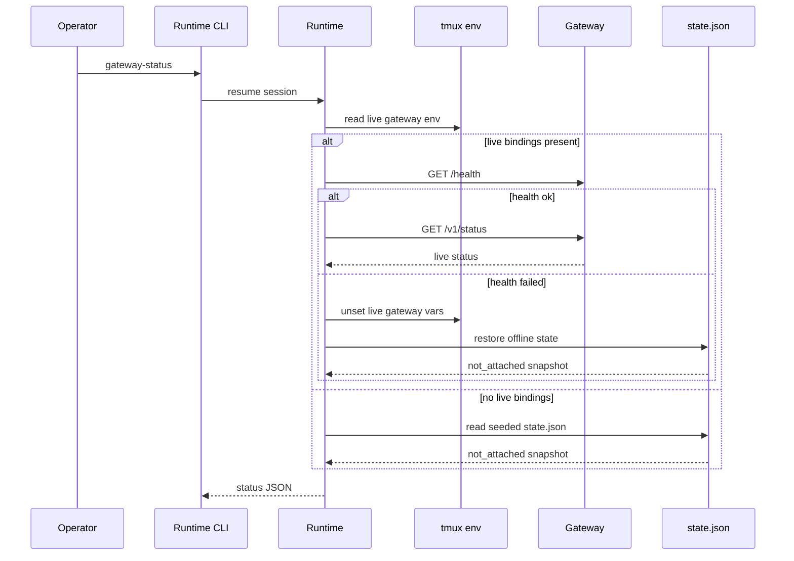

# Gateway Lifecycle And Operator Flows

This page explains how a runtime-managed session becomes gateway-capable, how a live gateway is attached or detached, and how the runtime tells the difference between a dead gateway and a session that is simply not attached right now.

## Mental Model

Think in three states:

1. the session is not gateway-capable,
2. the session is gateway-capable but has no live gateway attached,
3. the session has a live gateway sidecar.

Most operator confusion comes from mixing state 2 and state 3. The session can already have attach metadata and seeded status files even when there is no live HTTP listener.

## Capability Publication Versus Live Attach

Runtime-owned tmux-backed sessions publish gateway capability by default.

That means session start or resume can create:

- `gateway/gateway_manifest.json`,
- `gateway/attach.json`,
- `gateway/state.json`,
- manifest-first tmux discovery env,
- a `not_attached` status snapshot.

It does not mean a live gateway is already running.

`attach.json` is internal bootstrap state and `gateway_manifest.json` is derived outward-facing bookkeeping. Supported attach and relaunch behavior still resolve authority from `manifest.json` plus tmux or shared-registry discovery.

Server-backed `houmao_server_rest` sessions reuse the same runtime-owned gateway publication seam as direct runtime launches. That shared publication writes `gateway_manifest.json`, `attach.json`, seeded offline status, queue/bootstrap assets, and manifest-first tmux discovery env before the server-side managed-agent registration step finishes.

## Post-Launch Attach Is The Official Managed-Agent Path

For the official managed-agent flow, launch and gateway lifecycle stay separate.

That means:

- the managed agent launches first,
- gateway capability is published through `manifest.json`, derived gateway artifacts, seeded state, and tmux discovery env,
- live gateway attach happens later through an explicit attach action,
- async mailbox demos and server-managed flows should treat this post-launch attach as the supported path.

The same design works whether the attach action comes from runtime CLI control or from the server-managed `/houmao/agents/{agent_ref}/gateway/attach` route family.

For pair-managed `houmao_server_rest`, current-session attach becomes valid only after two conditions hold at the same time:

- the tmux session already publishes manifest-first discovery for that runtime-owned session
- the same logical session is already registered under `/houmao/agents/*` on the persisted `api_base_url`

Before registration completes, the seeded offline gateway artifacts may already exist, but current-session pair attach still fails because the managed-agent lookup is not ready yet.

## Pair-Owned Managed-Agent Attach

For pair-managed terminal sessions, the supported public CLI family is `houmao-mgr agents gateway ...`.

Explicit target mode:

```bash
houmao-mgr agents gateway attach --agent-name cao-gpu --pair-port 9889
houmao-mgr agents gateway send-keys --agent-name cao-gpu --pair-port 9889 --sequence "<[Escape]>"
houmao-mgr agents gateway mail-notifier enable --agent-name cao-gpu --pair-port 9889 --interval-seconds 60
```

Current-session mode:

```bash
houmao-mgr agents gateway attach
houmao-mgr agents gateway status
houmao-mgr agents gateway send-keys --sequence "<[Escape]>"
houmao-mgr agents gateway mail-notifier status
```

Outside-tmux tmux-session mode:

```bash
houmao-mgr agents gateway attach --target-tmux-session HOUMAO-cao-gpu-1775467167530
houmao-mgr agents gateway status --target-tmux-session HOUMAO-cao-gpu-1775467167530
houmao-mgr agents gateway send-keys --target-tmux-session HOUMAO-cao-gpu-1775467167530 --sequence "<[Escape]>"
```

Current-session mode must run inside the target tmux session and validates all of the following before it calls the managed-agent route:

- `HOUMAO_MANIFEST_PATH` points to a readable runtime-owned `manifest.json`, or `HOUMAO_AGENT_ID` resolves a fresh shared-registry `runtime.manifest_path`
- the resolved manifest belongs to the current tmux session
- the resolved manifest uses `backend == "houmao_server_rest"`
- manifest-declared attach authority becomes the authoritative managed-agent attach target
- any existing `gateway_manifest.json` is treated as derived publication rather than current-session attach authority

`--target-tmux-session` is the outside-tmux version of that workflow. It first checks that the addressed tmux session exists locally, then resolves `HOUMAO_MANIFEST_PATH` from that session, and finally falls back to an exact fresh shared-registry `terminal.session_name` match when the tmux-published manifest pointer is missing or stale.

Important boundary:

- `--pair-port` is only valid with explicit `--agent-name` or `--agent-id` attach
- `--pair-port` selects the Houmao pair authority, not the live gateway listener port; lower-level listener binding uses runtime-facing flags such as `--gateway-port`
- `--target-tmux-session` and `--current-session` do not accept `--pair-port`; both follow the addressed session's manifest-declared pair authority after local resolution
- current-session attach does not guess or re-resolve a different server target
- stale pointers fail closed instead of falling back to terminal id, active pane, or another alias

## Runtime-Owned Managed Attach Defaults To Foreground

For runtime-owned tmux-backed managed sessions, `houmao-mgr agents gateway attach` now uses the same-session auxiliary-window execution path by default. Use `--background` when you explicitly want the detached-process path instead.

Gateway-owned TUI tracking timings can be tuned at attach time with the positive-second `--gateway-tui-watch-poll-interval-seconds`, `--gateway-tui-stability-threshold-seconds`, `--gateway-tui-completion-stability-seconds`, `--gateway-tui-unknown-to-stalled-timeout-seconds`, `--gateway-tui-stale-active-recovery-seconds`, and `--gateway-tui-final-stable-active-recovery-seconds` flags. Explicit attach or launch-time overrides win over the gateway root's persisted desired timing config, and persisted desired timing config wins over the built-in defaults. Successful attach persists the resolved timing block next to desired host, port, and execution mode for later attach attempts.

Example:

```bash
houmao-mgr agents gateway attach --agent-name local
houmao-mgr agents gateway status --agent-name local
houmao-mgr agents gateway attach --background --agent-name local
houmao-mgr agents gateway attach --agent-name local --gateway-tui-stale-active-recovery-seconds 10
houmao-mgr agents gateway attach --agent-name local --gateway-tui-final-stable-active-recovery-seconds 30
```

Foreground attach rules:

- tmux window `0` remains the contractual agent surface
- when launch omitted `--session-name`, the runtime-owned tmux handle uses `HOUMAO-<agent_name>-<epoch-ms>`
- the gateway runs in an auxiliary tmux window whose recorded index is `>=1`
- `gateway status` reports `execution_mode` plus the authoritative `gateway_tmux_window_index` and `gateway_tmux_window_id` for the live gateway surface
- later attach or restart flows reuse the persisted desired execution mode instead of silently falling back to detached execution

## Runtime Auto-Attach Convenience

The runtime CLI still has a local `--gateway-auto-attach` convenience for runtime-owned sessions, but that convenience is not the public managed-agent contract and should not be confused with the server-managed lifecycle model.


Current runtime-only behavior:

- the managed session starts first,
- gateway attach is attempted afterward,
- if auto-attach fails after session start, the session can remain running and the failure is reported explicitly.

## Attach Later

Use `attach-gateway` when the session is already running and only needs the sidecar now.

```bash
pixi run python -m houmao.agents.realm_controller attach-gateway \
  --agent-identity HOUMAO-gpu
```

Listener resolution rules in the current implementation:

1. CLI host or port override for the attach action,
2. caller environment variable for host or port,
3. stored desired config when present,
4. internal bootstrap defaults when present,
5. fallback host `127.0.0.1` and system-assigned port request when no port is specified.

Important rule:

- port conflicts fail the attach explicitly; the runtime does not silently pick a different explicit port on the same attempt.
- when no attach-time override is supplied, the attach path reuses persisted desired listener defaults when they exist and otherwise falls back to the default listener rules.

## Status Inspection

`gateway-status` is deliberately tolerant of non-live cases.

- If a live gateway validates through env plus `GET /health`, the runtime reads live `GET /v1/status`.
- If no live gateway is attached, the runtime returns the seeded `state.json` snapshot.
- If live env exists but health validation fails, the runtime clears stale live bindings and restores offline state.



## Detach And Stop Interaction

Detach keeps the session gateway-capable while removing the live sidecar.

```bash
pixi run python -m houmao.agents.realm_controller detach-gateway \
  --agent-identity HOUMAO-gpu
```

Effects:

- the gateway process is terminated,
- live gateway env vars are removed,
- `gateway_manifest.json` is regenerated as offline derived bookkeeping,
- `state.json` returns to the offline `not_attached` shape,
- persisted manifest-backed attach authority stays in place for later re-attach.

`houmao-mgr agents stop` reuses this behavior for tmux-backed sessions when possible before terminating the backend session.

## Same-Session Gateway Windows

For `houmao_server_rest`, live gateway attach runs the gateway inside the same tmux session in an auxiliary window instead of relying only on an unrelated detached process.

Current behavior:

- tmux window `0` stays reserved as the only contractual agent surface
- the live gateway records its execution mode plus tmux window and pane handle in `gateway/run/current-instance.json`
- detach, stale-runtime cleanup, and same-session reattach stop the recorded auxiliary window rather than rediscovering some other non-zero window heuristically
- if the recorded execution handle ever claims window `0`, detach and cleanup refuse to kill it

Non-zero windows remain intentionally non-contractual for operators and callers:

- do not infer semantics from their names
- do not assume stable ordering or counts
- treat only the exact handle recorded for the current live gateway as authoritative

## Direct Runtime Control Versus Gateway Queueing

Choose direct control when you want synchronous turn execution now.

Choose gateway queueing when:

- a live gateway is already attached,
- you want durable acceptance before execution,
- you want the sidecar to serialize access to the managed terminal.

Current behavior boundary:

- gateway-routed requests do not auto-attach the gateway,
- direct runtime control remains valid even for sessions that are gateway-capable but not currently gateway-attached.

For server-managed agents, the same separation applies: `houmao-server` owns managed-agent request and gateway lifecycle routes, but shared mailbox send, check, and reply stay on the live gateway `/v1/mail/*` facade after attach.

## Tail The Running Log

The live gateway keeps one append-only running log at `<session-root>/gateway/logs/gateway.log`.

That file is the operator-facing view for:

- gateway start and stop,
- request execution outcomes,
- mail notifier enable or disable changes,
- notifier poll decisions such as empty polls, prompt-readiness deferrals, and enqueued reminders.

For detailed per-poll notifier evidence, inspect `queue.sqlite.gateway_notifier_audit` instead of relying on the human log alone.

Typical watch command:

```bash
tail -f <session-root>/gateway/logs/gateway.log
```

## Current Implementation Notes

- A session can be gateway-capable even when `gateway-status` reports `gateway_health=not_attached`.
- Runtime-owned live attach currently supports `local_interactive`, REST-backed sessions (`cao_rest`, `houmao_server_rest`), and runtime-owned native headless backends whose execution adapters are implemented.
- Attached runtime-owned `local_interactive` sessions expose the gateway-owned `/v1/control/tui/state`, `/v1/control/tui/history`, and `/v1/control/tui/note-prompt` routes as the supported local/serverless tracking surface; that surface uses the runtime session id as the public `terminal_id` fallback because there is no backend-provided terminal alias. The `/v1/control/tui/history` route is bounded in-memory snapshot history rather than coarse transition history.
- Server-managed native headless agents use the same post-launch attach model; the live gateway now preserves direct headless chat-session selection on `POST /v1/control/prompt`, exposes `GET /v1/control/headless/state` plus `POST /v1/control/headless/next-prompt-session`, and routes actual headless execution back through the pair authority without recursively re-entering the public gateway prompt route.
- `GET /health` is the runtime's liveness check before it trusts a live gateway instance.
- Desired host, port, and execution mode are rewritten after successful live attach so later starts can reuse the actual bound listener and gateway surface topology.

## Source References

- [`src/houmao/agents/realm_controller/runtime.py`](../../../../src/houmao/agents/realm_controller/runtime.py)
- [`src/houmao/agents/realm_controller/gateway_storage.py`](../../../../src/houmao/agents/realm_controller/gateway_storage.py)
- [`src/houmao/agents/realm_controller/gateway_client.py`](../../../../src/houmao/agents/realm_controller/gateway_client.py)
- [`tests/unit/agents/realm_controller/test_gateway_support.py`](../../../../tests/unit/agents/realm_controller/test_gateway_support.py)
