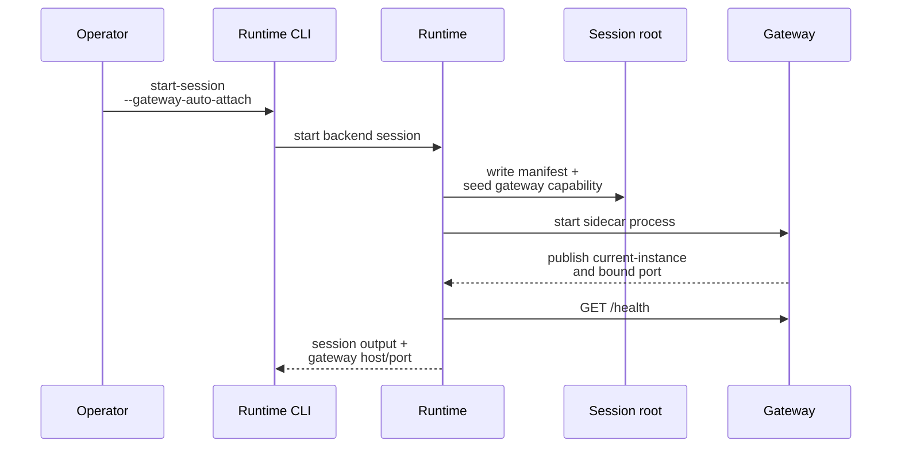
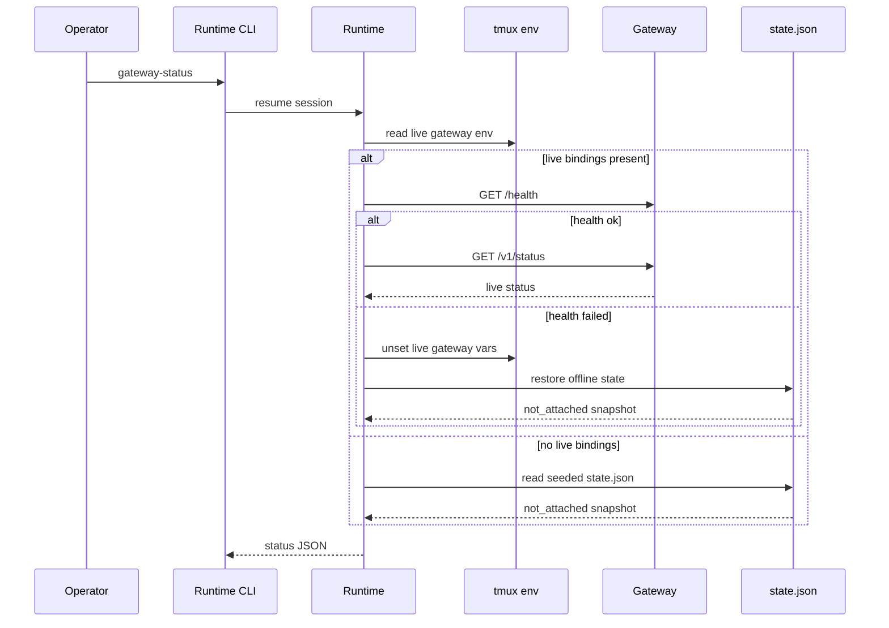

# Gateway Lifecycle And Operator Flows

This page explains how a runtime-managed session becomes gateway-capable, how a live gateway is attached or detached, and how the runtime tells the difference between a dead gateway and a session that is simply not attached right now.

## Mental Model

Think in three states:

1. the session is not gateway-capable,
2. the session is gateway-capable but has no live gateway attached,
3. the session has a live gateway sidecar.

Most operator confusion comes from mixing state 2 and state 3. The session can already have attach metadata and seeded status files even when there is no live HTTP listener.

## Capability Publication Versus Live Attach

Runtime-owned tmux-backed sessions publish gateway capability by default.

That means session start or resume can create:

- `gateway/attach.json`,
- `gateway/state.json`,
- stable tmux env pointers,
- a `not_attached` status snapshot.

It does not mean a live gateway is already running.

## Post-Launch Attach Is The Official Managed-Agent Path

For the official managed-agent flow, launch and gateway lifecycle stay separate.

That means:

- the managed agent launches first,
- gateway capability is published through `attach.json`, seeded state, and tmux env pointers,
- live gateway attach happens later through an explicit attach action,
- async mailbox demos and server-managed flows should treat this post-launch attach as the supported path.

The same design works whether the attach action comes from runtime CLI control or from the server-managed `/houmao/agents/{agent_ref}/gateway/attach` route family.

## Runtime Auto-Attach Convenience

The runtime CLI still has a local `--gateway-auto-attach` convenience for runtime-owned sessions, but that convenience is not the public managed-agent contract and should not be confused with the server-managed lifecycle model.



Current runtime-only behavior:

- the managed session starts first,
- gateway attach is attempted afterward,
- if auto-attach fails after session start, the session can remain running and the failure is reported explicitly.

## Attach Later

Use `attach-gateway` when the session is already running and only needs the sidecar now.

```bash
pixi run python -m houmao.agents.realm_controller attach-gateway \
  --agent-identity AGENTSYS-gpu
```

Listener resolution rules in the current implementation:

1. CLI host or port override for the attach action,
2. caller environment variable for host or port,
3. stored desired config when present,
4. attach-contract defaults,
5. fallback host `127.0.0.1` and system-assigned port request when no port is specified.

Important rule:

- port conflicts fail the attach explicitly; the runtime does not silently pick a different explicit port on the same attempt.
- when no attach-time override is supplied, the attach path reuses persisted desired listener defaults when they exist and otherwise falls back to the default listener rules.

## Status Inspection

`gateway-status` is deliberately tolerant of non-live cases.

- If a live gateway validates through env plus `GET /health`, the runtime reads live `GET /v1/status`.
- If no live gateway is attached, the runtime returns the seeded `state.json` snapshot.
- If live env exists but health validation fails, the runtime clears stale live bindings and restores offline state.



## Detach And Stop Interaction

Detach keeps the session gateway-capable while removing the live sidecar.

```bash
pixi run python -m houmao.agents.realm_controller detach-gateway \
  --agent-identity AGENTSYS-gpu
```

Effects:

- the gateway process is terminated,
- live gateway env vars are removed,
- `state.json` returns to the offline `not_attached` shape,
- stable attach metadata stays in place for later re-attach.

`stop-session` reuses this behavior for tmux-backed sessions when possible before terminating the backend session.

## Direct Runtime Control Versus Gateway Queueing

Choose direct control when you want synchronous turn execution now.

Choose gateway queueing when:

- a live gateway is already attached,
- you want durable acceptance before execution,
- you want the sidecar to serialize access to the managed terminal.

Current behavior boundary:

- gateway-routed requests do not auto-attach the gateway,
- direct runtime control remains valid even for sessions that are gateway-capable but not currently gateway-attached.

For server-managed agents, the same separation applies: `houmao-server` owns managed-agent request and gateway lifecycle routes, but shared mailbox send, check, and reply stay on the live gateway `/v1/mail/*` facade after attach.

## Tail The Running Log

The live gateway keeps one append-only running log at `<session-root>/gateway/logs/gateway.log`.

That file is the operator-facing view for:

- gateway start and stop,
- request execution outcomes,
- mail notifier enable or disable changes,
- notifier poll decisions such as empty polls, dedup skips, and busy deferrals.

For detailed per-poll notifier evidence, inspect `queue.sqlite.gateway_notifier_audit` instead of relying on the human log alone. The runnable operator walkthrough for that inspection flow lives in [`scripts/demo/gateway-mail-wakeup-demo-pack/README.md`](../../../../scripts/demo/gateway-mail-wakeup-demo-pack/README.md), which now uses the repository's copied dummy-project plus lightweight `mailbox-demo` defaults for this narrow gateway walkthrough.

Typical watch command:

```bash
tail -f <session-root>/gateway/logs/gateway.log
```

## Current Implementation Notes

- A session can be gateway-capable even when `gateway-status` reports `gateway_health=not_attached`.
- Runtime-owned live attach currently supports REST-backed sessions (`cao_rest`, `houmao_server_rest`) and runtime-owned native headless backends whose execution adapters are implemented.
- Server-managed native headless agents use the same post-launch attach model, but the live gateway routes prompt and interrupt work back through `/houmao/agents/{agent_ref}/requests` instead of resuming the headless session privately.
- `GET /health` is the runtime's liveness check before it trusts a live gateway instance.
- Desired host and port are rewritten after successful live attach so later starts can reuse the actual bound listener.

## Source References

- [`src/houmao/agents/realm_controller/runtime.py`](../../../../src/houmao/agents/realm_controller/runtime.py)
- [`src/houmao/agents/realm_controller/gateway_storage.py`](../../../../src/houmao/agents/realm_controller/gateway_storage.py)
- [`src/houmao/agents/realm_controller/gateway_client.py`](../../../../src/houmao/agents/realm_controller/gateway_client.py)
- [`tests/unit/agents/realm_controller/test_gateway_support.py`](../../../../tests/unit/agents/realm_controller/test_gateway_support.py)
