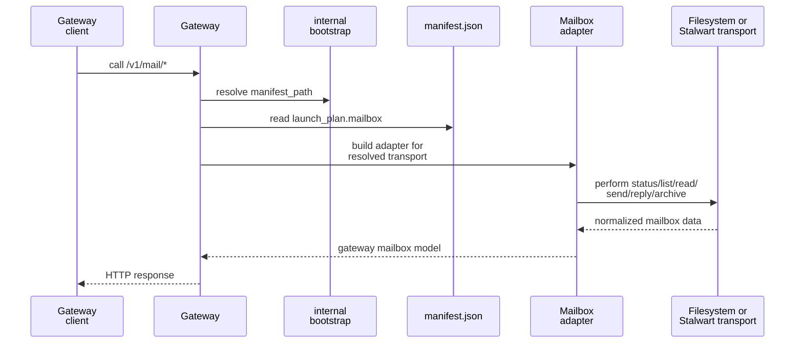

# Gateway Mailbox Facade

- Who this is for: operators and maintainers who need to understand how a live gateway exposes shared mailbox routes for filesystem-backed and Stalwart-backed sessions.
- What it explains: why `/v1/mail/*` exists, how adapter selection works, when the routes are available, and how notifier polling uses the same abstraction.
- Assumes: you already understand basic gateway attach and lifecycle concepts from [Lifecycle And Operator Flows](lifecycle.md).

## Mental Model

The gateway mailbox facade is the shared mailbox control surface for one attached session.

- It exists so mailbox reads and sends do not compete with the terminal-mutation queue behind `POST /v1/requests`.
- It hides transport differences behind one gateway-local contract backed by a manifest-resolved adapter.
- It does not replace mailbox semantics, filesystem repair rules, or Stalwart mailbox storage; it routes to the transport that the runtime already selected for the session.

## Boundary Table

| Layer | Owns | Defers to |
| --- | --- | --- |
| Gateway mailbox facade | route availability, manifest-backed resolution, adapter selection, notifier polling cadence, notifier audit history | mailbox semantics and route payload details described in mailbox and gateway contract pages |
| Filesystem adapter | shared mailbox route implementation against filesystem mailbox state | gateway listener lifecycle, queue semantics, notifier scheduling |
| Stalwart adapter | shared mailbox route implementation against JMAP plus session-local credential material | gateway listener lifecycle, runtime manifest persistence, Stalwart account provisioning |

## Shared Mailbox Surface

| Route | Purpose | Exact contract |
| --- | --- | --- |
| `GET /v1/mail/status` | report whether the live gateway exposes the shared mailbox facade and which transport binding it is using | [Protocol And State Contracts](../contracts/protocol-and-state.md) |
| `POST /v1/mail/list` | list normalized mailbox message metadata, optionally including body content | [Protocol And State Contracts](../contracts/protocol-and-state.md) |
| `POST /v1/mail/peek` | inspect one selected message without marking it read | [Protocol And State Contracts](../contracts/protocol-and-state.md) |
| `POST /v1/mail/read` | inspect one selected message and mark it read | [Protocol And State Contracts](../contracts/protocol-and-state.md) |
| `POST /v1/mail/send` | send a new message without consuming the terminal-mutation slot | [Protocol And State Contracts](../contracts/protocol-and-state.md) |
| `POST /v1/mail/post` | post an operator-origin note into the attached session's mailbox | [Protocol And State Contracts](../contracts/protocol-and-state.md) |
| `POST /v1/mail/reply` | reply to an existing message via opaque `message_ref` | [Protocol And State Contracts](../contracts/protocol-and-state.md) |
| `POST /v1/mail/mark` | mark selected mailbox messages read, answered, or archived | [Protocol And State Contracts](../contracts/protocol-and-state.md) |
| `POST /v1/mail/move` | move selected mailbox messages to another box | [Protocol And State Contracts](../contracts/protocol-and-state.md) |
| `POST /v1/mail/archive` | archive selected mailbox messages | [Protocol And State Contracts](../contracts/protocol-and-state.md) |
| `GET|PUT|DELETE /v1/mail-notifier` | inspect or control gateway mail-notifier behavior | [Protocol And State Contracts](../contracts/protocol-and-state.md) |

## Why `/v1/mail/*` Exists

`POST /v1/requests` is for terminal-mutating work such as prompt submission and interruption. Shared mailbox reads and sends are different:

- they have a distinct contract,
- they should not consume the single active terminal-mutation slot,
- they need one transport-neutral surface that works for both filesystem-backed and Stalwart-backed sessions.

That is why the gateway exposes a separate mailbox facade instead of treating mailbox work as just another queued prompt kind.

## How Adapter Selection Works

The gateway does not invent its own mailbox configuration. It resolves the mailbox binding that the runtime already persisted for the session.

Sequence:

1. The live gateway resolves the runtime-managed session manifest through its internal bootstrap state.
2. In the current implementation, that bootstrap state usually comes from `attach.json.manifest_path`.
3. The gateway reads `payload.launch_plan.mailbox` from that manifest.
4. The gateway builds one transport-specific adapter from that mailbox binding.
5. Shared mailbox routes call the adapter for status, listing, message inspection, send, operator-origin post, reply, marking, moving, or archive actions.

The adapter may be filesystem-backed or Stalwart-backed, but the gateway-facing contract stays the same. The precise payload shapes remain centralized in [Protocol And State Contracts](../contracts/protocol-and-state.md).

## Availability Rules

The mailbox facade is deliberately narrower than generic gateway availability.

| Condition | Result |
| --- | --- |
| session is gateway-capable but no live gateway is attached | no `/v1/mail/*` routes are available |
| live gateway is attached on `127.0.0.1` and the manifest has a usable mailbox binding | shared mailbox routes are available |
| live gateway is attached on `0.0.0.0` | shared mailbox routes return `503` |
| manifest is unreadable or has no mailbox binding | shared mailbox routes fail explicitly |

Current scope rule: mailbox routes remain loopback-only because the gateway does not yet define an authenticated remote exposure model for these routes.

## Direct Versus Gateway Mailbox Paths

The mailbox facade does not eliminate direct transport-specific mailbox behavior.

- If no live gateway is attached, the runtime-owned mailbox guidance may still use direct transport-specific access for the selected transport.
- If a live loopback gateway is attached, runtime-owned mailbox guidance prefers the shared `/v1/mail/*` facade for operations that both transports support.
- `message_ref` stays opaque in both paths.

That split is why the mailbox docs and gateway docs stay adjacent but separate. Use [Stalwart Setup And First Session](../../mailbox/operations/stalwart-setup-and-first-session.md) for the operator path and [Mailbox Runtime Contracts](../../mailbox/contracts/runtime-contracts.md) for the env-binding and prompt contract.

## Notifier Polling Uses The Same Facade

The mail-notifier is gateway-owned, but mailbox truth is transport-owned.

- The notifier checks eligible inbox mail through the same shared mailbox facade used for `list`.
- Mode `any_inbox` treats any unarchived inbox mail as eligible, including read or answered mail. Mode `unread_only` limits eligibility to unread unarchived inbox mail.
- The gateway still owns notifier cadence, readiness-gated reminder delivery, last-error bookkeeping, and per-poll audit history in `queue.sqlite`.
- This is what allows the notifier to work for both filesystem-backed and Stalwart-backed sessions without hard-wiring itself to filesystem mailbox-local SQLite.
- Current reminder behavior is intentionally bounded: one reminder may summarize the eligible inbox snapshot, the agent decides which messages to inspect and handle after listing current mailbox state, and the later turn archives successfully processed work through the shared mailbox facade.

Use [Agents And Runtime](../../system-files/agents-and-runtime.md) for the broader runtime-managed filesystem placement around `gateway/` and session-local secret material.

## Common Confusions

- A session can be gateway-capable without exposing a live mailbox facade right now.
- `/v1/mail/*` is not a generic replacement for `POST /v1/requests`; it exists alongside it.
- The gateway owns route exposure and adapter selection, not mailbox storage semantics.
- Stalwart-backed gateway access still depends on the runtime-owned session-local credential file materialized from `credential_ref`.

## Source References

- [`src/houmao/agents/realm_controller/gateway_service.py`](../../../../src/houmao/agents/realm_controller/gateway_service.py)
- [`src/houmao/agents/realm_controller/gateway_mailbox.py`](../../../../src/houmao/agents/realm_controller/gateway_mailbox.py)
- [`src/houmao/agents/realm_controller/gateway_storage.py`](../../../../src/houmao/agents/realm_controller/gateway_storage.py)
- [`src/houmao/agents/mailbox_runtime_support.py`](../../../../src/houmao/agents/mailbox_runtime_support.py)
- [`src/houmao/mailbox/stalwart.py`](../../../../src/houmao/mailbox/stalwart.py)
- [`tests/unit/agents/realm_controller/test_gateway_support.py`](../../../../tests/unit/agents/realm_controller/test_gateway_support.py)
- [`tests/integration/agents/realm_controller/test_gateway_runtime_contract.py`](../../../../tests/integration/agents/realm_controller/test_gateway_runtime_contract.py)
