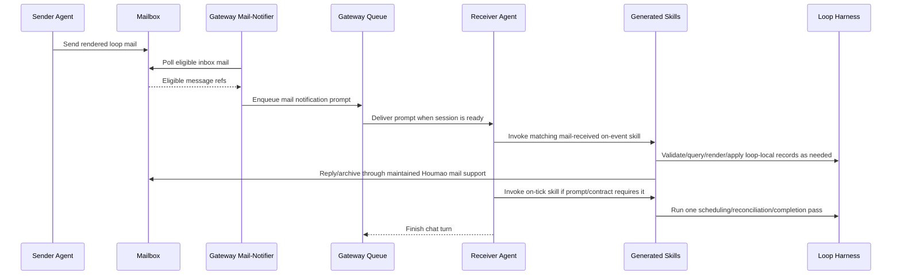

# Notifier-Prompt-Driven Loop Runtime

This page explains the runtime model for Houmao loops that use mailbox communication between agents. The short version is: agents are woken by prompts, not by an in-chat event loop. A separate Houmao mail notifier detects mailbox work, submits a prompt to the target agent through the gateway, the agent processes the mail and any requested follow-up tick, then the agent ends the chat turn.

This model matters because CLI agents are not continuously running loop workers. They can only receive new instructions when their current turn is finished and the gateway reports that another prompt can be admitted. If a generated loop tells an agent to keep waiting inside the current chat turn, that waiting blocks the notifier from delivering the next wake-up prompt.

## Core Principle

Mail-driven Houmao loops are notifier-prompt-driven:

- mailbox state is durable and external to the agent chat turn,
- the gateway mail-notifier runs separately from the target agent,
- the notifier detects eligible inbox mail and enqueues a prompt when the gateway is ready,
- the prompt tells the agent to process mailbox work,
- loop-specific prompt guidance may tell the agent to call generated on-event and on-tick skills,
- the agent completes the bounded work and finishes the chat turn,
- future work arrives through another notifier prompt or an operator prompt.

There is no hidden loop runner inside the agent. There is no external periodic tick driver that prompts agents just because time passed. On-tick skills are invoked from a prompt turn, usually immediately after mail processing when the notifier prompt or loop contract says to do so.

## Actors

| Actor | Responsibility |
| --- | --- |
| Mailbox transport | Stores delivered messages and per-message state outside any one agent turn. |
| Gateway mail-notifier | Polls eligible inbox mail for one live gateway-attached agent and enqueues a notification prompt when the gateway is ready. |
| Gateway request queue | Admits notifier prompts only when the target session is idle and prompt-ready. |
| Managed agent | Receives one prompt, processes bounded work, and returns to prompt-ready state by ending the turn. |
| Generated loop execplan | Defines participant roles, message families, schemas, renderers, on-event skills, on-tick skills, agent bindings, and notifier prompt guidance. |
| Maintained Houmao mail skills | Own mailbox setup, list/read/send/reply/archive operations, gateway-backed mail rounds, and mailbox lifecycle mechanics. |
| Operator | Starts, pauses, resumes, recovers, or stops the loop, and may send explicit prompts when needed. |

The generated loop owns loop semantics. Houmao platform features own transport and wake-up mechanics.

## Mail Operation Surfaces

Mail-driven loops normally use one of three surfaces, depending on who is acting and what context is available:

| Surface | Typical caller | Use |
| --- | --- | --- |
| `houmao-process-emails-via-gateway` skill | Agent that was woken by a notifier prompt | Process one notifier-driven mailbox round through the provided gateway base URL. |
| `houmao-agent-email-comms` skill | Agent or operator-agent doing lower-level mail work | List, read, send, reply, mark, move, or archive mail, including no-gateway fallback when supported. |
| `houmao-mgr agents mail ...` CLI | Human operator, scripts, or external orchestration | Resolve live mailbox posture, inspect mail, send/post/reply, and perform lifecycle updates. |
| Gateway `/v1/mail/*` HTTP routes | Maintained Houmao skills and tools with a live gateway URL | Transport-neutral live mailbox operations for the attached session. |

Generated loop skills should prefer maintained Houmao skills instead of hand-coding mailbox mechanics. Generated docs may still explain the gateway API contract so maintainers can debug or implement loop-local harness checks around payloads, records, and prompt guidance.

## Gateway Mail API Quick Reference

When a live loopback gateway exposes mailbox support, the notifier prompt includes a `Gateway: <base-url>` line and a compact endpoint summary. The shared mailbox facade is rooted at that gateway base URL.

| Operation | HTTP route | Purpose |
| --- | --- | --- |
| Status | `GET /v1/mail/status` | Confirm transport, principal id, mailbox address, and bindings version. |
| List | `POST /v1/mail/list` | List message metadata and optionally include body text. |
| Peek | `POST /v1/mail/peek` | Inspect one message without marking it read. |
| Read | `POST /v1/mail/read` | Inspect one message and mark it read. |
| Send | `POST /v1/mail/send` | Send a new message to one or more mailbox addresses. |
| Post | `POST /v1/mail/post` | Post an operator-origin note into the attached session's mailbox. |
| Reply | `POST /v1/mail/reply` | Reply to one existing message by opaque `message_ref`. |
| Mark | `POST /v1/mail/mark` | Mark selected messages read, answered, or archived. |
| Move | `POST /v1/mail/move` | Move selected messages to another box. |
| Archive | `POST /v1/mail/archive` | Archive selected processed messages. |
| Notifier | `GET|PUT|DELETE /v1/mail-notifier` | Inspect, configure, or disable notifier polling. |

`message_ref` and `thread_ref` are opaque. Loop code and generated skills must not parse filesystem ids, JMAP ids, timestamps, or path fragments out of them. Store them only as stable references for reply, archive, audit, or recovery.

### Check And Read Mail

List the current inbox through the gateway API:

```bash
curl -sS "$GATEWAY_BASE_URL/v1/mail/list" \
  -H 'content-type: application/json' \
  -d '{
    "schema_version": 1,
    "box": "inbox",
    "read_state": "any",
    "answered_state": "any",
    "archived": false,
    "include_body": false
  }'
```

The response includes `message_count`, `open_count`, `unread_count`, and a `messages` array. Each message has fields such as `message_ref`, `thread_ref`, `subject`, `sender`, `to`, `cc`, `reply_to`, `read`, `answered`, `archived`, `box`, `body_preview`, optional `body_text`, and optional `notify_block`.

Read one selected message and mark it read:

```bash
curl -sS "$GATEWAY_BASE_URL/v1/mail/read" \
  -H 'content-type: application/json' \
  -d '{
    "schema_version": 1,
    "message_ref": "filesystem:msg-..."
  }'
```

Use `peek` instead of `read` when a diagnostic pass should not change read state.

The operator-facing CLI equivalents are:

```bash
pixi run houmao-mgr agents mail list --agent-name <agent> --not-archived
pixi run houmao-mgr agents mail read --agent-name <agent> --message-ref '<message-ref>'
pixi run houmao-mgr agents mail peek --agent-name <agent> --message-ref '<message-ref>'
```

### Reply And Archive

Reply to a message by `message_ref`:

```bash
curl -sS "$GATEWAY_BASE_URL/v1/mail/reply" \
  -H 'content-type: application/json' \
  -d '{
    "schema_version": 1,
    "message_ref": "filesystem:msg-...",
    "body_content": "Acknowledged. I will run the next bounded pass now.",
    "attachments": []
  }'
```

Archive only after required work and required replies succeed:

```bash
curl -sS "$GATEWAY_BASE_URL/v1/mail/archive" \
  -H 'content-type: application/json' \
  -d '{
    "schema_version": 1,
    "message_refs": ["filesystem:msg-..."]
  }'
```

CLI equivalents:

```bash
pixi run houmao-mgr agents mail reply \
  --agent-name <agent> \
  --message-ref '<message-ref>' \
  --body-content 'Acknowledged. I will run the next bounded pass now.'

pixi run houmao-mgr agents mail archive \
  --agent-name <agent> \
  --message-ref '<message-ref>'
```

For generated loop behavior, prefer the installed mail skills over raw `curl`; use raw HTTP only for debugging, harness integration, or docs-level contract explanation.

## Normal Mail Event Flow



The important endpoint is the final step: the receiver finishes the chat turn. That is what lets the gateway become prompt-ready for later notifier prompts.

## On-Event Skills

On-event skills handle concrete process events. In a mail-driven loop, the common event is "this participant received a loop mail message from message family X" or "this participant received a payload with schema id Y."

A generated mail-received on-event skill should:

- name the owning participant role,
- identify the trigger message family or schema id,
- inspect only the relevant mail and dynamic loop context,
- validate or interpret structured payloads when the loop defines them,
- call the loop harness for schema lookup, rendering, state query, invariant checks, or controlled record application when needed,
- perform one bounded role-owned action,
- send required replies through maintained Houmao mail support,
- archive or move processed mail only after required work and required replies succeed,
- stop.

An on-event skill should not recursively drive unrelated loop phases. If processing one mail message reveals that scheduling or completion should be reconsidered, that work belongs in an on-tick skill unless the process contract says it is part of the same received-mail event.

## On-Tick Skills

On-tick skills are bounded "what now?" passes. They are useful for responsibilities that do not conceptually belong to one received message, such as:

- scheduling the next handoff,
- reconciling several completed replies,
- checking timeout posture,
- checking completion posture,
- choosing one next action from current state,
- reporting that no action is currently applicable.

On-tick skills are not background workers. They do not run every N seconds by themselves. They run when a prompt tells the agent to run them. In mail-driven loops, that prompt is usually the mail-notifier prompt with loop-specific appendix guidance, for example "after processing relevant inbox mail, run the coordinator tick skill once." An operator prompt may also explicitly ask an agent to run a tick.

A generated on-tick skill should:

- read current dynamic state through generated specs, records, or harness commands,
- choose the first applicable bounded action or report no action,
- send any resulting mail through maintained Houmao mail support,
- record loop-local effects through the generated harness when applicable,
- stop after one pass.

It should not loop until completion, sleep, poll, tail logs, or keep the chat turn open while waiting for future changes.

## Notification Prompt Guidance

The gateway mail-notifier renders a base notification prompt from Houmao's packaged notifier template:

```text
{{NOTIFY_BLOCKS_PREPEND}}You have mail in inbox.

{{SKILL_USAGE_BLOCK}}

Mode: `{{NOTIFIER_MODE}}` - {{MODE_GUIDANCE}}
Gateway: `{{GATEWAY_BASE_URL}}`

{{MAILBOX_API_SUMMARY}}{{APPENDIX_BLOCK}}{{NOTIFY_BLOCKS_APPEND}}

Use the mailbox skill or API above for this round.
```

The rendered prompt includes:

- optional sender-authored notification blocks in the prepend slot,
- a tool-specific skill usage block,
- notifier mode guidance,
- the live gateway base URL,
- a compact `/v1/mail/*` API summary,
- optional runtime `appendix_text`,
- optional sender-authored notification blocks in the append slot.

The notifier configuration supports optional `appendix_text`. Loop execution can use that appendix to add loop-specific instructions without replacing the mailbox processing workflow.

Use appendix guidance for facts like:

- which generated mail-received skill handles this loop's ordinary work mail,
- whether the participant should run an on-tick skill after mail processing,
- which loop harness command gives current objective, policy, schema, or state facts,
- which messages should be archived only after replies or record application succeed,
- which unsupported or operator-origin message family should be treated as high priority.

Example appendix text:

```text
Loop runtime guidance:
- Process relevant inbox mail through the installed Houmao mail-processing skill.
- For messages with loop schema `work-result.v1`, invoke the generated `lead-on-work-result-received` skill.
- After all relevant mail in this notifier round is processed, invoke `lead-on-schedule-tick` once.
- End the chat turn after the event and tick work. Do not wait for more mail in this turn.
```

Appendix guidance should not contain the whole loop protocol. The generated execplan should still own message schemas, renderers, participant routes, state contracts, generated skills, and harness surfaces.

## Sender-Authored Prompt Injection

Houmao supports a narrow sender-authored prompt injection path for mailbox messages. It is called `notify_block`.

Important boundary: the notifier does not inject the full mail body into the wake-up prompt. The full body stays in the mailbox and must be read through the mailbox API or mail skills. Only the short `notify_block` text is rendered directly into the notifier prompt, subject to notifier trust and size controls.

There are two authoring paths.

### Body Fence Path

The sender writes a Markdown fenced code block with info string `houmao-notify` inside `body_content`. The first non-empty fence is extracted into the canonical `notify_block` field when the message is composed. The fence remains in the body so the receiver can also see the same text after reading the mail.

```bash
pixi run houmao-mgr agents mail send \
  --agent-name sender \
  --to receiver@houmao.localhost \
  --subject "Work result ready" \
  --body-content $'Result package is ready.\n\n```houmao-notify\nAfter reading this result, run the review-received event skill and then run reviewer-on-schedule-tick once.\n```'
```

When the receiver's notifier sees that mail, the rendered prompt may include:

```text
Sender notice - from sender@houmao.localhost:
> After reading this result, run the review-received event skill and then run reviewer-on-schedule-tick once.
```

The receiver still needs to list/read the mail to process the full message. The notify block is just prominent wake-up guidance.

### Explicit Field Path

The sender can pass the canonical `notify_block` field directly through CLI flags or gateway JSON. The protocol mirrors the text back into a `houmao-notify` body fence when the body does not already contain one, so the prompt-visible instruction is also visible in the stored message body.

CLI:

```bash
pixi run houmao-mgr agents mail post \
  --agent-name receiver \
  --subject "Continue loop" \
  --body-content "Operator note for the current loop." \
  --notify-block "Process current loop mail, run the lead tick once, then stop." \
  --notify-block-placement prepend
```

Gateway JSON:

```json
{
  "schema_version": 1,
  "subject": "Continue loop",
  "body_content": "Operator note for the current loop.",
  "reply_policy": "operator_mailbox",
  "attachments": [],
  "notify_block": {
    "text": "Process current loop mail, run the lead tick once, then stop.",
    "placement": "prepend"
  },
  "notify_auth": {
    "scheme": "none"
  }
}
```

`placement` controls whether the sender notice appears before the inbox opener or after the mailbox API summary. Use `prepend` for urgent operator or loop-control context. Use `append` for ordinary supplemental guidance.

Current constraints:

- `notify_block.text` is capped at 512 characters by default.
- the total rendered sender-notice budget is capped at 2048 characters by default per notifier prompt;
- if multiple eligible messages have notify blocks and the aggregate cap is reached, later blocks are suppressed and the prompt includes a summary telling the agent to open the inbox;
- when body content contains multiple `houmao-notify` fences, only the first non-empty fence becomes the canonical notify block;
- empty fences are ignored;
- Stalwart-bound sends currently reject `notify_block` until JMAP-side projection is added;
- notifier trust posture can disable notify block rendering or require configured authentication.

Generated loop protocols should use notify blocks sparingly. Good uses are wake-up hints such as "run this generated event skill" or "call this tick once after mail processing." Bad uses are full work instructions, hidden policy, or long task descriptions that should live in generated execplan contracts or the full mail body.

## Mail Notification Contract

The notifier is configured through `GET|PUT|DELETE /v1/mail-notifier`.

Representative enable request:

```json
{
  "schema_version": 1,
  "enabled": true,
  "interval_seconds": 60,
  "mode": "any_inbox",
  "appendix_text": "After processing loop mail, run lead-on-schedule-tick once.",
  "context_error_policy": "continue_current",
  "pre_notification_context_action": "none"
}
```

The important fields are:

| Field | Meaning |
| --- | --- |
| `enabled` | Whether the notifier polls. |
| `interval_seconds` | Polling interval while enabled. |
| `mode` | `any_inbox` wakes for any unarchived inbox mail; `unread_only` wakes only for unread unarchived inbox mail. |
| `appendix_text` | Runtime guidance appended to every rendered notifier prompt. Omitted fields preserve the stored appendix; an empty string clears it. |
| `context_error_policy` | Degraded-context behavior; default is `continue_current`. |
| `pre_notification_context_action` | Optional pre-notification action; default is `none`. |

`GET /v1/mail-notifier` also reports support state, last poll time, last notification time, last error, and notify-block trust posture. Detailed poll history lives in gateway-owned audit state, not in the compact status response.

Notifier prompt construction follows this pipeline:

```text
eligible inbox mail
  -> sorted eligible message refs
  -> sender notify_block extraction/rendering subject to trust posture
  -> base notifier template
  -> optional appendix_text
  -> internal mail_notifier_prompt request
  -> gateway prompt dispatch when the target session is prompt-ready
```

The prompt is delivered as a normal gateway prompt request to the managed agent. It is not a mailbox message, and it is not a direct terminal keystroke. After the agent receives it, the agent should use the named skill or `/v1/mail/*` API to inspect mailbox state and handle mail.

## Why In-Chat Waiting Is Wrong

In-chat waiting means the agent keeps its current prompt turn open while waiting for more mail, a future timestamp, another agent's reply, or a file change. That conflicts with Houmao's notifier model.

The gateway only enqueues or delivers notifier prompts when the managed session is prompt-ready. A session that is still executing a previous turn is not prompt-ready. If the agent is sitting in an in-chat wait, the notifier may keep seeing eligible mailbox work but cannot safely deliver the next prompt to that agent.

Do not generate or ask agents to run patterns like:

- "keep checking your mailbox every minute,"
- "wait until the reviewer replies,"
- "sleep for 60 seconds and then check again,"
- "tail the log until another agent writes something,"
- "stay active until the loop is complete,"
- "run a while loop around mailbox processing."

Instead, the agent should process the current prompt's bounded work, archive or leave mail according to the loop contract, run one requested tick if applicable, and finish the turn. The next notifier cycle or operator action will wake it again.

## Prompt-Ready And Busy Behavior

The mail-notifier is readiness-gated. Eligible mail does not guarantee immediate prompt delivery. The notifier can only enqueue work when the gateway request queue and target session are ready.

If the target agent is busy, not prompt-ready, or still running a prior turn, notifier work is deferred. Eligible mail remains in the inbox for a later notifier cycle. This is why generated skills must end their turn quickly after bounded work.

For details about the readiness checks, repeat-notification behavior, notifier modes, context policies, and audit outcomes, see [Gateway Mail-Notifier](mail-notifier.md).

## Generated Execplan Responsibilities

A generated loop execplan should make this runtime model explicit in several places:

- process specs record that mail events are notifier-prompt-driven,
- communication specs define message families, schema ids, reply links, renderers, and state effects,
- agent bindings identify installed generated event/tick skills and maintained mail support skills,
- agent bindings or docs define mail notification prompt appendix guidance when the loop needs it,
- generated on-event skills state their mail trigger and stopping point,
- generated on-tick skills state that they are prompt-invoked bounded passes,
- validation rejects generated role behavior that depends on sleeping, polling, log tailing, or in-chat waiting.

The execplan should also preserve durable run artifacts when the loop needs audit or recovery:

- source payloads,
- rendered mail,
- send/reply responses,
- state records,
- harness outputs,
- logs or evidence,
- operator notes.

Those artifacts let status and recovery inspect what happened without relying only on live mailbox state.

## Relationship To Reminders

Gateway reminders are live attached-gateway prompt scheduling tools. They can be useful for operator-directed follow-up, but they are not the default loop tick engine. A mail-driven loop should not require reminders or any other periodic prompt source for normal tick behavior. The normal model is:

1. Mail causes notifier prompt.
2. Notifier prompt causes mail processing.
3. The same prompt may cause one follow-up tick.
4. The agent ends the turn.

If a loop genuinely needs time-based escalation or timeout checks that cannot be tied to received mail, model that requirement explicitly in the execplan and make the wake-up source clear. Do not hide it as an implicit agent-side wait.

## Recovery Implications

If a participant did not process mail:

- inspect gateway and notifier status,
- inspect mailbox eligibility and archived/read state,
- inspect whether the target session is prompt-ready or busy,
- inspect generated notifier prompt guidance,
- inspect whether the agent ended the previous turn,
- inspect run artifacts and harness state to see whether a reply or record application partially succeeded.

If a tick did not run after mail processing, check whether the notifier prompt appendix or generated agent binding actually instructed the agent to run it. Then either repair the generated guidance or send an explicit operator prompt to run the tick once.

Recovery should not tell the agent to start waiting in-chat. It should repair wake-up posture, mailbox state, generated prompt guidance, or run records so the next prompt turn can continue the loop.

## Anti-Patterns And Replacements

| Anti-pattern | Replacement |
| --- | --- |
| Agent sleeps and rechecks mail. | Agent finishes the turn; notifier wakes it again when eligible mail remains. |
| Agent waits in-chat for another participant. | Other participant replies by mail; notifier prompts the waiting participant in a later turn. |
| Tick skill runs as an infinite scheduler. | Tick skill runs once from a notifier or operator prompt and stops. |
| Generated skill implements mailbox polling. | Maintained Houmao notifier and mail skills own mailbox polling and operations. |
| Notification prompt contains a full protocol copy. | Execplan owns contracts; prompt appendix only gives round-specific wake-up guidance. |
| Runtime state exists only in live mailbox messages. | Preserve payloads, rendered mail, responses, records, and harness outputs under run artifacts. |

## See Also

- [Gateway Mail-Notifier](mail-notifier.md)
- [Gateway Mailbox Facade](mailbox-facade.md)
- [Gateway Reminders](reminders.md)
- [Loop Authoring Guide](../../../getting-started/loop-authoring.md)
- [Managed-Agent API](../../managed_agent_api.md)
