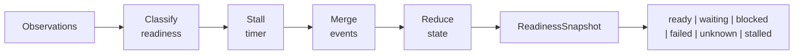
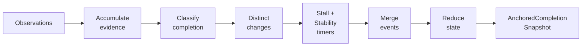
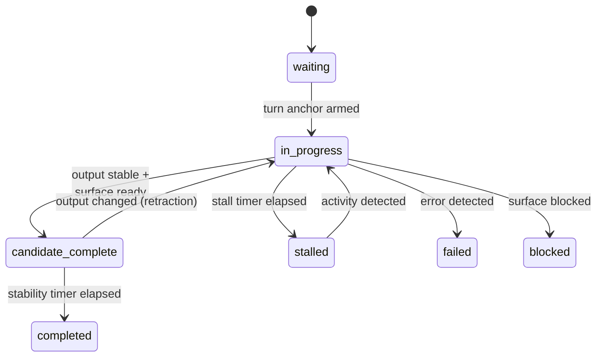

# Completion Detection

Module: `src/houmao/lifecycle/` — Shared lifecycle timing contracts and ReactiveX helpers.

## Readiness Pipeline

## Anchored Completion Pipeline

## Completion State Machine

## Overview

The completion detection subsystem builds on the TUI tracking state machine to provide turn-level lifecycle awareness. It observes the stream of `TrackedStateSnapshot` values and derives higher-level assessments: whether the agent surface is **ready** for new input, and whether a logical **turn** has **completed**.

Two ReactiveX pipelines form the core of this subsystem — one for readiness detection and one for anchored completion detection. Both pipelines consume tracked state and emit structured snapshot objects that downstream consumers (such as automated prompt submission logic) can act on.

## TurnAnchor Concept

A **turn anchor** marks the beginning of a logical agent turn. When a prompt is submitted to the agent, a turn anchor is created to track the lifecycle of that specific turn from submission through completion.

The anchor provides a temporal reference point: all completion detection for a turn is relative to its anchor. This ensures that completion signals from a previous turn are not misattributed to the current one, and that the pipeline can distinguish between "the agent finished the previous turn" and "the agent finished the current turn."

## Core Types

### TurnAnchor / TurnAnchorState

`TurnAnchor` marks the start of a logical turn with a timestamp and identifier. `TurnAnchorState` tracks the evolving state of that anchor as the turn progresses — from initial submission through activity detection to completion or failure.

### ReadinessSnapshot

A point-in-time readiness assessment. Captures whether the agent surface is ready to accept input, along with the evidence and timing that led to this assessment.

### ReadinessLifecycleStatus

The readiness states observed during a turn's lifecycle. Tracks transitions through states like waiting, ready, blocked, and failed as the surface evolves.

### AnchoredCompletionSnapshot

A point-in-time completion assessment anchored to a specific turn. Captures the completion state, the turn anchor it refers to, and the evidence supporting the assessment.

### AnchoredCompletionStatus

The completion states observed during a turn, from `inactive` through `in_progress` to terminal states like `completed` or `failed`.

### CompletionAuthorityMode

Determines how completion is assessed. The authority mode controls whether completion is inferred purely from surface state, from explicit completion markers, or from a combination of both. This allows different tools and configurations to use the detection strategy that best matches their TUI behavior.

### LifecycleObservation

One lifecycle observation sample, combining the tracked state snapshot with lifecycle-level metadata such as the active turn anchor and accumulated evidence.

### PostSubmitEvidence

Evidence collected after prompt submission. Tracks what the pipeline has observed since the turn anchor was created — including whether the agent acknowledged the input, whether output streaming began, and whether the surface returned to a ready state.

## Pipeline Builders

### `build_readiness_pipeline()`

Constructs a ReactiveX pipeline that observes tracked state and emits `ReadinessSnapshot` values.

The readiness pipeline monitors the agent surface for transitions into a state where new input can be submitted. It considers:

- Whether the surface is accepting input (`surface_accepting_input`).
- Whether the surface is in a ready posture (`surface_ready_posture`).
- Whether the turn phase has returned to `ready`.
- Stability of the surface state — a surface that is flickering between ready and active is not considered reliably ready.

The pipeline debounces transient readiness signals and requires stable confirmation before emitting a ready snapshot, preventing premature prompt submission during brief pauses in agent output.

### `build_anchored_completion_pipeline()`

Constructs a ReactiveX pipeline that observes tracked state anchored to a turn start and emits `AnchoredCompletionSnapshot` values.

The completion pipeline tracks the full lifecycle of a single turn:

1. **Inactive** — No turn is in progress; the pipeline waits for a turn anchor.
2. **In-progress** — A turn anchor has been set; the pipeline monitors for activity evidence (output streaming, status changes) and watches for completion signals.
3. **Candidate complete** — The surface has returned to a ready state after activity was observed. The pipeline holds in this state briefly to confirm stability before committing to completion.
4. **Completed** — The surface has been stably ready for long enough after activity, confirming the turn is done.
5. **Terminal states** — `failed`, `blocked`, or `stalled` if the turn encounters errors, permission blocks, or prolonged inactivity.

The pipeline requires that activity evidence is observed before it will accept a ready surface as a completion signal. This prevents the initial ready state (before the agent begins processing) from being misinterpreted as turn completion.

## Composition with TUI Tracking

The lifecycle pipelines do not directly observe the TUI pane. Instead, they subscribe to the `TrackedStateSnapshot` stream produced by the TUI tracking state machine (via `TuiTrackerSession` or `StreamStateReducer`). This layered architecture keeps concerns separated:

- **TUI tracking** is responsible for parsing pane content, detecting signals, and producing stable tracked state.
- **Lifecycle detection** is responsible for interpreting tracked state transitions in the context of turn anchors and emitting actionable readiness/completion assessments.

This separation allows the same lifecycle pipelines to work with any tool-specific detector, as long as the detector produces valid `TrackedStateSnapshot` values.
