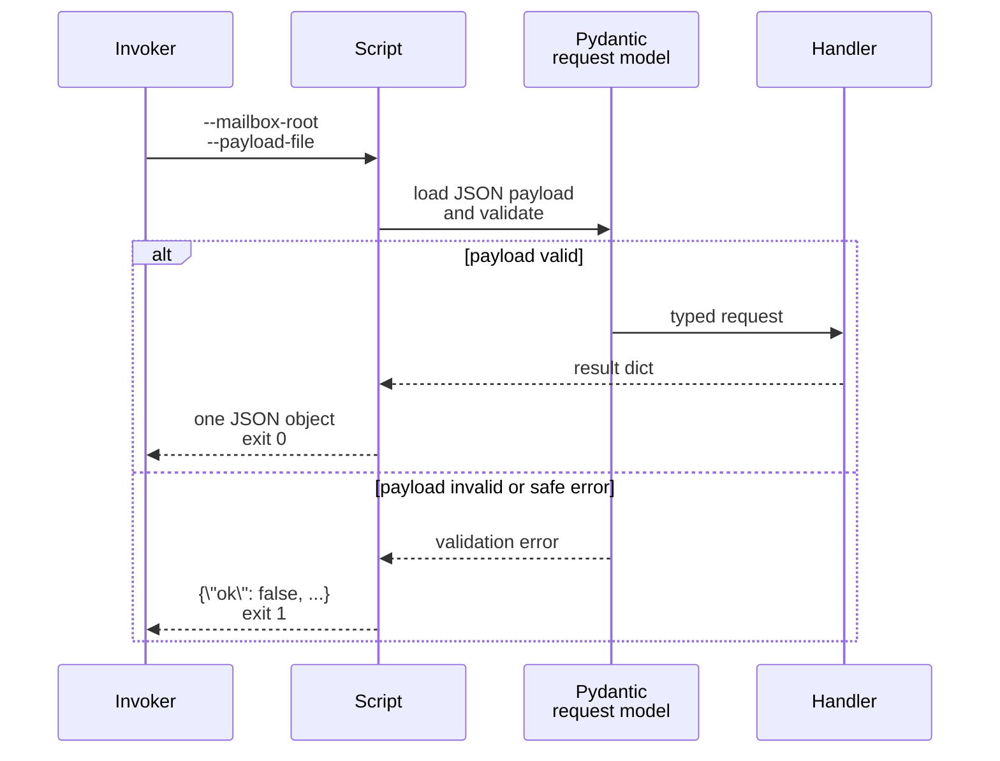

# Managed Mailbox Scripts

This page defines the stable helper surface under `rules/scripts/` for mailbox operations that touch shared state.

## Mental Model

The managed scripts are the mailbox's mutation boundary.

- The runtime materializes them into the mailbox-local `rules/` tree.
- Operators and sessions can inspect them, but should not replace them with improvisational equivalents.
- Each wrapper validates one JSON payload through strict `pydantic` models before calling the underlying handler.
- Each wrapper prints exactly one JSON object to stdout for both success and failure.

That contract makes mailbox mutations predictable even when different sessions are sharing one mailbox root.

## Stable Asset Set

Current managed script filenames:

- `register_mailbox.py`
- `deregister_mailbox.py`
- `deliver_message.py`
- `insert_standard_headers.py`
- `update_mailbox_state.py`
- `repair_index.py`

Shared dependency manifest:

- `rules/scripts/requirements.txt`
- Current third-party requirements: `pydantic>=2.12` and `PyYAML>=6.0`
- The invoking environment must also have the `houmao` package available

## Stable CLI Shape

All managed Python wrappers use:

- `--mailbox-root <path>`
- `--payload-file <path>` for payload-driven scripts

Current exception:

- `repair_index.py` allows `--payload-file` to be omitted and defaults to `{}`.

The wrappers emit newline-terminated JSON to stdout and return process exit code `0` on success or `1` on handled failure.



## Validation Expectations

The shared request models are strict:

- extra fields are forbidden,
- models are frozen and strict,
- blank required strings are rejected,
- addresses and message ids are validated against the same mailbox rules used elsewhere,
- validation errors are normalized into a field-path-oriented message such as `$.to[0].address: ...`.

The wrapper reports up to five validation issues in one error string. Validation failure happens before any mailbox mutation.

Representative failure:

```json
{
  "ok": false,
  "error": "delivery payload: $.to[0].address: mailbox addresses must be full-form email-like values such as `AGENTSYS-research@agents.localhost`"
}
```

## Script-Specific Contracts

### `register_mailbox.py`

Payload fields:

- `mode`: `safe`, `force`, or `stash`
- `address`
- `owner_principal_id`
- `mailbox_kind`: `in_root` or `symlink`
- `mailbox_path`
- optional `display_name`, `manifest_path_hint`, `role`

Representative success:

```json
{
  "ok": true,
  "mode": "stash",
  "address": "AGENTSYS-bob@agents.localhost",
  "active_registration_id": "reg-...",
  "owner_principal_id": "AGENTSYS-carol",
  "status": "active",
  "stashed_registration_id": "reg-old",
  "stashed_mailbox_path": "/abs/path/mailboxes/AGENTSYS-bob@agents.localhost--<uuid4hex>"
}
```

### `deregister_mailbox.py`

Payload fields:

- `mode`: `deactivate` or `purge`
- `address`

Representative success:

```json
{
  "ok": true,
  "mode": "purge",
  "address": "AGENTSYS-private@agents.localhost",
  "target_registration_id": "reg-...",
  "resulting_status": "purged",
  "purged_registration_id": "reg-..."
}
```

### `deliver_message.py`

Payload fields include:

- `staged_message_path`
- `message_id`, `thread_id`, `in_reply_to`, `references`, `created_at_utc`
- `sender`, `to`, `cc`, `reply_to`
- `subject`, `attachments`, `headers`

Representative success:

```json
{
  "ok": true,
  "message_id": "msg-20260311T041500Z-a1b2c3d4e5f64798aabbccddeeff0011",
  "canonical_path": "/abs/path/mailbox/messages/2026-03-11/msg-20260311T041500Z-a1b2c3d4e5f64798aabbccddeeff0011.md",
  "recipient_count": 1
}
```

### `update_mailbox_state.py`

Payload fields:

- `address`
- `message_id`
- at least one of `read`, `starred`, `archived`, `deleted`

Representative success:

```json
{
  "ok": true,
  "address": "AGENTSYS-recipient@agents.localhost",
  "owner_principal_id": "AGENTSYS-recipient",
  "registration_id": "reg-...",
  "message_id": "msg-20260311T041500Z-a1b2c3d4e5f64798aabbccddeeff0011",
  "read": true,
  "starred": true,
  "archived": false,
  "deleted": false
}
```

### `repair_index.py`

Payload fields:

- optional `cleanup_staging` default `true`
- optional `quarantine_staging` default `true`

Representative success:

```json
{
  "ok": true,
  "message_count": 1,
  "projection_count": 2,
  "registration_count": 2,
  "restored_state_count": 0,
  "defaulted_state_count": 2,
  "staging_action": "quarantine",
  "staging_artifact_count": 1,
  "staging_artifact_paths": ["/abs/path/mailbox/staging/orphaned.md.quarantine-..."],
  "backed_up_index_path": null
}
```

### `insert_standard_headers.py`

This script is materialized as part of the managed asset set, but the current build reserves it rather than implementing header normalization. It emits a structured failure result instead of silently doing nothing.

## Source References

- [`src/houmao/mailbox/managed.py`](../../../../src/houmao/mailbox/managed.py)
- [`src/houmao/mailbox/assets/rules/README.md`](../../../../src/houmao/mailbox/assets/rules/README.md)
- [`src/houmao/mailbox/assets/rules/scripts/requirements.txt`](../../../../src/houmao/mailbox/assets/rules/scripts/requirements.txt)
- [`src/houmao/mailbox/assets/rules/scripts/register_mailbox.py`](../../../../src/houmao/mailbox/assets/rules/scripts/register_mailbox.py)
- [`src/houmao/mailbox/assets/rules/scripts/deregister_mailbox.py`](../../../../src/houmao/mailbox/assets/rules/scripts/deregister_mailbox.py)
- [`src/houmao/mailbox/assets/rules/scripts/deliver_message.py`](../../../../src/houmao/mailbox/assets/rules/scripts/deliver_message.py)
- [`src/houmao/mailbox/assets/rules/scripts/update_mailbox_state.py`](../../../../src/houmao/mailbox/assets/rules/scripts/update_mailbox_state.py)
- [`src/houmao/mailbox/assets/rules/scripts/repair_index.py`](../../../../src/houmao/mailbox/assets/rules/scripts/repair_index.py)
- [`src/houmao/mailbox/assets/rules/scripts/insert_standard_headers.py`](../../../../src/houmao/mailbox/assets/rules/scripts/insert_standard_headers.py)
