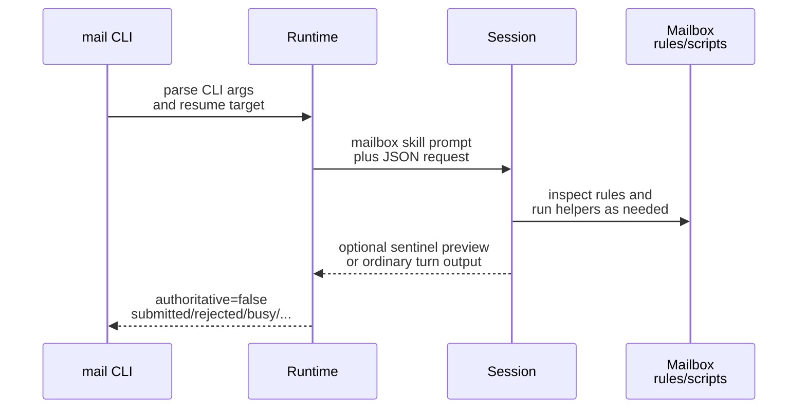

# Mailbox Runtime Contracts

This page explains the runtime-owned contract around mailbox configuration, env bindings, projected skills, and `mail` command request/result handling.

## Mental Model

The runtime is the authority for mailbox attachment to a session.

- Declarative config or CLI overrides choose the mailbox transport and identity.
- The runtime resolves that into one `MailboxResolvedConfig`.
- The session manifest persists that resolved mailbox binding as the durable mailbox authority reused by resume and gateway transport access.
- For tmux-backed managed sessions, the runtime also publishes the targeted `AGENTSYS_MAILBOX_*` keys into tmux session environment as the live mailbox projection for later mailbox work.
- The runtime projects the mailbox system skill into the built brain home under the visible `skills/mailbox/...` mailbox subtree.
- Later `mail` commands and projected mailbox skills resolve current mailbox bindings through the runtime-owned helper `pixi run python -m houmao.agents.mailbox_runtime_support resolve-live` rather than assuming the provider process's inherited mailbox env snapshot is still current.
- That same helper is also the runtime-owned discovery path for the attached shared-mailbox gateway facade: when a valid live gateway is attached it returns a `gateway` object with `base_url`, `host`, `port`, `protocol_version`, and `state_path`; otherwise it returns `gateway: null`.

## Declarative And Resolved Config

The declarative mailbox payload supports these fields:

- `transport`
- `principal_id`
- `address`
- `filesystem_root`

Current rules:

- `transport` is required when `mailbox` is present.
- `filesystem` and `stalwart` are implemented in v1.
- If `principal_id` is omitted, the runtime derives one from the tool, role, and optional agent identity.
- If `address` is omitted, it defaults to `<principal_id>@agents.localhost`.
- If `filesystem_root` is omitted, it defaults to `<runtime_root>/mailbox`.
- `stalwart` bindings resolve from either `base_url` or explicit `jmap_url` plus `management_url`.
- Persisted `stalwart` bindings remain secret-free and store `credential_ref` instead of inline credentials.

The resolved session payload persists:

```json
{
  "transport": "filesystem",
  "principal_id": "AGENTSYS-research",
  "address": "AGENTSYS-research@agents.localhost",
  "filesystem_root": "/abs/path/tmp/shared-mail",
  "bindings_version": "2026-03-13T09:15:30.123456Z"
}
```

That persisted `launch_plan.mailbox` payload is also the durable mailbox capability contract reused by resume, refresh, and gateway-side integrations. The gateway mail transport uses that durable manifest-backed capability rather than persisting a second mailbox copy under `gateway/`.

## Runtime-Owned Mailbox Bindings

Common env vars:

- `AGENTSYS_MAILBOX_TRANSPORT`
- `AGENTSYS_MAILBOX_PRINCIPAL_ID`
- `AGENTSYS_MAILBOX_ADDRESS`
- `AGENTSYS_MAILBOX_BINDINGS_VERSION`

Filesystem-specific env vars:

- `AGENTSYS_MAILBOX_FS_ROOT`
- `AGENTSYS_MAILBOX_FS_SQLITE_PATH`
- `AGENTSYS_MAILBOX_FS_MAILBOX_DIR`
- `AGENTSYS_MAILBOX_FS_LOCAL_SQLITE_PATH`
- `AGENTSYS_MAILBOX_FS_INBOX_DIR`

Email-transport env vars:

- `AGENTSYS_MAILBOX_EMAIL_JMAP_URL`
- `AGENTSYS_MAILBOX_EMAIL_MANAGEMENT_URL`
- `AGENTSYS_MAILBOX_EMAIL_LOGIN_IDENTITY`
- `AGENTSYS_MAILBOX_EMAIL_CREDENTIAL_REF`
- `AGENTSYS_MAILBOX_EMAIL_CREDENTIAL_FILE`

Important rules:

- For tmux-backed managed sessions, treat the manifest as durable authority, treat tmux session environment as the authoritative live mailbox publication, and treat inherited process env only as a launch-time snapshot unless the runtime-owned resolver validates it as still current.
- Resolve current mailbox bindings through `pixi run python -m houmao.agents.mailbox_runtime_support resolve-live` before direct mailbox work. That helper prefers current process env, falls back to the owning tmux session env, and returns normalized current bindings plus optional live gateway endpoint data for attached `/v1/mail/*` work.
- Treat `AGENTSYS_MAILBOX_FS_ROOT` as authoritative.
- `AGENTSYS_MAILBOX_FS_SQLITE_PATH` remains the shared mailbox-root `index.sqlite` catalog.
- `AGENTSYS_MAILBOX_FS_MAILBOX_DIR` resolves the current mailbox-view directory for the addressed mailbox.
- `AGENTSYS_MAILBOX_FS_LOCAL_SQLITE_PATH` is the authoritative mailbox-view SQLite database for the current mailbox.
- `AGENTSYS_MAILBOX_FS_INBOX_DIR` follows the active mailbox registration, so it may resolve through a symlinked `mailboxes/<address>` entry into a private directory.
- If `AGENTSYS_MAILBOX_BINDINGS_VERSION` changes, discard cached assumptions and reload the current bindings.
- `AGENTSYS_MAILBOX_EMAIL_CREDENTIAL_FILE` is session-local secret material derived from the persisted secret-free `credential_ref`.

## Shared Catalog Versus Mailbox-Local State

The filesystem transport now splits durable state between a shared catalog and mailbox-local mailbox-view state.

- The shared mailbox-root `index.sqlite` keeps registrations, canonical message catalog data, projections, delivery metadata, attachment metadata, and other structural state shared across the mailbox root.
- Each resolved mailbox directory owns `mailbox.sqlite`, which keeps mailbox-view state that can differ per mailbox, including read or unread, starred, archived, deleted, and mailbox-local thread summaries.
- Inside `mailbox.sqlite`, `message_state` rows are keyed by `message_id` and mailbox-local `thread_summaries` rows are keyed by `thread_id`.
- Because the database is already scoped to one resolved mailbox directory, mailbox-local rows do not need `registration_id` as part of their primary identity.
- Shared-root unread counters are no longer authoritative for mailbox-view state once mailbox-local SQLite exists.

## Projected Skill Contract

The runtime projects one transport-specific mailbox skill into the brain home during brain build. For current adapters whose active skill destination is `skills`, the primary discoverable mailbox skill surface is:

- `skills/mailbox/email-via-filesystem/SKILL.md`
- `skills/mailbox/email-via-stalwart/SKILL.md`

Shared runtime rules:

- require the runtime-owned live mailbox binding resolver for tmux-backed sessions,
- prefer the live gateway `/v1/mail/*` facade for shared mailbox operations when the resolver returns a live `gateway.base_url`,
- treat `message_ref` as the shared reply target contract,
- keep ordinary attached-session mailbox work on the shared gateway routines for `check`, `send`, `reply`, and `POST /v1/mail/state`,
- only mark a message read after successful processing.

Filesystem-specific rules:

- present direct helper flows as fallback guidance rather than the first-choice attached-session path when the shared gateway facade is available,
- inspect `rules/` before touching shared mailbox state,
- inspect `rules/scripts/requirements.txt` before invoking Python helpers,
- use shared managed scripts for steps that touch `index.sqlite`, mailbox-local `mailbox.sqlite`, or `locks/`,
- treat `AGENTSYS_MAILBOX_FS_LOCAL_SQLITE_PATH` as the source of truth for mailbox-view read or unread and thread-summary state.

Stalwart-specific rules:

- present direct env-backed access as fallback guidance rather than the first-choice attached-session path when the shared gateway facade is available,
- use the current `AGENTSYS_MAILBOX_EMAIL_*` bindings returned by the runtime-owned live resolver for direct mailbox access when no live gateway mailbox facade is available,
- do not assume filesystem mailbox rules, SQLite paths, locks, or projection symlinks exist for this transport.

This keeps mailbox behavior runtime-owned rather than role-authored.

## `mail` CLI Contract

Runtime subcommands:

- `mail check`
- `mail send`
- `mail reply`

CLI argument rules:

- `mail check` accepts `--unread-only`, `--limit`, and `--since`.
- `mail send` requires at least one `--to`, a `--subject`, and exactly one of `--body-file` or `--body-content`.
- `mail reply` requires `--message-ref` and exactly one of `--body-file` or `--body-content`.
- `mail send` and `mail reply` accept repeatable `--attach`.
- Recipients must be full mailbox addresses, not short names.
- `--message-id` remains accepted as a compatibility alias for `--message-ref`.

The runtime converts CLI input into an `args` payload before prompting the session.

These low-level runtime `mail` subcommands are TUI-mediated surfaces. They return non-authoritative request lifecycle results rather than claiming mailbox success or failure for the requested operation.

```json
{
  "version": 1,
  "request_id": "mailreq-20260313T091530Z-3c9f1e6ab2",
  "operation": "send",
  "transport": "filesystem",
  "principal_id": "AGENTSYS-research",
  "args": {
    "to": ["AGENTSYS-orchestrator@agents.localhost"],
    "cc": [],
    "subject": "Investigate parser drift",
    "body_content": "# Hello\n",
    "attachments": ["/abs/path/notes.txt"]
  },
  "response_contract": {
    "format": "json",
    "sentinel_begin": "AGENTSYS_MAIL_RESULT_BEGIN",
    "sentinel_end": "AGENTSYS_MAIL_RESULT_END"
  }
}
```



## Result Contract

For TUI-mediated runtime mail commands, the runtime returns a submission-only envelope with:

- `authoritative: false`
- `execution_path: "tui_submission"`
- `status` of `submitted`, `rejected`, `busy`, `interrupted`, or `tui_error`
- manager or transport verification guidance instead of mailbox truth inferred from transcript parsing

Exact sentinel-delimited JSON recovery is now optional preview. When the runtime does recover a preview payload, it still validates that preview against the active `request_id`, `operation`, and mailbox binding before surfacing it under `preview_result`, but the command does not require that preview to return.

Representative submission result:

```json
{
  "address": "AGENTSYS-research@agents.localhost",
  "authoritative": false,
  "execution_path": "tui_submission",
  "operation": "send",
  "request_id": "mailreq-20260313T091530Z-3c9f1e6ab2",
  "principal_id": "AGENTSYS-research",
  "schema_version": 1,
  "status": "submitted",
  "transport": "filesystem",
  "verification_required": true
}
```

Representative optional preview:

```json
{
  "preview_result": {
    "message_ref": "filesystem:msg-20260313T091531Z-a1b2c3d4e5f64798aabbccddeeff0011",
    "ok": true,
    "operation": "send",
    "principal_id": "AGENTSYS-research",
    "request_id": "mailreq-20260313T091530Z-3c9f1e6ab2",
    "transport": "filesystem"
  }
}
```

## Source References

- [`src/houmao/agents/mailbox_runtime_models.py`](../../../../src/houmao/agents/mailbox_runtime_models.py)
- [`src/houmao/agents/mailbox_runtime_support.py`](../../../../src/houmao/agents/mailbox_runtime_support.py)
- [`src/houmao/agents/realm_controller/cli.py`](../../../../src/houmao/agents/realm_controller/cli.py)
- [`src/houmao/agents/realm_controller/mail_commands.py`](../../../../src/houmao/agents/realm_controller/mail_commands.py)
- [`src/houmao/agents/brain_builder.py`](../../../../src/houmao/agents/brain_builder.py)
- [`src/houmao/agents/realm_controller/assets/system_skills/mailbox/email-via-filesystem/SKILL.md`](../../../../src/houmao/agents/realm_controller/assets/system_skills/mailbox/email-via-filesystem/SKILL.md)
- [`src/houmao/agents/realm_controller/assets/system_skills/mailbox/email-via-filesystem/references/env-vars.md`](../../../../src/houmao/agents/realm_controller/assets/system_skills/mailbox/email-via-filesystem/references/env-vars.md)
- [`src/houmao/agents/realm_controller/assets/system_skills/mailbox/email-via-stalwart/SKILL.md`](../../../../src/houmao/agents/realm_controller/assets/system_skills/mailbox/email-via-stalwart/SKILL.md)
- [`src/houmao/agents/realm_controller/assets/system_skills/mailbox/email-via-stalwart/references/env-vars.md`](../../../../src/houmao/agents/realm_controller/assets/system_skills/mailbox/email-via-stalwart/references/env-vars.md)
