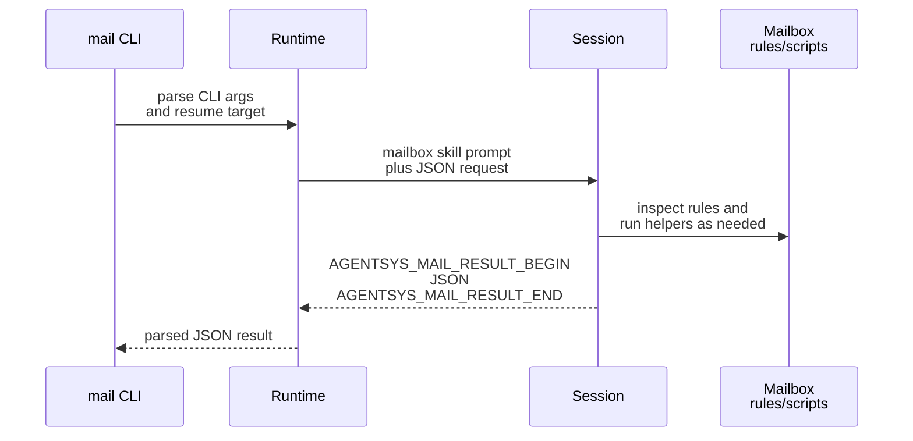

# Mailbox Runtime Contracts

This page explains the runtime-owned contract around mailbox configuration, env bindings, projected skills, and `mail` command request/result handling.

## Mental Model

The runtime is the authority for mailbox attachment to a session.

- Declarative config or CLI overrides choose the mailbox transport and identity.
- The runtime resolves that into one `MailboxResolvedConfig`.
- The launch plan publishes mailbox env vars into the session.
- The runtime also projects the mailbox system skill into the built brain home.
- Later `mail` commands reuse the persisted mailbox binding rather than rebuilding the contract from scratch.

## Declarative And Resolved Config

The declarative mailbox payload supports these fields:

- `transport`
- `principal_id`
- `address`
- `filesystem_root`

Current rules:

- `transport` is required when `mailbox` is present.
- Only `filesystem` is implemented in v1.
- If `principal_id` is omitted, the runtime derives one from the tool, role, and optional agent identity.
- If `address` is omitted, it defaults to `<principal_id>@agents.localhost`.
- If `filesystem_root` is omitted, it defaults to `<runtime_root>/mailbox`.

The resolved session payload persists:

```json
{
  "transport": "filesystem",
  "principal_id": "AGENTSYS-research",
  "address": "AGENTSYS-research@agents.localhost",
  "filesystem_root": "/abs/path/tmp/shared-mail",
  "bindings_version": "2026-03-13T09:15:30.123456Z"
}
```

That persisted `launch_plan.mailbox` payload is also the runtime-owned mailbox capability contract reused by resume, refresh, and gateway-side integrations. The gateway mail notifier reads mailbox support from the session manifest rather than persisting a second mailbox copy under `gateway/`.

## Runtime-Owned Mailbox Bindings

Common env vars:

- `AGENTSYS_MAILBOX_TRANSPORT`
- `AGENTSYS_MAILBOX_PRINCIPAL_ID`
- `AGENTSYS_MAILBOX_ADDRESS`
- `AGENTSYS_MAILBOX_BINDINGS_VERSION`

Filesystem-specific env vars:

- `AGENTSYS_MAILBOX_FS_ROOT`
- `AGENTSYS_MAILBOX_FS_SQLITE_PATH`
- `AGENTSYS_MAILBOX_FS_MAILBOX_DIR`
- `AGENTSYS_MAILBOX_FS_LOCAL_SQLITE_PATH`
- `AGENTSYS_MAILBOX_FS_INBOX_DIR`

Important rules:

- Re-read the env vars before each mailbox action.
- Treat `AGENTSYS_MAILBOX_FS_ROOT` as authoritative.
- `AGENTSYS_MAILBOX_FS_SQLITE_PATH` remains the shared mailbox-root `index.sqlite` catalog.
- `AGENTSYS_MAILBOX_FS_MAILBOX_DIR` resolves the current mailbox-view directory for the addressed mailbox.
- `AGENTSYS_MAILBOX_FS_LOCAL_SQLITE_PATH` is the authoritative mailbox-view SQLite database for the current mailbox.
- `AGENTSYS_MAILBOX_FS_INBOX_DIR` follows the active mailbox registration, so it may resolve through a symlinked `mailboxes/<address>` entry into a private directory.
- If `AGENTSYS_MAILBOX_BINDINGS_VERSION` changes, discard cached assumptions and reload the current bindings.

## Shared Catalog Versus Mailbox-Local State

The filesystem transport now splits durable state between a shared catalog and mailbox-local mailbox-view state.

- The shared mailbox-root `index.sqlite` keeps registrations, canonical message catalog data, projections, delivery metadata, attachment metadata, and other structural state shared across the mailbox root.
- Each resolved mailbox directory owns `mailbox.sqlite`, which keeps mailbox-view state that can differ per mailbox, including read or unread, starred, archived, deleted, and mailbox-local thread summaries.
- Inside `mailbox.sqlite`, `message_state` rows are keyed by `message_id` and mailbox-local `thread_summaries` rows are keyed by `thread_id`.
- Because the database is already scoped to one resolved mailbox directory, mailbox-local rows do not need `registration_id` as part of their primary identity.
- Shared-root unread counters are no longer authoritative for mailbox-view state once mailbox-local SQLite exists.

## Projected Skill Contract

The runtime projects `.system/mailbox/email-via-filesystem` into the brain home during brain build. That skill tells the session to:

- require the runtime-managed env vars,
- inspect `rules/` before touching shared mailbox state,
- inspect `rules/scripts/requirements.txt` before invoking Python helpers,
- use shared managed scripts for steps that touch `index.sqlite`, mailbox-local `mailbox.sqlite`, or `locks/`,
- treat `AGENTSYS_MAILBOX_FS_LOCAL_SQLITE_PATH` as the source of truth for mailbox-view read or unread and thread-summary state,
- only mark a message read after successful processing,
- refuse unsupported transports.

This keeps mailbox behavior runtime-owned rather than role-authored.

## `mail` CLI Contract

Runtime subcommands:

- `mail check`
- `mail send`
- `mail reply`

CLI argument rules:

- `mail check` accepts `--unread-only`, `--limit`, and `--since`.
- `mail send` requires at least one `--to`, a `--subject`, and exactly one of `--body-file` or `--body-content`.
- `mail reply` requires `--message-id` and exactly one of `--body-file` or `--body-content`.
- `mail send` and `mail reply` accept repeatable `--attach`.
- Recipients must be full mailbox addresses, not short names.

The runtime converts CLI input into an `args` payload before prompting the session.

```json
{
  "version": 1,
  "request_id": "mailreq-20260313T091530Z-3c9f1e6ab2",
  "operation": "send",
  "transport": "filesystem",
  "principal_id": "AGENTSYS-research",
  "args": {
    "to": ["AGENTSYS-orchestrator@agents.localhost"],
    "cc": [],
    "subject": "Investigate parser drift",
    "body_content": "# Hello\n",
    "attachments": ["/abs/path/notes.txt"]
  },
  "response_contract": {
    "format": "json",
    "sentinel_begin": "AGENTSYS_MAIL_RESULT_BEGIN",
    "sentinel_end": "AGENTSYS_MAIL_RESULT_END"
  }
}
```



## Result Contract

The runtime parser requires exactly one sentinel-delimited JSON object. It rejects:

- multiple begin or end sentinels,
- empty sentinel payloads,
- non-JSON or non-object payloads,
- mismatched `request_id`,
- mismatched `operation`,
- mismatched `transport` or `principal_id` when those fields are present in the result.

Representative result:

```json
{
  "ok": true,
  "request_id": "mailreq-20260313T091530Z-3c9f1e6ab2",
  "operation": "send",
  "transport": "filesystem",
  "principal_id": "AGENTSYS-research",
  "message_id": "msg-20260313T091531Z-a1b2c3d4e5f64798aabbccddeeff0011"
}
```

## Source References

- [`src/houmao/agents/mailbox_runtime_models.py`](../../../../src/houmao/agents/mailbox_runtime_models.py)
- [`src/houmao/agents/mailbox_runtime_support.py`](../../../../src/houmao/agents/mailbox_runtime_support.py)
- [`src/houmao/agents/realm_controller/cli.py`](../../../../src/houmao/agents/realm_controller/cli.py)
- [`src/houmao/agents/realm_controller/mail_commands.py`](../../../../src/houmao/agents/realm_controller/mail_commands.py)
- [`src/houmao/agents/brain_builder.py`](../../../../src/houmao/agents/brain_builder.py)
- [`src/houmao/agents/realm_controller/assets/system_skills/mailbox/email-via-filesystem/SKILL.md`](../../../../src/houmao/agents/realm_controller/assets/system_skills/mailbox/email-via-filesystem/SKILL.md)
- [`src/houmao/agents/realm_controller/assets/system_skills/mailbox/email-via-filesystem/references/env-vars.md`](../../../../src/houmao/agents/realm_controller/assets/system_skills/mailbox/email-via-filesystem/references/env-vars.md)
