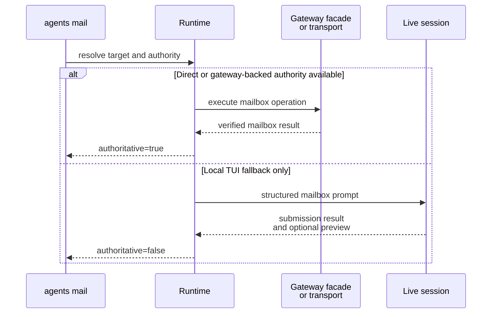

# Mailbox Runtime Contracts

This page explains the runtime-owned contract around mailbox configuration, env bindings, projected skills, and `agents mail` request and result handling.

## Mental Model

The runtime is the authority for mailbox attachment to a session.

- Declarative config or CLI overrides choose the mailbox transport and identity.
- The runtime resolves that into one `MailboxResolvedConfig`.
- The session manifest persists that resolved mailbox binding as the durable mailbox authority reused by resume and gateway transport access.
- For tmux-backed managed sessions, the runtime also publishes the targeted `AGENTSYS_MAILBOX_*` keys into tmux session environment as the live mailbox projection for later mailbox work.
- The runtime projects the mailbox system skill into the built brain home under the visible `skills/mailbox/...` mailbox subtree.
- Later mailbox work resolves current bindings through `pixi run houmao-mgr agents mail resolve-live` instead of assuming the provider process's inherited mailbox env snapshot is still current.
- That same command is also the runtime-owned discovery path for the attached shared-mailbox gateway facade: when a valid live gateway is attached it returns a `gateway` object with `base_url`, `host`, `port`, `protocol_version`, and `state_path`; otherwise it returns `gateway: null`.

## Declarative And Resolved Config

The declarative mailbox payload supports these fields:

- `transport`
- `principal_id`
- `address`
- `filesystem_root`

Current rules:

- `transport` is required when `mailbox` is present.
- `filesystem` and `stalwart` are implemented in v1.
- If `principal_id` is omitted, the runtime derives one from the tool, role, and optional agent identity.
- If `address` is omitted, it defaults to `<principal_id>@agents.localhost`.
- If `filesystem_root` is omitted, it defaults to `<runtime_root>/mailbox`.
- `stalwart` bindings resolve from either `base_url` or explicit `jmap_url` plus `management_url`.
- Persisted `stalwart` bindings remain secret-free and store `credential_ref` instead of inline credentials.

Representative resolved payload:

```json
{
  "transport": "filesystem",
  "principal_id": "AGENTSYS-research",
  "address": "AGENTSYS-research@agents.localhost",
  "filesystem_root": "/abs/path/tmp/shared-mail",
  "bindings_version": "2026-03-13T09:15:30.123456Z"
}
```

That persisted `launch_plan.mailbox` payload is also the durable mailbox capability contract reused by resume, refresh, and gateway-side integrations. The gateway mail transport uses that durable manifest-backed capability rather than persisting a second mailbox copy under `gateway/`.

## Runtime-Owned Mailbox Bindings

Common env vars:

- `AGENTSYS_MAILBOX_TRANSPORT`
- `AGENTSYS_MAILBOX_PRINCIPAL_ID`
- `AGENTSYS_MAILBOX_ADDRESS`
- `AGENTSYS_MAILBOX_BINDINGS_VERSION`

Filesystem-specific env vars:

- `AGENTSYS_MAILBOX_FS_ROOT`
- `AGENTSYS_MAILBOX_FS_SQLITE_PATH`
- `AGENTSYS_MAILBOX_FS_MAILBOX_DIR`
- `AGENTSYS_MAILBOX_FS_LOCAL_SQLITE_PATH`
- `AGENTSYS_MAILBOX_FS_INBOX_DIR`

Email-transport env vars:

- `AGENTSYS_MAILBOX_EMAIL_JMAP_URL`
- `AGENTSYS_MAILBOX_EMAIL_MANAGEMENT_URL`
- `AGENTSYS_MAILBOX_EMAIL_LOGIN_IDENTITY`
- `AGENTSYS_MAILBOX_EMAIL_CREDENTIAL_REF`
- `AGENTSYS_MAILBOX_EMAIL_CREDENTIAL_FILE`

Important rules:

- For tmux-backed managed sessions, treat the manifest as durable authority, treat tmux session environment as the authoritative live mailbox publication, and treat inherited process env only as a launch-time snapshot unless the runtime-owned resolver validates it as still current.
- Resolve current mailbox bindings through `pixi run houmao-mgr agents mail resolve-live` before direct attached-session mailbox work. Inside the owning tmux session, selectors may be omitted. Outside tmux, or when targeting a different agent, use `--agent-id` or `--agent-name`.
- `resolve-live --format shell` emits stable `export ...` assignments for `HOUMAO_MANAGED_AGENT_*`, `AGENTSYS_MAILBOX_*`, and `AGENTSYS_MAILBOX_GATEWAY_*`.
- Treat `AGENTSYS_MAILBOX_FS_ROOT` as authoritative.
- `AGENTSYS_MAILBOX_FS_SQLITE_PATH` remains the shared mailbox-root `index.sqlite` catalog.
- `AGENTSYS_MAILBOX_FS_MAILBOX_DIR` resolves the current mailbox-view directory for the addressed mailbox.
- `AGENTSYS_MAILBOX_FS_LOCAL_SQLITE_PATH` is the authoritative mailbox-view SQLite database for the current mailbox.
- `AGENTSYS_MAILBOX_FS_INBOX_DIR` follows the active mailbox registration, so it may resolve through a symlinked `mailboxes/<address>` entry into a private directory.
- If `AGENTSYS_MAILBOX_BINDINGS_VERSION` changes, discard cached assumptions and reload the current bindings.
- `AGENTSYS_MAILBOX_EMAIL_CREDENTIAL_FILE` is session-local secret material derived from the persisted secret-free `credential_ref`.

## Shared Catalog Versus Mailbox-Local State

The filesystem transport splits durable state between a shared catalog and mailbox-local mailbox-view state.

- The shared mailbox-root `index.sqlite` keeps registrations, canonical message catalog data, projections, delivery metadata, attachment metadata, and other structural state shared across the mailbox root.
- Each resolved mailbox directory owns `mailbox.sqlite`, which keeps mailbox-view state that can differ per mailbox, including read or unread, starred, archived, deleted, and mailbox-local thread summaries.
- Inside `mailbox.sqlite`, `message_state` rows are keyed by `message_id` and mailbox-local `thread_summaries` rows are keyed by `thread_id`.
- Because the database is already scoped to one resolved mailbox directory, mailbox-local rows do not need `registration_id` as part of their primary identity.
- Shared-root unread counters are no longer authoritative for mailbox-view state once mailbox-local SQLite exists.

## Projected Skill Contract

The runtime projects one transport-specific mailbox skill into the brain home during brain build. For current adapters whose active skill destination is `skills`, the primary discoverable mailbox skill surface is:

- `skills/mailbox/email-via-filesystem/SKILL.md`
- `skills/mailbox/email-via-stalwart/SKILL.md`

Shared runtime rules:

- require `houmao-mgr agents mail resolve-live` for tmux-backed same-session discovery,
- prefer the live gateway `/v1/mail/*` facade for shared mailbox operations when the resolver returns a live `gateway.base_url`,
- otherwise use `houmao-mgr agents mail check|send|reply|mark-read`,
- treat `message_ref` as the shared reply and mark-read target contract,
- treat `authoritative: false` as submission-only rather than mailbox truth,
- present `rules/` as markdown policy guidance and `rules/scripts/` as compatibility or implementation detail rather than the ordinary workflow contract.

Filesystem-specific rules:

- inspect `rules/README.md` and `rules/protocols/filesystem-mailbox-v1.md` for policy or repair guidance,
- do not require ordinary attached-session mailbox work to invoke mailbox-owned scripts under `rules/scripts/`,
- treat `AGENTSYS_MAILBOX_FS_LOCAL_SQLITE_PATH` as the source of truth for mailbox-view read or unread and thread-summary state.

Stalwart-specific rules:

- use the current `AGENTSYS_MAILBOX_EMAIL_*` bindings returned by the resolver for direct transport access when no live gateway mailbox facade is available,
- do not assume filesystem mailbox rules, SQLite paths, locks, or projection symlinks exist for this transport.

## Managed `agents mail` Contract

Public subcommands:

- `resolve-live`
- `status`
- `check`
- `send`
- `reply`
- `mark-read`

Selector rules:

- explicit `--agent-id` or `--agent-name` wins,
- inside the owning managed tmux session, omitted selectors resolve the current session through `AGENTSYS_MANIFEST_PATH` first and `AGENTSYS_AGENT_ID` fallback second,
- outside tmux without selectors, the command fails explicitly,
- `--port` is only supported with an explicit selector.

Argument rules:

- `resolve-live` supports `--format json|shell`.
- `check` accepts `--unread-only`, `--limit`, and `--since`.
- `send` requires at least one `--to`, a `--subject`, and exactly one of `--body-file` or `--body-content`.
- `reply` requires `--message-ref` and exactly one of `--body-file` or `--body-content`.
- `send` and `reply` accept repeatable `--attach`.
- `mark-read` requires `--message-ref`.
- Recipients must be full mailbox addresses, not short names.

Result-strength rules:

- verified pair-owned or manager-owned execution returns `authoritative: true`, `status: "verified"`, and `execution_path: "gateway_backed"` or `"manager_direct"`,
- local live-TUI fallback returns `authoritative: false`, `execution_path: "tui_submission"`, and submission-only status such as `submitted`, `rejected`, `busy`, `interrupted`, or `tui_error`,
- callers must verify non-authoritative outcomes through manager-owned `status` or `check`, gateway `/v1/mail/*` state, filesystem mailbox inspection, or transport-native mailbox state.



## Low-Level Runtime Prompt Contract

The raw runtime module `pixi run python -m houmao.agents.realm_controller mail ...` still exists as the structured prompt-turn surface behind local fallback and lower-level testing. Those low-level runtime commands remain TUI-mediated surfaces and return submission-oriented envelopes rather than claiming mailbox truth on their own.

Representative submission result:

```json
{
  "address": "AGENTSYS-research@agents.localhost",
  "authoritative": false,
  "execution_path": "tui_submission",
  "operation": "send",
  "request_id": "mailreq-20260313T091530Z-3c9f1e6ab2",
  "principal_id": "AGENTSYS-research",
  "schema_version": 1,
  "status": "submitted",
  "transport": "filesystem",
  "verification_required": true
}
```

When the runtime does recover a preview payload, it still validates that preview against the active `request_id`, `operation`, and mailbox binding before surfacing it under `preview_result`, but the command does not require that preview to return.

## Source References

- [`src/houmao/agents/mailbox_runtime_models.py`](../../../../src/houmao/agents/mailbox_runtime_models.py)
- [`src/houmao/agents/mailbox_runtime_support.py`](../../../../src/houmao/agents/mailbox_runtime_support.py)
- [`src/houmao/agents/realm_controller/cli.py`](../../../../src/houmao/agents/realm_controller/cli.py)
- [`src/houmao/agents/realm_controller/mail_commands.py`](../../../../src/houmao/agents/realm_controller/mail_commands.py)
- [`src/houmao/agents/brain_builder.py`](../../../../src/houmao/agents/brain_builder.py)
- [`src/houmao/agents/realm_controller/assets/system_skills/mailbox/email-via-filesystem/SKILL.md`](../../../../src/houmao/agents/realm_controller/assets/system_skills/mailbox/email-via-filesystem/SKILL.md)
- [`src/houmao/agents/realm_controller/assets/system_skills/mailbox/email-via-filesystem/references/env-vars.md`](../../../../src/houmao/agents/realm_controller/assets/system_skills/mailbox/email-via-filesystem/references/env-vars.md)
- [`src/houmao/agents/realm_controller/assets/system_skills/mailbox/email-via-stalwart/SKILL.md`](../../../../src/houmao/agents/realm_controller/assets/system_skills/mailbox/email-via-stalwart/SKILL.md)
- [`src/houmao/agents/realm_controller/assets/system_skills/mailbox/email-via-stalwart/references/env-vars.md`](../../../../src/houmao/agents/realm_controller/assets/system_skills/mailbox/email-via-stalwart/references/env-vars.md)
