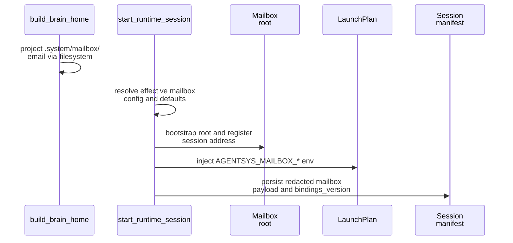

# Mailbox Runtime Integration

This page explains how mailbox support is attached to a brain home, a launch plan, a persisted session manifest, and later `mail` commands.

## Mental Model

Mailbox support spans build time, start time, resume time, and control time.

- Build time projects the runtime-owned mailbox skill into the home.
- Start time resolves one effective mailbox config and bootstraps the filesystem root.
- Launch-plan composition injects mailbox env vars into the session.
- Session manifests persist the redacted mailbox binding.
- Resume reconstructs the same mailbox binding from the manifest payload.
- `mail` commands run through the normal prompt-turn path rather than a separate transport client.

## Build Time

`build_brain_home()` always projects the runtime-owned mailbox skills into the selected skills destination, including `.system/mailbox/email-via-filesystem`.

That means mailbox guidance is repo-owned runtime material, not something each role must copy or invent.

## Start Time

`start_runtime_session()` does the mailbox-specific work before the interactive backend is fully in motion:

1. Parse declarative mailbox config from the brain manifest when present.
2. Apply CLI overrides such as `--mailbox-transport`, `--mailbox-root`, `--mailbox-principal-id`, and `--mailbox-address`.
3. Resolve defaults for missing mailbox fields.
4. Bootstrap the resolved filesystem mailbox root.
5. Build a launch plan that includes mailbox env bindings.
6. Persist a session manifest with the redacted mailbox payload.

## Refresh Behavior

`RuntimeSessionController.refresh_mailbox_bindings()` lets a running session adopt a refreshed filesystem root while keeping the same principal and address.

The refresh flow:

1. Create a fresh `MailboxResolvedConfig` with a new `bindings_version`.
2. Bootstrap the refreshed root.
3. Update the backend launch plan if the backend supports launch-plan refresh.
4. Persist the updated mailbox payload into the session manifest.

This is why code interacting with mailbox paths must respect `AGENTSYS_MAILBOX_BINDINGS_VERSION` rather than caching paths forever.

## Resume Time

`resume_runtime_session()` reconstructs the mailbox binding from the persisted manifest payload using `resolved_mailbox_config_from_payload()`. That lets a resumed session reuse the same mailbox contract instead of resolving it again from ambient caller state.

## `mail` Command Integration

The runtime does not expose direct mailbox RPCs to the operator. Instead:

- the CLI resumes the target session,
- `ensure_mailbox_command_ready()` validates that the session is mailbox-enabled and that bootstrap assets exist,
- `prepare_mail_prompt()` creates the structured request payload and sentinel response contract,
- `run_mail_prompt()` sends that prompt through the existing backend prompt-turn channel,
- `parse_mail_result()` extracts and validates one JSON result object from the session output.

This design keeps mailbox control inside the same runtime session model as ordinary prompt turns, while still enforcing a stronger response contract.

## Source References

- [`src/gig_agents/agents/brain_builder.py`](../../../../src/gig_agents/agents/brain_builder.py)
- [`src/gig_agents/agents/mailbox_runtime_support.py`](../../../../src/gig_agents/agents/mailbox_runtime_support.py)
- [`src/gig_agents/agents/realm_controller/launch_plan.py`](../../../../src/gig_agents/agents/realm_controller/launch_plan.py)
- [`src/gig_agents/agents/realm_controller/runtime.py`](../../../../src/gig_agents/agents/realm_controller/runtime.py)
- [`src/gig_agents/agents/realm_controller/mail_commands.py`](../../../../src/gig_agents/agents/realm_controller/mail_commands.py)
- [`tests/integration/agents/realm_controller/test_mailbox_runtime_contract.py`](../../../../tests/integration/agents/realm_controller/test_mailbox_runtime_contract.py)
