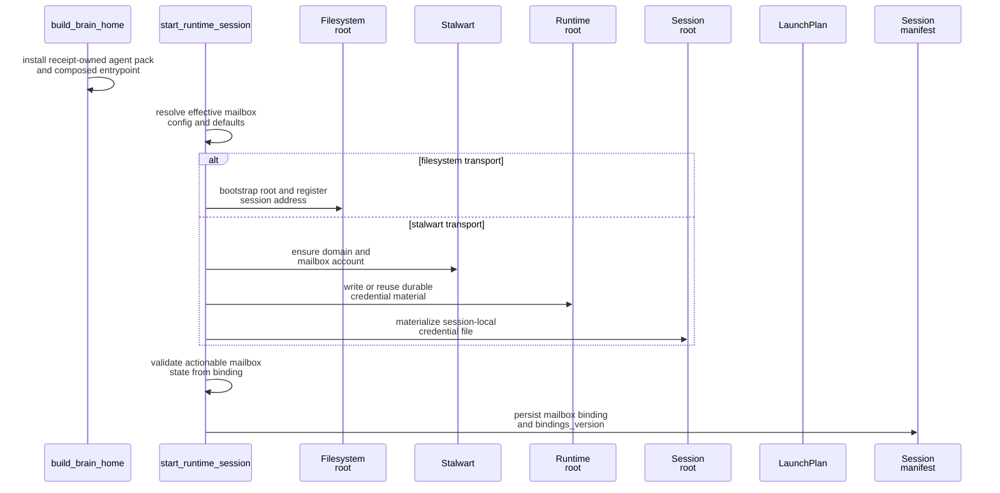

# Mailbox Runtime Integration

This page explains how mailbox support is attached to a brain home, a launch plan, a persisted session manifest, and later scoped `agents ... mail ...` commands across the filesystem and `stalwart` transports.

## Mental Model

Mailbox support spans build time, start time, resume time, and control time.

- Build time installs the receipt-owned `agent` pack and its public entrypoint into the runtime home; mailbox behavior remains nested in protected routines.
- Start time resolves one effective mailbox config and performs transport-specific bootstrap.
- Launch-plan composition keeps the durable mailbox binding on the manifest-backed launch plan and does not treat mailbox-specific env publication as part of the mailbox contract.
- Session manifests persist the redacted mailbox binding rather than inline secrets.
- Resume reconstructs the same mailbox binding from the manifest payload and materializes session-local secret files when the selected transport needs them.
- Public scoped `houmao-mgr agents single/self ... mail ...` commands resolve current mailbox authority first, prefer verified manager-owned or gateway-backed execution when that authority is available, and only fall back to the prompt-turn path when direct authority is unavailable.

## Build Time

`build_brain_home()` installs the complete `agent` pack into the selected skills destination with copy projection. Claude, Codex, and Kimi expose `skills/houmao-agent-entrypoint/SKILL.md`; the composed protected route lives below `subskills/houmao-shared-routines/`. Runtime mailbox prompts invoke the public agent entrypoint, which verifies self identity before routing to `process-emails-via-gateway` or `agent-email-comms`.

## Start Time

`start_runtime_session()` does the mailbox-specific work before the interactive backend is fully in motion:

1. Parse declarative mailbox config from the brain manifest when present.
2. Apply CLI overrides such as `--mailbox-transport`, `--mailbox-root`, `--mailbox-principal-id`, and `--mailbox-address`.
3. Resolve defaults for missing mailbox fields plus any Stalwart endpoint overrides.
4. Bootstrap the selected transport.
5. Build a launch plan that persists the resolved mailbox binding without mailbox-specific env publication.
6. Persist a session manifest with the redacted mailbox payload.

Transport-specific bootstrap rules:

| Transport | Bootstrap work | Persisted mailbox payload |
| --- | --- | --- |
| `filesystem` | create or validate the mailbox root and register the active address | mailbox root path plus shared identity metadata |
| `stalwart` | ensure the domain and mailbox account exist, write or reuse the durable runtime-owned credential file, and materialize the session-local credential file | JMAP URL, management URL, login identity, `credential_ref`, and shared identity metadata |

## Refresh Behavior

`RuntimeSessionController.refresh_mailbox_bindings()` lets a running session adopt a refreshed filesystem root while keeping the same principal and address.

The refresh flow:

1. Create a fresh `MailboxResolvedConfig` with a new `bindings_version`.
2. Bootstrap the refreshed root.
3. Update the backend launch plan if the backend supports launch-plan refresh.
4. Persist the updated mailbox payload into the session manifest.

This is why code interacting with mailbox paths must respect `bindings_version` rather than caching paths forever, and why direct mailbox work should resolve current bindings through the public runtime-owned helper instead of assuming launch-time process env stays current forever.

## Resume Time

`resume_runtime_session()` reconstructs the mailbox binding from the persisted manifest payload using `resolved_mailbox_config_from_payload()`. That lets a resumed session reuse the same mailbox contract instead of resolving it again from ambient caller state.

For `stalwart`, resume also materializes the session-local credential file from the runtime-owned `credential_ref` store before direct transport access or gateway-backed transport access needs it. That keeps the manifest secret-free while still allowing direct transport access or gateway-backed transport access to reuse the same resolved mailbox capability.

## Scoped `agents ... mail` Integration

The public mailbox control surface is `houmao-mgr agents single ... mail ...` for selected agents and `houmao-mgr agents self mail ...` for the current managed session.

That layer:

- resolves the target managed agent explicitly or through same-session manifest-first discovery,
- uses scoped mail `resolve-live` to expose the current normalized mailbox binding and any live `gateway.base_url`,
- prefers pair-owned gateway-backed execution or local manager-owned direct execution for `status`, `list`, `peek`, `read`, `send`, `post`, `reply`, `mark`, `move`, and `archive`,
- preserves the existing prompt-turn path only as the non-authoritative local live-TUI fallback when direct authority is still unavailable.

The lower-level runtime prompt path is still implemented through:

- `ensure_mailbox_command_ready()`,
- `prepare_mail_prompt()`,
- `run_mail_prompt()`,
- `parse_mail_result()`.

That lower-level path matters because projected mailbox skills and local fallback still need one structured mailbox request/result contract inside the live session. The public operator contract, however, is now gateway-first and scoped `houmao-mgr agents ... mail ...`-first rather than a direct Python-module resolver plus mailbox-local scripts.

In practice, the ordinary attached-session path is:

1. resolve current mailbox bindings through `pixi run houmao-mgr agents self mail resolve-live` or `pixi run houmao-mgr agents single --agent-name <name> mail resolve-live`,
2. when the resolver returns `gateway.base_url`, prefer that live gateway `/v1/mail/*` facade for shared mailbox operations,
3. otherwise use scoped `pixi run houmao-mgr agents single/self ... mail list|peek|read|send|post|reply|mark|move|archive`,
4. if those manager-owned commands still return `authoritative: false`, verify outcome through manager-owned or transport-owned state instead of treating submission as mailbox truth.

This design keeps mailbox control inside the same runtime session model when needed, while still presenting one simpler public workflow across both transports.

For the exact request and result envelopes, use [Mailbox Runtime Contracts](../contracts/runtime-contracts.md). For the exact gateway route payloads, use [Protocol And State Contracts](../../gateway/contracts/protocol-and-state.md).

## Source References

- [`src/houmao/agents/brain_builder.py`](../../../../src/houmao/agents/brain_builder.py)
- [`src/houmao/agents/mailbox_runtime_support.py`](../../../../src/houmao/agents/mailbox_runtime_support.py)
- [`src/houmao/agents/realm_controller/launch_plan.py`](../../../../src/houmao/agents/realm_controller/launch_plan.py)
- [`src/houmao/agents/realm_controller/runtime.py`](../../../../src/houmao/agents/realm_controller/runtime.py)
- [`src/houmao/agents/realm_controller/mail_commands.py`](../../../../src/houmao/agents/realm_controller/mail_commands.py)
- [`tests/integration/agents/realm_controller/test_mailbox_runtime_contract.py`](../../../../tests/integration/agents/realm_controller/test_mailbox_runtime_contract.py)
