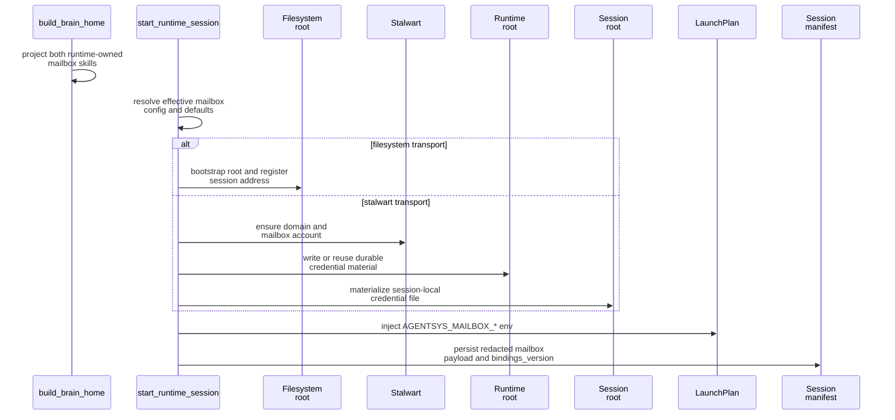

# Mailbox Runtime Integration

This page explains how mailbox support is attached to a brain home, a launch plan, a persisted session manifest, and later `mail` commands across the filesystem and `stalwart` transports.

## Mental Model

Mailbox support spans build time, start time, resume time, and control time.

- Build time projects both runtime-owned mailbox skills into the home.
- Start time resolves one effective mailbox config and performs transport-specific bootstrap.
- Launch-plan composition injects transport-specific mailbox env vars into the session.
- Session manifests persist the redacted mailbox binding rather than inline secrets.
- Resume reconstructs the same mailbox binding from the manifest payload and materializes session-local secret files when the selected transport needs them.
- `mail` commands still run through the normal prompt-turn path, but shared mailbox work prefers the live gateway mailbox facade when it is attached.

## Build Time

`build_brain_home()` always projects the runtime-owned mailbox skills into the selected skills destination, including:

- `.system/mailbox/email-via-filesystem`
- `.system/mailbox/email-via-stalwart`

That means mailbox guidance is repo-owned runtime material, not something each role must copy or invent.

## Start Time

`start_runtime_session()` does the mailbox-specific work before the interactive backend is fully in motion:

1. Parse declarative mailbox config from the brain manifest when present.
2. Apply CLI overrides such as `--mailbox-transport`, `--mailbox-root`, `--mailbox-principal-id`, and `--mailbox-address`.
3. Resolve defaults for missing mailbox fields plus any Stalwart endpoint overrides.
4. Bootstrap the selected transport.
5. Build a launch plan that includes transport-specific mailbox env bindings.
6. Persist a session manifest with the redacted mailbox payload.

Transport-specific bootstrap rules:

| Transport | Bootstrap work | Persisted mailbox payload |
| --- | --- | --- |
| `filesystem` | create or validate the mailbox root and register the active address | mailbox root path plus shared identity metadata |
| `stalwart` | ensure the domain and mailbox account exist, write or reuse the durable runtime-owned credential file, and materialize the session-local credential file | JMAP URL, management URL, login identity, `credential_ref`, and shared identity metadata |

## Refresh Behavior

`RuntimeSessionController.refresh_mailbox_bindings()` lets a running session adopt a refreshed filesystem root while keeping the same principal and address.

The refresh flow:

1. Create a fresh `MailboxResolvedConfig` with a new `bindings_version`.
2. Bootstrap the refreshed root.
3. Update the backend launch plan if the backend supports launch-plan refresh.
4. Persist the updated mailbox payload into the session manifest.

This is why code interacting with mailbox paths must respect `AGENTSYS_MAILBOX_BINDINGS_VERSION` rather than caching paths forever.

## Resume Time

`resume_runtime_session()` reconstructs the mailbox binding from the persisted manifest payload using `resolved_mailbox_config_from_payload()`. That lets a resumed session reuse the same mailbox contract instead of resolving it again from ambient caller state.

For `stalwart`, resume also materializes the session-local credential file from the runtime-owned `credential_ref` store before mailbox env bindings are published. That keeps the manifest secret-free while still allowing direct transport access or gateway-backed transport access to reuse the same resolved mailbox capability.

## `mail` Command Integration

The runtime does not expose direct mailbox RPCs to the operator. Instead:

- the CLI resumes the target session,
- `ensure_mailbox_command_ready()` validates that the session is mailbox-enabled and that the transport-specific bootstrap assets exist,
- `prepare_mail_prompt()` creates the structured request payload and sentinel response contract, plus guidance to prefer the live gateway mailbox facade when it is attached,
- `run_mail_prompt()` sends that prompt through the existing backend prompt-turn channel,
- `parse_mail_result()` extracts and validates one JSON result object from the session output.

In practice, the session-facing path is:

1. prefer the live gateway `/v1/mail/*` facade for shared mailbox operations when it is attached,
2. otherwise use direct transport-specific access through the runtime-owned mailbox skill and env bindings.

This design keeps mailbox control inside the same runtime session model as ordinary prompt turns, while still enforcing a stronger response contract and preserving one operator-facing mailbox UX across both transports.

For the exact request and result envelopes, use [Mailbox Runtime Contracts](../contracts/runtime-contracts.md). For the exact gateway route payloads, use [Protocol And State Contracts](../../gateway/contracts/protocol-and-state.md).

## Source References

- [`src/houmao/agents/brain_builder.py`](../../../../src/houmao/agents/brain_builder.py)
- [`src/houmao/agents/mailbox_runtime_support.py`](../../../../src/houmao/agents/mailbox_runtime_support.py)
- [`src/houmao/agents/realm_controller/launch_plan.py`](../../../../src/houmao/agents/realm_controller/launch_plan.py)
- [`src/houmao/agents/realm_controller/runtime.py`](../../../../src/houmao/agents/realm_controller/runtime.py)
- [`src/houmao/agents/realm_controller/mail_commands.py`](../../../../src/houmao/agents/realm_controller/mail_commands.py)
- [`tests/integration/agents/realm_controller/test_mailbox_runtime_contract.py`](../../../../tests/integration/agents/realm_controller/test_mailbox_runtime_contract.py)
