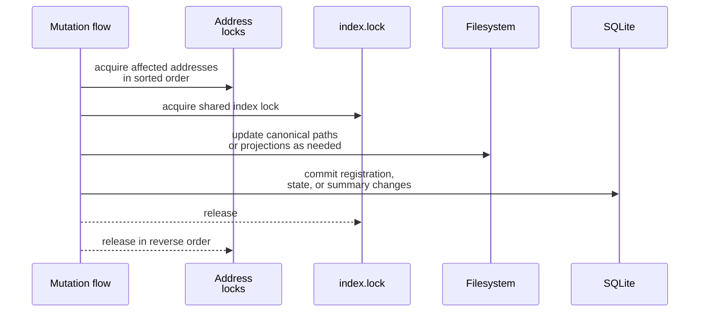

# Mailbox State And Locking

This page explains which mailbox artifacts are authoritative for which responsibilities and how the transport serializes conflicting mutations.

## Mental Model

The filesystem mailbox is not "just files" and it is not "just SQLite". It is a split-authority design:

- canonical Markdown files hold immutable delivered content,
- symlink projections expose that content inside mailbox views,
- SQLite tracks mutable state and query-oriented indexes,
- lock files serialize multi-actor writes so those layers stay consistent.

## Authority Map

| Responsibility | Authoritative artifact |
| --- | --- |
| Delivered message body and front matter | `messages/<YYYY-MM-DD>/<message-id>.md` |
| Active registration for an address | `mailbox_registrations` row with `status='active'` |
| Read, starred, archived, deleted flags | `mailbox_state` |
| Sender and recipient delivery history | `messages`, `message_recipients` |
| Projection catalog | `mailbox_projections` plus symlink targets |
| Attachment metadata | `attachments`, `message_attachments` |
| Thread unread counts and latest-message summary | `thread_summaries` |

Current SQLite schema highlights:

- `mailbox_registrations`
- `messages`
- `message_recipients`
- `attachments`
- `message_attachments`
- `mailbox_projections`
- `mailbox_state`
- `thread_summaries`

The transport initializes SQLite with `PRAGMA journal_mode=DELETE`, so it does not depend on WAL sidecar files.

## Lock Ordering

Sensitive flows follow one lock ordering rule:

1. Acquire `locks/addresses/<address>.lock` for every affected address in lexicographic order.
2. Acquire `locks/index.lock`.
3. Perform the filesystem and SQLite mutation.
4. Release locks in reverse order.

This applies to:

- registration
- deregistration
- message delivery
- mailbox-state updates
- repair and reindex

## Delivery As A Worked Example

Delivery combines all four authority layers:

1. Validate the staged request.
2. Acquire the sender and recipient address locks, then `index.lock`.
3. Move the staged Markdown file into `messages/<date>/`.
4. Create sender `sent/` and recipient `inbox/` symlink projections.
5. Insert message, recipient, attachment, projection, and mailbox-state rows.
6. Recompute the thread summary.

If any later step fails, the code rolls back the SQLite transaction and cleans up or reverts filesystem changes where possible.

## Why Repair Works

Repair succeeds because the immutable content and the mutable indexes are intentionally separate.

- Canonical messages can be reparsed from disk.
- Registrations can be rediscovered from mailbox artifacts and prior snapshots.
- Projections and mailbox state can be rebuilt around that content.

This would be much harder if read or archive flags were encoded by rewriting message bodies directly.

## Source References

- [`src/gig_agents/mailbox/filesystem.py`](../../../../src/gig_agents/mailbox/filesystem.py)
- [`src/gig_agents/mailbox/managed.py`](../../../../src/gig_agents/mailbox/managed.py)
- [`src/gig_agents/mailbox/protocol.py`](../../../../src/gig_agents/mailbox/protocol.py)
- [`tests/unit/mailbox/test_filesystem.py`](../../../../tests/unit/mailbox/test_filesystem.py)
- [`tests/unit/mailbox/test_managed.py`](../../../../tests/unit/mailbox/test_managed.py)
