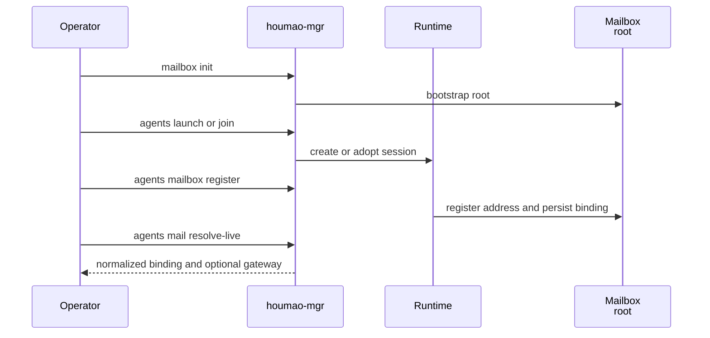

# Mailbox Common Workflows

This page explains the practical v1 procedures for bootstrapping a mailbox, resolving current bindings, reading mail, sending mail, replying, marking processed mail read, and deciding when filesystem rules or compatibility helpers need deeper inspection.

## Mental Model

The safest workflow is simple:

1. Let the runtime create or validate the mailbox root.
2. Treat `rules/` as the mailbox-local operating manual, not as an ordinary execution protocol.
3. Resolve the current live mailbox binding through `houmao-mgr agents mail resolve-live`.
4. Prefer the live gateway `/v1/mail/*` facade when it is attached.
5. Otherwise use `houmao-mgr agents mail check|send|reply|mark-read`.
6. Touch `rules/scripts/` only for compatibility, debugging, or repair workflows that intentionally bypass the ordinary managed path.

## Bootstrap And First Inspection

For the preferred local serverless workflow:

1. `pixi run houmao-mgr mailbox init --mailbox-root <path>`
2. `pixi run houmao-mgr agents launch ...` or `pixi run houmao-mgr agents join ...`
3. `pixi run houmao-mgr agents mailbox register --agent-name <name> --mailbox-root <path>`

After bootstrap, inspect these first when you are new to a mailbox root or are recovering an environment:

- `<mailbox_root>/rules/README.md`
- `<mailbox_root>/rules/protocols/filesystem-mailbox-v1.md`

If you intentionally need compatibility helpers for repair or debugging, inspect `<mailbox_root>/rules/scripts/requirements.txt` at that point, not as part of every ordinary mailbox turn.



## Resolve Live Bindings

Use `resolve-live` whenever you need the exact current binding set or the exact live shared-mailbox gateway endpoint.

```bash
pixi run houmao-mgr agents mail resolve-live --agent-name research
```

Important details:

- Inside the owning managed tmux session, selectors may be omitted.
- Outside tmux, or when targeting a different agent, use `--agent-id` or `--agent-name`.
- `--format shell` exports stable `HOUMAO_MANAGED_AGENT_*`, `AGENTSYS_MAILBOX_*`, and `AGENTSYS_MAILBOX_GATEWAY_*` assignments for shell automation.
- When the returned payload includes `gateway.base_url`, that is the supported discovery path for attached `/v1/mail/*` work instead of ad hoc host or port guessing.

## Read Mail Safely

Use `agents mail check` when you want manager-owned or gateway-backed mailbox reads.

```bash
pixi run houmao-mgr agents mail check \
  --agent-name research \
  --unread-only \
  --limit 10
```

Operational guidance:

- Re-resolve current bindings when you switch shells, sessions, or long-running automation contexts.
- Treat `AGENTSYS_MAILBOX_FS_LOCAL_SQLITE_PATH` as the source of truth for unread versus read state and mailbox-local thread summaries.
- Treat `AGENTSYS_MAILBOX_FS_SQLITE_PATH` as the shared structural catalog, not as the mailbox-view read or unread authority.
- Only mark a message read after the mailbox action or processing step has completed successfully.
- If a manager fallback result is `authoritative: false`, verify with `agents mail check`, filesystem inspection, or transport-native mailbox state.

## Send New Mail

Use `agents mail send` for manager-owned composition.

```bash
pixi run houmao-mgr agents mail send \
  --agent-name research \
  --to AGENTSYS-orchestrator@agents.localhost \
  --subject "Investigate parser drift" \
  --body-file body.md \
  --attach notes.txt
```

Stepwise expectations:

1. The CLI validates attachment paths and body source.
2. Houmao resolves current mailbox authority for the target managed agent.
3. If a live loopback gateway mailbox facade is attached, shared mailbox operations use that gateway route.
4. Otherwise Houmao uses manager-owned direct execution when it can prove authority.
5. Only when direct authority is unavailable does the local live TUI fallback submit a mailbox prompt into the session.
6. Submission-only fallback results require separate verification.

## Reply And Mark Read

Use `agents mail reply` when you already know the parent shared `message_ref`.

```bash
pixi run houmao-mgr agents mail reply \
  --agent-name research \
  --message-ref filesystem:msg-20260312T050000Z-parent \
  --body-content "Reply with next steps"
```

After you successfully process one nominated unread message, mark that same `message_ref` read:

```bash
pixi run houmao-mgr agents mail mark-read \
  --agent-name research \
  --message-ref filesystem:msg-20260312T050000Z-parent
```

Reply and mark-read guidance:

- Treat `message_ref` as opaque even when it contains a transport-prefixed value such as `filesystem:...` or `stalwart:...`.
- When a live gateway facade is attached, use the shared gateway routines for `check`, `reply`, and `POST /v1/mail/state`.
- When the manager-owned fallback path is in use, `houmao-mgr agents mail mark-read` is the supported explicit read-acknowledgement command.
- If `mark-read` returns `authoritative: false`, verify through `agents mail check`, filesystem inspection, or transport-native mailbox state before assuming the message was marked read.

## When `rules/` Inspection Is Mandatory

Inspect mailbox-local `rules/` before:

- running direct filesystem repair or recovery work,
- invoking compatibility Python helpers from `rules/scripts/`,
- touching `index.sqlite`,
- touching any `.lock` file,
- assuming a layout detail that could be mailbox-local policy rather than transport-wide policy.

If managed `rules/scripts/` assets are missing, treat that as a bootstrap or initialization problem, not a prompt to author replacement scripts in place.

## Source References

- [`src/houmao/srv_ctrl/commands/agents/mail.py`](../../../../src/houmao/srv_ctrl/commands/agents/mail.py)
- [`src/houmao/srv_ctrl/commands/managed_agents.py`](../../../../src/houmao/srv_ctrl/commands/managed_agents.py)
- [`src/houmao/agents/realm_controller/mail_commands.py`](../../../../src/houmao/agents/realm_controller/mail_commands.py)
- [`src/houmao/agents/mailbox_runtime_support.py`](../../../../src/houmao/agents/mailbox_runtime_support.py)
- [`src/houmao/mailbox/assets/rules/README.md`](../../../../src/houmao/mailbox/assets/rules/README.md)
- [`src/houmao/mailbox/assets/rules/protocols/filesystem-mailbox-v1.md`](../../../../src/houmao/mailbox/assets/rules/protocols/filesystem-mailbox-v1.md)
- [`src/houmao/mailbox/managed.py`](../../../../src/houmao/mailbox/managed.py)
