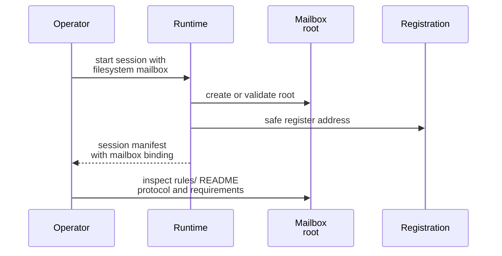
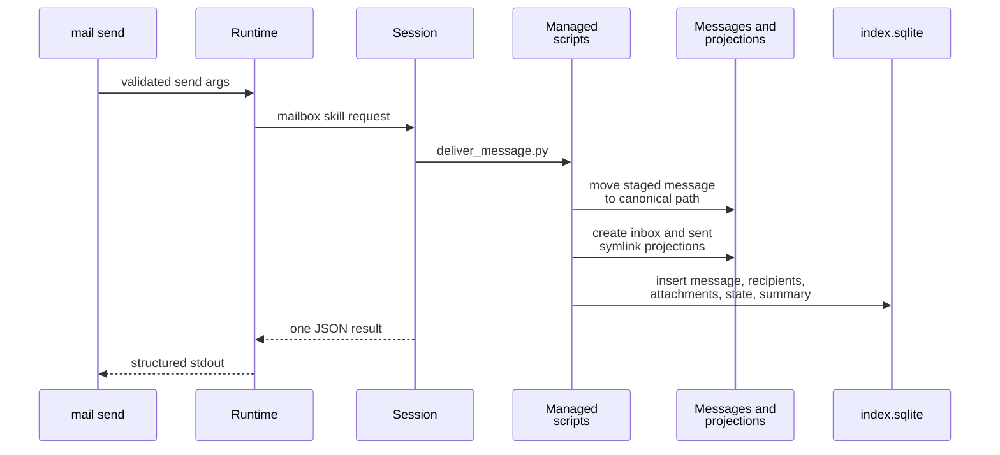

# Mailbox Common Workflows

This page explains the practical v1 procedures for bootstrapping a mailbox, reading mail, sending mail, replying, and deciding when mailbox-local rules need to be inspected first.

## Mental Model

The safest workflow is simple:

1. Let the runtime create or validate the mailbox root.
2. Treat `rules/` as the mailbox-local operating manual.
3. Use runtime-owned `mail` commands for session-facing actions.
4. Use managed helpers for direct filesystem operations that touch locks or SQLite.

That order matters because the mailbox root may have mailbox-local rules, a private mailbox registration path, or managed helper requirements that are not obvious from a single path listing.

## Bootstrap And First Inspection

When you enable mailbox support on `start-session`, the runtime bootstraps the filesystem root, registers the current address, projects the mailbox skill, and persists the resolved mailbox binding.

After bootstrap, inspect these first:

- `<mailbox_root>/rules/README.md`
- `<mailbox_root>/rules/protocols/filesystem-mailbox-v1.md`
- `<mailbox_root>/rules/scripts/requirements.txt`

Use this step whenever you are new to a mailbox root, recovering an environment, or about to touch shared state directly.



## Read Mail Safely

Use `mail check` when you want the session to interpret or summarize mailbox content using the runtime-owned contract.

```bash
pixi run python -m gig_agents.agents.brain_launch_runtime mail check \
  --agent-identity AGENTSYS-research \
  --unread-only \
  --limit 10
```

Operational guidance:

- Re-read the current mailbox bindings before each action.
- Treat SQLite as the source of truth for unread versus read state.
- Read canonical content by following projections back to `messages/<date>/<message-id>.md`.
- If `AGENTSYS_MAILBOX_BINDINGS_VERSION` changed, reload paths and retry from current bindings.

## Send New Mail

Use `mail send` for session-owned composition.

```bash
pixi run python -m gig_agents.agents.brain_launch_runtime mail send \
  --agent-identity AGENTSYS-research \
  --to AGENTSYS-orchestrator@agents.localhost \
  --subject "Investigate parser drift" \
  --body-file body.md \
  --attach notes.txt
```

Stepwise expectations:

1. The runtime validates attachment paths and body source.
2. The runtime prompts the session with the mailbox skill and a structured request.
3. The session inspects `rules/`.
4. If the action touches `index.sqlite` or `locks/`, the session uses the managed helper under `rules/scripts/`.
5. The delivery flow stages the message, moves it into the canonical store, creates inbox/sent projections, updates SQLite state, and returns one JSON result.



## Reply To Existing Mail

Use `mail reply` when you already know the parent `message_id`.

```bash
pixi run python -m gig_agents.agents.brain_launch_runtime mail reply \
  --agent-identity AGENTSYS-research \
  --message-id msg-20260312T050000Z-parent \
  --body-content "Reply with next steps"
```

Reply-specific guidance:

- Preserve the existing `thread_id`.
- Set `in_reply_to` to the direct parent.
- Extend `references`; do not infer threading from subject text alone.
- Use the same rules-first and managed-helper expectations as `mail send`.

## When `rules/` Inspection Is Mandatory

Inspect mailbox-local `rules/` before:

- invoking Python helper scripts from `rules/scripts/`,
- touching `index.sqlite`,
- touching any `.lock` file,
- assuming a layout detail that could be mailbox-local policy rather than transport-wide policy,
- reacting to a mailbox that claims to be initialized but is missing managed assets.

If managed `rules/scripts/` assets are missing, treat that as a bootstrap or initialization problem, not a prompt to author replacement scripts in place.

## Source References

- [`src/gig_agents/agents/brain_launch_runtime/cli.py`](../../../../src/gig_agents/agents/brain_launch_runtime/cli.py)
- [`src/gig_agents/agents/brain_launch_runtime/mail_commands.py`](../../../../src/gig_agents/agents/brain_launch_runtime/mail_commands.py)
- [`src/gig_agents/agents/mailbox_runtime_support.py`](../../../../src/gig_agents/agents/mailbox_runtime_support.py)
- [`src/gig_agents/mailbox/assets/rules/README.md`](../../../../src/gig_agents/mailbox/assets/rules/README.md)
- [`src/gig_agents/mailbox/assets/rules/protocols/filesystem-mailbox-v1.md`](../../../../src/gig_agents/mailbox/assets/rules/protocols/filesystem-mailbox-v1.md)
- [`src/gig_agents/mailbox/managed.py`](../../../../src/gig_agents/mailbox/managed.py)
