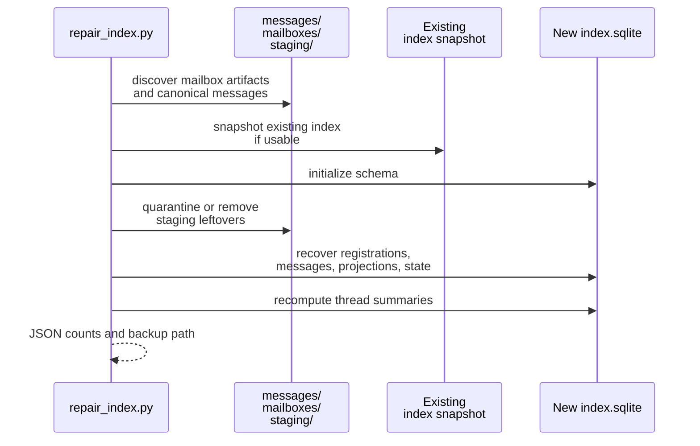

# Mailbox Repair And Recovery

This page explains what the mailbox repair flow rebuilds, what it preserves, and what its recovery boundary is.

## Mental Model

Repair is a rebuild around canonical truth, not a general undo system.

- Canonical messages under `messages/` are the durable content authority.
- Registrations can be rediscovered from `mailboxes/` and prior index hints.
- Projections, mailbox state, and thread summaries can be rebuilt.
- Orphaned staging artifacts can be quarantined or removed.

What repair cannot do is invent content that no longer exists in canonical message files.

## Exact Recovery Boundary

Repair can recover or rebuild:

- SQLite schema when the index is missing or unreadable
- active, inactive, and stashed registration metadata inferred from mailbox artifacts and snapshots
- projection symlinks in `inbox/` and `sent`
- mailbox-state rows for sender and recipient registrations
- thread summaries
- attachment metadata stored in canonical message front matter

Repair does not recover:

- deleted canonical message files
- mailbox content that only existed in staging and was never delivered
- unsupported stale roots from the earlier principal-keyed layout

If the root is stale or structurally unsupported, the correct action is to delete and re-bootstrap it rather than trying to repair in place.

## Repair Procedure

The managed `repair_index.py` wrapper defaults to `cleanup_staging=true` and `quarantine_staging=true`.

Representative invocation:

```bash
pixi run python src/gig_agents/mailbox/assets/rules/scripts/repair_index.py \
  --mailbox-root /abs/path/mailbox
```

Representative result:

```json
{
  "ok": true,
  "message_count": 1,
  "projection_count": 2,
  "registration_count": 2,
  "restored_state_count": 0,
  "defaulted_state_count": 2,
  "staging_action": "quarantine",
  "staging_artifact_count": 1,
  "staging_artifact_paths": ["/abs/path/mailbox/staging/orphaned.md.quarantine-..."],
  "backed_up_index_path": null
}
```



## Staging Cleanup Guidance

- `cleanup_staging=true` means the repair flow will process leftover staging artifacts.
- `quarantine_staging=true` keeps those artifacts for inspection rather than deleting them immediately.
- Staging cleanup is about incomplete work products, not delivered mailbox history.

For most operational use, the default quarantine mode is the safer first pass because it preserves evidence while still cleaning the active staging area.

## Source References

- [`src/gig_agents/mailbox/managed.py`](../../../../src/gig_agents/mailbox/managed.py)
- [`src/gig_agents/mailbox/filesystem.py`](../../../../src/gig_agents/mailbox/filesystem.py)
- [`src/gig_agents/mailbox/assets/rules/scripts/repair_index.py`](../../../../src/gig_agents/mailbox/assets/rules/scripts/repair_index.py)
- [`tests/unit/mailbox/test_managed.py`](../../../../tests/unit/mailbox/test_managed.py)
