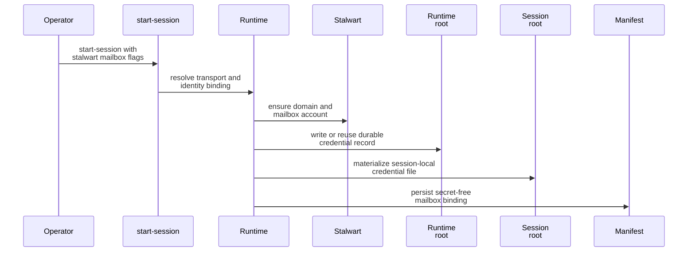

# Stalwart Setup And First Session

- Who this is for: operators and developers who want the shortest safe path to a mailbox-enabled session backed by Stalwart.
- What it explains: Houmao-side prerequisites, session startup, first `mail` commands, and when the live gateway mailbox facade becomes the preferred shared path.
- Assumes: you already have a buildable Houmao brain or session definition and a reachable Stalwart deployment.

## Mental Model

With the `stalwart` transport, Houmao stops acting like the mailbox storage engine.

- Houmao resolves one mailbox binding for the session, provisions or validates the Stalwart account, persists a secret-free manifest payload, and materializes one session-local credential file when needed.
- Stalwart is the authority for delivery, unread state, reply ancestry, and mailbox storage.
- A live gateway can add one shared `/v1/mail/*` facade in front of that same mailbox binding, but gateway attachment is still optional for the first successful session.

## Responsibility Boundaries

| Component | Owns | Does not own |
| --- | --- | --- |
| Houmao runtime | mailbox config resolution, manifest persistence, Stalwart provisioning orchestration, projected mailbox skill selection, session-local credential materialization | unread truth, mailbox threading truth, transport-local storage semantics inside Stalwart |
| Agent gateway | `/v1/mail/*` and `/v1/mail-notifier` exposure, adapter selection from manifest-backed authority plus internal bootstrap state, notifier cadence and audit history | Stalwart account provisioning, Stalwart mailbox storage, filesystem mailbox repair rules |
| Stalwart | mailbox delivery, unread state, reply ancestry, account mailbox contents, JMAP-backed mailbox operations | Houmao session manifests, gateway queue state, Houmao role or prompt contracts |

## Filesystem Versus Stalwart

| Topic | `filesystem` | `stalwart` |
| --- | --- | --- |
| Mailbox authority | Houmao-owned mailbox root plus SQLite state | Stalwart mailbox server |
| Transport-local assets | `rules/`, `locks/`, projections, `index.sqlite`, mailbox-local `mailbox.sqlite` | JMAP endpoint, management API, runtime-owned credential references, session-local credential file |
| First-read docs path | [Mailbox Quickstart](../quickstart.md) plus [Common Workflows](common-workflows.md) | this page |
| Shared gateway path | available when a live loopback gateway is attached | available when a live loopback gateway is attached |
| Reply target contract | opaque `message_ref` | opaque `message_ref` |

## Persisted Versus Secret Material

| Artifact | Location | Secret-free | Purpose |
| --- | --- | --- | --- |
| mailbox binding in `manifest.json` | `<session-root>/manifest.json` | yes | durable runtime record used by resume, direct mailbox flows, and gateway adapter construction |
| runtime-owned Stalwart credential store | `<runtime-root>/mailbox-credentials/stalwart/<credential-ref>.json` | no | durable runtime-owned secret material keyed by `credential_ref` |
| session-local Stalwart credential file | `<session-root>/mailbox-secrets/<credential-ref>.json` | no | per-session materialized secret file surfaced as `AGENTSYS_MAILBOX_EMAIL_CREDENTIAL_FILE` |

The manifest stores `credential_ref`, not the password itself. For the broader filesystem map and cleanup guidance, use [Agents And Runtime](../../system-files/agents-and-runtime.md).

## Prerequisites And Assumptions

Houmao needs the following inputs before a Stalwart-backed session can start successfully:

- either `mailbox.base_url` or both `mailbox.jmap_url` and `mailbox.management_url`,
- a reachable Management API that can create or update the mailbox domain and account,
- one of `HOUMAO_STALWART_MANAGEMENT_BEARER_TOKEN` or the pair `HOUMAO_STALWART_MANAGEMENT_API_KEY` and `HOUMAO_STALWART_MANAGEMENT_API_SECRET`,
- a mailbox address and login identity, where the login identity defaults to the mailbox address unless you override it.

You can supply the endpoint inputs declaratively or override them at session start with:

- `--mailbox-stalwart-base-url`
- `--mailbox-stalwart-jmap-url`
- `--mailbox-stalwart-management-url`
- `--mailbox-stalwart-login-identity`

If you supply only `base_url`, Houmao derives JMAP as `<base_url>/jmap` and the management API as `<base_url>/api`.

## Start A Stalwart-Backed Session

> **Note:** `--mailbox-transport stalwart` is not currently exposed via `houmao-mgr agents launch`. The raw `python -m houmao.agents.realm_controller start-session` module CLI shown below remains the supported access path for the stalwart mailbox workflow. Only the `filesystem` transport is available through `houmao-mgr` today.

Use `start-session` with `--mailbox-transport stalwart` and either a base URL or explicit endpoint URLs.

```bash
pixi run python -m houmao.agents.realm_controller start-session \
  --agent-def-dir tests/fixtures/agents \
  --brain-manifest <runtime-root>/manifests/<home-id>.yaml \
  --role gpu-kernel-coder \
  --backend claude_headless \
  --mailbox-transport stalwart \
  --mailbox-principal-id AGENTSYS-research \
  --mailbox-address AGENTSYS-research@agents.localhost \
  --mailbox-stalwart-base-url http://127.0.0.1:8080
```

At startup, Houmao resolves the mailbox binding, ensures the Stalwart domain and mailbox account exist, writes or reuses the durable runtime-owned credential record, materializes a session-local credential file, and persists a secret-free mailbox binding in the session manifest.



Representative manifest fragment:

```json
{
  "mailbox": {
    "transport": "stalwart",
    "principal_id": "AGENTSYS-research",
    "address": "AGENTSYS-research@agents.localhost",
    "jmap_url": "http://127.0.0.1:8080/jmap",
    "management_url": "http://127.0.0.1:8080/api",
    "login_identity": "AGENTSYS-research@agents.localhost",
    "credential_ref": "stalwart-AGENTSYS-research-at-agents-localhost-a1b2c3d4e5f60718",
    "bindings_version": "2026-03-19T08:00:00.000001Z"
  }
}
```

## Verify The First Session Directly

Start with direct `mail` commands. This is the shortest path to a correct first success, and it proves the runtime-owned mailbox binding before you add the gateway layer.

Check mail:

```bash
pixi run python -m houmao.agents.realm_controller mail check \
  --agent-identity AGENTSYS-research \
  --unread-only \
  --limit 10
```

Send a message:

```bash
pixi run python -m houmao.agents.realm_controller mail send \
  --agent-identity AGENTSYS-research \
  --to AGENTSYS-orchestrator@agents.localhost \
  --subject "Investigate parser drift" \
  --body-content "Please review the current parser mismatch."
```

Reply to a known message:

```bash
pixi run python -m houmao.agents.realm_controller mail reply \
  --agent-identity AGENTSYS-research \
  --message-ref stalwart:6830e11343d5efb7 \
  --body-content "Reply with next steps"
```

Important rules during first verification:

- Treat `message_ref` as opaque even when it contains a transport-prefixed value such as `stalwart:...`.
- Do not look for filesystem mailbox `rules/`, `locks/`, projections, or SQLite paths for this transport.
- If direct Stalwart mailbox access is needed, the runtime-owned env bindings provide the JMAP endpoint, login identity, `credential_ref`, and the session-local credential file.

## When The Gateway Becomes The Preferred Shared Path

Once a live gateway is attached on `127.0.0.1`, the runtime-owned mailbox guidance prefers the shared gateway mailbox facade for mailbox operations that both transports support cleanly:

- `GET /v1/mail/status`
- `POST /v1/mail/check`
- `POST /v1/mail/send`
- `POST /v1/mail/reply`
- `POST /v1/mail/state`

That preference matters because the gateway becomes the transport abstraction boundary. The session can keep one operator-facing `mail` UX while the gateway resolves either a filesystem-backed adapter or a Stalwart-backed adapter from the same manifest-backed mailbox binding. It also means one bounded later turn can reply to a shared `message_ref` and then mark that same processed message read without recovering raw Stalwart ids.

Use [Gateway Mailbox Facade](../../gateway/operations/mailbox-facade.md) for the attach-time and route-availability story. Use [Protocol And State Contracts](../../gateway/contracts/protocol-and-state.md) for the exact HTTP request and response shapes.

## Common Confusions

- `message_ref` is the shared reply target contract. It is not a promise that callers should parse transport-local ids out of the string.
- The manifest persists `credential_ref`, not the mailbox password.
- A Stalwart-backed session can be mailbox-enabled even when no live gateway is attached.
- Filesystem `rules/` and mailbox-local SQLite state are transport-local to the filesystem transport and do not apply to Stalwart-backed sessions.

## Exact References

- For env vars and manifest fields, use [Runtime Contracts](../contracts/runtime-contracts.md).
- For shared mailbox route payloads, use [Protocol And State Contracts](../../gateway/contracts/protocol-and-state.md).
- For runtime-owned filesystem placement, use [Agents And Runtime](../../system-files/agents-and-runtime.md).

## Source References

- [`src/houmao/agents/mailbox_runtime_support.py`](../../../../src/houmao/agents/mailbox_runtime_support.py)
- [`src/houmao/agents/realm_controller/mail_commands.py`](../../../../src/houmao/agents/realm_controller/mail_commands.py)
- [`src/houmao/agents/realm_controller/runtime.py`](../../../../src/houmao/agents/realm_controller/runtime.py)
- [`src/houmao/agents/realm_controller/cli.py`](../../../../src/houmao/agents/realm_controller/cli.py)
- [`src/houmao/mailbox/stalwart.py`](../../../../src/houmao/mailbox/stalwart.py)
- [`src/houmao/agents/realm_controller/gateway_mailbox.py`](../../../../src/houmao/agents/realm_controller/gateway_mailbox.py)
