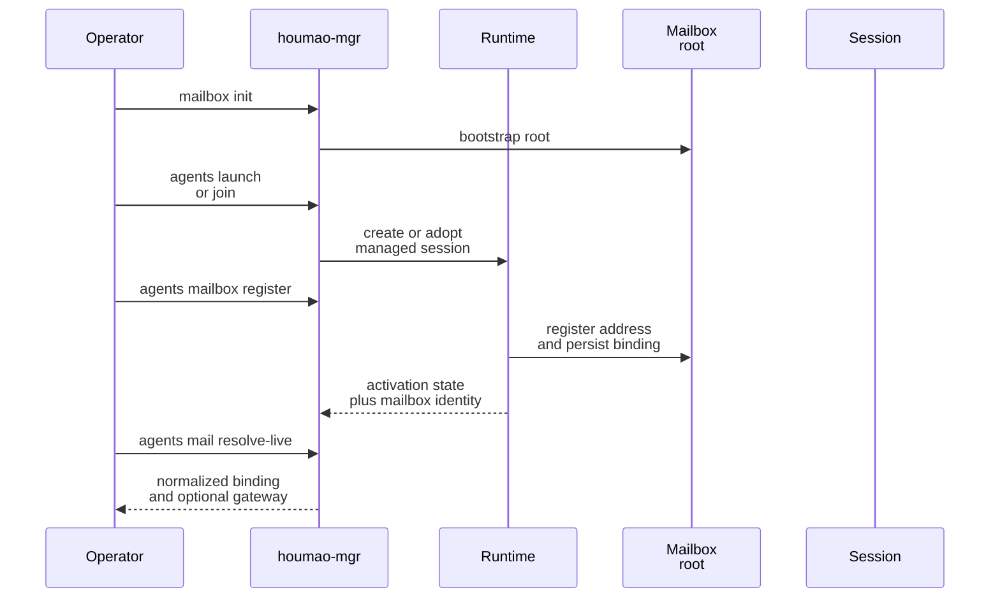
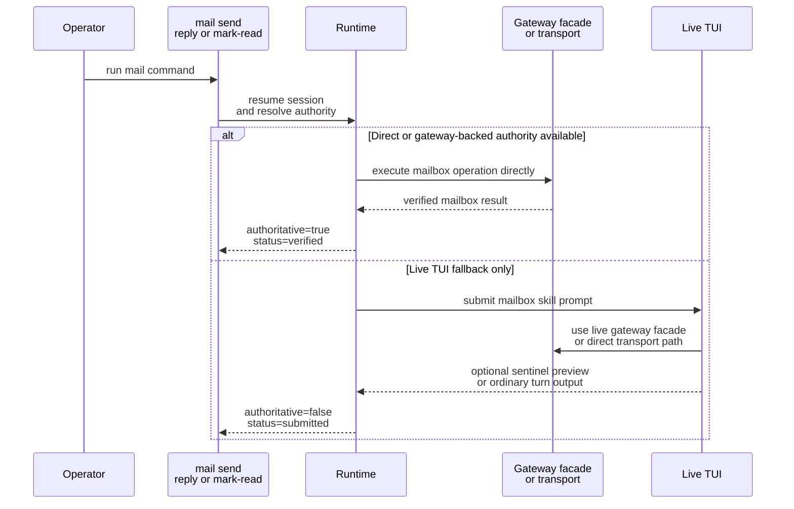

# Mailbox Quickstart

This page shows the shortest safe path to a working mailbox-enabled local managed agent and the manager-owned mailbox flow you will use first: `agents mail resolve-live`, `agents mail check`, `agents mail send`, `agents mail reply`, and `agents mail mark-read`.

## Choose Your Transport

Choose the transport before you copy a startup example.

| Transport | Use this when | Start here |
| --- | --- | --- |
| `filesystem` | you want the fully Houmao-owned mailbox transport with local rules, SQLite state, and projections | stay on this page |
| `stalwart` | you want Stalwart to be the mailbox authority for delivery, unread state, and reply ancestry | [Stalwart Setup And First Session](operations/stalwart-setup-and-first-session.md) |

The rest of this page keeps the shortest inline filesystem example. The `mail resolve-live`, `mail check`, `mail send`, `mail reply`, and `mail mark-read` CLI surface is shared, but Stalwart-specific startup and secret-handling guidance lives in the dedicated page above.

## Mental Model

Do not wire mailbox behavior into prompts by hand. For the preferred local serverless workflow, `houmao-mgr` splits mailbox setup into three explicit seams:

1. `houmao-mgr mailbox ...` manages the shared filesystem mailbox root and address lifecycle.
2. `houmao-mgr agents mailbox ...` attaches or removes one filesystem mailbox binding on an existing local managed agent.
3. `houmao-mgr agents mail ...` discovers the current live mailbox binding and performs mailbox follow-up after the agent is launched or joined.

After registration, the runtime projects the transport-specific mailbox skill and durable mailbox binding into the managed session. The visible `skills/mailbox/...` subtree is the mailbox skill surface, and `agents mail resolve-live` is the supported current-mailbox discovery path for later work.

When attached shared-mailbox work needs the exact live `/v1/mail/*` endpoint, use `pixi run houmao-mgr agents mail resolve-live` and take the endpoint from the returned `gateway.base_url` instead of rediscovering host or port ad hoc. Inside the owning managed tmux session, selectors may be omitted; outside tmux, or when targeting a different agent, use `--agent-id` or `--agent-name`.

## Filesystem Quickstart

For local serverless usage, prefer `houmao-mgr` late registration instead of launch-time mailbox flags. In v1, the implemented transports are `filesystem` and `stalwart`, but the native `houmao-mgr mailbox ...` and `houmao-mgr agents mailbox ...` workflow targets the filesystem transport only.

Implicit filesystem mailbox state defaults to `~/.houmao/mailbox`, independently from the runtime root. `HOUMAO_GLOBAL_MAILBOX_DIR` relocates that shared mailbox area for CI or controlled environments, and an explicit `--mailbox-root` override still wins for one command.

1. Bootstrap or validate the shared mailbox root.

```bash
pixi run houmao-mgr mailbox init --mailbox-root tmp/shared-mail
```

2. Launch or join the local managed agent without mailbox launch flags.

```bash
pixi run houmao-mgr agents launch \
  --agents gpu-kernel-coder \
  --agent-name research \
  --provider claude_code \
  --headless \
  --yolo
```

3. Register mailbox support after the session already exists.

```bash
pixi run houmao-mgr agents mailbox register \
  --agent-name research \
  --mailbox-root tmp/shared-mail
```

4. Inspect the late-registration posture before using manager-owned mail commands.

```bash
pixi run houmao-mgr agents mailbox status --agent-name research
```

Typical status output after a successful headless registration:

```json
{
  "activation_state": "active",
  "address": "HOUMAO-research@agents.localhost",
  "mailbox_root": "/abs/path/tmp/shared-mail",
  "principal_id": "HOUMAO-research",
  "registered": true,
  "runtime_mailbox_enabled": true,
  "transport": "filesystem"
}
```

5. Resolve the current live mailbox binding before direct gateway HTTP work or other current-mailbox work.

```bash
pixi run houmao-mgr agents mail resolve-live --agent-name research
```

For supported tmux-backed managed sessions, including sessions adopted through `houmao-mgr agents join`, late mailbox registration updates the durable session mailbox binding without requiring relaunch solely for mailbox attachment. That includes joined sessions whose relaunch posture is unavailable, as long as Houmao can still update the durable session state and validate the resulting mailbox binding. If direct mailbox work needs the current binding set explicitly, resolve it through `pixi run houmao-mgr agents mail resolve-live`. That helper returns structured mailbox fields plus optional `gateway.base_url` data when an attached shared-mailbox gateway is live.

Workspace-local job dirs remain separate from mailbox state. When the runtime uses local job storage under `<working-directory>/.houmao/jobs/<session-id>/`, that `.houmao/` tree is scratch/runtime state rather than the shared mailbox root. If the repo also uses `houmao-mgr project init`, the same hidden `.houmao/` overlay may contain both project-local agent-definition sources and runtime-local `jobs/` scratch, but the mailbox root remains separate and `.houmao/.gitignore` already hides the overlay by default.



## Check Mail

Use `agents mail check` against a mailbox-enabled managed agent.

```bash
pixi run houmao-mgr agents mail check \
  --agent-name research \
  --unread-only \
  --limit 10
```

Important details:

- `--agent-name` or `--agent-id` uses the normal managed-agent selector rules.
- Inside the owning managed tmux session, those selectors may be omitted for current-session targeting.
- `--unread-only` and `--limit` are optional filters.
- `--since` accepts an RFC3339 lower bound when you want incremental review.

Typical stdout is a verified manager result when Houmao owns the mailbox execution path directly.

```json
{
  "address": "HOUMAO-research@agents.localhost",
  "authoritative": true,
  "execution_path": "manager_direct",
  "operation": "check",
  "principal_id": "HOUMAO-research",
  "schema_version": 1,
  "status": "verified",
  "transport": "filesystem",
  "unread_count": 2
}
```

## Send Mail

```bash
pixi run houmao-mgr agents mail send \
  --agent-name research \
  --to HOUMAO-orchestrator@agents.localhost \
  --subject "Investigate parser drift" \
  --body-file body.md \
  --attach notes.txt
```

Important details:

- `--to` is required and may be repeated.
- `--cc` is optional and may be repeated.
- Recipients must be full mailbox addresses such as `HOUMAO-orchestrator@agents.localhost`.
- Exactly one of `--body-file` or `--body-content` must be supplied.
- `--attach` paths are validated by the CLI before they are surfaced to the session.
- When Houmao can execute through pair-owned, gateway-backed, or manager-owned direct authority, the result is authoritative.
- When a local live TUI fallback is used, the result is submission-only and returns `submitted`, `rejected`, `busy`, `interrupted`, or `tui_error` without claiming mailbox success from transcript parsing.
- Use `houmao-mgr agents mail status`, `houmao-mgr agents mail check`, filesystem mailbox inspection, or transport-native mailbox state to verify non-authoritative fallback results.

## Reply To Mail

```bash
pixi run houmao-mgr agents mail reply \
  --agent-name research \
  --message-ref filesystem:msg-20260312T050000Z-parent \
  --body-content "Reply with next steps"
```

Important details:

- `--message-ref` is required.
- Exactly one of `--body-file` or `--body-content` must be supplied.
- Attachments are allowed on replies too.
- Replies target the shared opaque `message_ref` contract; do not derive behavior from transport-prefixed values embedded inside the ref.

## Mark Mail Read

After you successfully process one nominated unread message, mark that same `message_ref` read.

```bash
pixi run houmao-mgr agents mail mark-read \
  --agent-name research \
  --message-ref filesystem:msg-20260312T050000Z-parent
```

Important details:

- `mark-read` is the manager-owned fallback companion to gateway `POST /v1/mail/state`.
- Only mark a message read after the processing step succeeded.
- If the command returns `authoritative: false`, verify the outcome through `houmao-mgr agents mail check`, filesystem mailbox inspection, or transport-native mailbox state.

## Direct Execution And TUI Fallback

`houmao-mgr agents mail ...` prefers manager-owned direct execution and gateway-backed execution. Only the local live-TUI fallback submits a mailbox prompt into the session.

- Shared gateway sessions use `skills/mailbox/houmao-email-via-agent-gateway/SKILL.md` as the primary Houmao mailbox skill document.
- Filesystem sessions use `skills/mailbox/houmao-email-via-filesystem/SKILL.md` for transport-specific mailbox context and no-gateway fallback.
- Stalwart sessions use `skills/mailbox/houmao-email-via-stalwart/SKILL.md` for transport-specific mailbox context and no-gateway fallback.
- When a live loopback gateway is attached, shared mailbox operations prefer the gateway `/v1/mail/*` facade before falling back to direct transport-specific access.
- For bounded attached-session turns, that shared facade includes `POST /v1/mail/state` so one processed unread target can be marked read without reconstructing transport-local identifiers.
- In TUI fallback mode, exact sentinel-delimited result recovery is optional preview data, not the correctness boundary for the command result.



## When To Leave Quickstart

- If you are using the `stalwart` transport, continue with [Stalwart Setup And First Session](operations/stalwart-setup-and-first-session.md).
- If you need the exact message schema, go to [Canonical Model](contracts/canonical-model.md).
- If you need the exact env vars or request/result envelopes, go to [Runtime Contracts](contracts/runtime-contracts.md).
- If you need stepwise operational guidance, go to [Common Workflows](operations/common-workflows.md).

## Source References

- [`src/houmao/srv_ctrl/commands/mailbox.py`](../../../src/houmao/srv_ctrl/commands/mailbox.py)
- [`src/houmao/srv_ctrl/commands/agents/mailbox.py`](../../../src/houmao/srv_ctrl/commands/agents/mailbox.py)
- [`src/houmao/srv_ctrl/commands/agents/mail.py`](../../../src/houmao/srv_ctrl/commands/agents/mail.py)
- [`src/houmao/agents/realm_controller/runtime.py`](../../../src/houmao/agents/realm_controller/runtime.py)
- [`src/houmao/agents/mailbox_runtime_support.py`](../../../src/houmao/agents/mailbox_runtime_support.py)
- [`src/houmao/agents/realm_controller/mail_commands.py`](../../../src/houmao/agents/realm_controller/mail_commands.py)
- [`src/houmao/agents/realm_controller/assets/system_skills/mailbox/houmao-email-via-agent-gateway/SKILL.md`](../../../src/houmao/agents/realm_controller/assets/system_skills/mailbox/houmao-email-via-agent-gateway/SKILL.md)
- [`src/houmao/agents/realm_controller/assets/system_skills/mailbox/houmao-email-via-filesystem/SKILL.md`](../../../src/houmao/agents/realm_controller/assets/system_skills/mailbox/houmao-email-via-filesystem/SKILL.md)
- [`src/houmao/agents/realm_controller/assets/system_skills/mailbox/houmao-email-via-stalwart/SKILL.md`](../../../src/houmao/agents/realm_controller/assets/system_skills/mailbox/houmao-email-via-stalwart/SKILL.md)
