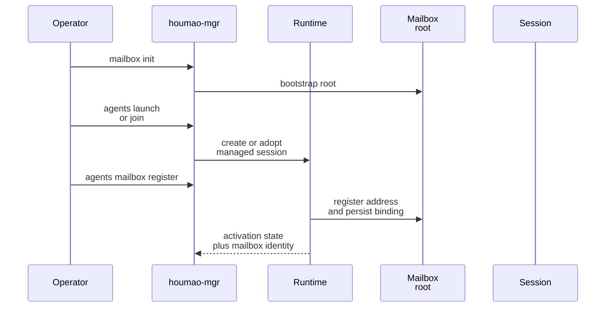
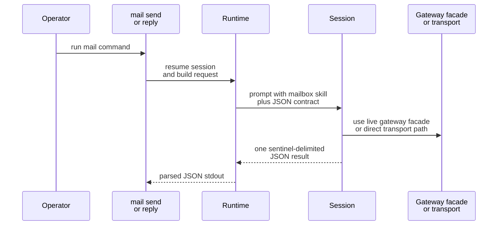

# Mailbox Quickstart

This page shows the shortest safe path to a working mailbox-enabled local managed agent and the three runtime-owned mailbox commands you will use first: `agents mail check`, `agents mail send`, and `agents mail reply`.

## Choose Your Transport

Choose the transport before you copy a startup example.

| Transport | Use this when | Start here |
| --- | --- | --- |
| `filesystem` | you want the fully Houmao-owned mailbox transport with local rules, SQLite state, and projections | stay on this page |
| `stalwart` | you want Stalwart to be the mailbox authority for delivery, unread state, and reply ancestry | [Stalwart Setup And First Session](operations/stalwart-setup-and-first-session.md) |

The rest of this page keeps the shortest inline filesystem example. The `mail check`, `mail send`, and `mail reply` CLI surface is shared, but Stalwart-specific startup and secret-handling guidance lives in the dedicated page above.

## Mental Model

Do not wire mailbox behavior into prompts by hand. For the preferred local serverless workflow, `houmao-mgr` splits mailbox setup into two explicit seams:

1. `houmao-mgr mailbox ...` manages the shared filesystem mailbox root and address lifecycle.
2. `houmao-mgr agents mailbox ...` attaches or removes one filesystem mailbox binding on an existing local managed agent.
3. `houmao-mgr agents mail ...` reuses that persisted binding for runtime-owned mailbox work after the agent is launched or joined.

After registration, the runtime projects the transport-specific mailbox skill and durable mailbox binding into the managed session, and for tmux-backed managed sessions it also refreshes the targeted `AGENTSYS_MAILBOX_*` keys in tmux session environment so later `agents mail ...` commands can reuse the same binding immediately. The visible `skills/mailbox/...` subtree is the primary mailbox skill surface, and `skills/.system/mailbox/...` remains a compatibility mirror.

## Filesystem Quickstart

For local serverless usage, prefer `houmao-mgr` late registration instead of launch-time mailbox flags. In v1, the implemented transports are `filesystem` and `stalwart`, but the native `houmao-mgr mailbox ...` and `houmao-mgr agents mailbox ...` workflow targets the filesystem transport only.

Implicit filesystem mailbox state defaults to `~/.houmao/mailbox`, independently from the runtime root. `AGENTSYS_GLOBAL_MAILBOX_DIR` relocates that shared mailbox area for CI or controlled environments, and an explicit `--mailbox-root` override still wins for one command.

1. Bootstrap or validate the shared mailbox root.

```bash
pixi run houmao-mgr mailbox init --mailbox-root tmp/shared-mail
```

2. Launch or join the local managed agent without mailbox launch flags.

```bash
pixi run houmao-mgr agents launch \
  --agents gpu-kernel-coder \
  --agent-name research \
  --provider claude_code \
  --headless \
  --yolo
```

3. Register mailbox support after the session already exists.

```bash
pixi run houmao-mgr agents mailbox register \
  --agent-name research \
  --mailbox-root tmp/shared-mail
```

4. Inspect the late-registration posture before using runtime-owned mail commands.

```bash
pixi run houmao-mgr agents mailbox status --agent-name research
```

Typical status output after a successful headless registration:

```json
{
  "activation_state": "active",
  "address": "AGENTSYS-research@agents.localhost",
  "mailbox_root": "/abs/path/tmp/shared-mail",
  "principal_id": "AGENTSYS-research",
  "registered": true,
  "runtime_mailbox_enabled": true,
  "transport": "filesystem"
}
```

For supported tmux-backed managed sessions, late mailbox registration now refreshes the live mailbox projection without requiring relaunch solely for mailbox binding refresh. If direct mailbox work needs the current binding set explicitly, resolve it through `pixi run python -m houmao.agents.mailbox_runtime_support resolve-live`.

Workspace-local job dirs remain separate from mailbox state. When the runtime uses local job storage under `<working-directory>/.houmao/jobs/<session-id>/`, that `.houmao/` tree is a scratch area rather than the shared mailbox root and is a good candidate for ignore rules in local repos.



## Check Mail

Use `agents mail check` against a mailbox-enabled managed agent.

```bash
pixi run houmao-mgr agents mail check \
  --agent-name research \
  --unread-only \
  --limit 10
```

Important details:

- `--agent-name` or `--agent-id` uses the normal managed-agent selector rules.
- `--unread-only` and `--limit` are optional filters.
- `--since` accepts an RFC3339 lower bound when you want incremental review.

Typical stdout is structured JSON returned by the session through the runtime-owned mailbox contract.

```json
{
  "ok": true,
  "operation": "check",
  "principal_id": "AGENTSYS-research",
  "transport": "filesystem",
  "unread_count": 2
}
```

## Send Mail

```bash
pixi run houmao-mgr agents mail send \
  --agent-name research \
  --to AGENTSYS-orchestrator@agents.localhost \
  --subject "Investigate parser drift" \
  --body-file body.md \
  --attach notes.txt
```

Important details:

- `--to` is required and may be repeated.
- `--cc` is optional and may be repeated.
- Recipients must be full mailbox addresses such as `AGENTSYS-orchestrator@agents.localhost`.
- Exactly one of `--body-file` or `--body-content` must be supplied.
- `--attach` paths are validated by the CLI before they are surfaced to the session.

## Reply To Mail

```bash
pixi run houmao-mgr agents mail reply \
  --agent-name research \
  --message-ref filesystem:msg-20260312T050000Z-parent \
  --body-content "Reply with next steps"
```

Important details:

- `--message-ref` is required.
- `--message-id` remains accepted as a compatibility alias.
- Exactly one of `--body-file` or `--body-content` must be supplied.
- Attachments are allowed on replies too.
- Replies target the shared opaque `message_ref` contract; do not derive behavior from transport-prefixed values embedded inside the ref.

## What The Runtime Expects From The Session

Every `mail` command uses the runtime-owned projected mailbox skill for the selected transport and expects exactly one sentinel-delimited JSON result payload back from the session.

- Filesystem sessions use `skills/mailbox/email-via-filesystem/SKILL.md` as the primary mailbox skill document and may also carry the same content at `skills/.system/mailbox/email-via-filesystem/SKILL.md` as a compatibility mirror.
- Stalwart sessions use `skills/mailbox/email-via-stalwart/SKILL.md` as the primary mailbox skill document and may also carry the same content at `skills/.system/mailbox/email-via-stalwart/SKILL.md` as a compatibility mirror.
- When a live loopback gateway is attached, shared mailbox operations prefer the gateway `/v1/mail/*` facade before falling back to direct transport-specific access.
- For bounded attached-session turns, that shared facade now includes `POST /v1/mail/state` so one processed unread target can be marked read without reconstructing transport-local identifiers.



## When To Leave Quickstart

- If you are using the `stalwart` transport, continue with [Stalwart Setup And First Session](operations/stalwart-setup-and-first-session.md).
- If you need the exact message schema, go to [Canonical Model](contracts/canonical-model.md).
- If you need the exact env vars or request/result envelopes, go to [Runtime Contracts](contracts/runtime-contracts.md).
- If you need stepwise operational guidance, go to [Common Workflows](operations/common-workflows.md).

## Source References

- [`src/houmao/srv_ctrl/commands/mailbox.py`](../../../src/houmao/srv_ctrl/commands/mailbox.py)
- [`src/houmao/srv_ctrl/commands/agents/mailbox.py`](../../../src/houmao/srv_ctrl/commands/agents/mailbox.py)
- [`src/houmao/srv_ctrl/commands/agents/mail.py`](../../../src/houmao/srv_ctrl/commands/agents/mail.py)
- [`src/houmao/agents/realm_controller/runtime.py`](../../../src/houmao/agents/realm_controller/runtime.py)
- [`src/houmao/agents/mailbox_runtime_support.py`](../../../src/houmao/agents/mailbox_runtime_support.py)
- [`src/houmao/agents/realm_controller/mail_commands.py`](../../../src/houmao/agents/realm_controller/mail_commands.py)
- [`src/houmao/agents/realm_controller/assets/system_skills/mailbox/email-via-filesystem/SKILL.md`](../../../src/houmao/agents/realm_controller/assets/system_skills/mailbox/email-via-filesystem/SKILL.md)
- [`src/houmao/agents/realm_controller/assets/system_skills/mailbox/email-via-stalwart/SKILL.md`](../../../src/houmao/agents/realm_controller/assets/system_skills/mailbox/email-via-stalwart/SKILL.md)
