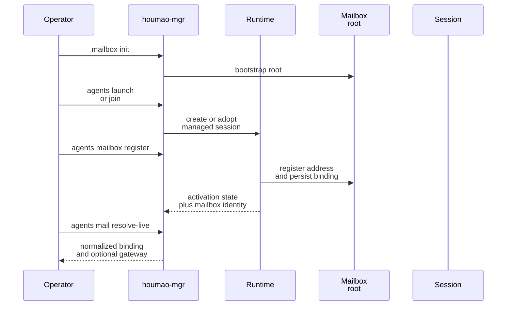
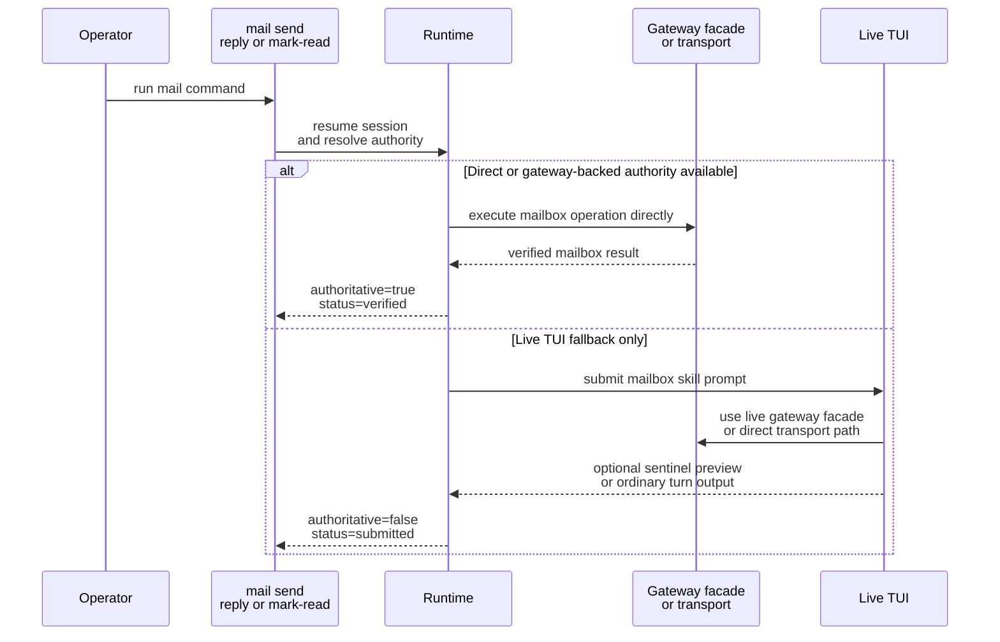

# Mailbox Quickstart

This page shows the shortest safe path to a working mailbox-enabled local managed agent and the manager-owned mailbox flow you will use first: `agents mail resolve-live`, `agents mail check`, `agents mail send`, `agents mail post`, `agents mail reply`, and `agents mail mark-read`.

## Choose Your Transport

Choose the transport before you copy a startup example.

| Transport | Use this when | Start here |
| --- | --- | --- |
| `filesystem` | you want the fully Houmao-owned mailbox transport with local rules, SQLite state, and projections | stay on this page |
| `stalwart` | you want Stalwart to be the mailbox authority for delivery, unread state, and reply ancestry | [Stalwart Setup And First Session](operations/stalwart-setup-and-first-session.md) |

The rest of this page keeps the shortest inline filesystem example. The `mail resolve-live`, `mail check`, `mail send`, `mail post`, `mail reply`, and `mail mark-read` CLI surface is shared, but Stalwart-specific startup and secret-handling guidance lives in the dedicated page above.

## Mental Model

Do not wire mailbox behavior into prompts by hand. For the preferred local serverless workflow, `houmao-mgr` splits mailbox setup into three explicit seams:

1. `houmao-mgr mailbox ...` manages the filesystem mailbox root and address lifecycle.
2. `houmao-mgr agents mailbox ...` attaches or removes one filesystem mailbox binding on an existing local managed agent.
3. `houmao-mgr agents mail ...` discovers the current live mailbox binding and performs mailbox follow-up after the agent is launched or joined.
4. `houmao-mgr system-skills ...` installs the current Houmao-owned mailbox skill sets into resolved Claude, Codex, or Gemini homes when you need those skills outside a Houmao-managed launch or join flow.

Managed launch and managed join now resolve their default Houmao-owned mailbox skill installation from the packaged system-skill catalog before runtime prompts rely on those skills. The visible mailbox skill surface stays tool-native and flat: Claude and Codex use top-level `skills/houmao-.../` directories, while Gemini uses top-level `.gemini/skills/houmao-.../` directories. `agents mail resolve-live` remains the supported current-mailbox discovery path for later work.

When you need the same Houmao-owned skill surface in a tool home that Houmao did not launch, install it with `houmao-mgr system-skills install`. Omitted `--home` resolves from the tool-native home env var first and otherwise falls back to the project-scoped default home, so `pixi run houmao-mgr system-skills install --tool codex` installs into the resolved Codex home. Add `--home ~/.codex` only when you need to override that target.

When attached mailbox work needs the exact live `/v1/mail/*` endpoint, use `pixi run houmao-mgr agents mail resolve-live` and take the endpoint from the returned `gateway.base_url` instead of rediscovering host or port ad hoc. Inside the owning managed tmux session, selectors may be omitted; outside tmux, or when targeting a different agent, use `--agent-id` or `--agent-name`.

## Filesystem Quickstart

For local serverless usage, prefer `houmao-mgr` late registration instead of launch-time mailbox flags. In v1, the implemented transports are `filesystem` and `stalwart`, but the native `houmao-mgr mailbox ...` and `houmao-mgr agents mailbox ...` workflow targets the filesystem transport only.

For maintained project-aware command flows, implicit filesystem mailbox state now defaults to `<active-overlay>/mailbox`. If no active overlay exists yet and the command needs local mailbox state, Houmao bootstraps `<cwd>/.houmao/mailbox`. `HOUMAO_GLOBAL_MAILBOX_DIR` and explicit `--mailbox-root` input still win when you need a non-project mailbox authority.

1. Bootstrap or validate the project-aware mailbox root.

```bash
pixi run houmao-mgr mailbox init
```

2. Launch or join the local managed agent without mailbox launch flags.

```bash
pixi run houmao-mgr agents launch \
  --agents gpu-kernel-coder \
  --agent-name research \
  --provider claude_code \
  --headless
```

3. Register mailbox support after the session already exists.

```bash
pixi run houmao-mgr agents mailbox register \
  --agent-name research
```

4. Inspect the late-registration posture before using manager-owned mail commands.

```bash
pixi run houmao-mgr agents mailbox status --agent-name research
```

Typical status output after a successful headless registration:

```json
{
  "activation_state": "active",
  "address": "research@houmao.localhost",
  "mailbox_root": "/abs/path/repo/.houmao/mailbox",
  "principal_id": "HOUMAO-research",
  "registered": true,
  "runtime_mailbox_enabled": true,
  "transport": "filesystem"
}
```

5. Resolve the current live mailbox binding before direct gateway HTTP work or other current-mailbox work.

```bash
pixi run houmao-mgr agents mail resolve-live --agent-name research
```

For supported tmux-backed managed sessions, including sessions adopted through `houmao-mgr agents join`, late mailbox registration updates the durable session mailbox binding without requiring relaunch solely for mailbox attachment. That includes joined sessions whose relaunch posture is unavailable, as long as Houmao can still update the durable session state and validate the resulting mailbox binding. If direct mailbox work needs the current binding set explicitly, resolve it through `pixi run houmao-mgr agents mail resolve-live`. That helper returns structured mailbox fields plus optional `gateway.base_url` data when an attached mailbox gateway is live.

Project-aware job dirs remain separate from mailbox state. When maintained launch flows use `<active-overlay>/jobs/<session-id>/`, that `.houmao/` subtree is still scratch/runtime state rather than mailbox authority, even though it shares the same hidden overlay as project-local agent-definition sources.



## Check Mail

Use `agents mail check` against a mailbox-enabled managed agent.

```bash
pixi run houmao-mgr agents mail check \
  --agent-name research \
  --unread-only \
  --limit 10
```

Important details:

- `--agent-name` or `--agent-id` uses the normal managed-agent selector rules.
- Inside the owning managed tmux session, those selectors may be omitted for current-session targeting.
- `--unread-only` and `--limit` are optional filters.
- `--since` accepts an RFC3339 lower bound when you want incremental review.

Typical stdout is a verified manager result when Houmao owns the mailbox execution path directly.

```json
{
  "address": "research@houmao.localhost",
  "authoritative": true,
  "execution_path": "manager_direct",
  "operation": "check",
  "principal_id": "HOUMAO-research",
  "schema_version": 1,
  "status": "verified",
  "transport": "filesystem",
  "unread_count": 2
}
```

## Send Mail

```bash
pixi run houmao-mgr agents mail send \
  --agent-name research \
  --to orchestrator@houmao.localhost \
  --subject "Investigate parser drift" \
  --body-file body.md \
  --attach notes.txt
```

Important details:

- `--to` is required and may be repeated.
- `--cc` is optional and may be repeated.
- Recipients must be full mailbox addresses such as `orchestrator@houmao.localhost`.
- Exactly one of `--body-file` or `--body-content` must be supplied.
- `--attach` paths are validated by the CLI before they are surfaced to the session.
- When Houmao can execute through pair-owned, gateway-backed, or manager-owned direct authority, the result is authoritative.
- When a local live TUI fallback is used, the result is submission-only and returns `submitted`, `rejected`, `busy`, `interrupted`, or `tui_error` without claiming mailbox success from transcript parsing.
- Use `houmao-mgr agents mail status`, `houmao-mgr agents mail check`, filesystem mailbox inspection, or transport-native mailbox state to verify non-authoritative fallback results.

## Post Operator-Origin Mail

Use `agents mail post` when the operator needs to drop a one-way note into the managed agent mailbox without sending as the managed mailbox principal.

```bash
pixi run houmao-mgr agents mail post \
  --agent-name research \
  --subject "Resume after sync" \
  --body-content "Continue from the latest mailbox checkpoint."
```

Important details:

- `post` is filesystem-only in v1.
- The canonical sender is always the reserved Houmao-owned system mailbox `HOUMAO-operator@houmao.localhost`.
- Newly derived managed-agent mailbox addresses use `<agentname>@houmao.localhost`.
- `HOUMAO-*` local parts under `houmao.localhost` are reserved for Houmao system mailboxes.
- `post` never falls back to live TUI submission because the operator-origin sender must stay authoritative.
- Replies to operator-origin messages are rejected explicitly.

## Reply To Mail

```bash
pixi run houmao-mgr agents mail reply \
  --agent-name research \
  --message-ref filesystem:msg-20260312T050000Z-parent \
  --body-content "Reply with next steps"
```

Important details:

- `--message-ref` is required.
- Exactly one of `--body-file` or `--body-content` must be supplied.
- Attachments are allowed on replies too.
- Replies target the shared opaque `message_ref` contract; do not derive behavior from transport-prefixed values embedded inside the ref.

## Mark Mail Read

After you successfully process one nominated unread message, mark that same `message_ref` read.

```bash
pixi run houmao-mgr agents mail mark-read \
  --agent-name research \
  --message-ref filesystem:msg-20260312T050000Z-parent
```

Important details:

- `mark-read` is the manager-owned fallback companion to gateway `POST /v1/mail/state`.
- Only mark a message read after the processing step succeeded.
- If the command returns `authoritative: false`, verify the outcome through `houmao-mgr agents mail check`, filesystem mailbox inspection, or transport-native mailbox state.

## Direct Execution And TUI Fallback

`houmao-mgr agents mail ...` prefers manager-owned direct execution and gateway-backed execution. Only the local live-TUI fallback submits a mailbox prompt into the session.

- Claude runtime homes use top-level Houmao skills under the isolated `CLAUDE_CONFIG_DIR`, such as `skills/houmao-process-emails-via-gateway/SKILL.md` and `skills/houmao-agent-email-comms/SKILL.md`.
- Codex runtime homes also use top-level Houmao skills, such as `skills/houmao-process-emails-via-gateway/SKILL.md` and `skills/houmao-agent-email-comms/SKILL.md`.
- Gemini runtime homes use top-level Houmao-owned skills under `.gemini/skills/`, such as `.gemini/skills/houmao-process-emails-via-gateway/SKILL.md` and `.gemini/skills/houmao-agent-email-comms/SKILL.md`.
- Houmao does not use the launched repo's `.claude/` tree as the runtime Claude config directory.
- When a live loopback gateway is attached, shared mailbox operations prefer the gateway `/v1/mail/*` facade before falling back to direct transport-specific access.
- For bounded attached-session turns, that shared facade includes `POST /v1/mail/state` so one processed unread target can be marked read without reconstructing transport-local identifiers.
- In TUI fallback mode, exact sentinel-delimited result recovery is optional preview data, not the correctness boundary for the command result.



## When To Leave Quickstart

- If you are using the `stalwart` transport, continue with [Stalwart Setup And First Session](operations/stalwart-setup-and-first-session.md).
- If you need the exact message schema, go to [Canonical Model](contracts/canonical-model.md).
- If you need the exact env vars or request/result envelopes, go to [Runtime Contracts](contracts/runtime-contracts.md).
- If you need stepwise operational guidance, go to [Common Workflows](operations/common-workflows.md).

## Source References

- [`src/houmao/srv_ctrl/commands/mailbox.py`](../../../src/houmao/srv_ctrl/commands/mailbox.py)
- [`src/houmao/srv_ctrl/commands/agents/mailbox.py`](../../../src/houmao/srv_ctrl/commands/agents/mailbox.py)
- [`src/houmao/srv_ctrl/commands/agents/mail.py`](../../../src/houmao/srv_ctrl/commands/agents/mail.py)
- [`src/houmao/srv_ctrl/commands/system_skills.py`](../../../src/houmao/srv_ctrl/commands/system_skills.py)
- [`src/houmao/agents/realm_controller/runtime.py`](../../../src/houmao/agents/realm_controller/runtime.py)
- [`src/houmao/agents/mailbox_runtime_support.py`](../../../src/houmao/agents/mailbox_runtime_support.py)
- [`src/houmao/agents/system_skills.py`](../../../src/houmao/agents/system_skills.py)
- [`src/houmao/agents/realm_controller/mail_commands.py`](../../../src/houmao/agents/realm_controller/mail_commands.py)
- [`src/houmao/agents/assets/system_skills/houmao-agent-email-comms/SKILL.md`](../../../src/houmao/agents/assets/system_skills/houmao-agent-email-comms/SKILL.md)
