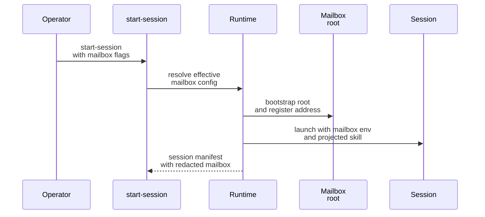
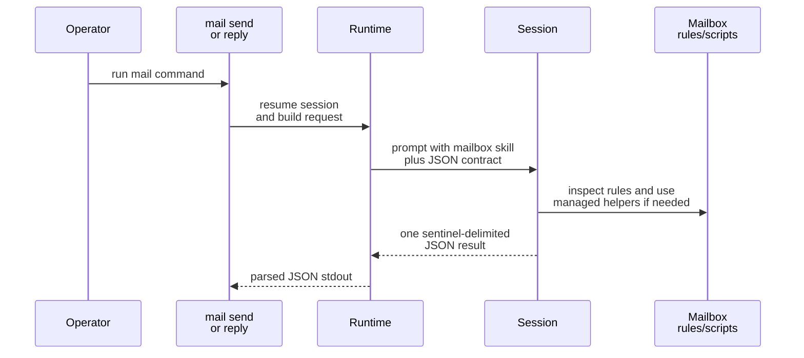

# Mailbox Quickstart

This page shows the shortest safe path to a working mailbox-enabled session and the three runtime-owned mailbox commands you will use first: `mail check`, `mail send`, and `mail reply`.

## Mental Model

You do not wire mailbox behavior into prompts by hand. The runtime does three jobs for you:

1. Resolve one filesystem mailbox binding for the session.
2. Bootstrap or validate the mailbox root and register the session address.
3. Project the runtime-owned mailbox skill and env vars into the session so later `mail` commands can reuse the same binding.

After that, `mail check`, `mail send`, and `mail reply` run against a resumed session. The CLI talks to the runtime, the runtime prompts the session using the projected mailbox skill, and the session returns one structured result payload.

## Enable Mailbox Support

You can enable mailbox support from declarative brain config or from `start-session` overrides. In v1, the only implemented transport is `filesystem`.

```bash
pixi run python -m gig_agents.agents.realm_controller start-session \
  --agent-def-dir tests/fixtures/agents \
  --brain-manifest tmp/agents-runtime/manifests/claude/<home-id>.yaml \
  --role gpu-kernel-coder \
  --backend claude_headless \
  --mailbox-transport filesystem \
  --mailbox-root tmp/shared-mail \
  --mailbox-principal-id AGENTSYS-research \
  --mailbox-address AGENTSYS-research@agents.localhost
```

The `start-session` result includes a redacted mailbox payload in the session manifest output when mailbox support is enabled.

```json
{
  "mailbox": {
    "transport": "filesystem",
    "principal_id": "AGENTSYS-research",
    "address": "AGENTSYS-research@agents.localhost",
    "filesystem_root": "/abs/path/tmp/shared-mail",
    "bindings_version": "2026-03-13T09:15:30.123456Z"
  }
}
```



## Check Mail

Use `mail check` against a resumed mailbox-enabled session.

```bash
pixi run python -m gig_agents.agents.realm_controller mail check \
  --agent-identity AGENTSYS-research \
  --unread-only \
  --limit 10
```

Important details:

- `--agent-identity` can be a name or a manifest path, using the normal runtime control-target rules.
- `--unread-only` and `--limit` are optional filters.
- `--since` accepts an RFC3339 lower bound when you want incremental review.

Typical stdout is structured JSON returned by the session through the runtime-owned mailbox contract.

```json
{
  "ok": true,
  "operation": "check",
  "principal_id": "AGENTSYS-research",
  "transport": "filesystem",
  "unread_count": 2
}
```

## Send Mail

```bash
pixi run python -m gig_agents.agents.realm_controller mail send \
  --agent-identity AGENTSYS-research \
  --to AGENTSYS-orchestrator@agents.localhost \
  --subject "Investigate parser drift" \
  --body-file body.md \
  --attach notes.txt
```

Important details:

- `--to` is required and may be repeated.
- `--cc` is optional and may be repeated.
- Recipients must be full mailbox addresses such as `AGENTSYS-orchestrator@agents.localhost`.
- Exactly one of `--body-file` or `--body-content` must be supplied.
- `--attach` paths are validated by the CLI before they are surfaced to the session.

## Reply To Mail

```bash
pixi run python -m gig_agents.agents.realm_controller mail reply \
  --agent-identity AGENTSYS-research \
  --message-id msg-20260312T050000Z-parent \
  --body-content "Reply with next steps"
```

Important details:

- `--message-id` is required.
- Exactly one of `--body-file` or `--body-content` must be supplied.
- Attachments are allowed on replies too.
- Replies keep the original `thread_id`; they do not create a new thread because the subject changed.

## What The Runtime Expects From The Session

Every `mail` command uses the projected mailbox skill `.system/mailbox/email-via-filesystem` and expects exactly one sentinel-delimited JSON result payload back from the session.



## When To Leave Quickstart

- If you need the exact message schema, go to [Canonical Model](contracts/canonical-model.md).
- If you need the exact env vars or request/result envelopes, go to [Runtime Contracts](contracts/runtime-contracts.md).
- If you need stepwise operational guidance, go to [Common Workflows](operations/common-workflows.md).

## Source References

- [`src/gig_agents/agents/realm_controller/cli.py`](../../../src/gig_agents/agents/realm_controller/cli.py)
- [`src/gig_agents/agents/realm_controller/runtime.py`](../../../src/gig_agents/agents/realm_controller/runtime.py)
- [`src/gig_agents/agents/mailbox_runtime_support.py`](../../../src/gig_agents/agents/mailbox_runtime_support.py)
- [`src/gig_agents/agents/realm_controller/mail_commands.py`](../../../src/gig_agents/agents/realm_controller/mail_commands.py)
- [`src/gig_agents/agents/realm_controller/assets/system_skills/mailbox/email-via-filesystem/SKILL.md`](../../../src/gig_agents/agents/realm_controller/assets/system_skills/mailbox/email-via-filesystem/SKILL.md)
