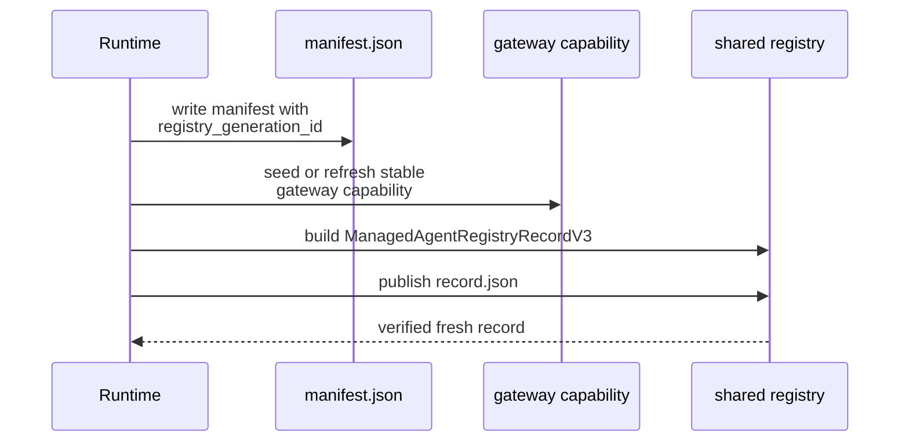
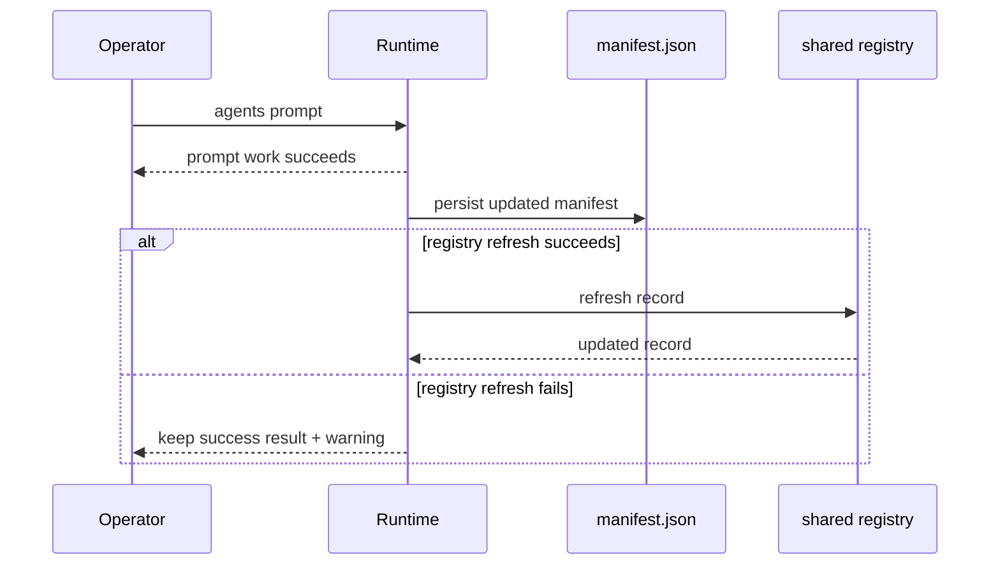

# Shared Registry Runtime Integration

This page explains how the runtime actually owns registry publication: where `generation_id` comes from, which lifecycle hooks refresh records, how stop teardown clears discoverability, and why some registry failures become warnings instead of failed primary actions.

For the broader filesystem placement of the registry root and `record.json`, use [System Files / Shared Registry](../../system-files/shared-registry.md).

## Mental Model

The runtime, not the backend helpers, owns shared-registry publication.

- session manifests remain the durable runtime record,
- gateway capability and mailbox bindings remain runtime-managed adjunct state,
- the registry is refreshed whenever those runtime-owned publication surfaces materially change.

That keeps the registry aligned with the same layer that already owns manifest persistence and stable discovery metadata.

## Start And Resume

For tmux-backed sessions, the runtime keeps one `registry_generation_id` in the controller and persists it in the session manifest.

Start behavior:

- the controller allocates a new `registry_generation_id`,
- `persist_manifest(refresh_registry=False)` writes that id into `manifest.json`,
- `ensure_gateway_capability()` seeds stable gateway state and then refreshes the shared-registry record.

Resume behavior:

- the runtime loads `registry_generation_id` back from the persisted manifest,
- if an older tmux-backed manifest lacks the field, resume generates one so the session can publish again,
- `ensure_gateway_capability()` runs again and refreshes the record for the reclaimed live session.

## Publication And Refresh Hooks

The runtime refreshes registry state from runtime-owned lifecycle hooks rather than from backend-local code.

Current refresh paths include:

- initial publish during start or resume through gateway-capability publication,
- manifest persistence after prompt turns or other stateful control actions,
- gateway capability publication,
- live gateway attach,
- live gateway detach,
- mailbox binding refresh.

The record itself is built from current controller state through `_build_shared_registry_record_for_controller()`, which gathers:

- canonical agent name,
- `generation_id`,
- manifest and session-root pointers,
- optional gateway metadata,
- optional mailbox metadata.

## Publication Flow

This sequence matters because the registry is supposed to point at runtime-owned artifacts that already exist, not to race ahead of manifest publication.

## Persisted Generation Behavior

`registry_generation_id` is what lets the runtime distinguish:

- “same live session, later refresh” from
- “new publisher claiming the same logical agent name.”

Important rules:

- refreshes reuse the same generation,
- resume reuses the persisted generation for the same session,
- replacement sessions get a new generation,
- destructive cleanup or explicit purge only removes the record when it still belongs to the same generation.

That last rule protects against one session tearing down a record that a later replacement publisher already owns.

## Failure Boundaries

The runtime treats the registry as additive discovery metadata, not as the primary action result.

That leads to two different failure classes.

### Publication failures that can still surface directly

Start and resume are the points where the runtime is asserting or reclaiming shared-registry ownership for the session. Failures there can still bubble up directly.

### Post-success refresh failures that become warnings

After the primary runtime action has already succeeded, registry refresh or cleanup problems are recorded as warnings instead of replacing that success.

Current warning-style cases include:

- manifest persistence after a successful prompt or control action,
- mailbox binding refresh after the mailbox work already succeeded,
- stopped-record publication after a successful `agents stop` teardown,
- pre-stop gateway-detach paths when registry-side refresh work fails during cleanup handling.

Managed-agent stop responses carry `manifest_path` and `session_root` when those locators are known before teardown. Those fields remain the supported explicit bridge from live discovery to later stopped-session relaunch or cleanup, even though lifecycle-aware stop now preserves the same locators in the stopped registry record.

Representative flow:

## Stop And Cleanup

On authoritative stop for a tmux-backed session:

1. the runtime tries to detach any live gateway first when relevant,
2. it terminates the backend session,
3. it persists the final manifest with the last-known tmux session name preserved for later relaunch,
4. it publishes a stopped lifecycle record that clears active liveness and gateway metadata while preserving runtime pointers, mailbox identity metadata, generation id, and last-known tmux authority.

If stopped-record publication fails after the session was already stopped, the runtime keeps the successful stop result and falls back to clearing the record rather than turning the stop into a failure.

`agents cleanup session` is now the destructive lifecycle step for stopped local sessions: after successful session-root removal, cleanup retires the stopped record by default or deletes it entirely when `--purge-registry` is requested.

## Current Implementation Notes

- `refresh_shared_registry_record()` returns `None` for non-tmux-backed sessions or when required publication state is missing.
- `publish_live_agent_record()` validates the serialized payload against the packaged `managed_agent_registry_record.v3.schema.json` contract before any write starts.
- `publish_live_agent_record()` enforces freshness and conflict checks before and after the atomic replace.
- Atomic record writes clean up orphan temp files on replace failure.
- `cleanup_stale_live_agent_records()` continues past per-directory failures and reports them separately.

## Source References

- [`src/houmao/agents/realm_controller/runtime.py`](../../../../src/houmao/agents/realm_controller/runtime.py)
- [`src/houmao/agents/realm_controller/manifest.py`](../../../../src/houmao/agents/realm_controller/manifest.py)
- [`src/houmao/agents/realm_controller/registry_models.py`](../../../../src/houmao/agents/realm_controller/registry_models.py)
- [`src/houmao/agents/realm_controller/registry_storage.py`](../../../../src/houmao/agents/realm_controller/registry_storage.py)
- [`tests/unit/agents/realm_controller/test_runtime_registry.py`](../../../../tests/unit/agents/realm_controller/test_runtime_registry.py)
- [`tests/integration/agents/realm_controller/test_registry_runtime_contract.py`](../../../../tests/integration/agents/realm_controller/test_registry_runtime_contract.py)
