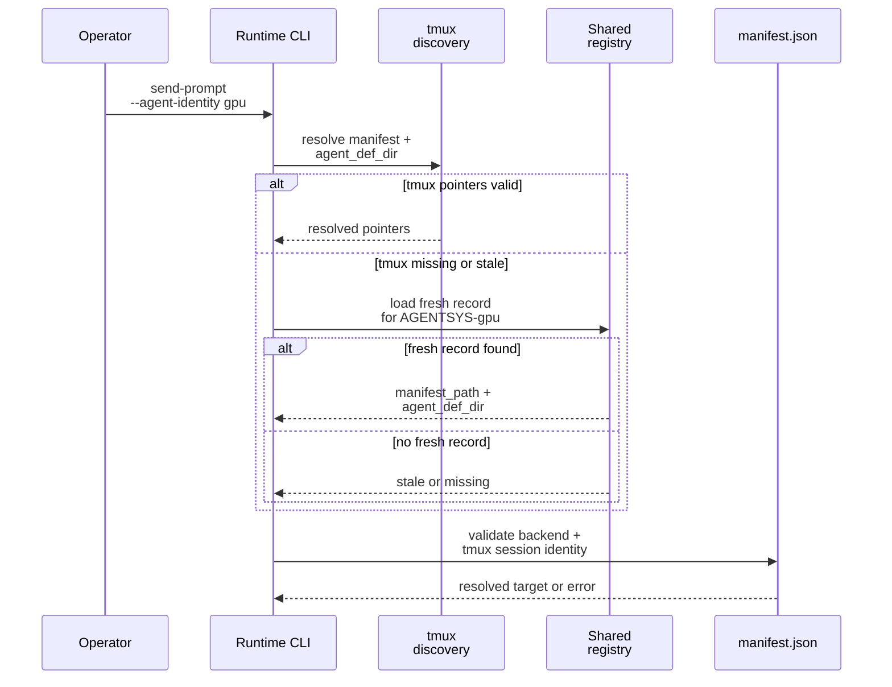
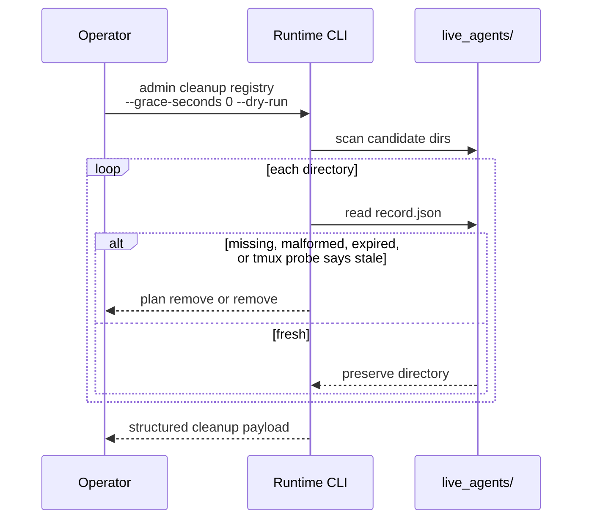

# Shared Registry Discovery And Cleanup

This page explains the operator-facing behavior of the shared registry: when the runtime uses it for name-based discovery, how fallback interacts with tmux-local pointers, and what `houmao-mgr admin cleanup registry` actually removes. The older `houmao-mgr admin cleanup-registry` spelling remains as a compatibility alias, but the grouped `admin cleanup ...` tree is the canonical documented path.

## Mental Model

The runtime does not lead with the shared registry. It leads with tmux-local discovery and uses the registry as the recovery path when tmux-local pointers are missing or stale.

That gives the current tmux session environment first say when it is healthy, while still letting the runtime recover sessions that live under different runtime roots.

## Name-Based Discovery Order

For name-addressed tmux-backed control such as `send-prompt`, `send-keys`, `mail`, and `stop-session`, the current order is:

1. normalize the input to canonical `AGENTSYS-...` form,
2. try tmux-local discovery first,
3. fall back to the shared registry when tmux-local discovery is unavailable,
4. validate the resolved manifest and agent-definition pointers before resuming control.

Path-like manifest identities do not use the shared registry. They go straight to the addressed `manifest.json`.

## What Counts As Fallback-Eligible

The shared registry is used when tmux-local discovery cannot give the runtime a valid target.

Current fallback-eligible cases include:

- the tmux session does not exist,
- `AGENTSYS_MANIFEST_PATH` is missing or blank,
- `AGENTSYS_MANIFEST_PATH` points to a missing manifest,
- `AGENTSYS_AGENT_DEF_DIR` is missing or blank,
- `AGENTSYS_AGENT_DEF_DIR` points to a missing directory.

Hard mismatches still fail fast instead of silently falling back:

- a manifest whose persisted tmux session identity does not match the addressed agent,
- a non-tmux-backed manifest reached through name-based resolution,
- explicitly invalid absolute-path requirements after a fresh registry record is loaded.

## Discovery Fallback Walkthrough



The key idea is that registry fallback still ends with manifest validation. The registry helps the runtime find the candidate session; it does not skip the final integrity checks.

## Operator Examples

Use canonical or unprefixed names interchangeably:

```bash
pixi run python -m houmao.agents.realm_controller send-prompt \
  --agent-identity gpu \
  --prompt "Summarize the current plan"

pixi run python -m houmao.agents.realm_controller stop-session \
  --agent-identity AGENTSYS-gpu
```

Use an explicit registry root for isolated environments:

```bash
AGENTSYS_GLOBAL_REGISTRY_DIR=/abs/path/tmp/registry \
pixi run python -m houmao.agents.realm_controller send-prompt \
  --agent-identity gpu \
  --prompt "hello"
```

## Cleanup Semantics

`houmao-mgr admin cleanup registry` is the operator-facing janitor for stale `live_agents/` directories.

Default behavior:

- scan the effective `live_agents/` directory,
- remove directories whose `record.json` is missing,
- remove directories whose `record.json` is malformed,
- remove directories whose record lease expired longer ago than the grace period,
- optionally classify lease-fresh tmux-backed records as stale when `--probe-local-tmux` is set and the named tmux session is absent on the local host,
- preserve fresh directories,
- continue past per-directory removal failures and report them separately,
- report one structured cleanup payload with `scope`, `resolution`, `planned_actions`, `applied_actions`, `blocked_actions`, `preserved_actions`, and summary counters.

Examples:

```bash
pixi run houmao-mgr admin cleanup registry
pixi run houmao-mgr admin cleanup registry --grace-seconds 0 --dry-run
pixi run houmao-mgr admin cleanup registry --probe-local-tmux
```

Representative result:

```json
{
  "dry_run": true,
  "grace_seconds": 0,
  "planned_agent_ids": ["<expired-agent-id>"],
  "planned_actions": [
    {
      "artifact_kind": "registry_live_agent_record",
      "details": {
        "agent_id": "<expired-agent-id>"
      },
      "path": "/abs/path/registry/live_agents/<expired-agent-id>",
      "proposed_action": "remove",
      "reason": "record lease expired beyond the cleanup grace period"
    }
  ],
  "preserved_agent_ids": ["<fresh-agent-id>"],
  "probe_local_tmux": true,
  "registry_root": "/abs/path/registry",
  "resolution": {
    "authority": "registry_root",
    "probe_local_tmux": true
  },
  "scope": {
    "grace_seconds": 0,
    "kind": "registry_cleanup",
    "registry_root": "/abs/path/registry"
  },
  "summary": {
    "applied_count": 0,
    "blocked_count": 0,
    "failed_count": 0,
    "planned_count": 1,
    "preserved_count": 1,
    "removed_count": 0
  }
}
```

Interpret the buckets like this:

- `planned_actions` and `planned_agent_ids`: stale state that would be deleted when `--dry-run` is removed,
- `applied_actions` and `removed_agent_ids`: stale state that was successfully deleted,
- `preserved_agent_ids`: directories that still represent fresh live records,
- `blocked_actions` and `failed_agent_ids`: stale directories that cleanup wanted to delete but could not remove.

## Cleanup Walkthrough



## Current Implementation Notes

- `houmao-mgr admin cleanup registry` does not make currently live records go away just because the directory exists; lease freshness remains the deciding signal unless `--probe-local-tmux` is explicitly enabled and the record points at a missing local tmux session.
- A malformed record is treated as stale for lookup and as removable for cleanup.
- The cleanup command uses the same effective root-resolution logic as publication and lookup, so `AGENTSYS_GLOBAL_REGISTRY_DIR` changes all three paths together.
- `houmao-mgr admin cleanup-registry` remains available as a compatibility alias for operators or tests that still use the pre-grouped spelling.

## Source References

- [`src/houmao/agents/realm_controller/cli.py`](../../../../src/houmao/agents/realm_controller/cli.py)
- [`src/houmao/agents/realm_controller/registry_storage.py`](../../../../src/houmao/agents/realm_controller/registry_storage.py)
- [`src/houmao/agents/realm_controller/runtime.py`](../../../../src/houmao/agents/realm_controller/runtime.py)
- [`tests/unit/agents/realm_controller/test_registry_storage.py`](../../../../tests/unit/agents/realm_controller/test_registry_storage.py)
- [`tests/unit/agents/realm_controller/test_runtime_agent_identity.py`](../../../../tests/unit/agents/realm_controller/test_runtime_agent_identity.py)
