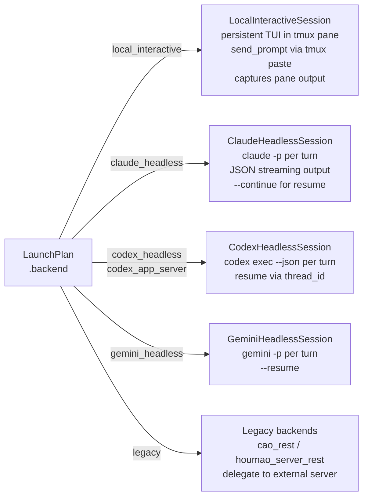

# Backends

All agent sessions in Houmao are executed by a backend. Each backend implements the `InteractiveSession` protocol, providing a uniform interface for prompt delivery, interruption, and termination regardless of the underlying agent tool or execution mode.

The canonical backend list is defined by the `BackendKind` literal type in `src/houmao/agents/realm_controller/models.py`. Adding a new backend requires updating `BackendKind`, wiring the backend through `launch_plan.py`, and implementing the `InteractiveSession` protocol.

## BackendKind

```python
BackendKind = Literal[
    "local_interactive",
    "claude_headless",
    "codex_headless",
    "gemini_headless",
    "codex_app_server",
    "cao_rest",
    "houmao_server_rest",
]
```

## Backend dispatch



## Backend reference

### local_interactive (primary)

**Source:** `backends/local_interactive.py`

The primary backend for interactive agent sessions. The agent runs as a real interactive CLI process inside a tmux pane, preserving the tool's native user experience (colors, interactive prompts, streaming output).

- **Session class:** `LocalInteractiveSession`
- **Prompt delivery:** via tmux paste-buffer, which simulates typing the prompt into the agent's stdin.
- **Role injection:** bootstrap message sent as the first-turn prompt (see [Role Injection](role-injection.md)).
- **Use case:** development, debugging, and any workflow where direct interactive access to the agent is valuable.

### claude_headless

**Source:** `backends/claude_headless.py`

Runs Claude Code CLI in headless mode (`claude -p --verbose`). Output is captured programmatically rather than displayed in an interactive terminal.

- **Session class:** `ClaudeHeadlessSession` (extends `HeadlessInteractiveSession`)
- **Resume:** `--continue` flag to resume a previous conversation.
- **Role injection:** when the role prompt is non-empty, Houmao passes `--append-system-prompt <prompt>` and sends one bootstrap message on the first turn. Empty prompts skip both startup inputs.
- **Use case:** automated pipelines, batch processing, and non-interactive agent orchestration.

### codex_headless

**Source:** `backends/codex_headless.py`

Runs Codex CLI in headless mode (`codex exec --json`). Produces structured JSON output for programmatic consumption.

- **Session class:** `CodexHeadlessSession` (extends `HeadlessInteractiveSession`)
- **Resume:** `resume <thread_id>` command to continue a previous thread.
- **Role injection:** when the role prompt is non-empty, Houmao passes `-c developer_instructions=<prompt>`. Empty prompts skip the developer-instructions flag.
- **Use case:** automated pipelines, structured output processing, and non-interactive agent orchestration.

### gemini_headless

**Source:** `backends/gemini_headless.py`

Runs Gemini CLI in headless mode (`gemini -p`).

- **Session class:** `GeminiHeadlessSession` (extends `HeadlessInteractiveSession`)
- **Auth lanes:** managed Gemini homes support `GEMINI_API_KEY` with optional `GOOGLE_GEMINI_BASE_URL`, or OAuth via projected `oauth_creds.json`. OAuth-backed homes inject `GOOGLE_GENAI_USE_GCA=true` when no explicit API-key or Vertex selector is already present.
- **Managed skills:** Houmao-owned Gemini skills project into `.agents/skills`; `.gemini/skills` remains an upstream compatibility path rather than Houmao's target contract.
- **Resume:** `--resume <session_id>` when the session manifest already persists a Gemini session id. Resume stays bound to the same recorded working directory/project context.
- **Role injection:** bootstrap message sent as the first-turn prompt.
- **Use case:** automated pipelines and non-interactive agent orchestration.

#### Gemini validation checklist

- API-key lane: create a Gemini auth bundle with `--api-key` and optional `--base-url`, build or launch a managed Gemini home, and confirm the effective launch environment exports `GEMINI_API_KEY` plus `GOOGLE_GEMINI_BASE_URL` when configured.
- OAuth lane: create a Gemini auth bundle with `oauth_creds.json` only, build or launch a managed Gemini home, and confirm the runtime exports `GOOGLE_GENAI_USE_GCA=true` without depending on a user-global Gemini `settings.json`.
- Skill projection: inspect the constructed home and confirm Houmao-owned Gemini skills land under `.agents/skills/mailbox/...`; treat `.gemini/skills` as compatibility-only.
- First-turn capture: verify the first `stream-json` Gemini turn emits a `session_id` and that Houmao persists that id into the managed session manifest.
- Resume behavior: send a follow-up Gemini prompt from the same working directory and confirm Houmao launches `gemini -p --resume <persisted-session-id>`; changing the working directory should fail explicitly instead of silently retargeting another Gemini project store.

### codex_app_server

**Source:** `backends/codex_app_server.py`

Runs Codex in app-server mode, which exposes a local HTTP interface for communication instead of using stdin/stdout.

- **Role injection:** native developer instructions (same as `codex_headless`).
- **Use case:** scenarios requiring HTTP-based interaction with the Codex agent.

### cao_rest (legacy)

**Source:** `backends/cao_rest.py`

Legacy backend that delegates session management to an external server via REST API. Planned for removal.

- **Role injection:** profile-based injection via the external server.
- **Note:** standalone operator use of `backend='cao_rest'` is retired in favor of `houmao-server` + `houmao-mgr`.

### houmao_server_rest (legacy)

**Source:** `backends/houmao_server_rest.py`

Legacy server-backed path that wraps `cao_rest` internally, routing through the Houmao server layer.

- **Role injection:** profile-based injection via the server.
- **Note:** this backend exists for backward compatibility and is expected to be consolidated with the newer `houmao-server` architecture.

## Headless backend base class

The three headless backends (`claude_headless`, `codex_headless`, `gemini_headless`) share a common base class: `HeadlessInteractiveSession`.

This base class manages:

- **tmux-backed process execution:** even in headless mode, the agent process runs inside a tmux pane for uniform process management, signal delivery, and output capture.
- **Resumable session state** via `HeadlessSessionState`, which tracks:
  - `session_id` — backend-specific session/thread identifier for resume.
  - `turn_index` — number of prompt turns completed in this session.
  - `role_bootstrap_applied` — whether the first-turn role bootstrap message has been delivered.

This shared infrastructure ensures consistent behavior across headless backends for concerns like process lifecycle, output buffering, and session persistence.

## InteractiveSession protocol

All backends implement the `InteractiveSession` protocol:

```python
class InteractiveSession(Protocol):
    def send_prompt(self, prompt: str) -> list[SessionEvent]: ...
    def interrupt(self) -> SessionControlResult: ...
    def terminate(self) -> SessionControlResult: ...
    def close(self) -> None: ...
```

See [Session Lifecycle](session-lifecycle.md) for details on how the protocol is used.

## See also

- [Launch Plan](launch-plan.md) — how backend-specific launch plans are composed
- [Role Injection](role-injection.md) — per-backend role injection strategies
- [Session Lifecycle](session-lifecycle.md) — how backends are used within the session lifecycle
