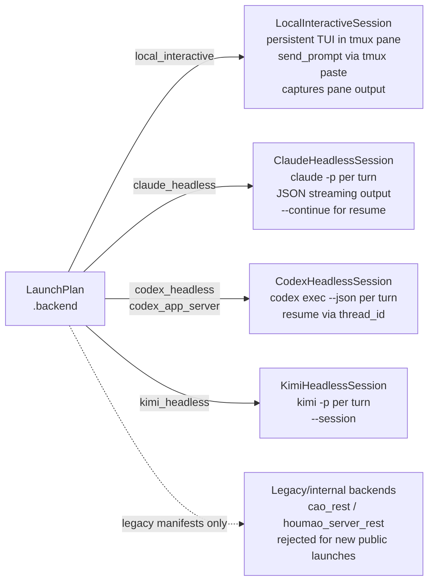

# Backends

All agent sessions in Houmao are executed by a backend. Each backend implements the `InteractiveSession` protocol, providing a uniform interface for prompt delivery, interruption, and termination regardless of the underlying agent tool or execution mode.

The canonical backend list is defined by the `BackendKind` literal type in `src/houmao/agents/realm_controller/models.py`. Adding a new backend requires updating `BackendKind`, wiring the backend through `launch_plan.py`, and implementing the `InteractiveSession` protocol.

## BackendKind

```python
BackendKind = Literal[
    "local_interactive",
    "claude_headless",
    "codex_headless",
    "kimi_headless",
    "codex_app_server",
    "cao_rest",
    "houmao_server_rest",
]
```

## Backend dispatch



## Backend reference

### local_interactive (primary)

**Source:** `backends/local_interactive.py`

The primary backend for interactive agent sessions. The agent runs as a real interactive CLI process inside a tmux pane, preserving the tool's native user experience (colors, interactive prompts, streaming output). Maintained local interactive tools are Claude Code, Codex, and Kimi Code.

- **Session class:** `LocalInteractiveSession`
- **Prompt delivery:** via tmux paste-buffer with bracketed paste and a separate final submit key.
- **Relaunch continuation:** provider-native startup arguments are applied before respawning the TUI in tmux window `0`.
- **Interrupt:** Escape is the primary interrupt/cancel key for maintained TUI providers, including Kimi Code.
- **Role injection:** tool-dependent; see [Role Injection](role-injection.md).
- **Use case:** development, debugging, and any workflow where direct interactive access to the agent is valuable.

#### Kimi Code local interactive

Kimi local interactive support starts the interactive `kimi` TUI under backend `local_interactive`; it does not reuse or rename `kimi_headless`.

- **Process recognition:** live process inspection treats both `kimi-code` and `kimi` as supported Kimi TUI process names.
- **Role injection:** Kimi TUI uses bootstrap-message or managed auto-skill system-prompt workflows. Houmao does not add an unverified Kimi TUI system-prompt flag.
- **Model selection:** launch-owned Kimi model selection is projected as `--model <alias>` for fresh and resumed Kimi TUI startup.
- **Update suppression:** managed Kimi TUI launches set `KIMI_CODE_NO_AUTO_UPDATE=1` so startup does not stop on the interactive update preflight.
- **Managed skills:** Houmao does not add managed `--skills-dir` arguments to Kimi TUI launches. The maintained `--skills-dir <KIMI_CODE_HOME>/skills` projection remains Kimi headless prompt-mode behavior.
- **Unattended prompt mode:** when launch policy resolves `operator_prompt_mode = unattended`, Kimi TUI startup uses Kimi auto permission mode while remaining visible. Launch policy writes `default_permission_mode = "auto"` for fresh sessions, and the runtime sends `/auto on` after TUI readiness and before role bootstrap or workload prompts. `as_is` leaves provider approval behavior unchanged.
- **Relaunch continuation:** `tool_last_or_new` maps to `kimi --continue`; `exact` maps to `kimi --session <session_id>`. The runtime never uses bare `kimi --session` for managed relaunch because that opens Kimi's interactive picker.
- **Resume conflicts:** resumed Kimi TUI startup cannot combine `--continue` or `--session <session_id>` with `--yolo`, `--auto`, or `--plan`. Houmao rejects that combination before provider start, and unattended resumed sessions refresh auto mode through `/auto on` after readiness instead of adding `--auto` to the startup command. `--model <alias>` remains allowed with resumed startup.

### claude_headless

**Source:** `backends/claude_headless.py`

Runs Claude Code CLI in headless mode (`claude -p --verbose`). Output is captured programmatically rather than displayed in an interactive terminal.

- **Session class:** `ClaudeHeadlessSession` (extends `HeadlessInteractiveSession`)
- **Resume:** `--continue` resumes the provider's latest stored conversation; `--resume <session_id>` resumes an exact provider session.
- **Role injection:** when the role prompt is non-empty, Houmao passes `--append-system-prompt <prompt>` and sends one bootstrap message on the first turn. Empty prompts skip both startup inputs.
- **Use case:** automated pipelines, batch processing, and non-interactive agent orchestration.

### codex_headless

**Source:** `backends/codex_headless.py`

Runs Codex CLI in headless mode (`codex exec --json`). Produces structured JSON output for programmatic consumption.

- **Session class:** `CodexHeadlessSession` (extends `HeadlessInteractiveSession`)
- **Resume:** `resume --last` asks Codex to continue its latest stored chat; `resume <session_id>` resumes an exact provider session.
- **Role injection:** when the role prompt is non-empty, Houmao passes `-c developer_instructions=<prompt>`. Empty prompts skip the developer-instructions flag.
- **Use case:** automated pipelines, structured output processing, and non-interactive agent orchestration.

### kimi_headless

**Source:** `backends/kimi_headless.py`

Runs Kimi Code CLI in prompt mode (`kimi -p <prompt> --output-format stream-json`).

- **Session class:** `KimiHeadlessSession` (extends `HeadlessInteractiveSession`)
- **Auth lanes:** managed Kimi homes use `KIMI_CODE_HOME` and support OAuth material through projected `config.toml` plus `credentials/kimi-code.json`, or env-model material through allowlisted `KIMI_MODEL_*` values.
- **Managed skills:** Houmao-owned Kimi skills project into top-level `skills`, and managed launches pass `--skills-dir <KIMI_CODE_HOME>/skills` so they do not depend on user-global skill discovery.
- **Resume:** `--continue` asks Kimi to continue the latest stored session for the working directory; `--session <session_id>` resumes an exact provider session. Resume stays bound to the same recorded working directory/project context.
- **Role injection:** bootstrap-message or managed auto-skill system-prompt workflow, depending on the resolved launch policy.
- **Use case:** automated pipelines and non-interactive agent orchestration for Kimi Code.

Kimi Code 0.11.0 does not expose a native system-prompt flag. Houmao projects `houmao-auto-system-prompt` into managed Kimi homes, but Kimi users may need to invoke `houmao-auto-system-prompt` manually before substantive chat begins when automatic skill startup has not loaded the Houmao system prompt.

#### Kimi validation checklist

- OAuth lane: create or import a Kimi auth bundle with `config.toml` and `credentials/kimi-code.json`, build or launch a managed Kimi home, and confirm `KIMI_CODE_HOME` points at that constructed home.
- Env-model lane: create a Kimi auth bundle with `KIMI_MODEL_NAME` and `KIMI_MODEL_API_KEY`, build or launch a managed Kimi home, and confirm those env vars are exported without depending on user-global `~/.kimi-code`.
- Skill projection: inspect the constructed home and confirm selected and Houmao-owned skills land under `skills/`.
- First-turn capture: verify the first `stream-json` Kimi turn emits a `session.resume_hint` event and that Houmao persists its `session_id` into the managed session manifest.
- Resume behavior: send a follow-up Kimi prompt from the same working directory and confirm Houmao launches `kimi --session <persisted-session-id> -p <prompt> --output-format stream-json`; changing the working directory should fail explicitly.
- Local-interactive unattended posture: launch a Kimi TUI session with `operator_prompt_mode = unattended` and confirm the launch plan records the Kimi auto refresh, the runtime submits `/auto on` before managed prompts, and no raw `--auto` or `--yolo` startup flag is required.

### codex_app_server

**Source:** `backends/codex_app_server.py`

Runs Codex in app-server mode, which exposes a local HTTP interface for communication instead of using stdin/stdout.

- **Role injection:** native developer instructions (same as `codex_headless`).
- **Use case:** scenarios requiring HTTP-based interaction with the Codex agent.

### cao_rest (legacy/internal)

**Source:** `backends/cao_rest.py`

Legacy backend that delegated session management to an external REST API. Public operator starts for this backend are retired and fail with migration guidance.

- **Role injection:** profile-based injection via the external server.
- **Note:** standalone operator use of `backend='cao_rest'` is retired in favor of maintained `houmao-mgr` local/headless flows and `houmao-passive-server` API workflows.

### houmao_server_rest (legacy/internal)

**Source:** removed public backend implementation; retained manifests are rejected before new session creation.

Legacy old-server-backed path. New runtime manifests with this backend are not supported.

- **Role injection:** profile-based injection via the server.
- **Note:** use maintained local/headless runtime backends or passive-server-owned headless launch APIs.

## Headless backend base class

The maintained native headless backends (`claude_headless`, `codex_headless`, `kimi_headless`) share a common base class: `HeadlessInteractiveSession`.

This base class manages:

- **tmux-backed process execution:** even in headless mode, the agent process runs inside a tmux pane for uniform process management, signal delivery, and output capture.
- **Resumable session state** via `HeadlessSessionState`, which tracks:
  - `session_id` — backend-specific session/thread identifier for resume.
  - `turn_index` — number of prompt turns completed in this session.
  - `role_bootstrap_applied` — whether the first-turn role bootstrap message has been delivered.

This shared infrastructure ensures consistent behavior across headless backends for concerns like process lifecycle, output buffering, and session persistence.

## Relaunch Chat-Session Mapping

Tmux-backed relaunch accepts a relaunch-only chat-session selector. It does not affect first launch and is distinct from gateway prompt-control chat-session selectors.

| Tool | Local interactive latest | Local interactive exact | Native headless latest | Native headless exact |
| --- | --- | --- | --- | --- |
| Claude Code | `claude --continue` | `claude --resume <session_id>` | `claude -p --continue <prompt>` | `claude -p --resume <session_id> <prompt>` |
| Codex | `codex resume --last` | `codex resume <session_id>` | `codex exec resume --last <prompt>` | `codex exec resume <session_id> <prompt>` |
| Kimi Code | `kimi --continue` | `kimi --session <session_id>` | `kimi --continue -p <prompt>` | `kimi --session <session_id> -p <prompt>` |

When the relaunch selector is omitted, the runtime uses `new` and starts a fresh provider chat. When a local interactive relaunch resumes an existing provider chat, bootstrap-message role injection is not replayed into that chat.

## InteractiveSession protocol

All backends implement the `InteractiveSession` protocol:

```python
class InteractiveSession(Protocol):
    def send_prompt(self, prompt: str) -> list[SessionEvent]: ...
    def interrupt(self) -> SessionControlResult: ...
    def terminate(self) -> SessionControlResult: ...
    def close(self) -> None: ...
```

See [Session Lifecycle](session-lifecycle.md) for details on how the protocol is used.

## See also

- [Launch Plan](launch-plan.md) — how backend-specific launch plans are composed
- [Role Injection](role-injection.md) — per-backend role injection strategies
- [Session Lifecycle](session-lifecycle.md) — how backends are used within the session lifecycle
