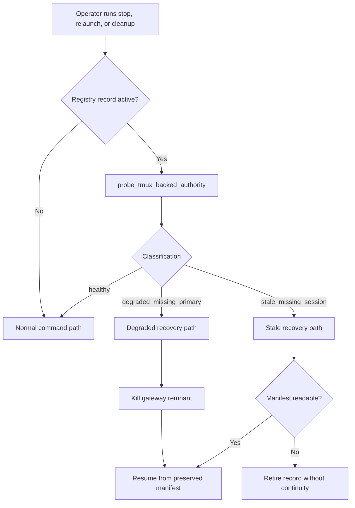

# Degraded and Stale Active Recovery

Module: `src/houmao/agents/realm_controller/backends/tmux_runtime.py` — Tmux-backed authority health probing.

When a managed agent's registry record claims `active` but the underlying tmux session is broken, Houmao routes `agents stop`, `agents relaunch`, and `agents cleanup` through dedicated recovery helpers rather than failing with a generic unusable-target error. This page documents the probe-first dispatch model and the recovery paths for each classification.

## When recovery triggers

Recovery runs automatically when a CLI command targets a local tmux-backed managed agent whose registry record is `active` but tmux inspection reveals a broken session. The affected commands are:

- `houmao-mgr agents stop`
- `houmao-mgr agents relaunch`
- `houmao-mgr agents cleanup session --purge-registry`

The runtime probes the tmux session before acting. No new persisted lifecycle states are added; the probe result is host-local runtime state derived from tmux inspection and is never written to the shared registry.

## Probe classification

`probe_tmux_backed_authority(session_name)` inspects tmux for the named session and the contractual primary surface (window index `0`, pane index `0`), then returns a `TmuxBackedAuthorityHealth` classification:

| State | tmux session | Window `0` | Pane `0` | Meaning |
|-------|-------------|------------|----------|---------|
| `healthy` | exists | present | present | Session is fully operational. |
| `degraded_missing_primary` | exists | may exist | missing | The tmux session survives but the primary pane is missing or unresponsive. A gateway remnant may still be running. |
| `stale_missing_session` | missing | missing | missing | The tmux session is entirely gone. |

## Recovery flow

## Recovery paths

### Degraded (`degraded_missing_primary`)

The tmux session exists but the primary pane is missing. A gateway remnant may still be alive.

**`agents stop`:**
1. Kills the surviving gateway remnant by cleaning up the tmux session.
2. If the preserved manifest authority is readable, resumes the stopped controller from the record and retires the registry record.
3. If the manifest authority is unreadable, retires the record without continuity.

**`agents relaunch`:**
1. Kills the gateway remnant by cleaning up the tmux session.
2. Resumes the stopped controller from the preserved manifest.
3. Revives the stopped session through the normal startup path, rebuilding the primary surface and reprovisioning the gateway.
4. If the manifest authority is unreadable, fails with an explicit error directing the operator to `agents stop` followed by fresh `agents launch`.

### Stale (`stale_missing_session`)

The tmux session is entirely missing.

**`agents stop`:**
1. If the preserved manifest authority is readable, resumes the stopped controller from the record and retires the registry record.
2. If the manifest authority is unreadable, retires the record without continuity.

**`agents relaunch`:**
1. If the preserved manifest authority is readable, resumes the stopped controller and revives the session.
2. If the manifest authority is unreadable, fails with an explicit error directing the operator to `agents stop` followed by fresh `agents launch`.

## Cleanup integration

`agents cleanup session --purge-registry` is the destructive lifecycle step for confirmed broken active local authority. When `--purge-registry` is used:

- The command probes tmux to confirm the session is degraded or stale.
- After successful session-root removal (or validated absence), it deletes the lifecycle record entirely rather than retiring it.

This flag is intended for operators who have confirmed through tmux inspection that the session is unrecoverable and want to remove all traces of the record. The default `agents cleanup session` behavior (without `--purge-registry`) retires stopped records after removal, preserving relaunchability when possible.

## See also

- [Session Lifecycle](session-lifecycle.md) — start, resume, prompt, stop, and relaunch
- [Managed Agent API](../managed_agent_api.md) — direct agent control API surface
- [Registry Discovery and Cleanup](../registry/operations/discovery-and-cleanup.md) — registry maintenance commands
