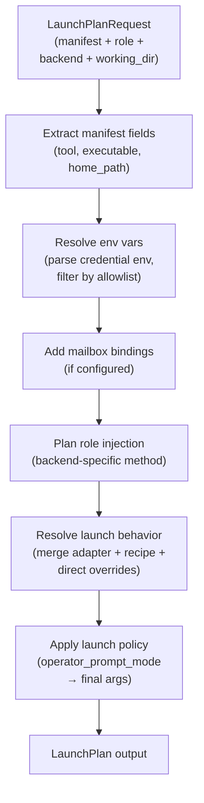

# Launch Plan

Module: `src/houmao/agents/realm_controller/launch_plan.py` — Launch-plan composition for brain + role inputs.

The launch plan is the bridge between Houmao's build phase and run phase. It takes a built brain manifest and a role package, resolves environment variables, merges launch overrides, binds mailbox configuration, and produces a fully resolved, backend-specific plan that a session backend can execute directly.

For operator prompt policy, the launch plan consumes the manifest's resolved `launch_policy.operator_prompt_mode` intent. Current builds resolve omission to `unattended`, while `as_is` means launch-plan composition leaves provider startup posture untouched.

## Resolution pipeline



## LaunchPlanRequest

`LaunchPlanRequest` is a frozen dataclass that captures everything needed to compose a launch plan.

| Field | Type | Description |
|---|---|---|
| `brain_manifest` | `dict[str, Any]` | Loaded brain manifest (output of the build phase) |
| `role_package` | `RolePackage` | Loaded role prompt containing `role_name`, `system_prompt`, and `path` |
| `backend` | `BackendKind` | Target backend for the session |
| `working_directory` | `Path` | Working directory for the agent process |
| `mailbox` | `MailboxResolvedConfig \| None` | Optional resolved mailbox configuration for inter-agent messaging |
| `intent` | `LaunchPolicyApplicationKind` | Launch intent; defaults to `"provider_start"` |

## build_launch_plan

```python
def build_launch_plan(request: LaunchPlanRequest) -> LaunchPlan
```

Composes a backend-specific launch plan from the given request. The function performs the following steps:

1. **Resolves allowlisted environment variables** from the brain home directory, ensuring only declared env vars are propagated to the agent process.
2. **Merges launch overrides** from the brain manifest with backend-specific typed-parameter translation (e.g., translating generic override keys into CLI flags appropriate for the target backend).
3. **Binds mailbox configuration** when inter-agent messaging is requested.
4. **Applies the role injection strategy** appropriate for the target backend (see [Role Injection](role-injection.md)).

The result is a fully resolved `LaunchPlan` that a backend can execute without further interpretation. The runtime `LaunchPlan` is derived and ephemeral; it is **not** a user-authored object and is not persisted as project-local source.

### Launch-profile inputs flow through the manifest

When a managed agent was launched from a reusable launch profile (either an easy `project easy profile` or an explicit `project agents launch-profiles`), the build manifest carries launch-profile-derived inputs into run-phase resolution. At minimum, the following profile-owned values reach the manifest before `build_launch_plan` consumes it:

- effective auth selection (by bundle name; secrets remain in the auth bundle, never inline),
- operator prompt-mode intent (`unattended` or `as_is`),
- durable non-secret env records,
- declarative mailbox configuration (transport, root, address, principal, Stalwart-only fields when applicable),
- managed-agent identity defaults (`agent_name`, optionally `agent_id`),
- the **effective launch prompt** — prompt composition happens in this order: source role prompt, launch-profile prompt overlay resolution, launch-owned appendix append when present, structured render into `<houmao_system_prompt>`, then backend-specific role injection. The runtime does not replay the overlay, appendix, or managed header later as separate bootstrap steps on resumed turns.
- secret-free `inputs.houmao_system_prompt_layout` metadata describing the rendered structured prompt layout for new builds.

The build manifest and the resulting runtime launch metadata also preserve secret-free **launch-profile provenance** sufficient for inspection and replay: the source lane (specialist or recipe), the birth-time lane (`easy_profile` or `launch_profile`), and the originating profile name when available. Inspection commands such as `houmao-mgr agents state`, `houmao-mgr agents list`, and the easy `houmao-mgr project easy instance get|list` surfaces report that provenance.

For the shared conceptual model that ties launch profiles to this run-phase composition step, see [Launch Profiles](../../getting-started/launch-profiles.md).

## LaunchPlan

`LaunchPlan` is a frozen dataclass representing the fully resolved, ready-to-execute launch configuration.

| Field | Type | Description |
|---|---|---|
| `backend` | `BackendKind` | Target backend |
| `tool` | `str` | Agent tool name (e.g., `"codex"`, `"claude"`, `"gemini"`) |
| `executable` | `str` | Resolved executable path or command |
| `args` | `list[str]` | Command-line arguments for the agent process |
| `working_directory` | `Path` | Working directory for the agent process |
| `home_env_var` | `str` | Environment variable name pointing to the runtime home (e.g., `CODEX_HOME`) |
| `home_path` | `Path` | Absolute path to the runtime home directory |
| `env` | `dict[str, str]` | Effective launch environment — contains secrets in-memory only, never persisted |
| `env_var_names` | `list[str]` | Names of environment variables set in `env` (for auditing without exposing values) |
| `role_injection` | `RoleInjectionPlan` | Backend-specific role injection plan (see [Role Injection](role-injection.md)) |
| `metadata` | `dict[str, Any]` | Additional metadata carried through from the brain manifest. When the launch came from a reusable launch profile, this carries secret-free launch-profile provenance — at minimum the profile name, the profile lane (`easy_profile` or `launch_profile`), the source kind (`specialist` or `recipe`), and prompt-overlay metadata. |
| `mailbox` | `MailboxResolvedConfig \| None` | Resolved mailbox configuration, if any |
| `launch_policy_provenance` | `LaunchPolicyProvenance \| None` | Provenance information for the applied launch policy |

### Security note

The `env` dictionary contains secret values (API keys, tokens) resolved at launch time. These values exist only in memory and are passed directly to the agent process environment. They are intentionally excluded from persisted manifests and logs.

## backend_for_tool

```python
def backend_for_tool(
    tool: str,
    prefer_cao: bool = False,
    prefer_local_interactive: bool = False,
) -> BackendKind
```

Returns the default backend for a given tool name.

**Default mapping:**

| Tool | Default Backend |
|---|---|
| `codex` | `codex_headless` |
| `claude` | `claude_headless` |
| `gemini` | `gemini_headless` |

**Override behavior:**

- When `prefer_local_interactive=True`, returns `local_interactive` for all tools. This routes the agent through a tmux-backed interactive session instead of the tool's native headless mode.
- When `prefer_cao=True`, returns `cao_rest` (legacy server-backed path).

## See also

- [Backends](backends.md) — backend implementations that execute a `LaunchPlan`
- [Role Injection](role-injection.md) — how role prompts are delivered per backend
- [Session Lifecycle](session-lifecycle.md) — how launch plans are used to start and resume sessions
