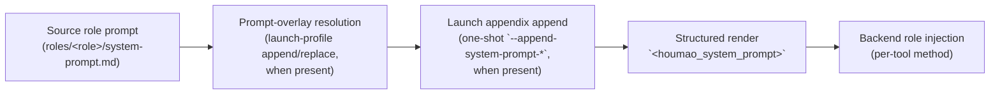

# Managed Launch Prompt Header

The **managed launch prompt header** is a deterministic Houmao-owned prompt region that is rendered into every managed launch's effective prompt by default. For launches that use the current structured prompt contract, the effective prompt is rooted at `<houmao_system_prompt>` and the header lives inside a top-level `<managed_header>` section with individually controlled child sections. By default it identifies the agent as Houmao-managed, names `houmao-mgr` as the canonical interface, tells the model to prefer Houmao-supported workflows when the task touches managed runtime, gateway, mailbox, or lifecycle behavior, and records that the launch is running in automated mode.

This page documents what the header is, when it is added, how it composes with the rest of the launch prompt, and how to opt out per launch or via stored launch profiles.

## What the Header Contains

The header text is rendered by `render_managed_prompt_header()` in [`src/houmao/agents/managed_prompt_header.py`](../../../src/houmao/agents/managed_prompt_header.py) and is stable across launches. `compose_managed_launch_prompt_payload()` wraps that text into the shared `<houmao_system_prompt>` layout, for example:

```xml
<houmao_system_prompt version="1">
<managed_header>
<identity>
...
</identity>
<houmao_runtime_guidance>
...
</houmao_runtime_guidance>
<automation_notice>
...
</automation_notice>
</managed_header>
<prompt_body>
...
</prompt_body>
</houmao_system_prompt>
```

The header has five stable policy sections. CLI and stored-profile policy use the hyphenated section names; the rendered prompt uses the XML-like tags:

| Policy section | Rendered tag | Default | Content |
|---|---|---|---|
| `identity` | `<identity>` | enabled | States that the agent is Houmao-managed and includes the resolved managed-agent name and id. |
| `houmao-runtime-guidance` | `<houmao_runtime_guidance>` | enabled | Tells the agent to prefer bundled Houmao workflows, `houmao-mgr`, Houmao-owned manifests, runtime metadata, and supported service interfaces for Houmao-managed work. |
| `automation-notice` | `<automation_notice>` | enabled | States that the agent is in fully automated mode, prohibits interactive user-question tools, and directs mailbox-driven clarification to reply-enabled mailbox threads when available. |
| `task-reminder` | `<task_reminder>` | disabled | Instructs long-running mailbox-style work to create a short gateway reminder and clear it when the final action is complete. |
| `mail-ack` | `<mail_ack>` | disabled | Instructs mailbox-driven work to send a concise acknowledgement to the reply-enabled address before substantive work. |

The structured prompt is part of the prompt body delivered to the underlying CLI tool. It is not a separate transport channel, RPC, or out-of-band signal. The model sees it the same way it would see any other system prompt content.

The header is versioned. The current header version is `MANAGED_PROMPT_HEADER_VERSION = 1`, and the current structured prompt-layout version is `HOUMAO_SYSTEM_PROMPT_LAYOUT_VERSION = 1`. Both are recorded through secret-free manifest metadata so future prompt changes can be tracked through build provenance.

## Why the Header Exists

Without the header, every Houmao-managed agent would have to be told the same baseline facts through its role prompt or skill content: that it is managed, what its managed name and id are, that there is a canonical CLI for direct system interaction, and that ad-hoc tmux probing or filesystem snooping is the wrong path when a supported Houmao interface exists. Repeating that across roles is fragile, and skipping it produces agents that either reinvent management primitives or miss them entirely.

The managed header centralizes that baseline. It is short on purpose so it does not crowd out the role prompt, and it is opt-out per launch so a few specialized roles can run without it when needed.

## Prompt Composition Order

The managed header now participates in a section-based prompt composer. The full composition order is:



1. **Source role prompt.** The role's `system-prompt.md` content is loaded as the base prompt.
2. **Prompt-overlay resolution.** When the resolved launch profile carries a prompt overlay, it is composed onto the base prompt with mode `append` or `replace`. Append concatenates with a blank-line separator; replace substitutes the overlay text.
3. **Launch appendix append.** When `houmao-mgr agents launch` or `houmao-mgr project easy instance launch` receives `--append-system-prompt-text` or `--append-system-prompt-file`, that one-shot appendix is appended after overlay resolution for the current launch only. It never rewrites the source role prompt or a stored profile.
4. **Structured render.** Houmao renders the effective prompt into `<houmao_system_prompt>`. When the whole header is enabled and at least one section is enabled, `<managed_header>` appears before `<prompt_body>` and contains enabled child sections in this fixed order: `<identity>`, `<houmao_runtime_guidance>`, `<automation_notice>`, `<task_reminder>`, `<mail_ack>`. Inside `<prompt_body>`, section order is `<role_prompt>`, `<launch_profile_overlay>`, and `<launch_appendix>` when those sections participate. If overlay mode is `replace`, `<role_prompt>` is omitted.
5. **Backend role injection.** The per-backend role-injection plan delivers that final composed prompt to the underlying CLI tool. See [Role Injection](role-injection.md) for the per-backend mechanism (`native_developer_instructions`, `native_append_system_prompt`, `bootstrap_message`, etc.).

The composition is implemented by `compose_managed_launch_prompt_payload()` and `compose_managed_launch_prompt()` in `managed_prompt_header.py`. When no header or prompt-body sections participate, the rendered effective prompt is empty.

## Default Policy and Per-Launch Overrides

The whole managed header is **enabled by default** for every managed launch. The launch-resolution helper `resolve_managed_prompt_header_decision()` walks three sources in order:

1. **Launch-time override** — `--managed-header` and `--no-managed-header` on the launch command. They are mutually exclusive and win over everything else for the current launch only.
2. **Stored launch-profile policy** — when a launch profile is being resolved and it stores `managed_header_policy: enabled` or `managed_header_policy: disabled`, that value is used.
3. **Default** — when neither a launch-time override nor a stored profile policy is present (or the stored value is `inherit`), the resolution falls back to the default-on behavior.

The decision is recorded as `ManagedPromptHeaderDecision.resolution_source` (one of `launch_override`, `launch_profile`, or `default`) and stored in the manifest's managed-header metadata for later inspection.

Managed-header sections have their own policy resolution through `resolve_managed_prompt_header_section_decisions()`. For each section, resolution uses the same precedence shape:

1. **Launch-time section override** — repeatable `--managed-header-section SECTION=enabled|disabled` on the launch command.
2. **Stored launch-profile section policy** — the selected launch profile's `managed_header_section_policy` mapping.
3. **Section default** — `identity`, `houmao-runtime-guidance`, and `automation-notice` default enabled; `task-reminder` and `mail-ack` default disabled.

The whole-header decision remains the outer render gate. If `--no-managed-header` disables the whole header, enabled section policy is still recorded in metadata but none of those sections render into the prompt for that launch.

The launch-time flags are exposed on every supported managed launch surface:

| Command | Per-launch flags | Notes |
|---|---|---|
| `houmao-mgr agents launch` | `--managed-header` / `--no-managed-header`, repeatable `--managed-header-section SECTION=enabled|disabled` | Whole-header flags are mutually exclusive and win over the resolved launch profile when one is selected. Section overrides are one-shot and win over stored section policy for the named section only. |
| `houmao-mgr project easy instance launch` | `--managed-header` / `--no-managed-header`, repeatable `--managed-header-section SECTION=enabled|disabled` | Whole-header flags are mutually exclusive and win over the stored easy-profile policy when launching from `--profile`. Section overrides are one-shot and win over stored section policy for the named section only. |

Those same launch surfaces also accept one-shot prompt appendix input through `--append-system-prompt-text` and `--append-system-prompt-file`. Those options are mutually exclusive, append after overlay resolution inside `<prompt_body>`, and do not rewrite stored launch profiles or easy profiles.

For full flag-level coverage, see the [`houmao-mgr` CLI reference](../cli/houmao-mgr.md) section on `agents launch` source-selector and launch-profile rules.

## Persistence in Stored Launch Profiles

Both lanes of stored launch profiles persist whole-header policy as `managed_header_policy` on the entry. Valid values are `enabled`, `disabled`, and `inherit`; `inherit` is the default when the operator does not select either policy at create time. They also persist optional per-section policy as `managed_header_section_policy`, keyed by the stable section names `identity`, `houmao-runtime-guidance`, `automation-notice`, `task-reminder`, and `mail-ack`. Section policy values are `enabled` or `disabled`; omitted section keys fall back to that section's default.

The stored field interacts with the launch-time flags on three surfaces:

| Stored-policy command | Stored field | Behavior |
|---|---|---|
| `houmao-mgr project agents launch-profiles add` | `--managed-header` / `--no-managed-header`, repeatable `--managed-header-section SECTION=enabled|disabled` | Sets stored whole-header and section policy on a new explicit launch profile. Omitting whole-header flags stores `inherit`; omitting section flags stores no section policy entries. |
| `houmao-mgr project agents launch-profiles set` | `--managed-header` / `--no-managed-header` / `--clear-managed-header`, `--managed-header-section SECTION=enabled|disabled`, `--clear-managed-header-section SECTION`, `--clear-managed-header-sections` | Patches stored whole-header and section policy on an existing launch profile. `--clear-managed-header` resets the whole-header field to `inherit`; section clear flags remove one or all stored section policy entries. |
| `houmao-mgr project easy profile create` | `--managed-header` / `--no-managed-header`, repeatable `--managed-header-section SECTION=enabled|disabled` | Sets stored whole-header and section policy on a new easy profile. Omitting whole-header flags stores `inherit`; omitting section flags stores no section policy entries. |
| `houmao-mgr project easy profile set` | `--managed-header` / `--no-managed-header` / `--clear-managed-header`, `--managed-header-section SECTION=enabled|disabled`, `--clear-managed-header-section SECTION`, `--clear-managed-header-sections` | Patches stored whole-header and section policy on an existing easy profile. |

`--clear-managed-header` is the only way to return a stored field to `inherit` after it has been set explicitly. It does not change the launch-time default-on fallback — it just stops the stored profile from forcing a value.

Section clear flags affect only `managed_header_section_policy`. They do not change the whole-header policy, and clearing a section entry means future launches return to that section's default unless a launch-time override supplies a value.

For the shared profile model that ties easy profiles to explicit launch profiles, see [Launch Profiles](../../getting-started/launch-profiles.md).

## Resolution Examples

The whole-header decision matrix is small enough to enumerate:

| Launch-time flag | Stored policy | Resolved | `resolution_source` |
|---|---|---|---|
| `--managed-header` | any | enabled | `launch_override` |
| `--no-managed-header` | any | disabled | `launch_override` |
| (none) | `enabled` | enabled | `launch_profile` |
| (none) | `disabled` | disabled | `launch_profile` |
| (none) | `inherit` or absent | enabled | `default` |

The launch-time flags never rewrite the stored policy. A `--no-managed-header` launch from a profile that stores `enabled` disables the header for that one launch and leaves the stored profile untouched.

Section policy resolves independently for each section:

| Launch-time section flag | Stored section policy | Resolved section | `resolution_source` |
|---|---|---|---|
| `--managed-header-section automation-notice=enabled` | any | enabled | `launch_override` |
| `--managed-header-section automation-notice=disabled` | any | disabled | `launch_override` |
| (none) | `automation-notice: enabled` | enabled | `launch_profile` |
| (none) | `automation-notice: disabled` | disabled | `launch_profile` |
| (none) | absent | section default | `default` |

For example, a stored profile can disable only `automation-notice` while keeping the default `identity` and `houmao-runtime-guidance` sections. A one-shot launch can then restore the notice with `--managed-header-section automation-notice=enabled`, or it can enable the default-off mailbox sections with `--managed-header-section task-reminder=enabled --managed-header-section mail-ack=enabled`.

## Verifying the Header for One Launch

Each managed launch records the resolved managed-header decision in its session manifest. New launches also persist `inputs.houmao_system_prompt_layout`, which records the structured prompt root and section order without storing secrets. To inspect a live or stopped session's manifest-persisted decision, use `houmao-mgr agents state --agent-name <name>` or read the manifest under the runtime home directly. The resolved decision includes whether the whole header was enabled, the resolution source, the stored policy at resolution time, the resolved managed agent name and id used to render the header text, and a `sections` mapping with each section's tag, enabled/rendered state, resolution source, stored policy, and default state.

When troubleshooting whether an agent is acting as if it has the header context, the canonical checks are the manifest-persisted managed-header metadata and, for new launches, the persisted `houmao_system_prompt_layout` section list rather than the live TUI.

## See Also

- [Launch Profiles](../../getting-started/launch-profiles.md) — shared launch-profile model and how easy profiles and explicit launch profiles persist managed-header whole-header and section policy.
- [Role Injection](role-injection.md) — per-backend mechanism that delivers the final composed prompt to the underlying CLI.
- [`houmao-mgr` CLI reference](../cli/houmao-mgr.md) — flag-level coverage of `--managed-header`, `--no-managed-header`, `--managed-header-section`, and the stored-profile clear flags on the launch and launch-profile commands.
