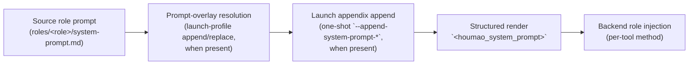

# Managed Launch Prompt Header

The **managed launch prompt header** is a short, deterministic block of Houmao-owned text that is rendered into every managed launch's effective prompt by default. For launches that use the current structured prompt contract, the effective prompt is rooted at `<houmao_system_prompt>` and the header lives inside a top-level `<managed_header>` section. It identifies the agent as Houmao-managed, names `houmao-mgr` as the canonical interface, and tells the model to prefer Houmao-supported workflows when the task touches managed runtime, gateway, mailbox, or lifecycle behavior.

This page documents what the header is, when it is added, how it composes with the rest of the launch prompt, and how to opt out per launch or via stored launch profiles.

## What the Header Contains

The header text is rendered by `render_managed_prompt_header()` in [`src/houmao/agents/managed_prompt_header.py`](../../../src/houmao/agents/managed_prompt_header.py) and is stable across launches. `compose_managed_launch_prompt_payload()` wraps that text into the shared `<houmao_system_prompt>` layout, for example:

```xml
<houmao_system_prompt version="1">
<managed_header>
...
</managed_header>
<prompt_body>
...
</prompt_body>
</houmao_system_prompt>
```

The header content includes:

- a one-line statement that the agent is running as a Houmao-managed agent,
- the resolved managed agent name,
- the resolved managed agent id,
- guidance to prefer bundled Houmao workflows for managed runtime, agent coordination, lifecycle control, mailbox or gateway access, reminders, and system-state discovery,
- guidance to use `houmao-mgr` as the canonical direct interface for interacting with the Houmao system,
- guidance to treat Houmao-owned manifests, runtime metadata, and supported service interfaces as authoritative rather than probing tmux state or unsupported internal paths,
- a closing reminder that ordinary domain work should still proceed normally — the Houmao guidance only applies when the task is actually about managed capabilities.

The structured prompt is part of the prompt body delivered to the underlying CLI tool. It is not a separate transport channel, RPC, or out-of-band signal. The model sees it the same way it would see any other system prompt content.

The header is versioned. The current header version is `MANAGED_PROMPT_HEADER_VERSION = 1`, and the current structured prompt-layout version is `HOUMAO_SYSTEM_PROMPT_LAYOUT_VERSION = 1`. Both are recorded through secret-free manifest metadata so future prompt changes can be tracked through build provenance.

## Why the Header Exists

Without the header, every Houmao-managed agent would have to be told the same baseline facts through its role prompt or skill content: that it is managed, what its managed name and id are, that there is a canonical CLI for direct system interaction, and that ad-hoc tmux probing or filesystem snooping is the wrong path when a supported Houmao interface exists. Repeating that across roles is fragile, and skipping it produces agents that either reinvent management primitives or miss them entirely.

The managed header centralizes that baseline. It is short on purpose so it does not crowd out the role prompt, and it is opt-out per launch so a few specialized roles can run without it when needed.

## Prompt Composition Order

The managed header now participates in a section-based prompt composer. The full composition order is:



1. **Source role prompt.** The role's `system-prompt.md` content is loaded as the base prompt.
2. **Prompt-overlay resolution.** When the resolved launch profile carries a prompt overlay, it is composed onto the base prompt with mode `append` or `replace`. Append concatenates with a blank-line separator; replace substitutes the overlay text.
3. **Launch appendix append.** When `houmao-mgr agents launch` or `houmao-mgr project easy instance launch` receives `--append-system-prompt-text` or `--append-system-prompt-file`, that one-shot appendix is appended after overlay resolution for the current launch only. It never rewrites the source role prompt or a stored profile.
4. **Structured render.** Houmao renders the effective prompt into `<houmao_system_prompt>`. When enabled, `<managed_header>` appears before `<prompt_body>`. Inside `<prompt_body>`, section order is `<role_prompt>`, `<launch_profile_overlay>`, and `<launch_appendix>` when those sections participate. If overlay mode is `replace`, `<role_prompt>` is omitted.
5. **Backend role injection.** The per-backend role-injection plan delivers that final composed prompt to the underlying CLI tool. See [Role Injection](role-injection.md) for the per-backend mechanism (`native_developer_instructions`, `native_append_system_prompt`, `bootstrap_message`, etc.).

The composition is implemented by `compose_managed_launch_prompt_payload()` and `compose_managed_launch_prompt()` in `managed_prompt_header.py`. When no header or prompt-body sections participate, the rendered effective prompt is empty.

## Default Policy and Per-Launch Opt-Out

The managed header is **enabled by default** for every managed launch. The launch-resolution helper `resolve_managed_prompt_header_decision()` walks three sources in order:

1. **Launch-time override** — `--managed-header` and `--no-managed-header` on the launch command. They are mutually exclusive and win over everything else for the current launch only.
2. **Stored launch-profile policy** — when a launch profile is being resolved and it stores `managed_header_policy: enabled` or `managed_header_policy: disabled`, that value is used.
3. **Default** — when neither a launch-time override nor a stored profile policy is present (or the stored value is `inherit`), the resolution falls back to the default-on behavior.

The decision is recorded as `ManagedPromptHeaderDecision.resolution_source` (one of `launch_override`, `launch_profile`, or `default`) and stored in the manifest's managed-header metadata for later inspection.

The launch-time flags are exposed on every supported managed launch surface:

| Command | Per-launch flags | Notes |
|---|---|---|
| `houmao-mgr agents launch` | `--managed-header` / `--no-managed-header` | Mutually exclusive. Wins over the resolved launch profile when one is selected. |
| `houmao-mgr project easy instance launch` | `--managed-header` / `--no-managed-header` | Mutually exclusive. Wins over the stored easy-profile policy when launching from `--profile`. |

Those same launch surfaces also accept one-shot prompt appendix input through `--append-system-prompt-text` and `--append-system-prompt-file`. Those options are mutually exclusive, append after overlay resolution inside `<prompt_body>`, and do not rewrite stored launch profiles or easy profiles.

For full flag-level coverage, see the [`houmao-mgr` CLI reference](../cli/houmao-mgr.md) section on `agents launch` source-selector and launch-profile rules.

## Persistence in Stored Launch Profiles

Both lanes of stored launch profiles persist managed-header policy as `managed_header_policy` on the entry. Valid values are `enabled`, `disabled`, and `inherit`; `inherit` is the default when the operator does not select either policy at create time.

The stored field interacts with the launch-time flags on three surfaces:

| Stored-policy command | Stored field | Behavior |
|---|---|---|
| `houmao-mgr project agents launch-profiles add` | `--managed-header` / `--no-managed-header` | Sets the stored policy on a new explicit launch profile. Omitting both stores `inherit`. |
| `houmao-mgr project agents launch-profiles set` | `--managed-header` / `--no-managed-header` / `--clear-managed-header` | Patches the stored policy on an existing launch profile. `--clear-managed-header` resets the field to `inherit`. |
| `houmao-mgr project easy profile create` | `--managed-header` / `--no-managed-header` | Sets the stored policy on a new easy profile. Omitting both stores `inherit`. |

`--clear-managed-header` is the only way to return a stored field to `inherit` after it has been set explicitly. It does not change the launch-time default-on fallback — it just stops the stored profile from forcing a value.

For the shared profile model that ties easy profiles to explicit launch profiles, see [Launch Profiles](../../getting-started/launch-profiles.md).

## Resolution Examples

The decision matrix is small enough to enumerate:

| Launch-time flag | Stored policy | Resolved | `resolution_source` |
|---|---|---|---|
| `--managed-header` | any | enabled | `launch_override` |
| `--no-managed-header` | any | disabled | `launch_override` |
| (none) | `enabled` | enabled | `launch_profile` |
| (none) | `disabled` | disabled | `launch_profile` |
| (none) | `inherit` or absent | enabled | `default` |

The launch-time flags never rewrite the stored policy. A `--no-managed-header` launch from a profile that stores `enabled` disables the header for that one launch and leaves the stored profile untouched.

## Verifying the Header for One Launch

Each managed launch records the resolved managed-header decision in its session manifest. New launches also persist `inputs.houmao_system_prompt_layout`, which records the structured prompt root and section order without storing secrets. To inspect a live or stopped session's manifest-persisted decision, use `houmao-mgr agents state --agent-name <name>` or read the manifest under the runtime home directly. The resolved decision includes whether the header was enabled, the resolution source, the stored policy at resolution time, and the resolved managed agent name and id used to render the header text.

When troubleshooting whether an agent is acting as if it has the header context, the canonical checks are the manifest-persisted managed-header metadata and, for new launches, the persisted `houmao_system_prompt_layout` section list rather than the live TUI.

## See Also

- [Launch Profiles](../../getting-started/launch-profiles.md) — shared launch-profile model and how easy profiles and explicit launch profiles persist managed-header policy.
- [Role Injection](role-injection.md) — per-backend mechanism that delivers the final composed prompt to the underlying CLI.
- [`houmao-mgr` CLI reference](../cli/houmao-mgr.md) — flag-level coverage of `--managed-header`, `--no-managed-header`, and `--clear-managed-header` on the launch and launch-profile commands.
