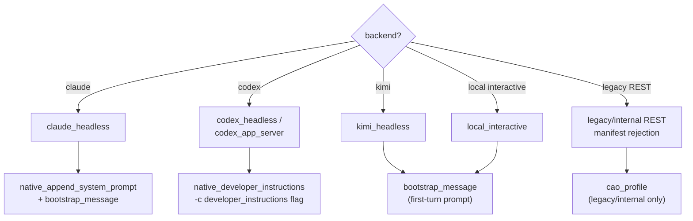

# Role Injection

Role injection determines how a role's system prompt is delivered to an agent session. Because each agent tool (Claude, Codex, Kimi) accepts role-level instructions differently, the injection strategy is resolved per-backend at launch-plan composition time. The input to role injection is the already-composed effective launch prompt, not just the raw contents of `roles/<role>/system-prompt.md`. For current managed launches, that effective prompt is rooted at `<houmao_system_prompt>` and may contain `<managed_header>`, `<prompt_body>`, `<role_prompt>`, `<launch_profile_overlay>`, and `<launch_appendix>` sections depending on what participated in the launch.

## Injection decision tree



## plan_role_injection

```python
def plan_role_injection(
    backend: BackendKind,
    tool: str,
    role_name: str,
    role_prompt: str,
) -> RoleInjectionPlan
```

Determines the injection strategy for the given backend and tool, and returns a fully resolved `RoleInjectionPlan`. This function is called internally by `build_launch_plan` (see [Launch Plan](launch-plan.md)) and does not need to be invoked directly.

## RoleInjectionPlan

`RoleInjectionPlan` is a frozen dataclass describing how and what to inject.

| Field | Type | Description |
|---|---|---|
| `method` | `RoleInjectionMethod` | The injection strategy to use |
| `role_name` | `str` | Name of the role being injected |
| `prompt` | `str` | The full role prompt text |
| `bootstrap_message` | `str \| None` | First-turn message to deliver the role prompt, if the method requires it |

## RoleInjectionMethod

The `RoleInjectionMethod` type enumerates the available injection strategies:

- **`native_developer_instructions`** — the effective launch prompt is passed as a CLI flag that the tool natively supports for developer/system instructions when prompt content exists.
- **`native_append_system_prompt`** — the effective launch prompt is appended to the tool's system prompt via a native CLI flag, optionally combined with a bootstrap message, when prompt content exists.
- **`auto_skill_system_prompt`** — the effective launch prompt is made available through the managed `houmao-auto-system-prompt` skill when the selected launch policy relies on provider skills instead of a native system-prompt flag.
- **`bootstrap_message`** — the effective launch prompt is delivered as the first user-turn message in the session when prompt content exists.
- **`cao_profile`** — the effective launch prompt was injected via a legacy profile mechanism. Current public launch paths do not target this method.

The runtime does not ask providers to interpret those tags. Backends receive one opaque final prompt string and apply their normal native injection path or bootstrap fallback to that already-rendered prompt.

## Per-backend strategies

| Backend | Method | How it works |
|---|---|---|
| `claude_headless` | `native_append_system_prompt` | When the effective launch prompt is non-empty, Houmao passes `--append-system-prompt <prompt>` and sends one bootstrap message on the first turn. Empty effective prompts skip both. |
| `codex_headless` | `native_developer_instructions` | When the effective launch prompt is non-empty, Houmao passes `-c developer_instructions=<prompt>`. Empty effective prompts skip this startup input entirely. |
| `codex_app_server` | `native_developer_instructions` | Same semantics as `codex_headless`, but applied to the `thread/start` request payload. |
| `kimi_headless` | `bootstrap_message` | When the effective launch prompt is non-empty, Houmao prepends it to the first Kimi prompt through the managed bootstrap message. Empty effective prompts skip bootstrap entirely. |
| `local_interactive` | tool-dependent | Codex uses native developer instructions, Claude uses native appended system prompt, and Kimi uses bootstrap messaging or managed auto-skill workflows. Empty effective prompts suppress those startup inputs regardless of tool. |
| `cao_rest` | `cao_profile` | Legacy/internal: retained only for old manifests and explicit rejection paths. |
| `houmao_server_rest` | `cao_profile` | Legacy/internal: retired old-server backend identity, rejected for new sessions. |

## Bootstrap message lifecycle

For backends that use `bootstrap_message` or combine native injection with a bootstrap message (`claude_headless`), the bootstrap is delivered exactly once when effective launch-prompt content exists — on the first turn of the session. The headless backend base class tracks this via the `role_bootstrap_applied` flag in `HeadlessSessionState`, ensuring the bootstrap message is not re-sent on resume.

The bootstrap message is distinct from subsequent user prompts. It establishes the agent's role context before any user-directed work begins.

## Design rationale

Role injection is intentionally backend-specific rather than using a single universal strategy because:

1. **Native injection is preferred** when available. Tools like Codex and Claude provide dedicated CLI flags for developer instructions and system prompts, respectively. Using these native mechanisms ensures the role prompt is handled by the tool's own context management, which is more reliable than conversational priming.

2. **Bootstrap messages or managed auto skills are the fallback.** When a tool does not expose a native injection flag for the maintained launch path (Kimi headless and Kimi TUI), the role prompt is sent as the first conversational turn or made available through `houmao-auto-system-prompt`. This is effective but less cleanly separated from native provider context than a dedicated system-prompt flag.

3. **Legacy backends are not public launch targets.** `cao_rest` and `houmao_server_rest` may still appear in old manifests or internal compatibility code, but new user-facing launches fail fast before relying on their profile mechanism.

Kimi Code 0.11.0 does not expose a native system-prompt flag. Houmao projects `houmao-auto-system-prompt` into managed Kimi homes, but Kimi users may need to invoke that skill manually before substantive chat begins when automatic skill startup has not confirmed the prompt.

## See also

- [Launch Plan](launch-plan.md) — where role injection plans are composed
- [Backends](backends.md) — backend implementations that execute role injection
- [Session Lifecycle](session-lifecycle.md) — how role injection fits into the session startup flow
