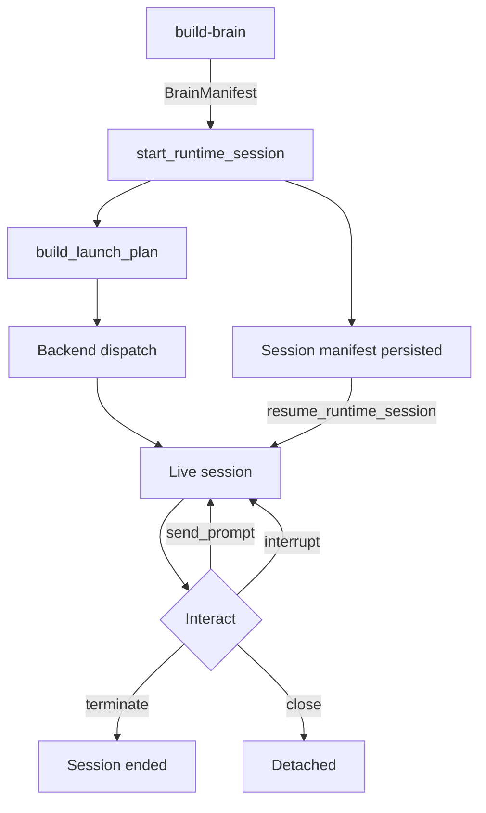

# Session Lifecycle

Module: `src/houmao/agents/realm_controller/runtime.py` — High-level session runtime orchestration.

The session lifecycle covers starting, interacting with, resuming, and stopping agent sessions. The `RuntimeSessionController` is the main controller class that manages this lifecycle, backed by persisted session manifests that enable resume across process restarts.

## RuntimeSessionController

`RuntimeSessionController` is the primary entry point for managing a live agent session. It is constructed via one of two class-level factory functions: `start_runtime_session` (for new sessions) or `resume_runtime_session` (for previously persisted sessions).

### Starting a new session

```python
@classmethod
def start_runtime_session(
    agent_def_dir: Path,
    brain_manifest_path: Path,
    role_name: str,
    backend: BackendKind,
    working_directory: Path,
    *,
    auto_attach: bool = False,
    gateway_host: str | None = None,
    gateway_port: int | None = None,
    mailbox_transport: str | None = None,
    tmux_session_name: str | None = None,
    registry_launch_authority: str | None = None,
) -> RuntimeSessionController
```

Starts a new runtime session by:

1. Loading the brain manifest from `brain_manifest_path`.
2. Resolving the role package from `role_name` within the agent definition directory.
3. Building a `LaunchPlan` via `build_launch_plan` (see [Launch Plan](launch-plan.md)).
4. Dispatching the launch plan to the chosen backend.
5. Persisting a session manifest to the job directory for later resume.

**Parameters:**

| Parameter | Description |
|---|---|
| `agent_def_dir` | Path to the agent definition directory containing roles, brains, and blueprints |
| `brain_manifest_path` | Path to the built brain manifest (JSON) from the build phase |
| `role_name` | Name of the role to apply (resolved from `roles/<role_name>/system-prompt.md`) |
| `backend` | Target backend (see [Backends](backends.md)) |
| `working_directory` | Working directory for the agent process |
| `auto_attach` | Whether to automatically attach a gateway to the session |
| `gateway_host` | Host for gateway attachment |
| `gateway_port` | Port for gateway attachment |
| `mailbox_transport` | Mailbox transport type for inter-agent messaging |
| `tmux_session_name` | Explicit tmux session name override |
| `registry_launch_authority` | Authority identifier for agent registry registration |

### Resuming a session

```python
@classmethod
def resume_runtime_session(
    agent_def_dir: Path,
    session_manifest_path: Path,
) -> RuntimeSessionController
```

Resumes a previously started session from its persisted session manifest. The manifest contains all information needed to reconnect to the live agent process (or restart it if needed), including the original launch plan, backend state, and session identifiers.

**Parameters:**

| Parameter | Description |
|---|---|
| `agent_def_dir` | Path to the agent definition directory |
| `session_manifest_path` | Path to the persisted session manifest written during `start_runtime_session` |

### Session manifest persistence

Each session writes a manifest to its job directory upon creation. This manifest captures:

- The original launch plan and backend configuration.
- Session identifiers (tmux session name, backend-specific session IDs).
- Gateway state and attachment information.
- Runtime artifacts and metadata.

The job directory serves as the persistent root for all session-related state, including the session manifest, gateway state files, and any runtime artifacts produced during the session.

## InteractiveSession protocol

All backends expose a common `InteractiveSession` protocol for interacting with a running agent. The `RuntimeSessionController` delegates to this protocol for prompt delivery and session control.

### send_prompt

```python
def send_prompt(prompt: str) -> list[SessionEvent]
```

Sends a user prompt to the running agent session and returns a list of `SessionEvent` objects representing the agent's response and any side effects. This is the primary interaction method for delivering work to an agent.

### interrupt

```python
def interrupt() -> SessionControlResult
```

Interrupts the agent's current operation. The specific behavior depends on the backend — headless backends may send a SIGINT to the underlying process, while interactive backends may send a Ctrl-C sequence via tmux.

### terminate

```python
def terminate() -> SessionControlResult
```

Terminates the agent session. This stops the underlying agent process and cleans up backend-specific resources. The session manifest remains on disk for inspection but the session cannot be resumed after termination.

### close

```python
def close() -> None
```

Releases resources held by the session controller without necessarily terminating the underlying agent process. Use this when detaching from a session that should continue running.

## Lifecycle flow



## See also

- [Launch Plan](launch-plan.md) — how launch plans are composed from brain manifests and roles
- [Backends](backends.md) — backend implementations that execute launch plans
- [Role Injection](role-injection.md) — how role prompts are delivered to agents
