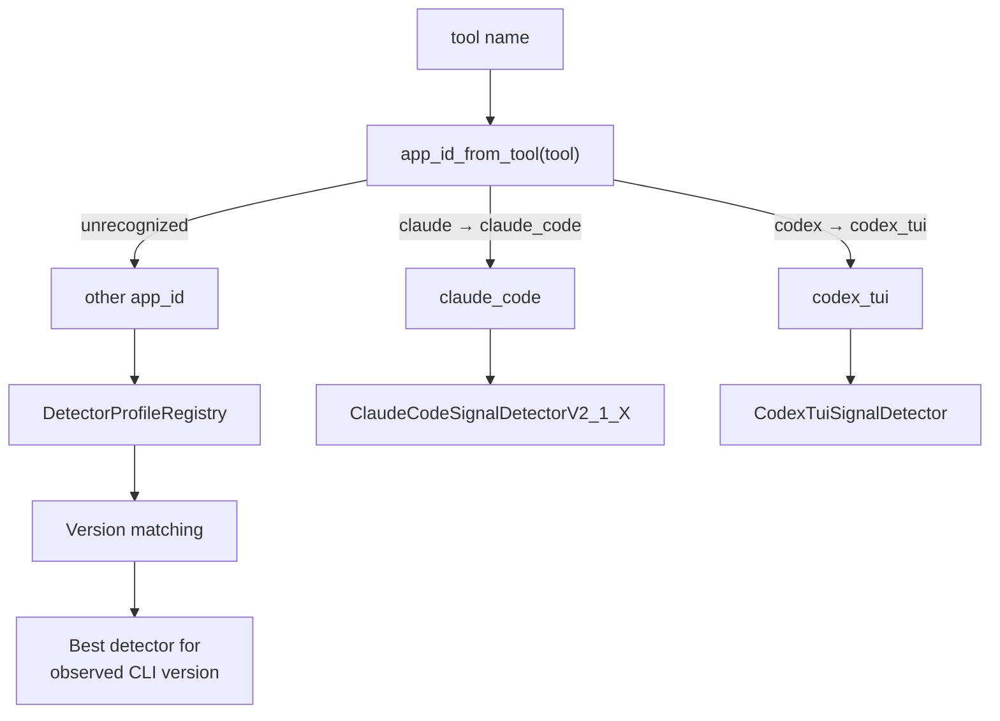

# TUI Tracking Detectors

Module: `src/houmao/shared_tui_tracking/detectors.py` — Shared detector/profile contracts plus compatibility exports.

## Detector Selection

## BaseTrackedTurnSignalDetector

Abstract base class defining the contract for all TUI signal detectors. Each detector is responsible for analyzing a single observation frame (a raw pane snapshot and parsed surface context) and producing structured turn signals.

### Properties

| Property | Type | Description |
|---|---|---|
| `temporal_window_seconds` | `float` | The time window (in seconds) over which this detector considers recent frames for temporal analysis |

### Methods

#### `detect(output_text, parsed_surface) → DetectedTurnSignals`

**Abstract.** Performs one-frame signal detection on the given pane output text and parsed surface context. Returns a `DetectedTurnSignals` instance capturing all observable signals from this single frame — prompt visibility, active evidence, error patterns, completion candidates, and surface signature.

This method must be stateless with respect to the detector instance; all temporal reasoning is handled separately via `build_temporal_frame` and `derive_temporal_hints`.

#### `build_temporal_frame(output_text, signals, observed_at_seconds) → object | None`

Builds a temporal profile frame from the current observation. The returned frame object is detector-specific and is accumulated into a sliding window for `derive_temporal_hints`. Returns `None` if the detector does not support temporal profiling.

#### `derive_temporal_hints(recent_frames) → TemporalHintSignals`

Derives lifecycle hints from a window of recent temporal frames. These hints inform the state machine about patterns that are only visible across multiple observations — such as sustained activity, stalled output, or gradual convergence toward a ready state.

## Concrete Detectors

### Claude Code Detectors

- **`ClaudeCodeSignalDetectorV2_1_X`** — Signal detector for Claude Code ≥ 2.1.x. Recognizes Claude Code's prompt patterns, status line formats, interrupt indicators, and error surfaces. Handles the tool-use confirmation dialogs and permission prompts specific to Claude Code's TUI.

### Codex TUI Detectors

- **`CodexTuiSignalDetector`** — Base Codex TUI signal detector.
- **`CodexTuiSignalDetectorV0_116_X`** — Codex TUI signal detector targeting Codex CLI ≥ 0.116.x. Recognizes Codex's input prompt, status bar, streaming output indicators, and completion patterns.
- **`CodexTrackedTurnSignalDetector`** — Tracked turn signal detector for Codex sessions. Builds on the TUI signal detector with additional turn-level tracking logic.

### Fallback Detectors

- **`FallbackClaudeDetector`** — Fallback detector used when no versioned Claude Code detector matches the installed CLI version. Provides conservative signal detection that avoids false positives.
- **`FallbackCodexTuiSignalDetector`** — Fallback detector for unrecognized Codex CLI versions.
- **`FallbackTrackedTurnSignalDetector`** — Fallback tracked turn detector for unsupported or unrecognized tools.

## DetectorProfileRegistry

Defined in `src/houmao/shared_tui_tracking/registry.py`.

The registry resolves a supported TUI application identifier to its closest-compatible detector profile. This allows the tracking subsystem to select the correct detector implementation based on the tool and version being tracked.

### DetectorProfileRegistration

A registration entry in the registry.

| Field | Type | Description |
|---|---|---|
| `app_id` | `str` | Application identifier (e.g., `"claude_code"`, `"codex_tui"`) |
| `detector_name` | `str` | Human-readable detector name |
| `detector_version` | `str` | Detector version string |
| `minimum_supported_version` | `str` | Minimum CLI version this detector supports |
| `profile_factory` | callable | Factory that produces a configured detector profile |

### ResolvedDetectorProfile

The resolved profile for one tracker session, selected by the registry based on tool identity and version.

### `app_id_from_tool(tool: str) -> str`

Maps a tool name (as used in brain recipes and backend kinds) to the canonical app ID used by the detector registry. For example, `"claude"` maps to `"claude_code"` and `"codex"` maps to `"codex_tui"`.

## App-Specific Detector Implementations

Detector implementations are organized by application under `src/houmao/shared_tui_tracking/apps/`:

### `claude_code/`

Claude Code signal detection. Contains the versioned detector implementations, surface parsing logic for Claude Code's TUI layout (prompt region, output region, status/footer bar), and pattern matchers for Claude Code-specific indicators (tool-use confirmations, permission dialogs, error banners).

### `codex_tui/`

Codex TUI signal detection with temporal hint logic. Includes versioned detectors, surface parsers for the Codex TUI layout, and temporal profiling that tracks output streaming velocity and idle patterns to distinguish between "still thinking" and "done."

### `unsupported_tool/`

Fallback handler for tools that do not have a dedicated detector. Produces conservative signals that avoid false readiness or completion claims, ensuring the tracking subsystem degrades gracefully when encountering an unknown TUI application.
