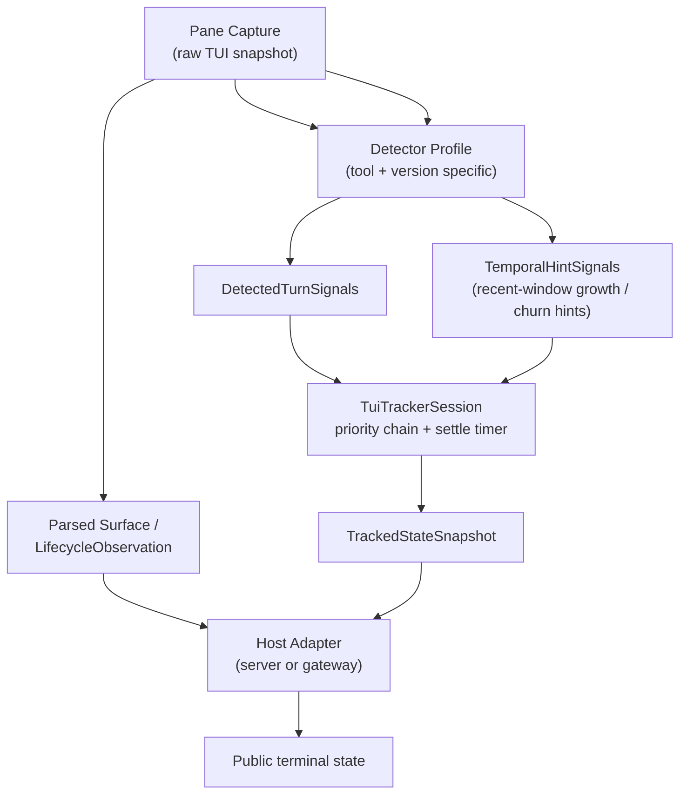
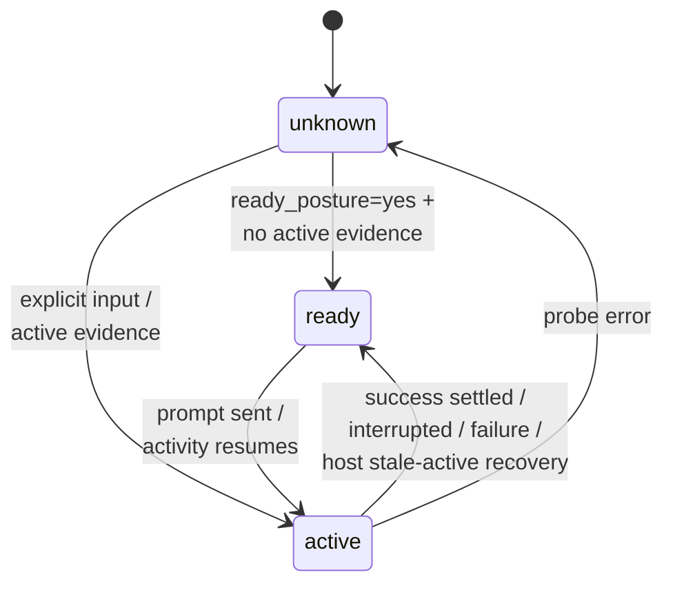

# TUI Tracking State Model

Module: `src/houmao/shared_tui_tracking/` — Neutral tracked-TUI models shared by official/runtime adapters.

## State Dimensions Overview



`TrackedStateSnapshot` is the shared tracker output. Server and gateway hosts publish a larger public model on top of it by merging parsed-surface diagnostics, lifecycle timing sidecars, visible-state stability, and a small number of host-owned corrections such as stale-active recovery.

## TurnPhase State Machine



## Important Model Notes

- `surface_accepting_input=yes` or a visible prompt does not by itself prove that a turn is over. The shared tracker can keep `turn_phase=active` if there is stronger current activity evidence.
- Detector profiles may use two different scopes at once: a prompt-scoped latest-turn region for interruption and success context, and a live-edge tail for current activity cues such as status rows and in-flight tool cells.
- Codex is the main example of this split. Current activity uses the live edge so stale scrollback rows do not keep the turn active forever, while temporal transcript growth can still keep the turn active when no spinner or running row is visible.
- Host adapters may correct an unanchored stale `active` posture after a stable submit-ready window. That correction publishes `ready` without manufacturing `last_turn_result=success`.

## Core Type Aliases

All type aliases are `Literal` unions used throughout the tracking subsystem.

### Tristate

```python
Tristate = Literal["yes", "no", "unknown"]
```

Three-valued logic for surface observations where the detector may not have enough evidence to commit to a boolean.

### TurnPhase

```python
TurnPhase = Literal["ready", "active", "unknown"]
```

Whether the tracker currently believes a turn is in flight, the surface is ready for another turn, or the posture is ambiguous.

### TransportState

```python
TransportState = Literal["tmux_up", "tmux_missing", "probe_error"]
```

Reflects the health of the underlying tmux transport used to observe the TUI pane.

### ProcessState

```python
ProcessState = Literal["tui_up", "tui_down", "unsupported_tool", "probe_error", "unknown"]
```

Whether the tracked TUI process is alive and observable.

### ParseStatus

```python
ParseStatus = Literal["parsed", "skipped_tui_down", "unsupported_tool", "transport_unavailable", "probe_error", "parse_error"]
```

Outcome of attempting to parse a raw pane snapshot into structured surface context.

### ReadinessState

```python
ReadinessState = Literal["ready", "waiting", "blocked", "failed", "unknown", "stalled"]
```

Readiness of the agent surface to accept new input.

### CompletionState

```python
CompletionState = Literal["inactive", "in_progress", "candidate_complete", "completed", "waiting", "blocked", "failed", "unknown", "stalled"]
```

Completion status of the current logical turn, from inactive through in-progress to terminal states.

### TrackedDiagnosticsAvailability

```python
TrackedDiagnosticsAvailability = Literal["available", "unavailable", "tui_down", "error", "unknown"]
```

Whether diagnostic information can be extracted from the current surface state.

### TrackedLastTurnResult

```python
TrackedLastTurnResult = Literal["success", "interrupted", "known_failure", "none"]
```

Outcome of the most recently completed turn as inferred by the detector.

### TrackedLastTurnSource

```python
TrackedLastTurnSource = Literal["explicit_input", "surface_inference", "none"]
```

How the last turn was initiated — via explicit prompt submission or inferred from surface state transitions.

## TrackedStateSnapshot

Frozen dataclass representing a point-in-time snapshot of the tracked TUI state. This is the primary output of the tracking state machine.

| Field | Type | Description |
|---|---|---|
| `surface_accepting_input` | `Tristate` | Whether the surface is accepting new input |
| `surface_editing_input` | `Tristate` | Whether the surface is in an input-editing state |
| `surface_ready_posture` | `Tristate` | Whether the detector judged the surface to be in a ready posture |
| `turn_phase` | `TurnPhase` | Current turn phase |
| `last_turn_result` | `TrackedLastTurnResult` | Result of the last completed turn |
| `last_turn_source` | `TrackedLastTurnSource` | How the last turn was initiated |
| `detector_name` | `str` | Name of the detector that produced this snapshot |
| `detector_version` | `str` | Version of the detector |
| `active_reasons` | `tuple[str, ...]` | Human-readable reasons the surface is considered active, such as `status_row`, `tool_cell`, or `transcript_growth` |
| `notes` | `tuple[str, ...]` | Additional detector notes for diagnostics and profile behavior |
| `stability_signature` | `str` | Hash-like signature of the observable surface state |
| `stable` | `bool` | Whether the surface state has been stable (unchanged) long enough to trust |
| `stable_for_seconds` | `float` | Duration the current signature has been stable |
| `stable_since_seconds` | `float` | Elapsed time at which the current stability window began |
| `observed_at_seconds` | `float` | Elapsed time at which this snapshot was observed |

## DetectedTurnSignals

Frozen dataclass representing the raw signals extracted by a detector from a single observation frame. This is the detector's immediate output before the tracker session applies temporal hints, priority ordering, and settle timing.

| Field | Type | Description |
|---|---|---|
| `detector_name` | `str` | Name of the detector |
| `detector_version` | `str` | Version of the detector |
| `accepting_input` | `Tristate` | Whether the surface appears to accept input |
| `editing_input` | `Tristate` | Whether the surface appears to be editing input |
| `ready_posture` | `Tristate` | Whether the surface appears idle/ready in this one frame |
| `prompt_visible` | `bool` | Whether a prompt is visible on the surface |
| `prompt_text` | `str \| None` | Extracted prompt text, if visible |
| `footer_interruptable` | `bool` | Whether the footer indicates the agent can be interrupted |
| `active_evidence` | `bool` | Whether this frame contains evidence that the agent is actively processing |
| `active_reasons` | `tuple[str, ...]` | Reasons the surface is considered active in this frame |
| `interrupted` | `bool` | Whether the turn appears to have been interrupted |
| `known_failure` | `bool` | Whether a known failure pattern was detected |
| `current_error_present` | `bool` | Whether an error is currently visible on the surface |
| `success_candidate` | `bool` | Whether the surface state is a candidate for successful completion |
| `completion_marker` | `str \| None` | Detected completion marker text |
| `latest_status_line` | `str \| None` | Most recent status line from the surface |
| `ambiguous_interactive_surface` | `bool` | Whether the surface is in an ambiguous interactive state |
| `success_blocked` | `bool` | Whether success detection is blocked by surface ambiguity |
| `surface_signature` | `str` | Signature of the observed surface for stability tracking |
| `notes` | `tuple[str, ...]` | Additional diagnostic notes |

For Codex specifically, current activity is no longer inferred from arbitrary full-scrollback rows. Status-row and tool-cell activity come from the live edge of the current visible surface, while interruption, success context, and temporal transcript growth continue to use prompt-local latest-turn reasoning.
