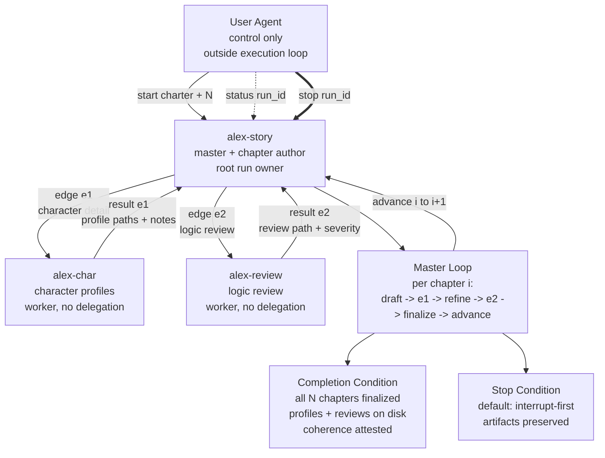

# Objective

Produce N sequential chapters of a science-fiction story, where N is declared in the start charter. Each chapter goes through a fixed pairwise pipeline driven by the master: draft -> character detail edge -> refine -> review edge -> finalize.

The run produces these persistent artifacts:

- chapter drafts, revisions, and finalized chapters at `story/chapters/<index>-<chapter-name>.md`
- character profiles at `story/characters/<character-name>.md`
- logic, character, pacing, and continuity reviews at `story/review/<ts>-<what>.md`
- optional master-owned status at `story/run-state.md`

The base directory for `story/` is this example directory. The master is responsible for creating subdirectories on first use if they do not exist.

## Per-Chapter Pipeline

For each chapter index `i` in `1..N`:

1. Draft phase: `alex-story` drafts chapter `i`, chooses a short kebab-case `<chapter-name>` slug, and writes the initial draft to `story/chapters/<i:02d>-<chapter-name>.md`.
2. Character detail edge: `alex-story` delegates to `alex-char` via mailbox. The edge payload references the draft path and lists characters that need new or updated profiles. `alex-char` reads the draft, writes or updates one profile per character at `story/characters/<character-name>.md`, and returns one result to `alex-story` summarizing paths and continuity notes.
3. Refinement phase: `alex-story` revises the chapter in place using the character profiles and continuity notes returned from `alex-char`.
4. Review edge: `alex-story` delegates to `alex-review` via mailbox. The edge payload references the refined chapter path and relevant profile paths. `alex-review` writes a review report to `story/review/<ts>-<what>.md`, where `<ts>` is a UTC timestamp like `20260410T015900Z` and `<what>` is a slug like `chapter-01-the-arrival`. `alex-review` returns one result to `alex-story` with severity counts and the review path.
5. Finalize phase: `alex-story` addresses all `critical` findings and as many `moderate` findings as reasonable without breaking the chapter's identity. `alex-story` updates the same chapter file in place as the finalized chapter.
6. Advance: `alex-story` advances to chapter `i+1` and repeats the pipeline until N chapters are finalized.

# Completion Condition

The run is complete when all of the following are true:

- N chapters exist as finalized files under `story/chapters/`, named `<i:02d>-<chapter-name>.md` for `i` in `1..N`.
- For every distinct character mentioned across all finalized chapters, a profile file exists at `story/characters/<character-name>.md`.
- For every chapter index `i` in `1..N`, at least one review report exists under `story/review/` whose `<what>` slug references chapter `i`.
- `alex-story` has completed the finalize phase for chapter `N`.
- `alex-story` attests in its completion message that the chapter set reads as a coherent sequence.

Until the start charter sets N, the master must hold the run in an accepted-but-paused posture and report `awaiting-N` in status responses.

# Participants

- `alex-story`: master, root run owner, chapter author, orchestrator for both pairwise edges, owner of finalize, advance, completion, and stop.
- `alex-char`: character-profile worker. Reads chapter drafts, writes or updates character profile files, returns results to `alex-story`, and never delegates further.
- `alex-review`: logic, character, pacing, and continuity reviewer. Reads refined chapters and relevant character profiles, writes review reports, returns results to `alex-story`, and never delegates further.

Mailbox identities:

- `alex-story`: `alex-story@houmao.localhost`, principal id `HOUMAO-alex-story`
- `alex-char`: `alex-char@houmao.localhost`, principal id `HOUMAO-alex-char`
- `alex-review`: `alex-review@houmao.localhost`, principal id `HOUMAO-alex-review`

# Delegation Policy

`delegate_to_named`: `alex-story` may delegate only to `alex-char` and `alex-review`.

- Workers may not delegate further.
- Workers may not communicate with each other directly.
- Every delegation edge must close back to `alex-story`.
- Worker results may not bypass the master.

# Stop Policy

Default mode: `interrupt-first`.

On stop:

- The master stops opening new chapter pipelines.
- The master interrupts any in-flight edge whether it is pending with `alex-char` or `alex-review`.
- The master preserves all on-disk artifacts already written.
- The master returns a stop summary listing the highest finalized chapter index, the interrupted chapter or phase if any, and preserved artifact paths.

`graceful` stop is opt-in and is used only when the operator's stop request explicitly asks for it.

# Reporting Contract

## Status

When the user agent sends `status <run_id>`, the master returns:

- run phase: `awaiting-N | drafting | char-edge | refining | review-edge | finalizing | advancing | complete | stopped`
- current chapter index and N
- active pairwise edge if any: `e1-char` or `e2-review`
- finalized chapter paths
- character profile paths
- review report paths
- next planned action
- completion posture
- stop posture if a stop is in flight

## Completion

When the run is complete, the master returns:

- final message confirming all N chapters are finalized
- ordered chapter path list
- character profile path list
- review report path list
- brief coherence note

# Mermaid Control Graph

# File Path Conventions

| Artifact | Path template | Written by |
|---|---|---|
| Chapter draft, revision, finalized chapter | `story/chapters/<i:02d>-<chapter-name>.md` | `alex-story` |
| Character profile | `story/characters/<character-name>.md` | `alex-char` |
| Review report | `story/review/<ts>-<what>.md` | `alex-review` |
| Optional run status | `story/run-state.md` | `alex-story` |

`<chapter-name>` and `<character-name>` are short kebab-case slugs. `<ts>` is a UTC timestamp like `YYYYMMDDTHHMMSSZ`. `<what>` should identify the chapter, for example `chapter-01-the-arrival`.

# Notes For The User Agent

The user agent, meaning the operator or operator agent sending the start charter, is responsible for:

- choosing and declaring N in the start charter
- optionally providing premise, setting, cast, tone, or constraints
- sending status requests on demand only; status polling is not a liveness signal
- sending stop requests if the run needs to end early
- using the `houmao-agent-loop-pairwise` skill for full lifecycle handling when available
