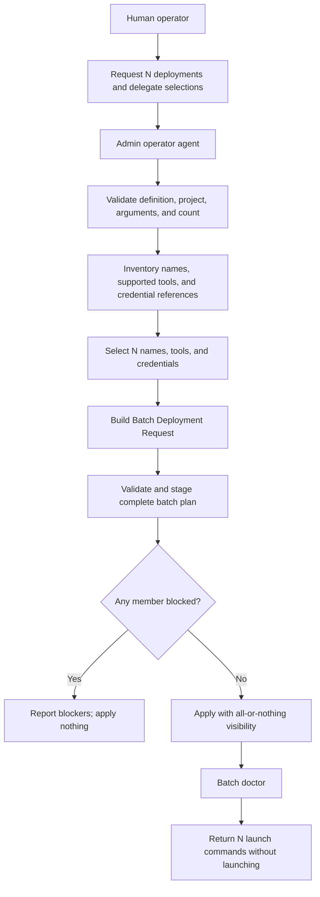

# Use Case UC-03: Deploy Multiple Agents With Delegated Selections

## Actor Goal

As a human Houmao operator, I want to request `N` concrete agents from one materialized Agent Definition and delegate their names, CLI tools, and credential references to the operator agent, so that Houmao can prepare a valid, explainable batch in my selected project without making me choose every repeated deployment field.

## Use Case

The human selects one exact Agent Definition, one Houmao project, a positive deployment count, and any required definition-declared deployment arguments. The human explicitly delegates three selection categories to the admin operator agent: deployment names, CLI tool families, and references to existing compatible project credentials.

The operator agent validates and snapshots the definition, inspects the project catalog and maintained tool support, and selects values only within the delegated categories. It preserves any explicit user selections, chooses unique names, chooses only tools supported by the definition and Houmao, and chooses only existing credentials compatible with each selected tool. It records the candidate set, chosen values, and rationale without reading credential secrets.

Houmao represents the request as one Batch Deployment Request and one Batch Deployment Plan containing `N` ordinary member plans. Planning validates all members and detects collisions before mutation. Apply gives all-or-nothing catalog visibility and journals recoverable filesystem publication. Successful deployment correlates members by one batch operation id, returns `N` launch commands, and creates no durable batch domain object or live managed agent.

## Supported Actions

### Delegate Repeated Deployment Selections

This action lets the human authorize the operator agent to fill selected deployment controls.

- context
  - Actor **has** an exact Agent Definition, a target project, a desired count, and any task-specific deployment arguments.
  - System **has** an admin-only deployment skill that can inspect compatible tools, registered credential references, and existing project names.
- intent
  - Actor **wants** several concrete deployments without naming and configuring each one manually.
  - Actor **wonders** "Can I ask for four agents and let you choose their names, CLI tools, and credentials?"
- action
  - Actor then **asks** the operator agent to deploy the requested count and explicitly delegates those three selection categories.
- result
  - Actor **gets** a bounded delegation record that names the authorized fields and preserves every non-delegated field under normal user or definition control.

### Review the Proposed Batch

This action exposes the operator agent's selections and reasoning before project mutation.

- context
  - Actor **has** delegated names, tools, and credential-reference selection.
  - System **has** validated the definition snapshot and inspected compatible project candidates.
- intent
  - Actor **wants** confidence that every proposed agent is valid and distinguishable.
  - Actor **wonders** "Which names, tools, and credentials did you choose, and why?"
- action
  - Actor then **asks** the operator agent to prepare the batch deployment.
- result
  - Actor **gets** an ordered batch summary containing `N` unique deployment names, derived specialist/profile names, selected tools, credential display-name references, selection rationale, shared argument bindings, warnings, and blockers.

### Apply the Batch With All-or-Nothing Visibility

This action creates all requested project Agent Deployments as one authorized operation.

- context
  - Actor **has** an unblocked batch summary and has requested deployment rather than plan-only preparation.
  - System **has** one intact Batch Deployment Plan bound to the selected project, definition digest, request, and expected catalog state.
- intent
  - Actor **wants** either all requested agents deployed or no partial batch left behind.
  - Actor **wonders** "If the third profile fails, will any partial deployment become visible?"
- action
  - Actor then **asks** the operator agent to apply the complete batch.
- result
  - Actor **gets** `N` healthy Agent Deployments or one recoverable failure operation with no partial catalog visibility, plus operation provenance and launch-command handoff.

## Main Flow

1. The human selects one materialized Agent Definition and one Houmao project.
2. The human requests a positive integer count `N` within the maintained batch limit.
3. The human supplies shared definition-declared deployment arguments and any explicit per-member overrides permitted by the definition.
4. The human says that the operator agent may choose agent names, CLI tools, and credentials as it sees fit.
5. `houmao-admin-entrypoint` routes the plural deployment request to `houmao-agent-definition deploy-definition`.
6. The deployment routine verifies the admin actor frame and records the exact request.
7. It validates and snapshots the selected definition identity, version, digest, supported tool families, deploy contract, templates, and skills.
8. It validates `N` against the maintained positive batch bound.
9. It resolves and confirms the shared definition-declared deployment arguments according to UC-02.
10. It records a delegated-selection scope containing only deployment names, CLI tool families, and existing compatible credential references.
11. It inventories existing deployment, specialist, profile, and registered-skill names in the selected project.
12. It inventories maintained CLI tool families allowed by the definition and usable by the project.
13. It inventories credential metadata and stable references registered for those tool families without reading protected credential content.
14. It preserves any explicit user choice for an individual member and selects only the remaining delegated fields.
15. It chooses `N` unique deployment names and derives collision-free specialist/profile names.
16. For each member, it selects a definition-compatible CLI tool and an existing credential reference compatible with that tool.
17. It records selection rationale and whether a compatible `(tool, credential)` pair is reused across members.
18. It builds one Batch Deployment Request containing the count, exact definition snapshot, shared input bindings, valid per-member overrides, delegated `tool` or `credential-ref` bindings, delegation scope, and candidate summaries.
19. Planning creates `N` ordinary member plans containing deployment, specialist, and profile names; tool and credential references; rendered bindings; skills; warnings; blockers; and selection rationale.
20. The operator agent presents the complete ordered batch summary. It asks no additional selection question for fields covered by the delegation.
21. If the original instruction clearly requests deployment, the operator agent carries that apply authority forward; a plan-only request stops after preview.
22. The deterministic batch planner validates every member against the same definition snapshot and selected project.
23. It validates count, names, tools, credential identities, shared and per-member arguments, mappings, rendered content, cross-member collisions, existing-project collisions, and expected catalog state.
24. The planner stages one opaque Batch Deployment Plan and all `N` rendered member trees without creating project definitions.
25. Batch apply prepares every member and inserts all Agent Deployment records through one catalog transaction only after every staged member is ready.
26. If publication is interrupted, the operation journal preserves enough state for doctor to finish publication or remove only operation-owned staging.
27. Batch doctor verifies the operation, definition provenance, delegated selections, output digests, project relationships, skills, and launch readiness for all `N` deployments.
28. The operator agent reports the batch operation id, every selection and rationale, every created deployment, doctor results, and one exact profile launch command per member.
29. The workflow stops without launching any live managed agent.

## Alternative and Exception Flows

- If `N` is zero, negative, non-integral, or above the maintained batch limit, the operator agent reports the valid bound and creates no plan.
- If the user supplies some names, tools, or credential references and delegates the rest, explicit choices win and the delegation covers only unresolved fields.
- If the user does not explicitly delegate a missing selection category, the operator agent asks for it or uses a definition-declared default. It does not infer delegation from the plural count.
- If the definition supports only one usable CLI tool, every member may use that tool and the batch summary explains the constraint.
- If several compatible `(tool, credential)` pairs exist, the operator agent may reuse or distribute them, but it records the chosen strategy and rationale.
- If no compatible existing credential exists for a required tool, planning blocks. Delegation does not authorize credential creation, import, repair, or secret mutation.
- If a credential display name changes after planning but its stable identity remains valid, apply uses the recorded identity and renders current maintained display information.
- If a selected credential is deleted, becomes incompatible, or fails preflight before apply, the batch plan becomes stale and no member is applied.
- If a proposed name collides, the operator agent may select a different unused name within the delegated scope before planning. It never overwrites an existing object.
- If two batch members resolve to the same deployment, specialist, profile, registered-skill, or managed path, planning blocks the complete batch.
- If the definition or project catalog changes after planning, apply rejects the stale batch before mutation.
- If one member has an invalid per-member deployment input or undeclared requested content change, planning blocks every member until the request is corrected.
- If no per-instance argument overrides are supplied, every member uses the confirmed shared argument bindings. The operator agent does not invent task differences merely because `N` is greater than one.
- If the human asks only to prepare or preview, the operator agent stages or reports the batch plan but does not apply it.
- If apply is interrupted, no partial member set becomes catalog-visible. Doctor reconciles publication from the operation journal.
- If apply succeeds, each Agent Deployment may later be inspected, updated, removed, or launched individually. Batch provenance does not force permanent lockstep lifecycle.
- A later explicit batch launch request belongs to the live-agent lifecycle and is not authorized by this deployment request.

## Flow Diagram



## Sequence Diagram

```mermaid
sequenceDiagram
    autonumber
    actor Human as Human operator
    participant Operator as Admin operator agent
    participant Definition as Agent Definition Revision
    participant Catalog as Project catalog
    participant Planner as Batch planner
    participant Apply as Recoverable batch apply

    Human->>Operator: Deploy N agents; choose names, tools, credentials
    Operator->>Definition: Validate and snapshot
    Definition-->>Operator: Tools, deploy contract, templates, digest
    Operator->>Catalog: Inspect names and compatible credential references
    Catalog-->>Operator: Non-secret candidates and current preconditions
    Operator->>Operator: Select delegated fields and record rationale
    Operator-->>Human: Present N-member batch summary
    Operator->>Planner: Batch Request plus definition snapshot
    Planner->>Planner: Validate every member and cross-member preconditions
    Planner-->>Operator: Opaque batch plan or complete blocker set
    Operator->>Apply: Apply authorized intact batch plan
    Apply->>Catalog: Create N deployments in one transaction
    alt Preparation or publication is interrupted
        Apply-->>Operator: Recoverable operation report; no partial catalog visibility
    else Every member succeeds
        Apply-->>Operator: Operation id and N healthy deployment ids
        Operator-->>Human: Selections, doctor results, N launch commands
    end
```

## Durable Outputs

- One Batch Deployment Request bound to an exact definition version and digest, selected project, count, and shared deployment arguments.
- An explicit delegated-selection scope limited to names, CLI tools, and credential references.
- A non-secret candidate summary and one rationale for each selected name, tool, and credential reference.
- `N` resolved member entries with distinct deployment, specialist, and profile identities.
- One opaque batch plan containing all member plans, rendered outputs, cross-member preconditions, warnings, blockers, and digests.
- One operation journal plus an operation id and ordinal on each ordinary Agent Deployment.
- Operation and member last-applied digests plus doctor evidence.
- Either `N` visible project deployments or no visible member set.
- One exact profile-backed launch command per member, with no live agents created by deployment.

## Example Prompt and Expected AI Response

### Event 001: Delegate a Four-Agent Batch

> Time: `design example` · Session: `human operator deploying a reviewer batch`

User Prompt:

> `$houmao-admin-entrypoint I want to deploy 4 agents from builtin:repository-reviewer into the current project. Use repository_area=payments, review_depth=extended, and done_when="every changed payment path has evidence-backed review coverage". You pick the agent names, CLI tools, and credentials as you see fit.`

AI:

> The assistant routes to the admin-only definition deployment workflow, validates and snapshots the selected definition, validates the count and shared deployment arguments, and records explicit delegation for names, CLI tools, and credential references only. It inspects existing project names, definition-supported tools, and compatible registered credential metadata without reading secrets. It proposes four resolved member plans with unique names, tool/credential selections, and rationale. It reports blockers if any member is invalid. Under the prompt's explicit deployment authority, it applies one unblocked Batch Deployment Plan with all-or-nothing catalog visibility, runs doctor, and prints four launch commands. It does not create credentials or launch agents.

### Event 002: No Compatible Credential Exists

> Time: `design example` · Session: `human operator requesting delegated selections`

User Prompt:

> `$houmao-admin-entrypoint deploy 3 agents from ./agent-definition and choose their names, tools, and credentials.`

AI:

> The assistant validates the definition and project, then inspects only maintained credential identities and compatibility metadata. If one required tool has no compatible credential, it reports the affected members and blocks the complete batch before mutation. It does not fabricate a credential, inspect secret payloads, silently switch to an unsupported tool, or partially deploy the members that happened to validate.

## Assumptions and Open Questions

- The canonical terms are **Batch Deployment Request**, **Batch Deployment Plan**, and **batch operation**. The operation creates several ordinary Agent Deployments from one exact Agent Definition snapshot.
- `N` must be a positive integer within a maintained project batch limit.
- Member names are deployment controls rather than definition-declared arguments. CLI tools and credential references are delegated deployment selections; when the definition declares compatible `tool` or `credential-ref` arguments, the selected values also satisfy those arguments with delegated-selection provenance.
- “Agent name” means the member Agent Deployment display name; specialist and profile names derive from it. The operation receives an opaque id and needs no human-facing batch object.
- A delegated credential selection names an existing registered credential by stable identity. It never grants access to or mutation authority over credential secrets.
- Shared definition-declared deployment arguments apply to every member unless the human supplies explicit valid per-member overrides.
- The operator agent may reuse a compatible tool or credential across members unless the definition or project policy forbids reuse.
- Batch creation has all-or-nothing catalog visibility, but successfully created deployments have independent later lifecycle.
- “Deploy” remains pre-launch project materialization. Launching one or all resulting agents requires a separate explicit live-agent action.

## Relationship to Existing Work

- UC-01 defines reusable Agent Definition authoring, copied skills, concrete project deployment, and separate launch.
- UC-02 defines the argument interface and immediate pre-plan collection used as shared or explicitly overridden inputs for this batch.
- This use case adds plural cardinality, field-limited selection delegation, cross-member validation, recoverable apply, and operation provenance.
- Individual batch members retain the existing Agent Deployment ownership, doctor, update, removal, and launch contracts.
