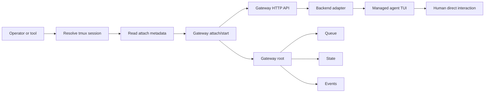

## Context

This repo already has strong building blocks for live agent sessions: tmux-backed agent identities, persisted session manifests, runtime-managed environment publication, and backend-specific control adapters. A separate mailbox protocol is being explored elsewhere in the repo, but that system is not mature enough to become a dependency of this change. What the repo still lacks is a per-agent control plane that can sit close to one live session, expose a stable HTTP endpoint, arbitrate competing requests, normalize backend status, schedule follow-up work, and record recovery decisions.

The key architectural change in this revision is to decouple gateway lifecycle from agent lifecycle. The gateway remains optional. A session may run with no gateway, may start with a gateway already attached, or may gain a gateway later after the managed TUI is already running. That change preserves rollout flexibility and unlocks a more powerful long-term story: runtime-owned sessions can gain gateway support after launch, and manually launched tmux-backed sessions can become gateway-attachable later if they publish the same attach contract.

The operator-facing UX constraint also shifts slightly in order to support that lifecycle. The system still must not create a second visible operator surface, but the gateway no longer needs to live in the same tmux window as the TUI. Instead, the gateway becomes an out-of-band companion process that discovers and controls the live session through tmux env pointers, backend metadata, and durable per-agent state. That makes "attach later" and "stop or restart independently" tractable without trying to inject a background shell into an already-running interactive TUI surface.

This revision keeps the gateway explicitly independent from the mailbox system. Mailbox-triggered enqueueing, mailbox-aware scheduling rules, mailbox-specific env bindings, and mailbox-specific request kinds are still deferred until the mailbox contract is mature enough to integrate cleanly.



## Goals / Non-Goals

**Goals:**

- Keep the gateway optional and additive so non-gateway sessions remain valid and usable.
- Allow the gateway to start either together with the agent or later by attaching to a running tmux-backed session.
- Preserve the operator UX requirement that gateway support introduces no second visible tmux pane or window.
- Reuse existing tmux session env publication patterns for discovery and extend them into a stable gateway-attach contract.
- Separate "gateway-capable session" from "gateway-running session" so the gateway can be started, stopped, and restarted independently.
- Support runtime-owned attach first while designing the attach contract so manually launched sessions can participate later.
- Keep a durable per-agent queue and state root so gateway restart does not lose accepted work and later attach flows have somewhere to persist state.
- Keep the HTTP contract backend-extensible and independent from the mailbox protocol.

**Non-Goals:**

- Hard security isolation against a human with direct tmux access on the same host.
- Requiring the gateway to be co-started with every agent session.
- Requiring the gateway to share the same shell process or tmux window as the foreground TUI.
- Recovering a full tmux-session or tmux-server loss from inside the gateway process itself.
- Automatically attaching a gateway to arbitrary tmux sessions that expose no attach metadata at all.
- Integrating the gateway directly with the mailbox system in v1.
- Solving authentication, authorization, or network perimeter hardening for explicitly enabled all-interface HTTP exposure in v1.

## Decisions

### 1) The gateway is an optional independently managed companion process, not a launch prerequisite

The gateway is an independently managed per-agent companion process. It may be absent, may be attached immediately after session startup, or may be attached later to an already-running session. The gateway must not create a visible tmux pane or window of its own, but it does not need to share the same shell lifecycle as the managed TUI.

There are two primary activation paths:

- launch-attached: the runtime starts the agent session, then immediately resolves attach metadata and starts the gateway companion for that live session
- attach-later: a lifecycle command resolves an already-running tmux session, reads its attach metadata, and starts the gateway companion without restarting the agent

Conceptually:

```text
launch-attached
  start agent session
  -> publish attach metadata
  -> start gateway daemon
  -> publish live gateway bindings

attach-later
  resolve live tmux session
  -> read attach metadata
  -> start gateway daemon
  -> publish live gateway bindings
```

This design is intentionally different from the earlier same-window wrapper model. A co-start wrapper remains an optional implementation strategy for some backends later, but it is no longer the defining lifecycle contract. The gateway must not depend on being injected before the TUI `exec`s, because that would make post-launch attach and independent stop or restart awkward or impossible.

Rationale: independent lifecycle is the cleanest way to keep the gateway optional while still making it usable later for already-running agents and future manual sessions.

Alternatives considered:

- Mandatory same-window sidecar wrapper. Rejected because it over-couples gateway availability to backend launch and blocks later attach flows.
- Separate visible tmux pane or window. Rejected because it violates the operator UX constraint.
- In-process gateway inside the agent TUI process. Rejected because it ties lifecycle and recovery to tool-specific internals.

### 2) Attach discovery is tmux-env-driven and unified by a secret-free attach contract

The gateway attaches to a running session by resolving tmux session identity and reading secret-free discovery metadata from that session's tmux environment.

Existing runtime-owned env pointers remain foundational:

- `AGENTSYS_MANIFEST_PATH`
- `AGENTSYS_AGENT_DEF_DIR`

For runtime-owned sessions, those existing pointers already provide enough information to discover the persisted session manifest and the agent definition root. This revision proposes standardizing that into one uniform attach contract file plus an explicit gateway-root pointer:

- `AGENTSYS_GATEWAY_ATTACH_PATH`
- `AGENTSYS_GATEWAY_ROOT`

For runtime-owned sessions in v1, `AGENTSYS_GATEWAY_ATTACH_PATH` points to `<AGENTSYS_GATEWAY_ROOT>/attach.json`.

That file should be a secret-free JSON payload describing how a gateway can attach to the addressed session. Runtime-owned sessions can materialize it from their manifest and launch metadata. Manual launchers can create and publish the same file directly even when no gig-agents session manifest exists.

The attach contract should include fields such as:

- schema version
- runtime session id when one exists
- canonical agent identity or tmux session name
- backend adapter kind
- working directory
- manifest path when one exists
- agent definition directory when one exists
- backend adapter metadata needed for observation or control
- default gateway host or port preferences when available

The important distinction is that attach metadata describes how to attach a gateway to a live session, not whether a gateway is currently running.

Rationale: this keeps discovery grounded in existing tmux env patterns while giving runtime-owned and manual sessions one future-proof attachability contract.

Alternatives considered:

- Derive everything only from `AGENTSYS_MANIFEST_PATH`. Rejected because manually launched sessions may have no runtime manifest at all.
- Encode all attach metadata directly in tmux env vars. Rejected because the contract will grow and is easier to evolve as a versioned file path.
- Require every attach-later flow to be fully hand-configured from CLI flags. Rejected because it is too error-prone for routine operator use.

### 3) Stable attachability metadata and live gateway bindings are separate concepts

This revision separates stable "this session can have a gateway" metadata from ephemeral "a gateway is running right now" metadata.

A per-agent gateway root remains useful, but it now represents stable attachability and durable state rather than only the lifecycle of one co-started sidecar instance. A representative layout is:

```text
<runtime_root>/gateways/<gateway-attach-identity>/
  protocol-version.txt
  attach.json
  desired-config.json
  state.json
  queue.sqlite
  events.jsonl
  logs/
    gateway.log
  run/
    current-instance.json
    gateway.pid
```

For runtime-owned sessions in v1, `<gateway-attach-identity>` is the runtime-generated `session_id` already used to key the session manifest. Future manual sessions can publish a different stable attach identity through their attach contract once that manual-session schema is defined.

The main split is:

- stable attachability pointers, `AGENTSYS_GATEWAY_ATTACH_PATH` and `AGENTSYS_GATEWAY_ROOT`
- live gateway bindings, such as `AGENTSYS_AGENT_GATEWAY_HOST`, `AGENTSYS_AGENT_GATEWAY_PORT`, `AGENTSYS_GATEWAY_STATE_PATH`, and `AGENTSYS_GATEWAY_PROTOCOL_VERSION`

Stable attachability metadata may exist even when no gateway process is running. Live bindings only describe the currently active gateway instance and may disappear or change across restart.

Because the gateway can be stopped and started independently, listener host and port are no longer part of immutable session identity. They become current-instance metadata. Desired defaults may persist, but the active listener is valid only while the corresponding gateway instance is alive.

Capability publication for runtime-owned sessions creates or materializes the gateway root, writes `protocol-version.txt` plus `attach.json`, and seeds `state.json` with a protocol-versioned offline or not-attached snapshot even before the first live gateway attach. Graceful detach rewrites `state.json` back to that offline or not-attached condition while clearing live bindings.

If a gateway instance starts successfully with a system-selected port, that resolved host and port become the desired listener persisted in `desired-config.json` for later restarts until a caller explicitly overrides them.

On graceful shutdown, the gateway lifecycle should clear live gateway bindings from the tmux session while preserving stable attachability metadata. On crash, stale live bindings are possible, so clients must validate them through health checks or run-state files instead of trusting tmux env alone.

Rationale: independent lifecycle only works cleanly if discovery of attachability is more stable than discovery of the currently running gateway process.

Alternatives considered:

- Treat host and port as permanent session identity. Rejected because independent stop or restart makes them instance-level facts, not timeless identity.
- Publish only live host and port bindings. Rejected because attach-later becomes impossible when the gateway is not already running.

### 4) The HTTP API remains package-owned, but gateway lifecycle control is a separate concern

The gateway still exposes a local HTTP API for health inspection, status inspection, and gateway-managed request submission. The current v1 API shape remains directionally good:

- `GET /health`
- `GET /v1/status`
- `POST /v1/requests`

The important refinement is that gateway lifecycle is not part of that per-agent request API. Starting, attaching, detaching, or stopping a gateway is a lifecycle-control action that happens before a caller can use the HTTP surface.

That means gateway-aware callers now have two phases:

1. ensure a gateway is attached and healthy for the target session
2. use the HTTP API for status or queued work submission

The queue remains durable and gateway-owned. External callers still do not mutate SQLite directly.

Rationale: separating lifecycle control from request submission keeps the HTTP contract small and lets gateway activation evolve independently from per-request semantics.

### 5) Initial gateway state is snapshot-based, and `offline` includes "not currently attached"

Because the gateway may attach after the agent has already been running, the gateway cannot assume it observed the entire session from launch. When attaching to an already-running session, it initializes from:

- the current live observation of the backend or tmux surface
- any previously persisted gateway root state when one exists
- the attach contract

It does not attempt to reconstruct every pre-attach operator action or backend transition that occurred before the gateway existed.

The status model remains useful, but `gateway_state=offline` now has a broader meaning: the gateway may simply not be attached right now, not necessarily that it crashed unexpectedly. `state.json` remains a stable local read contract, but it may describe last-known status plus current gateway absence rather than continuous full-session observation from the original agent launch.

Rationale: later attach is only viable if the gateway is allowed to seed itself from current state instead of pretending it has launch-time omniscience.

### 6) The scheduler still owns single-writer automation, but only while a gateway is attached

The queueing and single-writer scheduling model still holds. When a gateway is attached, terminal-mutating work flows through one durable execution slot and human interaction remains a first-class scheduling signal.

The key difference is that this control plane is active only while a gateway is attached. Direct runtime or operator interaction remains possible when no gateway is running. That means the design should distinguish:

- gateway-capable session: attach metadata exists and a gateway could be attached
- gateway-running session: a live gateway instance is attached and currently owns the automation queue

In v1, public terminal-mutating request kinds can still remain narrow, such as `submit_prompt` and `interrupt`, while timer-driven or wakeup-oriented work remains internal scheduler behavior.

Rationale: keeping the single-writer automation semantics limited to active gateway periods avoids pretending the system always has a control plane when it explicitly does not.

### 7) Gateway restart and later attach both recover from stable roots, but they mean different things

Gateway restart and later attach are related but not identical:

- restart: the same logical gateway root already existed, accepted queued work may already exist, and the new process must recover it
- first attach to an ungatewayed running session: for runtime-owned sessions in v1 the gateway root already exists from capability publication, while future manual sessions may still materialize that root lazily; in either case, no prior queue may exist and the initial status is seeded from a current observation snapshot

This distinction should be explicit in the design because it changes what "recovery" means. Restart is recovery of prior gateway-owned state. First attach is establishment of gateway-owned state for a session that previously had none.

Independent stop or restart should not require stopping the agent itself. Conversely, normal agent-session teardown may choose to stop the gateway as cleanup when the runtime owns both processes, but that is a policy decision rather than a hard lifecycle constraint.

Rationale: treating first attach and restart as the same event would blur lifecycle edges and make state semantics harder to reason about.

### 8) Runtime integration splits into capability publication, optional auto-attach, and gateway-aware control

Runtime integration now has three layers instead of one:

1. capability publication:
   new runtime-owned tmux-backed sessions publish attach metadata by default in v1, making them gateway-capable even when no gateway is running
2. optional auto-attach:
   a start-time flag may request immediate gateway attach after session startup, but that is a convenience path rather than the only path
3. gateway-aware control:
   when a live gateway exists, gateway-aware tools use it for managed request submission and status reads

This suggests a semantic shift for launch flags:

- `--enable-gateway` is no longer best thought of as "this session may ever have a gateway"
- it becomes "auto-attach a gateway at launch if possible"

Runtime-owned direct control can remain available for non-gateway sessions and for sessions where no gateway is currently attached. In v1, gateway-aware control paths require an already-running gateway and fail explicitly if none is attached; a future explicit "ensure attached" mode can be considered later, but ordinary control commands do not auto-attach the gateway as a side effect.

For future manual sessions, the same idea applies: publish attach metadata first, then decide later whether or when to actually start the gateway.

Rationale: this keeps runtime launch simple while making attach-later a first-class design goal instead of a special exception.

## Risks / Trade-offs

- [Gateway attach metadata is present but incomplete or stale] -> Version the attach contract, validate it strictly, and fail attach explicitly rather than guessing.
- [Clients trust stale live gateway env bindings after a crash] -> Treat tmux env bindings as hints and require health or run-state validation before use.
- [Later attach misses important earlier operator or backend events] -> Define the initial attach state as snapshot-based and do not promise full pre-attach history.
- [Independent lifecycle makes host and port less stable] -> Distinguish desired listener config from live instance bindings and avoid treating host or port as permanent session identity.
- [Manual session support becomes too magical] -> Require a documented attach contract for manual sessions instead of trying to infer arbitrary tmux layouts.
- [Runtime and gateway-aware control paths diverge] -> Keep gateway-aware behavior explicit and preserve direct control for sessions with no gateway attached.
- [Operator expectations become unclear about whether a session "has a gateway"] -> Use explicit language and status distinctions between gateway-capable and gateway-running.

## Migration Plan

1. Reframe the design from "same-window sidecar launched before the TUI" to "optional independently managed companion process with no visible operator surface."
2. Introduce a stable secret-free attach contract for runtime-owned tmux sessions and publish it through tmux envs alongside existing manifest and agent-definition pointers.
3. Keep start-time gateway attachment as an optional convenience flow rather than a prerequisite for gateway capability.
4. Add explicit attach and detach lifecycle surfaces for runtime-owned sessions so the gateway can be started or stopped independently.
5. Keep the HTTP request API stable and queue-backed while treating lifecycle control as a separate layer.
6. Extend the same attach contract to future manual launchers so manually started sessions can opt into gateway attachability later without requiring gig-agents to have launched them originally.

## Open Questions

- What is the minimal attach contract for manual sessions that is still flexible enough for future backends?
- When an agent session is stopped by runtime-owned teardown, should the runtime stop an attached gateway automatically or leave it as an independent process that reports offline state until explicitly stopped?
- When launch-time auto-attach fails after the agent session has already started, should the runtime keep that agent session running or tear it down as part of attach failure handling?
