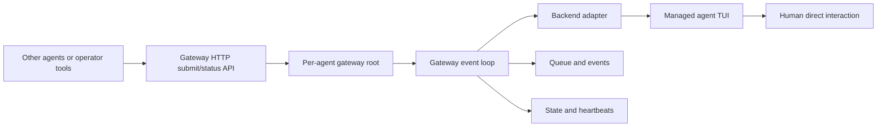

## Context

This repo already has strong building blocks for live agent sessions: tmux-backed agent identities, persisted session manifests, runtime-managed environment publication, and CAO-backed interactive terminals. A separate mailbox protocol is being explored elsewhere in the repo, but that system is not mature enough to become a dependency of this change. What the repo still lacks is a per-agent control plane that sits close to one live session, exposes a stable HTTP gateway endpoint, arbitrates competing requests, normalizes backend status, schedules follow-up work, and records recovery decisions.

The user-facing constraint for this change is unusually specific and should drive the architecture: the gateway must not appear as a separate tmux window or pane. It must live in the same tmux window as the managed agent TUI, run silently as a background process, and avoid turning the session into a two-surface operator experience. At the same time, direct human interaction with the agent TUI remains a supported feature of the system, not an error case. That means the gateway cannot assume exclusive ownership of the terminal surface and must be designed to observe, tolerate, and reconcile human-driven TUI changes.

The first implementation only needs to cover one host's network interfaces and one port per managed session. The default bind host should remain loopback (`127.0.0.1`) for safer local operation, while `0.0.0.0` remains an explicit opt-in when operators need all-interface access. CAO remains a useful lower-level backend adapter, but the gateway contract should not be CAO-specific so it can survive backend replacement later.

This revision also keeps the gateway explicitly independent from the mailbox system. Mailbox-triggered enqueueing, mailbox-aware scheduling rules, mailbox-specific env bindings, and mailbox-specific request kinds are deferred until the mailbox contract is mature enough to integrate cleanly.



## Goals / Non-Goals

**Goals:**

- Add a per-agent gateway sidecar that runs in the same tmux window lifecycle as the managed agent TUI without introducing a separate visible tmux surface.
- Resolve one stable HTTP gateway host and port for each gateway-managed session before launch and publish that listener address for discovery.
- Give each managed agent one durable local control plane for request admission, permission policy, priority ordering, queueing, timer-driven wakeups, health observation, and recovery.
- Preserve direct human TUI interaction as a supported workflow by treating it as concurrent operator activity that the gateway must tolerate rather than forbid.
- Normalize backend-specific state into gateway-owned status records that external tools can query without scraping raw tmux output directly.
- Store queued work and gateway events durably so gateway restart or transient failures do not lose outstanding requests.
- Keep the gateway contract backend-neutral and single-port-per-session, with a safe default bind host and explicit all-interface opt-in, so future discovery, access control, or distributed coordination can build on it later without redefining the per-agent model.

**Non-Goals:**

- Hard security isolation against a human with direct tmux access on the same host.
- Recovering a full tmux-session or tmux-server loss from inside the in-window sidecar itself.
- Distributed agent discovery, remote queue replication, or cross-host request delivery in v1.
- Integrating the gateway directly with the mailbox system in v1; mailbox-triggered enqueueing and mailbox-aware automation are deferred until the mailbox contract is mature.
- Silently hopping to a different port after launch-time gateway-port resolution or bind failure.
- Requiring exclusive gateway ownership of the TUI surface or treating human direct interaction as protocol corruption.
- Designing a generic cluster-wide scheduler in this change.
- Solving authentication, authorization, or network perimeter hardening for explicitly enabled all-interface HTTP exposure in v1.

## Decisions

### 1) The gateway runs as a silent same-window sidecar process launched before the foreground TUI

The gateway will be started in the same tmux window as the managed agent by a wrapper-style launch contract that backgrounds the gateway and then `exec`s the foreground TUI command. The sidecar itself will run a FastAPI application served as an HTTP service whose bind host defaults to `127.0.0.1` and may be set to `0.0.0.0` when explicitly configured. The steady-state operator experience remains a single visible TUI surface.

Conceptually, the launch shape is:

```sh
gatewayd --config /abs/path/gateway-bootstrap.json --host 127.0.0.1 --port 43123 >>/abs/path/logs/gateway.log 2>&1 &
exec <managed-agent-foreground-command>
```

This structure matters for two reasons:

- there is no second visible tmux window or pane for operators to accidentally enter, and
- there is no idle shell prompt left behind during normal execution.

The sidecar must not read from stdin, print to the terminal, or rely on an interactive terminal UI of its own. All stdout and stderr are redirected to log files under the gateway root. Regardless of whether it binds on `127.0.0.1` or `0.0.0.0`, the FastAPI service is not part of the visible operator terminal surface.

For CAO-backed sessions, the runtime-owned bootstrap path should wrap the provider launch so the gateway starts in the same tmux window before the provider TUI takes over. For other tmux-backed interactive surfaces, the same wrapper contract should be used when the runtime owns a persistent foreground command.

FastAPI is the chosen service framework for this change because it gives the gateway a well-typed local HTTP contract, predictable request and response validation, and a straightforward path to internal health and status endpoints without coupling callers to SQLite schema details.

Rationale: this satisfies the operator UX constraint directly while preserving the shared lifecycle between the gateway and the managed terminal surface.

Alternatives considered:

- Separate tmux window or pane. Rejected because it creates an operator-visible surface the user explicitly does not want.
- Central broker process per runtime root. Rejected because it weakens per-agent locality and recovery independence.
- In-process gateway inside the agent TUI binary. Rejected because it couples policy and recovery to tool-specific internals and makes backend replacement harder.

### 2) Gateway listener host and port resolution happen once at launch with explicit precedence and fail-fast conflict handling

Each gateway-managed session gets one effective HTTP gateway bind host and port resolved before the sidecar is launched.

The precedence order for the bind host is:

1. `start-session --gateway-host`
2. caller env `AGENTSYS_AGENT_GATEWAY_HOST`
3. blueprint config `gateway.host`
4. default `127.0.0.1`

Allowed bind-host values in this change are exactly:

- `127.0.0.1`
- `0.0.0.0`

The precedence order for the port is:

1. `start-session --gateway-port <port>`
2. caller env `AGENTSYS_AGENT_GATEWAY_PORT=<port>`
3. blueprint config `gateway.port: <port>`
4. one system-selected free port when no explicit port source is present

The resolved bind host and port become part of the session's gateway identity. The runtime writes them into gateway bootstrap metadata, persists them in the session manifest, and publishes them into the tmux session environment for discovery by gateway-aware tools. When the effective host is `127.0.0.1`, the gateway is reachable only through loopback on that port. When the effective host is `0.0.0.0`, local callers may still use `127.0.0.1:<resolved-port>` while non-local callers may use any reachable interface address for the host with the same port.

Blueprint configuration should remain secret-free and minimal. A representative shape is:

```yaml
schema_version: 1
name: gpu-kernel-coder
brain_recipe: ../brains/brain-recipes/codex/gpu-kernel-coder-default.yaml
role: gpu-kernel-coder
gateway:
  host: 127.0.0.1
  port: 43123
```

When the port comes from the free-port fallback, the runtime chooses one currently available local port exactly once during launch preparation and then treats that selected port as fixed for the session being launched. If the FastAPI sidecar later cannot bind the resolved host-plus-port listener because another process already owns it, the launch fails explicitly and the agent session is not started. The runtime must not silently choose a different port after resolution, because that would break discovery and make operator expectations drift from what the launch inputs declared.

Rationale: operators and tests sometimes need a predictable listener address, ad hoc sessions need easy overrides, loopback should remain the safe default, and free-port fallback is still useful for default ergonomics. A single precedence chain plus fail-fast bind behavior keeps the resulting session identity unambiguous.

Alternatives considered:

- Always require an explicit gateway port. Rejected because it adds friction to routine local launches.
- Always auto-pick a free port. Rejected because it removes a useful control point for operator workflows, tests, and blueprint-defined defaults.
- Treat port conflicts as permission to silently pick the next free port. Rejected because it would make discovery unstable and violates the requested fail-fast behavior.
- Default to `0.0.0.0` for every session. Rejected because loopback is the safer default for ordinary local workflows.
- Put gateway-port defaults in recipes rather than blueprints. Rejected for this change because the requested default belongs to named launched-agent definitions rather than reusable brain recipes.

### 3) Each gateway gets a durable per-agent root under the runtime root plus live tmux env pointers

The gateway state should live in a deterministic per-agent directory such as:

```text
<runtime_root>/gateways/<canonical-agent-identity>/
  protocol-version.txt
  bootstrap.json
  state.json
  queue.sqlite
  events.jsonl
  logs/
    gateway.log
  locks/
    gateway.lock
  run/
    gateway.pid
```

`state.json` is the current read-optimized status snapshot for external readers. `queue.sqlite` is the durable source of truth for queued requests, timers, execution leases, and completion records. `events.jsonl` is append-only audit history. `bootstrap.json` captures the runtime-provided launch configuration the sidecar needs after restart, including the resolved gateway host and port.

The runtime should publish live tmux session environment pointers for the addressed session, including at minimum:

- `AGENTSYS_AGENT_GATEWAY_HOST`
- `AGENTSYS_AGENT_GATEWAY_PORT`
- `AGENTSYS_GATEWAY_ROOT`
- `AGENTSYS_GATEWAY_STATE_PATH`
- `AGENTSYS_GATEWAY_PROTOCOL_VERSION`

The persisted session manifest should also record the gateway launch mode and root path so a resumed control path can discover the expected gateway layout even if live tmux env needs validation or refresh.

Rationale: external tooling needs a stable discovery path, and the gateway needs durable queue state that survives process restart.

Alternatives considered:

- Purely in-memory queue and status. Rejected because recovery and audit would be too weak.
- Tmux environment as the only source of gateway state. Rejected because env variables are useful pointers, not a durable event store.
- One shared runtime-wide gateway database. Rejected because it creates unnecessary coupling between otherwise independent agent sessions.

### 4) External callers interact through package-owned HTTP clients over the resolved local port, while SQLite is the internal persistence layer

The gateway protocol should be reachable through the resolved gateway listener address, but external callers should not mutate `queue.sqlite` directly. Instead, the repo should expose package-owned submit and query surfaces that talk to the gateway's FastAPI service over HTTP and let that service validate and serialize requests into the gateway store.

This boundary is intentional for mailbox maturity as well: the gateway does not grow a special mailbox path in this change. If a future mailbox workflow wants to enqueue work, it should do so through the same validated submission interface as any other local caller in a follow-up change.

At minimum, the HTTP surface should cover:

- health or liveness inspection,
- current gateway status inspection, and
- submission of gateway-managed requests.

Requests should be stored as structured records with fields such as:

- `request_id`
- `sender_principal_id`
- `target_agent_identity`
- `kind`
- `priority`
- `not_before_utc`
- `expires_at_utc`
- `payload_json`
- `requires_submit_ready`
- `coalescing_key`
- `status`

Informational queries, such as gateway status inspection, should be served by read-oriented HTTP routes backed by `state.json` or equivalent validated state reads and should not enter the execution queue. Terminal-mutating work should always flow through the durable queue so the gateway can serialize it.

Rationale: the gateway needs a stable contract for multiple local writers without turning SQLite schema details into a public interface.

Alternatives considered:

- Raw file-drop request directories. Rejected because ordering, de-duplication, and update semantics become harder once priorities and retries are involved.
- Raw SQLite writes by any caller. Rejected because it freezes low-level schema details into the public control contract.
- Direct tmux or CAO calls from all orchestrators. Rejected because it reintroduces the race conditions this change exists to remove.
- Ad hoc per-caller HTTP route definitions outside the gateway package. Rejected because the gateway needs one owned contract rather than path drift across callers.

### 5) The status model separates gateway health, agent state, terminal surface state, and execution state

The gateway should publish a structured status snapshot that keeps these concerns separate:

- `gateway_state`: `booting | online | degraded | recovering | offline`
- `agent_state`: `idle | busy | waiting_input | awaiting_operator | error | unknown`
- `surface_state`: `submit_ready | modal | blocked | disconnected | unknown`
- `execution_state`: `idle | running | backoff | blocked`

It should also include supporting fields such as:

- `gateway_port`
- `active_request_id`
- `queue_depth`
- `last_gateway_heartbeat_utc`
- `last_agent_observation_utc`
- `recovery_attempt_count`
- `last_error`

This separation is important because human interaction changes the surface frequently without necessarily implying that the gateway or agent is broken. For example, a human opening a slash-command menu should move `surface_state` out of `submit_ready` and pause queued injection, but it should not mark the gateway unhealthy.

Backend adapters should map CAO-native or shadow-parser evidence, headless runtime state, and tmux availability into this normalized status model. When the gateway cannot classify the surface safely, it should prefer `unknown` and avoid injection rather than guessing that the prompt is free.

Rationale: explicit separation makes the gateway robust to non-exclusive control of the TUI surface.

Alternatives considered:

- One flat `status` field like `busy` or `idle`. Rejected because it collapses health, control eligibility, and operator state into one ambiguous label.
- Treating any manual surface deviation as `error`. Rejected because direct human interaction is a supported feature, not misuse.

### 6) The gateway scheduler owns a single terminal-mutation slot and treats human activity as a first-class scheduling signal

Only one queued request at a time may hold the terminal-mutation lease for a given agent. The scheduler should order pending work by policy, priority, age, and eligibility while preserving single-writer semantics for terminal input.

Requests should divide into two broad classes:

- non-mutating reads, which can be served from gateway state without terminal injection, and
- terminal-mutating actions, which require the single active execution slot.

Low-value repeated work such as periodic wakeup nudges or deferred follow-up prompts should support coalescing so multiple pending requests collapse into one effective queued action. Timer-driven work should become ordinary queued requests rather than bypassing policy.

Human direct TUI interaction should not invalidate the queue. Instead:

- when the surface is not safely submit-ready, queued injection waits,
- when a human changes the surface mid-request, the gateway records the observation and reevaluates completion or retry policy,
- when the human resolves the blocking surface and the gateway sees a safe ready state again, queued work may continue.

The gateway should never assume that it may inject text merely because a request exists. Injection is allowed only when the backend adapter says the surface is eligible for that specific action.

Rationale: this keeps queue semantics stable while making human interaction a feature the scheduler understands rather than a source of silent corruption.

Alternatives considered:

- Optimistic concurrent sends with “last writer wins.” Rejected because it recreates the raw tmux race problem.
- Automatic interruption of human activity for high-priority gateway work. Rejected for v1 because it would make the operator experience brittle and surprising.

### 7) Recovery is conservative, backend-adapter-driven, and explicitly scoped below whole-session supervision

The gateway should own a bounded recovery ladder for failures inside the live agent surface:

1. refresh status and re-validate the latest observation,
2. wait or back off if the surface is merely non-ready or manually occupied,
3. attempt backend-native interruption or wakeup when policy allows,
4. restart the managed TUI using the runtime-owned backend adapter when the agent process is gone or unrecoverable,
5. move to `degraded` after the retry budget is exhausted.

Recovery must remain conservative because human interaction is allowed. The gateway should not forcibly inject control sequences into an unknown or operator-blocked surface unless the request type and policy explicitly permit that behavior.

Full tmux-session or tmux-server loss is out of scope for the same-window sidecar. If the whole tmux container disappears, an outer launcher or supervisor layer is responsible for re-establishing the session and then starting a fresh gateway from persisted runtime state.

Rationale: the sidecar can recover many agent-local failures, but it cannot be the recovery authority for the container it lives inside.

Alternatives considered:

- Aggressive automatic control-input recovery on any stall. Rejected because it would fight with valid human interaction and increase unintended terminal mutation.
- Making the gateway responsible for tmux-server resurrection. Rejected because that violates the failure-domain boundary created by same-window colocation.

### 8) Runtime integration is additive and should preserve non-gateway sessions

The runtime should treat gateway support as an additive session feature. New tmux-backed sessions that enable the gateway publish gateway pointers and launch the sidecar. Existing sessions without gateway support remain valid and resumable without backfilling a gateway requirement.

This design implies three integration points:

- session startup resolves the effective gateway port from CLI, env, blueprint, or free-port fallback, creates the gateway root, writes `bootstrap.json`, publishes tmux env pointers, and launches the same-window wrapper,
- session resume validates and republishes gateway pointers, including the persisted gateway port, and consults gateway state when the session is gateway-enabled,
- control commands targeting a gateway-enabled session prefer gateway-mediated request submission over raw concurrent tmux mutation.

Rationale: this reduces rollout risk and keeps older manifests and sessions from becoming invalid immediately.

Alternatives considered:

- Make the gateway mandatory for all existing tmux-backed sessions immediately. Rejected because it complicates rollout and recovery for sessions created before the new contract exists.
- Hide the gateway entirely from runtime/session metadata. Rejected because discovery and debugging would be unnecessarily difficult.

## Risks / Trade-offs

- [Background sidecar accidentally writes into the visible terminal] -> Redirect all gateway stdout and stderr to log files, forbid stdin reads, and keep all terminal interaction behind backend adapters or tmux control primitives rather than direct console writes.
- [A requested or resolved gateway listener address is already in use by another process] -> Resolve the effective host and port before launch, treat FastAPI bind failure as an explicit startup error, and do not silently substitute a different listener after resolution.
- [An explicitly enabled all-interface HTTP service expands the network-visible attack surface] -> Default to `127.0.0.1`, require explicit configuration for `0.0.0.0`, document that any host interface may expose the gateway in that mode, and defer authentication, authorization, and perimeter-hardening policy to follow-up changes or deployment controls.
- [Human operators can bypass gateway policy by typing directly into the TUI] -> Define the gateway as the supported automation path rather than a hard local security boundary, observe surface changes explicitly, and log when direct interaction changes queue eligibility or request outcomes.
- [Same-window colocation prevents the gateway from surviving full tmux-session loss] -> Persist queue and status on disk, keep recovery of whole-session loss in an outer supervisor layer, and scope the gateway to agent-local recovery only.
- [Readiness classification may be wrong on complex terminal surfaces] -> Normalize backend signals conservatively, publish `unknown` when confidence is low, and refuse automatic injection on uncertain surfaces.
- [Durable queue storage adds schema and compatibility burden] -> Keep the external protocol at the package-owned command layer, version the gateway root with `protocol-version.txt`, and treat SQLite as an internal implementation detail.
- [Gateway restart can leave stale active-request state] -> Store execution leases durably with heartbeat timestamps, reconcile incomplete leases on startup, and move abandoned work back to pending or failed according to policy.

## Migration Plan

1. Add gateway-aware manifest and tmux environment publication in an additive way so older sessions remain valid, including publication of the effective gateway port.
2. Introduce launch-time gateway-port resolution from CLI, env, blueprint, or free-port fallback for new gateway-enabled tmux-backed sessions.
3. Fail launch explicitly when the resolved gateway port cannot be bound instead of silently selecting another port.
4. Keep existing direct runtime control paths available for sessions that are not gateway-enabled.
5. On rollback, stop launching the sidecar for new sessions and ignore gateway-specific metadata for existing sessions; preserved gateway roots remain inspectable and can be cleaned up out of band.
6. Defer any default-on rollout until status normalization, listener-port discovery, and recovery behavior have been validated against real human-plus-automation interaction patterns.

## Open Questions

- Should the first implemented backend integration target only CAO-backed interactive sessions, or should it also cover other tmux-backed sessions that maintain a persistent foreground TUI?
- Do we want an explicit operator-facing “pause gateway queue” control in v1, or is observed surface state sufficient for the initial design?
- Which gateway request kinds should be first-class in v1 beyond generic prompt turns, wakeup nudges, and recovery-oriented actions, and which should wait for follow-up changes?
