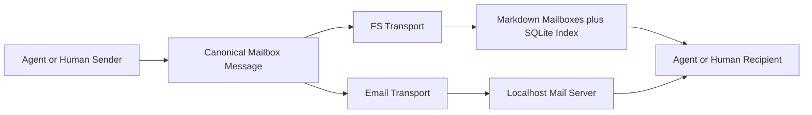
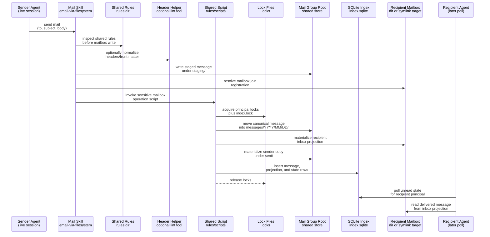

## Context

This repo already has strong primitives for agent identity, runtime roots, persisted session manifests, and tmux-backed long-lived sessions, but it does not yet have a durable async communication layer between agents. Current orchestration patterns rely on direct prompt delivery, ad hoc artifact handoff directories, or provider-specific inbox concepts. That is a poor fit for workflows where agents should respond later, where humans need to join the same conversation, or where the same coordination model should work both offline and through a localhost mail server.

This change introduces a mailbox-style protocol with one implemented transport and one explicit compatibility target:

- an implemented filesystem flavor with no daemon, where agents read and write mailbox state directly under a relocatable mailbox content root, and
- a future true-email adaptation target, where the same logical message model can later be carried over an actual mail transport without changing message semantics.

Key constraints:

- The filesystem flavor must remain daemon-free.
- Messages must be human-inspectable and human-authorable.
- Mutable mailbox state such as read/unread and starring should not require rewriting delivered message bodies.
- The protocol should fit existing `AGENTSYS-...` agent identities without making live session manifests the only addressing mechanism.
- The first version should stay local-host oriented; path-based attachments do not need cross-host portability.
- Mailbox operating instructions should be runtime-owned so they remain consistent across agents and transports.



## Goals / Non-Goals

**Goals:**

- Define one canonical mailbox message model implemented by the filesystem transport and intentionally compatible with future true-email adaptation.
- Make immutable message content live in Markdown so agents and humans can inspect conversations without specialized tooling.
- Keep mutable mailbox state in SQLite so read/unread, starred, archived, and thread views are queryable without rewriting message files.
- Use deterministic on-disk layout under a mailbox content root that defaults under the runtime root but can be relocated through env bindings.
- Support async polling by agents with simple periodic checks rather than synchronous rendezvous.
- Make human participation possible through filesystem mailboxes in this change while preserving semantics that can later be adapted to a normal mail client workflow.
- Keep the transport layer independent from any one runtime backend such as CAO or a specific CLI tool.
- Expose mailbox behavior to agents through runtime-generated system skills that use stable env-var bindings instead of literal transport coordinates.

**Non-Goals:**

- Cross-host or internet-routable email delivery.
- End-to-end encryption, DKIM/SPF/DMARC, or internet mail trust concerns.
- Full mailbox push/notification infrastructure in v1.
- Shared-work mailbox semantics where multiple workers race to claim one mailbox identity.
- Rich MIME binary attachment transport in v1; attachment references are the primary mechanism.
- Per-role or per-recipe authored mailbox skill content.
- Implementing a localhost mail server or true-email runtime transport in this change.

## Decisions

### 1) Canonical protocol = immutable envelope metadata plus Markdown body

The canonical message unit is an immutable message document with structured metadata and a Markdown body. The filesystem flavor stores that as `.md`; the email flavor projects the same logical fields into RFC 5322 headers plus a Markdown body.

The message model is:

```text
message_id        globally unique immutable id
thread_id         stable conversation id; root message uses its own id
in_reply_to       direct parent message id, optional for thread roots
references        ordered ancestor ids for email-style threading
created_at_utc    RFC3339 timestamp
from              sender principal
to                primary recipient principals
cc                optional copied principals
reply_to          optional explicit reply target principals
subject           human-friendly summary
body_markdown     main message body
attachments       reference attachments with metadata
headers           extensible transport-neutral metadata
```

Filesystem message files use YAML front matter followed by Markdown body:

```md
---
protocol_version: 1
message_id: msg-20260311T041500Z-a1b2c3d4
thread_id: msg-20260311T041500Z-a1b2c3d4
in_reply_to: null
references: []
created_at_utc: 2026-03-11T04:15:00Z
from:
  principal_id: AGENTSYS-orchestrator
  address: AGENTSYS-orchestrator@agents.localhost
to:
  - principal_id: AGENTSYS-research
    address: AGENTSYS-research@agents.localhost
cc: []
reply_to: []
subject: Investigate parser drift
attachments:
  - attachment_id: att-01
    kind: path_ref
    path: /abs/path/to/report.json
    media_type: application/json
    sha256: ...
    size_bytes: 1234
headers:
  tags: [parser, investigation]
---

Message body in Markdown.
```

Mutable state is intentionally excluded from message bodies. Read/unread, starred, archived, deleted, and thread summary state live only in SQLite. Thread ancestry is carried in the immutable envelope; thread views are cached in SQLite for speed.

Rationale: this keeps message content durable and audit-friendly while allowing mailbox UX state to change freely.

Alternatives considered:

- SQLite as the sole source of truth. Rejected because it makes messages less inspectable and harder to recover manually.
- JSON-only message bodies. Rejected because humans should be able to read and draft messages comfortably.
- Raw RFC 822 `.eml` as the canonical stored form. Rejected because it is less approachable for direct filesystem workflows and less convenient for Markdown-native prompts.

### 2) Addressing is principal-based and email-like, not manifest-path-based

The protocol addresses recipients by mailbox principals rather than live session handles. A principal has:

- `principal_id`: stable local identifier such as `AGENTSYS-gpu` or `human-alice`
- `address`: email-like transport address such as `AGENTSYS-gpu@agents.localhost`
- optional local metadata such as display name, manifest path hint, or role

For agent principals, the preferred default `principal_id` is the existing canonical agent identity in the `AGENTSYS-...` namespace. This aligns mailbox naming with runtime session naming without making the mailbox dependent on one specific live session manifest.

Manifest paths may still appear as optional local hints in SQLite metadata or transport config, but they are not part of the canonical message envelope. A mailbox survives agent restarts; a session manifest does not need to be the mailbox address.

Rationale: mailbox identity should be durable across sessions and compatible with both filesystem and mail-server transports.

Alternatives considered:

- Address directly by session manifest path. Rejected because it makes conversations brittle across restarts and awkward for humans.
- Use opaque UUID mailbox ids everywhere. Rejected because humans and operator tools benefit from readable addresses.

### 3) Filesystem transport uses an env-configurable mailbox content root with Markdown projections and SQLite index

The filesystem flavor stores mailbox data under a deterministic internal layout rooted at the effective mailbox content root. That mailbox content root is carried through runtime-managed env bindings, is not required to live under the runtime root, and defaults to `<runtime_root>/mailbox` when the runtime does not provide an explicit override:

```text
<mailbox_root>/
  protocol-version.txt
  index.sqlite
  rules/
    README.md
    protocols/
    scripts/
    skills/
  locks/
    index.lock
    principals/
      AGENTSYS-orchestrator.lock
      AGENTSYS-research.lock
      human-alice.lock
  messages/
    2026/
      03/
        11/
          msg-20260311T041500Z-a1b2c3d4.md
  attachments/
    managed/
      sha256/
        ab/
          cd/
            <digest>/
              report.json
  mailboxes/
    AGENTSYS-orchestrator/
      inbox/
      sent/
      archive/
      drafts/
    AGENTSYS-research -> /abs/path/private-mailboxes/AGENTSYS-research
    human-alice -> /abs/path/private-mailboxes/human-alice
  staging/
```

`messages/` contains the canonical immutable message files. `mailboxes/<principal>/...` contains mailbox-visible projections of those messages so recipients can work from familiar folders. Each `mailboxes/<principal>` entry may be either a concrete directory inside the shared mail root or a symlink to that principal's private mailbox directory outside the shared root. A participant dynamically joins the mail group by creating that symlink entry under `mailboxes/`, assuming filesystem permissions allow other participants to write through it. Symlink targets must expose the same mailbox substructure (`inbox/`, `sent/`, `archive/`, and `drafts/`) as an in-root mailbox directory.

The shared mail-group root still owns the canonical message store, locks, attachments, and shared SQLite index. Symlinked principal mailbox directories externalize mailbox projections, not the canonical message corpus itself.

`rules/` is the mailbox-local coordination surface for standardized interaction with the shared mail group. It should contain a mailbox-local `README.md`, protocol notes under `protocols/`, helper scripts under `scripts/`, and mailbox-operation helper skills under `skills/`. Agents interacting with the shared mail root are expected to consult `rules/` first so they follow mailbox-local conventions before reading or mutating shared mailbox state.

For sensitive operations that touch `index.sqlite` or `locks/`, the shared mailbox should provide implemented scripts under `rules/scripts/` for agents to invoke rather than expecting every agent to improvise raw SQLite or lock-file handling. Those scripts may be written in Python or shell:

- Python scripts should assume only the Python standard library and Python `>=3.11`
- shell scripts may be plain `.sh`

Typical sensitive operations include delivery commit, mailbox-state mutation, lock acquisition or release orchestration, index repair, and reindex flows.

`rules/scripts/` may also contain non-sensitive helper tools for message composition and consistency checks. A common example is a header-insertion or header-normalization script that takes parameters such as sender, recipients, subject, thread ancestry, or tags and emits or patches standardized message headers or YAML front matter. These tools act like linting or normalization helpers: agents are encouraged to use them when present, but they are not mandatory in the same way as the shared scripts for SQLite or lock-touching operations.

This is intentionally guidance, not hard enforcement. In v1, the system relies on the agent following its mailbox skill instructions to inspect `rules/` first. If an agent skips those shared rules and breaks the mailbox contract, that is considered agent misbehavior rather than supported transport behavior.

`attachments/managed/` is optional storage for attachments that should be copied into the mailbox store. For ordinary local workflows, attachment entries may remain as path references to arbitrary filesystem paths outside the mailbox root.

`AGENTSYS_MAILBOX_FS_ROOT` is the authoritative mailbox content root binding for sessions that use the filesystem transport. Agent-facing instructions and implementations should follow that env value rather than reconstruct mailbox paths from the runtime root.

`index.sqlite` holds:

- principal registry
- messages
- recipient lists
- mailbox folder projections
- per-recipient mailbox state
- attachment metadata
- cached thread summaries

The principal registry should record the effective mailbox registration for each principal, including whether `mailboxes/<principal>` is an in-root directory or a symlinked private mailbox target.

Rationale: the filesystem stays directly navigable while SQLite provides the query and mutable-state layer the user asked for.

Alternatives considered:

- Keep protocol guidance only in runtime-injected skills and repo docs, with no mailbox-local source of truth. Rejected because participants need mailbox-root-local rules, scripts, and helper skills that travel with the shared mail group itself.
- Force every principal mailbox directory to live physically under one shared root. Rejected because participants should be able to join a mail group by linking an existing private mailbox directory into the shared root without relocating their mailbox projections.
- Per-mailbox folders only, with no canonical message store. Rejected because multi-recipient duplication becomes harder to reconcile and reindex.
- Canonical store only, with no mailbox folder projections. Rejected because humans and simple agent pollers should be able to inspect `inbox/` and `sent/` directly.

### 4) Synchronization uses deterministic `.lock` files plus SQLite transactions; no background process

The filesystem transport has no helper daemon. Each sender performs delivery directly.

Write path:

1. Consult `rules/` for the current shared mailbox protocol guidance, helper scripts, and standardized mailbox skills.
2. Optionally use a lint-style helper from `rules/scripts/` to insert or normalize standardized headers or front matter during message composition.
3. Compose and validate the message in `staging/`.
4. Resolve recipient principal ids, mailbox registration targets, and attachment metadata.
5. For operations that touch `locks/` or `index.sqlite`, invoke the shared script from `rules/scripts/` rather than hand-rolling those sensitive steps inside the agent.
6. Acquire per-principal lock files for all affected principals in lexicographic order.
7. Acquire `locks/index.lock`.
8. Move the canonical message into `messages/...`.
9. Materialize mailbox projections in resolved recipient mailbox directories and sender `sent/`; recipient mailbox entries may be in-root directories or symlinked private mailbox targets.
10. Commit corresponding SQLite rows in one transaction.
11. Release locks.

Sender-to-recipient delivery in the filesystem flavor looks like this:



Read path:

- Agents should consult `rules/` before interpreting or mutating mailbox state so mailbox-local scripts and helper skills can refine the generic transport guidance.
- Listing and reading mailbox files is lock-free.
- Mutating mailbox state such as marking read or starring acquires the mailbox principal lock plus SQLite transaction, and those sensitive mutations should use the shared scripts in `rules/scripts/` rather than ad hoc SQLite or lock manipulation.
- Optional header-normalization or header-insertion scripts in `rules/scripts/` can be used as lint-style helpers during message composition, but they are not required for every mailbox interaction.
- SQLite uses a non-WAL journal mode so the transport does not rely on `index.sqlite-wal` or `index.sqlite-shm` sidecar files.

Crash recovery:

- Canonical message files are durable first-class artifacts.
- SQLite is treated as a rebuildable index plus mutable-state store.
- A future `reindex`/`repair` command can rebuild message and projection tables from the filesystem corpus, preserving message bodies even if index state is lost.
- Missing or dangling principal mailbox symlinks are treated as delivery-time registration failures rather than silent mailbox creation at an unexpected path.
- Missing or stale `rules/` content increases the chance of agent misuse, so mailbox maintainers should treat `rules/` as part of the operational mailbox surface rather than optional documentation.
- Missing or broken scripts under `rules/scripts/` can block standardized sensitive operations, so mailbox maintainers should treat those scripts as part of the operational transport surface rather than optional examples.
- Optional header-helper scripts may be absent without breaking transport correctness, but their absence can reduce consistency in how agents format message headers or front matter.

Rationale: the protocol stays daemon-free and plain-filesystem-friendly while still coordinating concurrent writers safely.

Alternatives considered:

- A local queue daemon. Rejected because the filesystem flavor explicitly should not require a background process.
- SQLite-only locking. Rejected because it does not protect multi-file projection writes by itself.
- Require every participant to relocate mailbox projections under the shared root before joining. Rejected because symlink registration gives a simpler dynamic-join path for agent-owned private mailbox directories.
- Let every agent implement its own SQLite and lock-file mutations independently. Rejected because sensitive shared-state operations should be funneled through mailbox-local scripts under `rules/scripts/` so the group can standardize behavior.

### 5) Threading is explicit and transport-neutral

Threading is not inferred from subject prefixes alone. The protocol uses:

- `thread_id` as the canonical conversation id
- `in_reply_to` for direct parent relationship
- `references` for full ancestry chain

Rules:

- A new root message sets `thread_id = message_id`.
- A reply keeps the parent thread id.
- A forward may start a new thread unless the sender explicitly chooses to keep the existing thread id.
- Subject prefixes such as `Re:` are cosmetic and may be added for human familiarity, but they do not drive threading.

SQLite caches per-thread summaries such as latest message time, unread count per principal, and normalized subject.

For email transport, standard `In-Reply-To` and `References` headers carry the ancestry, and `X-Agent-Thread-ID` carries the explicit thread id so the server flavor does not depend on subject heuristics.

Rationale: explicit threading is necessary for deterministic async agent workflows.

Alternatives considered:

- Subject-only threading. Rejected because it is too ambiguous for automation.

### 6) Attachments are reference-first, with optional managed-copy mode

The first version treats attachments primarily as file references, not embedded binary payloads. Each attachment entry records:

- stable `attachment_id`
- `kind` such as `path_ref` or `managed_copy`
- absolute path or managed-store path
- media type
- size
- digest
- optional human label

Two modes are supported:

- `path_ref`: points at an arbitrary existing filesystem path
- `managed_copy`: copies the file into `attachments/managed/...` and references that managed path

For the filesystem flavor, either mode is valid. For the email flavor, path references remain valid because the server is localhost-only and shares the same host filesystem. Rich MIME binary transport is deferred.

Rationale: reference attachments match the user's requirement and avoid unnecessary copying of large artifacts.

Alternatives considered:

- Always copy attachments into the mailbox store. Rejected because some workflows want zero-copy references to large local outputs.
- Always embed MIME attachments. Rejected because it complicates compatibility and duplicates local artifacts needlessly.

### 7) Canonical protocol stays compatible with future true-email adaptation

This change does not implement a localhost mail server or runtime email transport adapter. Instead, it defines how the canonical mailbox model maps onto standard mail surfaces so a future adapter can be added without changing mailbox semantics.

Mapping:

- `message_id` -> `Message-ID`
- `created_at_utc` -> `Date`
- `from`, `to`, `cc`, `reply_to`, `subject` -> standard mail headers
- `in_reply_to` and `references` -> standard threading headers
- `thread_id` -> `X-Agent-Thread-ID`
- extra protocol metadata -> `X-Agent-*` headers or a small structured sidecar part when headers would become too large
- body -> `text/markdown`

Future true-email adapters should normalize inbound or outbound messages through the same canonical model as the filesystem transport and should project normalized messages into the shared mailbox index so filesystem views, future email clients, and agent pollers stay in sync.

Rationale: protocol compatibility matters now; true-email transport implementation can follow once the filesystem-first protocol and agent workflows are proven.

Alternatives considered:

- Separate protocol definitions for filesystem and email. Rejected because it would split the user model and complicate agent logic.
- Implement both filesystem and true-email transports in the same change. Rejected because it expands scope and introduces avoidable server/runtime complexity before the filesystem-first protocol is validated.

### 8) Agents poll periodically; humans participate through the same artifacts

Recipients consume mail asynchronously by polling their mailbox view.

For agent participants:

- each agent is configured with one mailbox principal
- the poller queries unread messages for that principal from SQLite or scans the principal `inbox/`
- after handling a message, the agent may mark it read and reply in the same thread

For human participants:

- filesystem flavor: inspect or author Markdown messages in familiar mailbox folders, ideally through helper CLI/editor workflows
- email flavor: use a normal mail client against the localhost server

This design assumes one active consumer per mailbox principal in the common case. Shared-team mailbox claiming semantics are deferred.

Rationale: periodic polling is the simplest async model that works in both flavors and matches the user's requirement that agents check mail and respond later.

Alternatives considered:

- Push-only notifications. Rejected because they would force extra infrastructure and do not fit the daemon-free flavor.

### 9) Mailbox access is exposed through runtime-owned system skills

Mailbox operations should not be re-explained independently in each role or recipe. Instead, the runtime generates one or more mailbox system skills from platform-owned templates and injects them into every launched agent session under a reserved runtime-owned namespace.

These skills are transport-neutral at the content level: they describe mailbox behaviors and refer only to runtime-managed bindings rather than hard-coded filesystem paths, server URLs, or mailbox addresses.

Rationale: this gives every agent the same mailbox affordances, keeps the mailbox UX centrally maintainable, and avoids stale or divergent instructions across roles.

Alternatives considered:

- User-selected mailbox skills only. Rejected because mailbox participation is a platform feature that should behave consistently across all agents.
- Per-role mailbox instructions. Rejected because it duplicates transport details and becomes stale as bindings change.

### 10) Generated mailbox skills use a stable env-var contract with refreshable bindings

Generated mailbox skill templates resolve mailbox bindings through a stable set of runtime-managed env vars. The runtime populates those bindings at session start and can refresh them on demand without regenerating the underlying skill templates.

The common binding contract is:

```text
AGENTSYS_MAILBOX_TRANSPORT=none|filesystem|email
AGENTSYS_MAILBOX_PRINCIPAL_ID=<stable mailbox principal id>
AGENTSYS_MAILBOX_ADDRESS=<email-like mailbox address>
AGENTSYS_MAILBOX_BINDINGS_VERSION=<monotonic binding version or timestamp>
```

Transport-specific bindings extend that base contract and SHALL use transport-specific env key prefixes so the active transport's bindings are visually and mechanically distinct:

- filesystem bindings use `AGENTSYS_MAILBOX_FS_*`
- mail-system bindings use `AGENTSYS_MAILBOX_EMAIL_*`

Examples:

```text
# filesystem
AGENTSYS_MAILBOX_FS_ROOT=<mailbox_root>
AGENTSYS_MAILBOX_FS_SQLITE_PATH=<mailbox_root>/index.sqlite
AGENTSYS_MAILBOX_FS_INBOX_DIR=<mailbox_root>/mailboxes/<principal>/inbox

# reserved for future mail-system adapter
AGENTSYS_MAILBOX_EMAIL_IMAP_URL=imap://localhost:1143
AGENTSYS_MAILBOX_EMAIL_SMTP_URL=smtp://localhost:1025
```

In this change, the runtime populates only the common bindings plus filesystem-specific bindings. `AGENTSYS_MAILBOX_FS_ROOT` carries the effective filesystem mailbox root for the session; when no explicit filesystem mailbox root override is configured, the runtime defaults that binding to `<runtime_root>/mailbox`. `AGENTSYS_MAILBOX_EMAIL_*` names are reserved compatibility keys for a future true-email adapter and are not required to be populated by the current implementation.

Refresh semantics are runtime-owned:

- for turn-based headless sessions, refreshed implemented bindings MUST apply to subsequent turns,
- for runtime-controlled long-lived sessions, refreshed implemented bindings MUST be reapplied through the session control surface the runtime owns,
- generated skill content remains stable and reads the current binding contract rather than embedding old values.

Future true-email adapters SHOULD reuse the same common binding contract and the reserved `AGENTSYS_MAILBOX_EMAIL_*` namespace when they are added in a follow-up change.

Rationale: env-var indirection keeps the skill text stable while allowing mailbox endpoints, paths, and addresses to evolve over the lifetime of a session.

Alternatives considered:

- Render literal paths and URLs directly into generated skills. Rejected because any change would require regenerating and redistributing the skill text.
- Make agents discover transport locations from ad hoc files. Rejected because env vars provide a simpler cross-tool contract at session startup.

### 11) Runtime CLI adds an agent-mediated `mail` command rather than a second mailbox client

Operators need a first-class way to ask a live agent session to perform mailbox work without hand-writing mailbox prompts every time. The runtime therefore adds a `mail` command surface under the existing brain-launch runtime CLI.

`mail` is intentionally agent-mediated. It does not implement a separate mailbox client inside the runtime and does not directly mutate mailbox files or SQLite state on behalf of the agent. Instead, the runtime:

1. resolves the target live session through the same `--agent-identity` or session-manifest path rules used by other runtime session-control commands,
2. constructs a runtime-owned mailbox prompt for a specific mailbox operation that explicitly names the injected mailbox skill the agent should use and appends a small structured metadata block,
3. delivers that request through the existing prompt-turn control path,
4. relies on the launched agent to use its injected mailbox system skills plus runtime-managed mailbox env bindings, and
5. parses one structured mailbox result payload back from the agent and prints it for the operator.

The intended v1 operations are:

- `mail check`: ask the agent to perform one immediate mailbox poll cycle and summarize unread or recent messages for its own principal
- `mail send`: ask the agent to create and deliver a new root message from its own mailbox principal
- `mail reply`: ask the agent to reply to one existing message while preserving `thread_id`, `in_reply_to`, and `references`

An illustrative CLI shape for v1 is:

```bash
gig-agents-cli mail check \
  --agent-def-dir <agent-def-dir> \
  --agent-identity <session-manifest-or-agent-name> \
  [--unread-only] \
  [--limit 20] \
  [--since 2026-03-11T00:00:00Z]

gig-agents-cli mail send \
  --agent-def-dir <agent-def-dir> \
  --agent-identity <session-manifest-or-agent-name> \
  --to <principal-or-address> \
  [--to <principal-or-address> ...] \
  [--cc <principal-or-address> ...] \
  --subject "Investigate parser drift" \
  [--instruction "Summarize findings and ask for feedback"] \
  [--body-file /abs/path/to/body.md] \
  [--attach /abs/path/to/report.json ...]

gig-agents-cli mail reply \
  --agent-def-dir <agent-def-dir> \
  --agent-identity <session-manifest-or-agent-name> \
  --message-id <message-id> \
  [--instruction "Acknowledge and commit to next steps"] \
  [--body-file /abs/path/to/reply.md] \
  [--attach /abs/path/to/patch.diff ...]
```

Shape notes:

- `--agent-identity` targets the live runtime session to ask; it does not override the mailbox sender principal bound to that session
- `check` is observational by default and should not silently reply or perform unrelated task work
- `send` and `reply` accept either a concise operator instruction for agent-authored content or an explicit Markdown body file for operator-provided content
- `reply` addresses one specific parent message by `--message-id`; recipient and threading metadata are derived from the mailbox protocol rather than restated manually on the CLI

The runtime-owned mailbox request is primarily a prompt template that tells the agent which mailbox skill to use, with a small metadata block appended for operation arguments and result parsing. One suitable shape is:

```text
Use the runtime-injected mailbox skill `$email-via-filesystem` to perform this mailbox operation for the current session principal.
Inspect `<mailbox_root>/rules/` first and follow any mailbox-local README, scripts, or helper skills there before touching shared mailbox state.
If the operation touches `index.sqlite` or `locks/`, use the shared script from `rules/scripts/` instead of improvising direct SQLite or lock-file mutations.

Follow the mailbox env bindings for the current session. Do not guess paths or sender identity. Return exactly one JSON result between the required sentinels.

AGENTSYS_MAIL_REQUEST:
  version: 1
  request_id: mailreq-20260311T054500Z-a1b2c3d4
  operation: check
  args:
    unread_only: true
    limit: 20
  response_contract:
    format: json
    sentinel_begin: AGENTSYS_MAIL_RESULT_BEGIN
    sentinel_end: AGENTSYS_MAIL_RESULT_END
```

The agent should answer with one structured result payload that the runtime can validate and surface to operators:

```text
AGENTSYS_MAIL_RESULT_BEGIN
{"ok":true,"request_id":"mailreq-20260311T054500Z-a1b2c3d4","operation":"check","transport":"filesystem","principal_id":"AGENTSYS-research","checked_at_utc":"2026-03-11T05:45:12Z","unread_count":2,"messages":[...]}
AGENTSYS_MAIL_RESULT_END
```

This command surface follows the same single-turn session-serialization rules as existing runtime prompt commands. In v1, if the target session is already busy or cannot safely accept a new prompt turn, `mail` should fail fast with an explicit error rather than silently queueing hidden mailbox work.

Rationale: this gives operators a stable mailbox UX while keeping all mailbox behavior routed through the same injected system skills and transport bindings the agent uses for autonomous mailbox work.

Alternatives considered:

- A runtime-direct mailbox client. Rejected because it would duplicate mailbox logic, bypass the injected mailbox skill model, and create two competing mailbox behavior paths.
- Treat mailbox actions as ordinary free-form `send-prompt` usage. Rejected because operators need a stable skill-directed prompt template plus parseable metadata for `check`, `send`, and `reply`.
- Hidden internal queueing for mailbox commands. Rejected in v1 because it obscures session state and complicates operator expectations around when mailbox work actually ran.

## Risks / Trade-offs

- **Dual state surfaces** (`.md` plus SQLite) → Mitigation: treat message files as immutable durable artifacts and SQLite as rebuildable index plus mutable mailbox state.
- **Hardlinks are not universally available** → Mitigation: use hardlinks when possible and fall back to copies while preserving canonical `message_id` and digest.
- **Path-reference attachments are local-host scoped** → Mitigation: explicitly scope v1 to local-only transports and keep managed-copy mode available for better durability.
- **Email transports may rewrite headers or line wrapping** → Mitigation: normalize all inbound/outbound mail through the canonical model and reserve `X-Agent-*` fields for protocol-critical metadata.
- **Multiple live sessions using one principal can race on mailbox intent** → Mitigation: assume one active consumer per mailbox principal in v1 and leave shared-claim semantics for a follow-up change.
- **Principal mailbox symlinks can become dangling or point at mis-shaped targets** → Mitigation: validate principal mailbox registration targets before delivery and fail explicitly when a symlink target is missing or lacks the required mailbox subdirectories.
- **Agents may ignore mailbox-local `rules/` guidance** → Mitigation: make the runtime-injected mailbox skill instruct agents to inspect `rules/` first, colocate scripts and helper skills there, and treat failures to follow those rules as agent-instruction-following failures in v1.
- **Agents may bypass shared sensitive-operation scripts and manipulate SQLite or locks directly** → Mitigation: document that all `index.sqlite` or `locks/` mutations should go through `rules/scripts/`, place those scripts in the mailbox root itself, and have the mailbox skill explicitly direct agents to use them.
- **SQLite corruption could lose read/starred state** → Mitigation: keep message bodies outside SQLite and provide rebuild tooling for index recovery.
- **Long-lived sessions may observe refreshed env bindings only at runtime-controlled boundaries** → Mitigation: define refresh guarantees for subsequent turns, expose `AGENTSYS_MAILBOX_BINDINGS_VERSION`, and keep generated skill templates bound to env lookups rather than literal values.
- **Agent output may not match the runtime `mail` response contract** → Mitigation: use a runtime-owned structured request template, require one delimited JSON result payload, and validate that payload before presenting success to operators.
- **Operators may invoke `mail` while a session is already busy** → Mitigation: make `mail` follow the existing single-turn session-serialization model and fail fast with an explicit busy error in v1 rather than queueing hidden work.

## Migration Plan

1. Introduce the canonical mailbox model and filesystem layout first, without changing existing direct prompt delivery paths.
2. Add protocol validation, SQLite index creation, and repair/reindex support for the filesystem flavor.
3. Add runtime-generated mailbox system skills and the mailbox env-binding contract to started sessions.
4. Add the runtime `mail` command surface and its structured mailbox request or result contract so operators can invoke `check`, `send`, and `reply` against live mailbox-enabled sessions.
5. Add agent-side polling hooks so runtimes can opt into mailbox-driven async work using existing `AGENTSYS-...` identities.
6. Reserve the header mappings and `AGENTSYS_MAILBOX_EMAIL_*` env namespace needed for a follow-up true-email adapter without implementing that adapter here.
7. Document operator and human workflows for filesystem participation now, plus compatibility notes for future email-client participation.

Rollback is straightforward during rollout because the mailbox layer is additive. Existing direct-control runtime flows remain usable while mailbox features are introduced.

## Open Questions

- Should mailbox principal bindings be persisted in existing session manifests, or configured independently at launch time?
- Do we want `bcc` and draft-send workflows in v1, or should the first version keep only `from/to/cc/reply_to`?
- Should a future true-email adapter store extra structured metadata in `X-Agent-*` headers only, or also attach a canonical JSON sidecar part for lossless normalization?
- Which follow-up implementation path is the right first true-email adapter: SMTP plus IMAP compatibility, or a narrower server interface with mail-client support deferred?
- Should mailbox binding refresh also emit an explicit agent-visible "bindings changed" notification, or is next-turn env refresh sufficient for v1?
