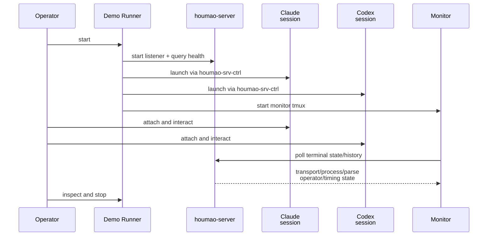

# Case: Interactive Shadow Validation

## Goal

Exercise the real production-level operator journey end to end: start the demo, attach to both live agent TUIs plus the monitor, perform short live interactions against copied dummy projects, observe server-owned parser and lifecycle transitions, and stop the run with durable evidence preserved.

## Intended Implemented Assets

- `scripts/demo/houmao-server-dual-shadow-watch/autotest/run_autotest.sh`
- `scripts/demo/houmao-server-dual-shadow-watch/autotest/case-interactive-shadow-validation.sh`
- `scripts/demo/houmao-server-dual-shadow-watch/autotest/case-interactive-shadow-validation.md`
- `scripts/demo/houmao-server-dual-shadow-watch/autotest/helpers/common.sh`

## Intended Runner Surface

- Automatic companion variant: `scripts/demo/houmao-server-dual-shadow-watch/autotest/run_autotest.sh case-interactive-shadow-validation`
- Interactive canonical variant: follow `scripts/demo/houmao-server-dual-shadow-watch/autotest/case-interactive-shadow-validation.md` while the agent performs the steps and the user watches outcomes

## Sequence

## Ordered Steps

### Automatic Variant

1. Start the demo with a fresh run root and bounded startup timeout.
2. Query the server-owned state for both tracked terminals and assert that the required transport/process/parse/operator/timing fields are present.
3. Capture baseline monitor artifacts and inspect output.
4. Stop the demo and preserve the resulting logs and NDJSON evidence.

### Interactive Variant

1. Start the demo and attach to the Claude, Codex, and monitor tmux sessions.
2. Let both live TUIs settle and confirm on the monitor that each session reaches the expected idle/ready posture.
3. Trigger at least one non-ready UI surface such as a menu, approval, or operator-blocked prompt and confirm that the monitor reflects the corresponding waiting or blocked state from `houmao-server`.
4. Submit one short prompt against each copied dummy project and watch the monitor move through active lifecycle states such as `in_progress`, `candidate_complete`, and `completed` as appropriate.
5. If a reproducible unknown or stalled condition is available for the selected provider/tool surface, exercise it and confirm the server-owned timing/state story remains legible.
6. Run `inspect`, then stop the demo and preserve artifacts for later review.

## Expected Evidence

- Live monitor output showing server-owned parser-facing fields and lifecycle state for both sessions side by side
- Inspect output identifying the same sessions and terminal ids seen in the monitor
- `samples.ndjson` and `transitions.ndjson` capturing the observed state changes
- Preserved logs and demo state under the run root after stop

## Failure Signals

- Monitor renders but key server-owned fields are missing or inconsistent with inspect output
- Interactive state changes only appear when re-derived locally instead of coming from `houmao-server`
- Session teardown succeeds partially and leaves the run in an ambiguous state
- Evidence is lost on failure or stop, preventing later diagnosis
