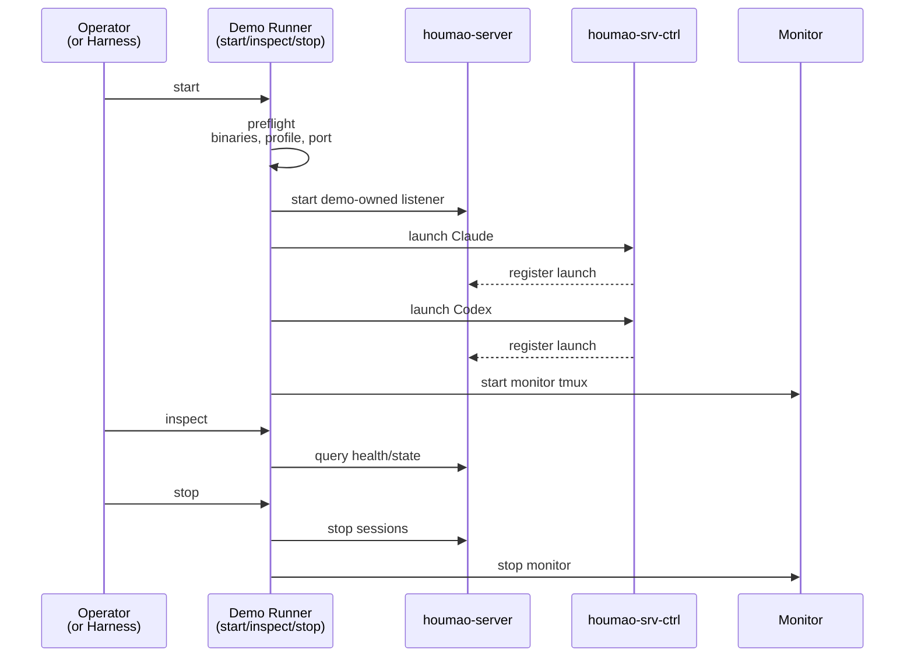

# Case: Preflight Start Stop

## Goal

Reach the first meaningful blocker quickly by proving that the demo can preflight, start a demo-owned `houmao-server`, launch both live sessions through the supported Houmao pair, expose inspectable state, and stop cleanly without requiring an operator to drive the TUIs.

## Intended Implemented Assets

- `scripts/demo/houmao-server-dual-shadow-watch/autotest/run_autotest.sh`
- `scripts/demo/houmao-server-dual-shadow-watch/autotest/case-preflight-start-stop.sh`
- `scripts/demo/houmao-server-dual-shadow-watch/autotest/case-preflight-start-stop.md`
- `scripts/demo/houmao-server-dual-shadow-watch/autotest/helpers/common.sh`

## Intended Runner Surface

- Automatic variant: `scripts/demo/houmao-server-dual-shadow-watch/autotest/run_autotest.sh case-preflight-start-stop`
- Interactive variant: `scripts/demo/houmao-server-dual-shadow-watch/run_demo.sh start`, `inspect`, and `stop`

## Sequence

## Ordered Steps

### Automatic Variant

1. Allocate a fresh run root and demo-specific loopback port.
2. Run preflight and fail immediately if a required binary, profile, port, or provider configuration is missing.
3. Start the demo and wait only up to the configured startup timeout for `houmao-server` plus both delegated launches to become ready.
4. Run `inspect` and capture the reported run root, server base URL, session names, terminal ids, and attach commands.
5. Assert that the server-owned state surfaces exist for both terminals and that the run root contains the expected control and monitor artifact roots.
6. Stop the demo and assert that sessions are terminated, the demo-owned server is stopped when this run started it, and the artifact directory remains on disk.

### Interactive Variant

1. Start the demo from the documented runner surface.
2. Read the printed preflight/startup output and confirm that attach commands for both agent sessions and the monitor were emitted.
3. Run `inspect` and confirm the reported server base URL, session names, terminal ids, and artifact locations look coherent.
4. Stop the demo without attaching to the live sessions and confirm that the stop summary plus preserved artifacts are visible.

## Expected Evidence

- Non-zero exit with a clear diagnostic when preflight fails
- Successful start output showing the run root, server base URL, both live sessions, and the monitor session
- Inspect output showing terminal ids and tmux targets for both agents
- Run-root artifacts such as persisted demo state, monitor paths, and server/runner logs
- Successful stop output plus preserved evidence after teardown

## Failure Signals

- Missing `pixi`, `tmux`, `cao`, `houmao-server`, or `houmao-srv-ctrl`
- Missing or unusable profile/provider configuration for the selected live sessions
- Loopback port collision or listener startup timeout
- Delegated launch succeeds partially but no terminal registration appears in `houmao-server`
- Stop hangs, times out, or removes the very artifacts needed for diagnosis
