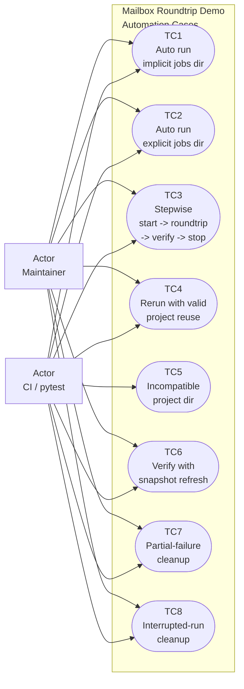
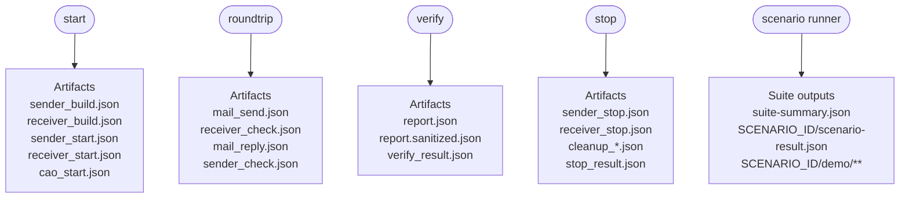

## Context

The mailbox roundtrip tutorial pack currently has one strong path: a single `run_demo.sh` invocation provisions the demo output directory, starts both sessions, runs the roundtrip, builds a report, and verifies the sanitized contract. That is good for a one-click walkthrough, but it is awkward for automatic hack-through testing because the reusable automation logic is split between one monolithic wrapper and test-owned harness code outside the pack.

Two existing repository patterns matter here:

- `scripts/demo/gateway-mail-wakeup-demo-pack/` already uses a command-style wrapper plus helper-owned Python subcommands for `auto`, `start`, `verify`, and `stop`.
- The mailbox roundtrip pack already keeps structured helper logic in `scripts/tutorial_pack_helpers.py`, so expanding that helper is more natural than building new generic infrastructure elsewhere.

The new constraint from this redesign is important: the automation scripts themselves should live inside the mailbox demo directory. Repository tests may still call them, but the automation surface should be pack-owned and runnable by maintainers directly from that same demo location.

## Goals / Non-Goals

**Goals:**

- Keep mailbox demo automation assets inside `scripts/demo/mailbox-roundtrip-tutorial-pack/`.
- Provide a reusable command surface for the mailbox demo so automation can perform startup, roundtrip execution, verification, and cleanup in separate phases when needed.
- Add pack-local automation helpers that can run stable scenario checks and archive per-scenario outputs without reimplementing demo state handling in tests.
- Preserve the existing one-shot happy path for operators while adding maintainer-oriented automation entrypoints.
- Make repository integration tests drive the pack-local automation scripts rather than inventing a parallel orchestration model.

**Non-Goals:**

- Creating a generic repo-wide hack-through framework for all demos.
- Changing mailbox protocol behavior, runtime `mail` semantics, or CAO launcher semantics.
- Replacing the mailbox tutorial README with a test-only document.
- Moving the main scenario definitions or helper entrypoints out of the mailbox demo directory.

## Decisions

### 1. The mailbox demo wrapper will gain a command-style automation surface while preserving one-shot execution

The mailbox pack should move from a single implicit run mode to a command surface similar to the gateway demo pattern. The expected shape is:

- `auto` for the current full happy path,
- `start` for provisioning the output dir, CAO context, brains, and sessions,
- `roundtrip` for `mail send -> mail check -> mail reply -> mail check`,
- `verify` for report build, sanitize, compare, and optional snapshot refresh,
- `stop` for cleanup of live demo-owned sessions and demo-managed CAO.

The default command should remain the operator-friendly full run so the existing tutorial remains easy to follow.

Why:

- Hack-through automation needs phase boundaries.
- Tests and maintainers can reuse the same pack-owned flow instead of reconstructing partial state transitions externally.
- This mirrors a successful existing pack pattern instead of inventing a mailbox-specific ad hoc control style.

Alternatives considered:

- Keep one monolithic wrapper and place all extra logic in pytest-only harness code.
  Rejected because it violates the new requirement that automation assets live inside the demo directory and it keeps automation invisible to maintainers.
- Add a separate pack-local automation script but keep `run_demo.sh` monolithic.
  Rejected because the automation script would still need to duplicate startup, roundtrip, verify, or cleanup boundaries that belong to the pack itself.

### 2. Helper-owned Python logic will own phase orchestration and reusable demo state

`scripts/tutorial_pack_helpers.py` should become the command implementation boundary for the new pack commands. The bash wrapper should stay thin and argument-focused.

The helper should own:

- stepwise orchestration,
- minimal reusable demo state needed between commands,
- machine-readable success or failure payloads,
- cleanup behavior for partial runs,
- report-build and verification reuse.

The implementation may persist a small demo-owned automation state file under the selected demo output directory, but the existing JSON artifacts should remain the canonical operator-visible records for build, start, mail, and report outputs.

Why:

- The current pack already delegates structured CAO, worktree, path, and report logic to Python.
- Stepwise automation is easier to test when state handling and cleanup decisions are not encoded in bash branches.
- A small helper-owned state layer is acceptable as long as it stays demo-local and does not replace the existing artifacts.

Alternatives considered:

- Reuse only the existing artifact files as implicit state and avoid any helper-owned automation state.
  Rejected as the sole design because phase-oriented cleanup and reuse logic becomes brittle when every command must infer progress from scattered files.
- Move orchestration into a generic shared demo library.
  Rejected because the current need is pack-local and the user explicitly wants the automation scripts to stay inside the demo directory.

### 3. Scenario automation will live in pack-local scripts and will archive per-scenario outputs under a caller-selected root

The pack should add a maintainer-oriented automation script under `scripts/demo/mailbox-roundtrip-tutorial-pack/scripts/` that can run one or more named scenarios. Each scenario should use the same pack-owned command surface and write its outputs under a caller-selected automation root, with one subdirectory per scenario.

At minimum, the first scenario set should cover:

- default auto run with implicit jobs-dir behavior,
- explicit jobs-dir override,
- rerun against an existing valid project worktree,
- incompatible existing project directory,
- verify or snapshot flow,
- failure-oriented cleanup coverage for partial or interrupted runs.

Why:

- This keeps scenario definitions and automation entrypoints in the pack itself.
- Maintainers can run the same automation outside pytest.
- Integration tests can call this script with hermetic fake tools instead of carrying their own hidden scenario orchestration.

Alternatives considered:

- Encode all scenario coverage only in pytest functions.
  Rejected because it keeps the automation logic out of the demo pack.
- Make the pack-local automation script shell-only.
  Rejected because scenario selection, result summaries, and structured failure reporting are cleaner in Python.

### 4. Repository tests will validate the pack-local automation surface rather than inventing a separate control model

Integration tests under `tests/integration/demo/` should call the pack-local command and scenario scripts, typically with fake `git`, `pixi`, and `tmux` tooling as they do today. The tests can still host fake-tool shims, but the orchestration path under test should be the pack-owned automation interface.

Manual maintainer validation can then become a thin wrapper around the same pack-local automation surface rather than a separate top-level test program with its own behavior.

Why:

- This keeps the real source of truth in the demo directory.
- Tests continue to provide hermetic coverage while also verifying the pack's actual automation contract.
- It reduces drift between what maintainers can run manually and what the test suite exercises.

Alternatives considered:

- Put all fake-tool and manual execution logic directly in the demo pack.
  Rejected because repository tests still belong under `tests/`, even when they call pack-local scripts.

## Test Case Model

Mermaid does not provide a first-class UML use-case diagram primitive, so this design uses Mermaid flowcharts in a UML use-case style to make the intended test coverage explicit without introducing non-rendering Markdown art.

### Coverage Diagram



### Phase-And-Artifact Diagram



### Named Test Cases

- `TC1 auto-implicit-jobs-dir`: run the default happy path with no `--jobs-dir` and assert that both sessions resolve `job_dir` under `<DEMO_OUTPUT_DIR>/project/.houmao/jobs/<SESSION_ID>/`.
- `TC2 auto-explicit-jobs-dir`: run the happy path with an explicit jobs root and assert that both sessions resolve `job_dir` under `<JOBS_DIR>/<SESSION_ID>/`.
- `TC3 stepwise-start-roundtrip-verify-stop`: assert that stepwise commands can reuse one prepared demo root and still produce the same sanitized report contract as `auto`.
- `TC4 rerun-valid-project-reuse`: run the automation twice against the same demo root and assert that a valid existing `project/` worktree is reused rather than rejected or recreated incompatibly.
- `TC5 incompatible-project-dir`: precreate `<DEMO_OUTPUT_DIR>/project` as a non-worktree directory and assert that automation fails clearly before live runtime work proceeds.
- `TC6 verify-snapshot-refresh`: run verification with snapshot mode and assert that only sanitized expected-report content is refreshed.
- `TC7 partial-failure-cleanup`: inject a failure after `start` has created live resources but before the full roundtrip completes, then assert that cleanup artifacts exist and demo-owned live resources are stopped.
- `TC8 interrupted-run-cleanup`: simulate interruption during stepwise or automatic execution and assert that cleanup preserves ownership boundaries and leaves diagnosable outputs under the same demo root.

## Test Input / Expected Output Contracts

### Scenario Runner Input Format

The pack-local scenario runner should accept one machine-readable scenario definition per case, whether that definition is built internally from named presets or loaded from a JSON file. The intended normalized in-memory shape is:

```json
{
  "scenario_id": "auto-implicit-jobs-dir",
  "command_sequence": [
    {
      "command": "auto",
      "demo_output_dir": "<AUTOMATION_ROOT>/auto-implicit-jobs-dir/demo",
      "jobs_dir": null,
      "snapshot_report": false
    }
  ],
  "expected_outcome": {
    "kind": "success",
    "exit_code": 0
  },
  "fault_injection": null,
  "notes": "<OPTIONAL_FREEFORM_TEXT>"
}
```

For stepwise cases, the normalized input should expand to multiple commands:

```json
{
  "scenario_id": "stepwise-start-roundtrip-verify-stop",
  "command_sequence": [
    {
      "command": "start",
      "demo_output_dir": "<AUTOMATION_ROOT>/stepwise-start-roundtrip-verify-stop/demo",
      "jobs_dir": null,
      "snapshot_report": false
    },
    {
      "command": "roundtrip",
      "demo_output_dir": "<AUTOMATION_ROOT>/stepwise-start-roundtrip-verify-stop/demo",
      "jobs_dir": null,
      "snapshot_report": false
    },
    {
      "command": "verify",
      "demo_output_dir": "<AUTOMATION_ROOT>/stepwise-start-roundtrip-verify-stop/demo",
      "jobs_dir": null,
      "snapshot_report": false
    },
    {
      "command": "stop",
      "demo_output_dir": "<AUTOMATION_ROOT>/stepwise-start-roundtrip-verify-stop/demo",
      "jobs_dir": null,
      "snapshot_report": false
    }
  ],
  "expected_outcome": {
    "kind": "success",
    "exit_code": 0
  },
  "fault_injection": null,
  "notes": "<OPTIONAL_FREEFORM_TEXT>"
}
```

For failure-oriented scenarios, the expected outcome and fault injection should be explicit:

```json
{
  "scenario_id": "partial-failure-cleanup",
  "command_sequence": [
    {
      "command": "auto",
      "demo_output_dir": "<AUTOMATION_ROOT>/partial-failure-cleanup/demo",
      "jobs_dir": null,
      "snapshot_report": false
    }
  ],
  "expected_outcome": {
    "kind": "failure",
    "exit_code": 1,
    "stderr_contains": "command failed during <STEP_NAME>"
  },
  "fault_injection": {
    "kind": "synthetic-command-failure",
    "step": "<STEP_NAME>"
  },
  "notes": "<OPTIONAL_FREEFORM_TEXT>"
}
```

### Per-Scenario Result Output Format

Each scenario should write one machine-readable result file at `<AUTOMATION_ROOT>/<SCENARIO_ID>/scenario-result.json` with the normalized shape below:

```json
{
  "scenario_id": "auto-implicit-jobs-dir",
  "status": "passed",
  "expected_outcome": {
    "kind": "success",
    "exit_code": 0
  },
  "observed_outcome": {
    "kind": "success",
    "exit_code": 0,
    "stdout_excerpt": "<STDOUT_TEXT>",
    "stderr_excerpt": "<STDERR_TEXT_OR_EMPTY>"
  },
  "demo_output_dir": "<AUTOMATION_ROOT>/auto-implicit-jobs-dir/demo",
  "artifacts": {
    "report": "<DEMO_OUTPUT_DIR>/report.json",
    "report_sanitized": "<DEMO_OUTPUT_DIR>/report.sanitized.json",
    "sender_start": "<DEMO_OUTPUT_DIR>/sender_start.json",
    "receiver_start": "<DEMO_OUTPUT_DIR>/receiver_start.json"
  },
  "assertions": {
    "sanitized_report_match": true,
    "job_dir_mode": "implicit_project_local",
    "project_worktree_reused": "<TRUE_OR_FALSE>",
    "cleanup_artifacts_present": "<TRUE_OR_FALSE>"
  },
  "provider_outputs": {
    "sender_visible_output": "<LLM_OUTPUT_TEXT_OR_EMPTY>",
    "receiver_visible_output": "<LLM_OUTPUT_TEXT_OR_EMPTY>"
  }
}
```

For expected-failure scenarios, the result format should preserve both the failure and the fact that the scenario still passed because that failure was expected:

```json
{
  "scenario_id": "incompatible-project-dir",
  "status": "passed",
  "expected_outcome": {
    "kind": "failure",
    "exit_code": 1,
    "stderr_contains": "not a git worktree"
  },
  "observed_outcome": {
    "kind": "failure",
    "exit_code": 1,
    "stdout_excerpt": "<STDOUT_TEXT_OR_EMPTY>",
    "stderr_excerpt": "<STDERR_TEXT>"
  },
  "demo_output_dir": "<AUTOMATION_ROOT>/incompatible-project-dir/demo",
  "artifacts": {
    "failure_stderr": "<AUTOMATION_ROOT>/incompatible-project-dir/stderr.txt"
  },
  "assertions": {
    "failed_before_runtime_start": true,
    "matched_expected_error": true
  },
  "provider_outputs": {
    "sender_visible_output": "",
    "receiver_visible_output": ""
  }
}
```

### Suite Summary Output Format

The scenario runner should also write one aggregate summary at `<AUTOMATION_ROOT>/suite-summary.json`:

```json
{
  "suite_id": "mailbox-roundtrip-demo-automation",
  "started_at_utc": "<TIMESTAMP>",
  "finished_at_utc": "<TIMESTAMP>",
  "scenario_count": 8,
  "passed_count": 8,
  "failed_count": 0,
  "scenario_results": [
    {
      "scenario_id": "auto-implicit-jobs-dir",
      "status": "passed",
      "scenario_result_path": "<AUTOMATION_ROOT>/auto-implicit-jobs-dir/scenario-result.json"
    },
    {
      "scenario_id": "partial-failure-cleanup",
      "status": "passed",
      "scenario_result_path": "<AUTOMATION_ROOT>/partial-failure-cleanup/scenario-result.json"
    }
  ]
}
```

### Command-Level Expected Outputs

The stepwise command surface should preserve a predictable command-to-artifact contract:

- `start`: expects no prior live state for a fresh run and produces `cao_start.json`, `sender_build.json`, `receiver_build.json`, `sender_start.json`, and `receiver_start.json`.
- `roundtrip`: expects a prepared demo root with live sender and receiver sessions and produces `mail_send.json`, `receiver_check.json`, `mail_reply.json`, and `sender_check.json`.
- `verify`: expects existing demo artifacts from either `auto` or the stepwise phases and produces `report.json`, `report.sanitized.json`, and one machine-readable verification result such as `verify_result.json`.
- `stop`: expects either active demo-owned live resources or an already-stopped demo root and produces `sender_stop.json`, `receiver_stop.json`, `cleanup_*.json` when relevant, and one machine-readable stop summary such as `stop_result.json`.

## Risks / Trade-offs

- [More command entrypoints may make the demo feel more complex] -> Mitigation: keep `auto` as the default one-click path and document the extra commands as maintainer-oriented automation aids.
- [A helper-owned automation state file could drift from the existing artifacts] -> Mitigation: keep the state minimal, demo-local, and derived from the same canonical artifact payloads where possible.
- [Scenario automation could become a second hidden framework] -> Mitigation: scope the first version to the mailbox demo only and reuse the pack's own command surface instead of adding another abstraction layer.
- [Failure-oriented scenarios may be hard to run against real external services] -> Mitigation: treat hermetic fake-tool integration coverage as the primary automation path and keep real-environment maintainer runs optional.

## Migration Plan

This is a demo-pack-only change. The existing one-shot demo behavior should remain available through the default `auto` path while the new command and scenario scripts are added. Tests and README documentation should migrate to the pack-local automation entrypoints in the same change so maintainers immediately have one coherent workflow.

## Open Questions

- None blocking. The main architectural direction is settled: pack-local automation scripts, helper-owned command orchestration, and repository tests that drive those scripts.
