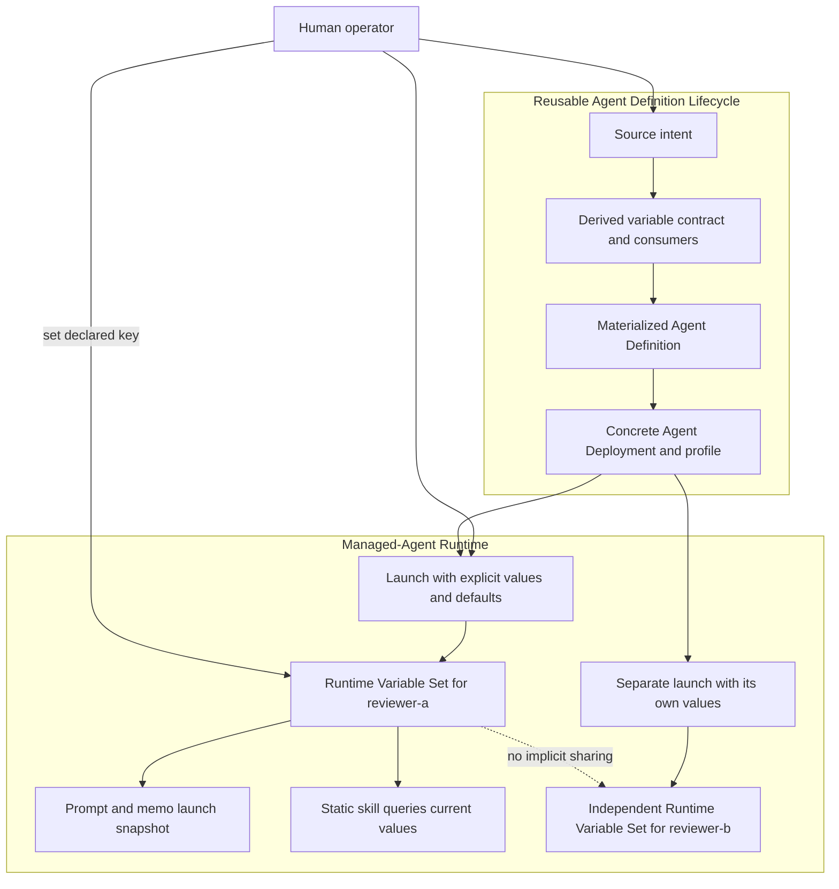
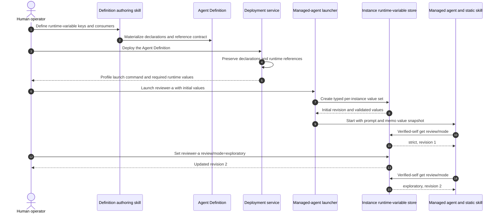

# Use Case UC-04: Configure Per-Agent-Instance Runtime Variables

## Actor Goal

As a human Houmao operator, I want an Agent Definition to declare non-secret runtime-variable keys that I can set independently for each managed-agent instance, so that prompts, memo material, and skills can adapt the agent's behavior without changing the reusable definition or rewriting installed skills.

## Use Case

The definition author describes behavior settings such as `review/mode`, `report/language`, or `evidence/minimum-count` in `intent/src/agent-def-overview.md`. Authoring derives a typed Agent Runtime Variable contract with stable keys, descriptions, defaults, validation constraints, and declared consumers. The approved materialized Agent Definition stores those declarations separately from deployment arguments and deployment placeholders.

Definition deployment preserves the declarations and runtime-reference sites in the concrete project profile. It does not bind per-instance values. When the human later launches a managed agent, Houmao combines declared defaults with explicit launch values, validates the complete set, and stores one Agent Runtime Variable Set in that instance's canonical `state.sqlite`. Prompt and memo template references receive the launch-time value snapshot. Static Agent Skills are not rendered or rewritten at launch; their instructions query current values through the verified managed-agent CLI before choosing a behavior branch.

During the run, the human may inspect or change a declared value for an explicit managed-agent target. The next runtime lookup sees the new revision. Houmao does not retroactively modify an already submitted system prompt, overwrite live memo edits, interrupt the agent, or mutate another instance created from the same Agent Definition.

## Supported Actions

### Declare Runtime Variables in an Agent Definition

This action turns user-named behavior settings into a reusable typed contract.

- context
  - Actor **has** an agent behavior description with named settings that should vary between live agent instances.
  - System **has** an Agent Definition authoring workflow that separates source intent, derived interpretation, and immutable revision contracts.
- intent
  - Actor **wants** stable keys that prompts, memo material, and skills can consume without hard-coding one value into the definition.
  - Actor **wonders** "Can I define `review/mode` and `report/language` once, then choose different values for two agents launched from this definition?"
- action
  - Actor then **asks** the authoring workflow to define the keys, types, defaults, constraints, descriptions, and consumers.
- result
  - Actor **gets** a reviewable Agent Runtime Variable contract that distinguishes per-instance behavior configuration from deployment arguments, credentials, and live process state.

### Reference Runtime Variables From Agent Material

This action connects declared keys to prompt, memo, and skill behavior without making skills dynamic packages.

- context
  - Actor **has** declared runtime-variable keys and agent material that needs configurable behavior.
  - System **has** launch-snapshot references for prompt and memo templates plus verified current-instance lookup commands for skills.
- intent
  - Actor **wants** each consumer to read the appropriate value without inventing its own configuration source.
  - Actor **wonders** "How does the review skill use the current mode after I change it without Houmao rebuilding the skill?"
- action
  - Actor then **asks** the authoring workflow to connect each consumer to a declared key.
- result
  - Actor **gets** declared prompt or memo snapshot-reference sites and static skill guidance that queries the current Agent Runtime Variable Set before branching.

### Instantiate Values When Launching an Agent

This action creates one validated variable set for one concrete managed-agent instance.

- context
  - Actor **has** a deployed profile carrying an Agent Runtime Variable contract and explicit values for any required keys without defaults.
  - System **has** the maintained managed-agent launch workflow and a runtime-owned state location for the new instance.
- intent
  - Actor **wants** the new agent to start with its own values while leaving the reusable definition and other instances unchanged.
  - Actor **wonders** "Can this agent start in `strict` mode while another instance from the same profile starts in `exploratory` mode?"
- action
  - Actor then **asks** Houmao to launch the profile with zero or more declared runtime-variable values.
- result
  - Actor **gets** one launched managed-agent instance with a typed Agent Runtime Variable Set, launch-resolution provenance, and prompt or memo snapshots rendered from that instance's initial values.

### Inspect and Change a Live Instance Value

This action changes current behavior configuration for one explicit managed-agent target.

- context
  - Actor **has** a running or preserved managed-agent instance whose profile declared the requested key.
  - System **has** target-scoped operator commands and verified-self read commands for Agent Runtime Variables.
- intent
  - Actor **wants** later skill executions to see a new value without replacing the profile, relaunching the agent, or mutating peers.
  - Actor **wonders** "Can I change only agent `reviewer-b` from `strict` to `exploratory`, and can its next review step see that value?"
- action
  - Actor then **asks** Houmao to validate and set the declared key for that explicit instance.
- result
  - Actor **gets** an incremented runtime-variable revision and can verify that the target's next lookup returns the new value while other instances retain their own values.

## Main Flow

1. The human asks the admin operator agent to define a reusable reviewer whose behavior uses `review/mode`, `report/language`, and `evidence/minimum-count`.
2. Agent Definition authoring preserves the exact request in `intent/src/agent-def-overview.md`.
3. Derivation proposes stable keys, supported value types, required state, non-secret defaults, enum or numeric constraints, descriptions, and consumer mappings.
4. Derivation classifies each consumer as launch-snapshot material or live-query guidance.
5. Prompt-overlay, system-prompt, or memo-seed template references use exact non-executable `{{houmao.runtime.<key>}}` markers at declared sites.
6. Complete Agent Skills remain static. Their instructions name the keys they consume and require a verified `houmao-mgr agents self runtime-vars get <key>` lookup before behavior that depends on the value.
7. The human reviews the proposed variables alongside deployment inputs, launch-snapshot consumers, live-query consumers, and instance-state boundaries.
8. Approved materialization writes the runtime-variable declarations and consumer map into `instance-contract.toml`.
9. Definition deployment validates and copies the declarations into deployment-owned project content and the generated profile.
10. Deployment resolves every `{{houmao.deploy.*}}` marker but preserves valid declared `{{houmao.runtime.*}}` launch-snapshot references.
11. Deployment doctor reports the runtime-variable interface and the exact launch command, including which keys require values at launch. It creates no live value set.
12. The human launches profile `reviewer` as managed agent `reviewer-a` with `review/mode=strict` and `report/language=en`.
13. Before process start, Houmao opens a journaled launch-preparation attempt, loads the profile's variable declarations, applies explicit launch values over declared defaults, validates types and constraints, and blocks on any required unresolved key.
14. Houmao creates an Agent Runtime Variable Set in `.houmao/memory/agents/<agent-id>/state.sqlite`, bound to `reviewer-a` and the exact instance-contract digest.
15. Launch rendering snapshots initial values into declared system-prompt, prompt-overlay, and memo-seed sites.
16. Houmao starts the managed agent and exposes only the state locator and verified lookup surface needed to read the values. It does not export secret-capable arbitrary environment variables.
17. When a private review skill runs, its static instructions make the managed agent query `review/mode` through `agents self runtime-vars get`.
18. The lookup verifies managed self, reads `reviewer-a`'s current variable revision, and returns `strict` with its type and source.
19. The skill follows its declared strict-mode branch.
20. The human explicitly targets `reviewer-a` and changes `review/mode` to `exploratory`.
21. Houmao validates the key and value against the declaration, atomically updates only `reviewer-a`'s value set, and records the new revision.
22. Houmao reports that the update affects future runtime lookups but does not rewrite the submitted system prompt, overwrite the live memo, send a prompt, or interrupt current work.
23. On the next review-skill execution, verified self lookup returns `exploratory`, and the skill follows its declared exploratory branch.
24. A separately launched `reviewer-b` retains its independent value set.

## Alternative and Exception Flows

- If the user describes a value that changes how the reusable definition is specialized into project files, authoring classifies it as a deployment argument rather than an Agent Runtime Variable.
- If the user proposes a password, token, private key, credential payload, or secret-bearing string, authoring rejects Agent Runtime Variable storage and directs the user to maintained credential handling.
- If a key is duplicated, malformed, has an unsupported type, lacks enum alternatives, or has an invalid default, bundle validation blocks materialization.
- If prompt or memo material references an undeclared runtime key or uses a reference outside a declared site, bundle validation rejects the reference.
- If a skill contains a runtime interpolation marker that would require launch-time package rewriting, validation blocks it and requires static current-value lookup guidance instead.
- If a declared variable has no consumer and no explicit operator-inspection purpose, validation reports it as unused rather than collecting inert configuration.
- If a required key has neither an explicit launch value nor a valid default, launch fails before runtime state or a process is created.
- If the human supplies an unknown key at launch, Houmao rejects it instead of adding an ad hoc instance variable.
- If a value fails its declared boolean, integer, number, enum, string, or string-list constraints, launch or update reports a field-specific error and preserves prior state.
- If the operator omits an explicit target for a variable mutation, admin routing does not use the current shell or operator agent as implicit managed self.
- If a managed agent queries its own declared variables, `agents self` verifies current runtime manifest and registry authority and returns only that instance's state.
- If a managed agent asks to mutate its own variable, the v1 route refuses. Agent Runtime Variable mutation remains a human-operator action.
- If the operator changes a value while a skill is already acting on an earlier lookup, the current action may finish with the earlier snapshot. The next lookup observes the new revision.
- If a value changes after launch, the original system-prompt and memo-seed snapshots remain unchanged. The operator may send a separate prompt when immediate attention is required, and skills still read current values on their next lookup.
- If an instance is stopped but preserved, its values remain inspectable and available to a supported relaunch of that same preserved instance. Clean instance removal deletes its runtime-variable state with other instance-owned runtime data.
- If a fresh instance is launched from the same deployment or profile, Houmao creates a new value set from defaults and that launch's explicit values. It does not clone a peer's current values implicitly.
- If several batch-deployed profiles are later launched, each live instance receives an independent variable set. A shared batch operation id does not create shared mutable runtime variables.

## Mermaid Flow Diagram

## Mermaid Sequence Diagram

## Durable Outputs

- Human-owned runtime-variable requirements in `intent/src/agent-def-overview.md`.
- Derived variable declarations, consumer mappings, assumptions, blockers, source digests, and `materialization.toml` entries.
- A versioned non-secret Agent Runtime Variable contract in the materialized Agent Definition Revision.
- Declared launch-snapshot reference sites for system prompt, prompt overlay, and memo seed material.
- Static Agent Skill instructions that name required keys and use verified current-instance lookup instead of runtime package rendering.
- Deployment-owned variable declarations and reference metadata attached to the concrete project profile.
- One canonical `.houmao/memory/agents/<agent-id>/state.sqlite` per managed-agent instance, containing its typed value set, value sources, revisions, timestamps, and instance-contract digest.
- Launch-resolution evidence showing defaults, explicit values, missing-value validation, prompt or memo snapshot digest, and owning instance identity.
- Target-scoped update provenance that does not contain credential secrets.
- Independent state and lifecycle behavior for separate instances launched from one definition or deployment.

## Example Prompt and Expected AI Response

### Event 001: Author Runtime Variables and Consumers

> Time: `design example` · Session: `human operator authoring a configurable reviewer`

User Prompt:

> `$houmao-admin-entrypoint define a reviewer agent. Let me define runtime variables by key: review/mode is strict or exploratory, report/language is a string defaulting to en, and evidence/minimum-count is a positive integer. I will use them in its system prompt, memo, and review skill. I need to set them per agent instance during the run.`

AI:

> The assistant preserves the request in `agent-def-overview.md` and proposes three non-secret Agent Runtime Variable declarations with types, defaults, constraints, descriptions, and consumers. It distinguishes them from deployment arguments because their values belong to each live managed-agent instance. It proposes launch-snapshot references for prompt and memo templates and verified live-query guidance for the static review skill. It explains that changing a value affects future lookups but does not rewrite the installed skill or retroactively change the current system prompt. It presents the derived contract for review before materialization.

### Event 002: Launch and Change One Instance

> Time: `design example` · Session: `human operator running two reviewer instances`

User Prompt:

> `$houmao-admin-entrypoint launch reviewer-a from profile repository-reviewer with review/mode=strict and evidence/minimum-count=3. Then set reviewer-a review/mode to exploratory, but leave reviewer-b unchanged.`

AI:

> The assistant routes launch through the existing agent-instance lifecycle, validates the supplied values against the profile's runtime-variable declarations, applies declared defaults, and creates `reviewer-a`'s independent value set before process start. For the later update it requires the explicit `reviewer-a` target, validates `exploratory`, updates only that instance, and reports the new revision. It explains that the next verified skill lookup sees the new value, while `reviewer-b`, the reusable definition, the project profile, installed skills, the current system prompt, and live memo edits remain unchanged. It does not send a prompt or interrupt either agent unless separately requested.

## Assumptions and Open Questions

- The canonical terms are **Agent Runtime Variable** for one declaration and **Agent Runtime Variable Set** for the values instantiated for one managed-agent instance.
- Agent Runtime Variables are behavior configuration, not deployment arguments, environment-variable passthrough, credentials, memo content, or arbitrary key-value storage.
- V1 value types follow the useful Isomer Labs runtime-param subset: `string`, `bool`, `integer`, `number`, `enum`, and `string_list`.
- Runtime-variable keys are stable, definition-local, path-like identifiers. CLI output also includes the owning definition and deployment identity to avoid ambiguity.
- Human operators may set declared values. Managed agents may list, get, and explain their own effective values but may not mutate them in v1.
- System prompt, prompt overlay, and memo seed consumers use a launch-time snapshot because already submitted model context cannot change retroactively.
- Static skills query current values when needed. Houmao does not render, generate, or rewrite skill packages at managed-agent launch.
- A stopped but preserved instance retains its values; a fresh instance starts from declaration defaults plus explicit launch values. Clean removal deletes instance-owned state.
- Runtime-variable updates do not automatically prompt, interrupt, or wake the managed agent.
- The change design fixes the storage boundary, compare-and-set behavior, verified-self authority, and supported value categories. Exact CLI spelling may follow existing command conventions during implementation without changing these contracts.

## Relationship to Existing Work

- UC-01 establishes Agent Definition authoring, materialization, deployment, static skill ownership, and separate live launch.
- UC-02 defines deployment arguments, whose values are resolved before project deployment and become fixed concrete project configuration. This use case adds a separate contract whose values do not exist until managed-agent launch.
- UC-03 creates several project deployments but no live agents. When those profiles are launched later, each managed-agent instance receives an independent Agent Runtime Variable Set.
- Isomer Labs' Toolbox runtime-param design provides the declaration/value separation, typed values, stable keys, secret rejection, scoped resolution, and CLI `define`, `set`, `get`, `list`, `explain`, and `validate` precedent. Houmao changes the effective scope from project/topic layers to one managed-agent instance.
- Existing Houmao `agents single` and `agents self` command families provide the operator-targeted and verified-self boundaries for runtime-variable access.
- Existing Houmao launch-time prompt composition and memo-seed materialization provide snapshot consumers. Existing private-skill projection remains static and must not become a runtime template engine.
